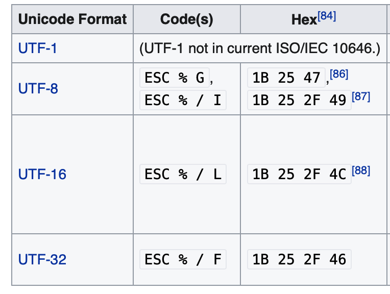

<br><br><br><br>
<center></center>

<h3 align=center style="font-size: 36px;color:#FF4646;font-family: Palatino, Times, serif;"><br>Image Metadata<br><i>and</i><br>Exiv2 Architecture</h3>

<h3 align=center style="font-size:24px;color:#23668F;font-family: Palatino, Times, serif;">Robin Mills<br>2021-10-06</h3>

<div id="dedication"/>
## _Dedication and Acknowledgment_

_I want to say <b>Thank You</b> to a few folks who have made this book possible._

_First, my wife Alison, who has been my loyal supporter since the day we met in High School in 1967._

_Secondly, Andreas Huggel the founder of the project and Luis and Dan who have worked tirelessly with me since 2017._

_Exiv2 contributors (in alphabetical order): Abhinav, Alan, Alex, Andreas (both of them), Arnold, Ben, Christoph, Gilles, Kev, Leo, Leonardo, Mahesh, Micha&lstrok;, Mikayel, Milo&scaron;, Nehal, Neils, Peter, Phil, Rosen, Sridhar, Thomas, Tuan .... and others who have contributed to Exiv2._

_File Detectives:  Phil Harvey, Dave Coffin, Laurent Cl&eacute;vy._

_And our cat Lizzie.  Sadly, Lizzie was put to sleep on 2021-02-13._

<center></center>

## <center>TABLE of CONTENTS</center>
<div id="TOC"/>

| Section                                             | Page | Image Formats                          | Page | Project Management                    | Page | 
|:--                                                    | --:|:--                                       | --:|:--                                      | --:|
| [1. Image File Formats](#1)                           |  9 | [TIFF and BigTiff](#TIFF)                | 10 | [11. Project Management](#11)           | 77 |
| [2. Metadata Standards](#2)                           | 32 | [JPEG and EXV](#JPEG)                    | 12 | [11.1 C++ Code](#11-1)                  | 78 |
| [2.1 Exif Metadata](#Exif)                            | 35 | [PNG Portable Network Graphics](#PNG)    | 17 | [11.2 Build](#11-2)                     | 79 |
| [2.2 XMP Metadata](#XMP)                              | 36 | [JP2 Jpeg 2000](#JP2)                    | 18 | [11.3 Security](#11-3)                  | 80 |
| [2.3 IPTC/IMM Metadata](#IPTC)                        | 37 | [BMFF .CR3, .HEIC, .AVIF, .JXL](#BMFF)   | 19 | [11.4 Documentation](#11-4)             | 80 |
| [2.4 ICC Profile](#ICC)                               | 37 | [CRW Canon Raw](#CRW)                    | 20 | [11.5 Testing](#11-5)                   | 80 |
| [2.5 MakerNotes](#MakerNotes)                         | 38 | [RIFF Resource I'change File Fmt](#RIFF) | 20 | [11.6 Samples](#11-6)                   | 80 |
| [2.6 Metadata Convertors](#Convertors)                | 38 | [MRW Minolta Raw](#MRW)                  | 21 | [11.7 Users](#11-7)                     | 80 |
| [3. Reading Metadata](#3)                             |    | [ORF Olympus Raw](#ORF)                  | 22 | [11.8 Bugs](#11-8)                      | 80 |
| [3.1 Read metadata with dd](#3-1)                     |    | [PEF Pentax Raw](#PEF)                   |    | [11.9 Releases](#11-9)                  |    |
| [3.2 Tags and TagNames](#3-2)                         |    | [PGF Progressive Graphics File](#PGF)    |    | [11.10 Platforms](#11-10)               |    |
| [3.3 Visitor Design Pattern](#3-3)                    |    | [PSD PhotoShop Document](#PSD)           |    | [11.11 Localisation](#11-11)            |    |
| [3.4 IFD::accept()](#3-4)                             |    | [RAF Fujifilm Raw](#RAF)                 |    | [11.12 Build Server](#11-12)            |    |
| [3.5 ReportVisitor::visitTag()](#3-5)                 |    | [RW2 Panasonic Raw](#RW2)                |    | [11.11 Source Code](#11-11)             |    |
| [3.6 Jpeg::Image accept()](#3-6)                      |    | [TGA Truevision Targa](#TGA)             |    | [11.14 Web Site](#11-14)                |    |
|                                                       |    | [BMP Windows Bitmap](#BMP)               |    | [11.15 Servers](#11-15)                 |    |
| [4. Lens Recognition](#4)                             |    | [GIF Graphical Interchange Format](#GIF) |    | [11.16 API](#11-16)                     |    |
| [5. Previews and Thumbnails](#5)                      |    | [SIDECAR Xmp Sidecars](#SIDECAR)         |    | [11.17 Contributors](#11-17)            |    |
| [6. I/O in Exiv2](#6)                                 | 38 |                                          | 22 | [11.18 Scheduling](#11-18)              | 80 |
|                                                       | 39 |                                          | 23 | [11.19 Enhancements](#11-19)            | 81 | 
| [7. Exiv2 Architecture](#7)                           | 41 | [9. API/ABI Compatibility](#9)           | 24 | [11.20 Tools](#11-20)                   | 81 |
| [7.1 API Overview](#7-1)                              | 41 | [10. Security](#10)                      | 25 | [11.21 Licensing](#11-21)               | 81 |
| [7.2 Typical Sample Application](#7-2)                | 42 | [10.1 Security Policy](#10-1)            | 26 | [11.22 Back-porting](#11-22)            | 81 |
| [7.3 The EasyAccess API](#7-3)                        | 44 | [10.2 The Fuzzing Police](#10-2)         | 27 | [11.23 Partners](#11-23)                | 81 |
| [7.4 Listing the API](#7-4)                           | 44 |                                          | 28 | [11.24 Development](#11-24)             | 81 |
| [7.5 Function Selectors](#7-5)                        | 48 | [12. Code discussed in this book](#12)   | 29 |                                         | 81 |
| [7.6 Tags in Exiv2](#7-6)                             | 53 | [tvisitor.cpp](#tvisitor)                | 30 | _**Other Sections**_                    | 81 |
| [7.7 Tag Decoder](#7-7)                               | 57 | [dmpf.cpp](#dmpf)                        |    | [Dedication](#dedication)               | 81 |
| [7.8 TiffVisitor](#7-8)                               | 59 | [csv.cpp](#csv)                          |    | [About this book](#about)               | 81 |
| [7.9 Other Exiv2 Classes](#7-9)                       | 61 | [CMakeLists.txt](#cmakelists)            |    | [How did I get here?](#begin)           | 82 |
|                                                       | 63 | [make test](#maketest)                   |    | [2012 - 2017](#2012)                    |    |
| [8. Test Suite](#8)                                   | 63 |                                          |    | [Current Priorities](#current)          | 82 |
| [8.1 Bash Tests](#8-1)                                | 63 |                                          |  2 | [Future Projects](#future)              | 82 |
| [8.2 Python Tests](#8-2)                              | 68 |                                          |  4 | [Scope of Book](#scope)                 | 82 |
| [8.3 Unit Tests](#8-3)                                | 69 |                                          |  4 | [Making this book](#making)             | 82 |
| [8.4 Version Test](#8-4)                              | 70 |                                          |  5 |                                         | 82 |
| [8.5 Generating HUGE images](#8-5)                    | 71 |                                          |  5 |                                         |    |
| [8.6 Downloading Test Images](#8-6)                   | 73 |                                          |  6 |  [The Last Word](#finally)              |    |          

<div id="about"/>
## About this book

This book is about **Image Metadata _and_ Exiv2 Architecture**.

**Image Metadata** is the information stored in a digital image in addition to the image itself.  Data such as the camera model, date, time, location and camera settings are stored.  To my knowledge, no book has been written about this important technology.

**Exiv2 Architecture** is about the Exiv2 library and command-line application which implements cross-platform code in C++ to read, modify, insert and delete items of metadata.  I've been working on this code since 2008 and, as I approach my 70th birthday, would like to document my knowledge in the hope that the code will be maintained and developed by others in future.

At the moment, the book is _**work in progress**_ and expected to be finished in 2021.  Exiv2 v0.27.4 shipped on schedule on 2021-04-30 and the working copy of this book in available on exiv2.org.

There is no plan to have the book printed or commercially published.

[TOC](#TOC)

<div id="begin"/>
### How did I get interested in this matter?

I first became interested in metadata because of a trail conversation with Dennis Connor in 2008.  Dennis and I ran frequently together in Silicon Valley and Dennis was a Software Development Manager in a company that made GPS systems for Precision Agriculture.  I had a Garmin Forerunner 201 Watch.  We realised that we could extract the GPS data from the watch in GPX format, then merge the position into photos.  Today this is called "GeoTagging" and is supported by many applications.

<center></center>

I said "Oh, it can't be too difficult to do that!".  And here we are more than a decade later still working on the project.  The program geotag.py was completed in about 6 weeks.  Most of the effort went into porting Exiv2 and pyexiv2 to Visual Studio and macOS.  Both Exiv2 and pyexiv2 were Linux only at that time.

The program samples/geotag.cpp is a command-line application to geotag photos and I frequently use this on my own photographs.  Today, I have a Samsung Galaxy Watch which uploads runs to Strava.  I download the GPX from Strava.  The date/time information in the JPG is the key to search for the position data.  The GPS tags are created and saved in the image.

In 2008, I chose to implement this in python because I wanted to learn the language.  Having discovered exiv2 and the python wrapper pyexiv2, I set off with enthusiasm to build a cross-platform script to run on **Windows** _(XP, Visual Studio 2003)_, **Ubuntu Linux** _(Hardy Heron 2008.04 LTS)_ and **MacOS-X** _(32 bit Tiger 10.4 on a big-endian PPC)_.  After I finished, I emailed Andreas.  He responded in less than an hour and invited me to join Team Exiv2.  Initially, I provided support to build Exiv2 with Visual Studio.

Incidentally, later in 2008, Dennis offered me a contract to port his company's Linux code to Visual Studio to be used on a Windows CE Embedded Controller.  1 million lines of C++ were ported from Linux in 6 weeks.  I worked with Dennis for 4 years on all manner of GPS related software development.

[https://clanmills.com/articles/gpsexiftags/](https://clanmills.com/articles/gpsexiftags/)

I have never been employed to work on Metadata.  I was a Senior Computer Scientist at Adobe for more than 10 years, however I was never involved with XMP or Metadata.

[TOC](#TOC)

<div id="2012"/>
### 2012 - 2017

By 2012, Andreas was losing interest in Exiv2.  Like all folks, he has many matters which deserve his time.  A family, a business, biking and other pursuits.  From 2012 until 2017, I supported Exiv2 mostly alone.  I had lots of encouragement from Alan and other occasional contributors.  Neils did great work on lens recognition and compatibility with ExifTool.  Ben helped greatly with WebP support and managed the transition of the code from SVN to GitHub.  Phil _(of ExifTool fame)_ has always been very supportive and helpful.

I must also mention our adventures with Google Summer of Code and our students Abhinav, Tuan and Mahesh.  GSoC is a program at Google to sponsor students to contribute to open source projects. 1200 Students from around the world are given a bounty of $5000 to contribute 500 hours to a project during summer recess.  The projects are supervised by a mentor.  Exiv2 is considered to be part of the KDE family of projects.  Within KDE, there is a sub-group of Graphics Applications and Technology.  We advertised our projects, the students wrote proposals and some were accepted by Google on the Recommendation of the KDE/Graphics group.

In 2012, Abhinav joined us and contributed the Video read code and was mentored by Andreas.  In 2013, Tuan joined us and contributed the WebReady code and was mentored by me.  Mahesh also joined us to contribute the Video write code and was mentored by Abhinav.

I personally found working with the students to be enjoyable and interesting.  I retired from work in 2014 and returned to England after 15 years in Silicon Valley.  In 2016, Alison and I had a trip round the world and spent a day with Mahesh in Bangalore and with Tuan in Singapore.  We were invited to stay with Andreas and his family.  We subsequently went to Vietnam to attend Tuan's wedding in 2017.

[TOC](#TOC)
<div id="2017"/>
### 2017 - Present (2021)

After v0.26 was released in 2017, Luis and Dan started making contributions.  They have made many important contributions in the areas of security, test and build.  In 2019, Kevin joined us.  He discovered and fixed some security issues.

The current release of Exiv2 is v0.27.5 and shipped on 2021-10-22.  Further "dot" releases of v0.27 may be published for security fixes in future.  There is no scheduled date for 'main' to be released.

The Libre Graphics Meeting was scheduled to take place in May 2020 in Rennes, France.  I intended to conduct a workshop on **Image Metadata _and_ Exiv2 Architecture**.  This book was being written to be used in that presentation.  Regretfully, the Covid-19 crisis caused the postponement of LGM in 2020 and 2021.  

I started working on Exiv2 to implement GeoTagging.  As the years have passed, I've explored most of the code.  I've added new capability such as support for ICC profiles, metadata-piping and file-debugging.  I've done lots of work on the build, test suite and documentation.  I've talked to users all over the world and closed several hundred issues and feature requests.  Over the years, I've met users in India, Singapore, Armenia, the USA and the UK.  I've attended 2 Open-Source Conferences. It's been an adventure and mostly rewarding. When I answer questions, it's rare for users to acknowledge my response.  Almost nobody says "Thank You, Robin".

[TOC](#TOC)
<div id="current"/>
### Current Development Priorities

In July 2017 we received our first security CVE.  Not a pleasant experience.  The security folks started hitting us with fuzzed files. These are files which violate format specifications and can cause the code to crash. We responded with v0.27 which will have regular "dot" releases to provide security fixes.  Managing frequent releases and user correspondence consumes lots of my time.

In parallel with "the dots", major work was done by Luis, Dan and Rosie to prepare Exiv2 for the future on the 'master' branch.  Due to the covid crisis, this project was terminated and the C++11 code has been ported to branch 'main' and 'master' was renamed 'old-master'.

I'm delighted by the work done by Dan, Luis and Kev to deal with the assault of the security people. I believe we are responding effectively. None-the-less, they have dominated development of Exiv2 for several years.  Many ideas could not be pursued because security consumed our engineering resources.

[TOC](#TOC)
<div id="future"/>
### Future Development Projects

The code is in good shape, our release process is solid and we have comprehensive user documentation.  As photography develops, there will be many new cameras and image formats.   Exiv2 Video support is weak and was deprecated in v0.27.  It has been removed from 'main'.  Perhaps a contributor will re-engineer the video code in future.

A long standing project for Exiv2 is a **unified metadata container**.  There is an implementation of this in the unstable branch of the SVN repository.  Currently we have three containers for Exif, Iptc and Xmp.  This is clumsy.  We also have a restriction of one image per file.  Perhaps both restrictions have a common solution.  I hope the **unified metadata container** will be included in Exiv2 v1.00.

The toolset used in Software Engineering evolves with time.  C++ has been around for about 35 years and, while many complain about it, I expect it will out-live most of us.  None-the-less, languages which are less vulnerable to security issues may lead the project to a re-write in a new language such as Rust.  I hope this book provides the necessary understanding of metadata to support such an undertaking.

The most common issue raised by users concerns lens recognition.  For v0.26, I added the _**Configuration File**_ feature to enable users to modify lens recognition on their computer.  While this is helpful, many users would like Exiv2 to deal with this perfectly, both now and in the future.

I intended to make a proposal at LGM in Rennes in May 2020 concerning this matter. Both Exiv2 and ExifTool can extract metadata from an image into a .EXV file. I would propose to implement a program to read the .EXV and return the Lens. That program will have an embedded programming language with the rules to identify the lens. The scripts will be ascii files which can be updated. It will be called M2Lscript (MetaData to Lens Script), pronounced _**"MillsScript"**_. The M2Lscript interpreter will be available as a command-line application, a perl module (for ExifTool), a C++ library (for linking into exiv2) and perhaps a python module.

In this way, new lens definitions can be written in M2Lscript without touching anything in Exiv2 or ExifTool.

I will not be able to work on both Exiv2 and M2Lscript simultaneously.  When a new maintainer takes responsibility for Exiv2, I will retire.  M2Lscript would be my swansong technology project.  However, the C-19 crisis postponed LGM in 2020 and 2021.  I don't have the energy to continue with open-source. This book is my final contribution.

[TOC](#TOC)
<div id="scope"/>
### Purpose and Scope of this book

This book is my gift and legacy to Exiv2.  I hope Exiv2 will continue to exist long into the future.  This book is being written to document my discoveries about **Image Metadata _and_ Exiv2 Architecture**.  However, I want to avoid a _**cut'n'paste**_ of information already in the project documentation.  This book is an effort to collect my knowledge of this code into a single volume.  Many topics in this book are discussed in more detail in the issue history stored in Redmine and GitHub.  I hope this book helps future maintainers to understand Exiv2, solve issues and develop the code for years to come.

I wish you a happy adventure in the world of Image Metadata.  If you'd like to discuss matters concerning this book, please open an issue on GitHub and share your thoughts with Team Exiv2.

This book is copyright and licensed under GNU GPLv2. [https://www.gnu.org/licenses/old-licenses/gpl-2.0.html](https://www.gnu.org/licenses/old-licenses/gpl-2.0.html)

### Disclaimer

Attention is drawn to the possibility that some elements of this document may be the subject of patent rights. Robin Mills and/or the Exiv2 Project and/or the Exiv2 Contributors shall not be held responsible for identifying any or all such patent rights.

[TOC](#TOC)
<div id="making"/>
### Making this book

I've had a lot of fun making this book.  Most of the time was spent on the code, however getting the book into good shape for the web and print has been fun.  The graphics were drawn using OmniGraffle 6.6.2 on my MacBook Pro.  Exporting the drawings to PNG is very awkward in Omni-graffle.  I use the export a region WITH transparency.  Left 0 Top 0 Width 19.5 Height 19.5/15.5.  To make the background white: `$ convert foo.png -background white -flatten foo.png`.

All the documentation for Exiv2 is written in markdown with the exception of the Unix man page exiv2.1  I find markdown easy to use and quickly produces satisfying results.  

The book is written in markdown and displayed on my computer with the MacDown Application.  When MacDown exports a PDF, he ignores print directives in the style sheet, he does not support page numbering and the links are ineffective.  To my taste, the text size of pages is too large when printed on A4.

I used a modified version of this style sheet: ~/Library/Application Support/MacDown/Styles/GitHub2.css. I changed the fonts to be Helvetica in the titles and Palatino in the body.  I thought about using the Exiv2 logo font which is Albertus Medium.  I decided to adopt the ubiquitous Palatino.  Code is set in Consolas in both the graphics and the in-line code snippets in the text.

```bash
@media print {
    h1,h2 { page-break-before: always; }
    h3,h4 { page-break-after: never;   }
}
```

I get MacDown to export HTML to IMaEA.html.  I open IMaEA.html in Safari and print it into a PDF file with a page size of 275x389mm.  This preserves the aspect ratio &radic;2/1 of ISO-Standard pages.  Safari has a option to add page number and date to every page.  I get Safari to save the print in PDF (it's 275x388).  The printing system on macOS has a Paper Handling feature to scale the print to fit a page size and I set that to A4.  I save the PDF from the print system and the result is a beautiful A4 document with all the links working and scaled to fit A4.

I have to manually update the page numbers in the table of contents.  If Exiv2 ever supports PDF, I'll probably be able to script that!  I only do that when I intend to publish the file as it's tedious.

The final step is to take the PDF to the local print shop to be printed and bound.

Incidentally, I investigated adding a clickable Exiv2 logo to every page of the PDF and found this very useful open-source program pdfstamp: url = [https://github.com/CrossRef/pdfstamp.git](https://github.com/CrossRef/pdfstamp.git)

PDF documents work in point sizes (72/inch) so A4 pages 297x210mm = 842x596pt.  The origin is in the lower left.

```bash
$ java -jar pdfstamp.jar -v -i ~/gnu/exiv2/team/book/exiv2.png  -l 30,30 -u https://exiv2.org  -pp 2-74 ~/clanmills/exiv2/book/IMaEA.pdf -o .
$ java -jar pdfstamp.jar -v -d 8000 -i ~/gnu/exiv2/team/book/exiv2-large.png  -l 550,30 -u https://exiv2.org  -pp 2-75 ~/clanmills/exiv2/book/IMaEA.pdf -o . 
```

We could use this to add page labels (date/time/title) to every page (except the front page).

I also investigated doing this in the style-sheet.  I tried Safari, Chrome and Firefox with varying success.  Then I read this: [https://www.smashingmagazine.com/2015/01/designing-for-print-with-css/](https://www.smashingmagazine.com/2015/01/designing-for-print-with-css/).

The prince product fully supports HTML->PDF with @media print in the style sheet and works really well.  They offer a free/unrestricted license for non-commercial use.

[https://www.princexml.com](https://www.princexml.com)

I tried prince and was very pleased with the result.  When you ask prince to create the PDF, you can specify page-size and style sheet.  I've set up IMaEA.css with the builtin page size of 275x389.

```bash
$ prince --page-size='275mm 389mm' --style ~/gnu/exiv2/team/book/pdf-styles.css IMaEA.html
$ prince --type IMaEA.css IMaEA.html
```

The date that appears at the center-bottom of every page (except the first) is in the style sheet. You could change that with sed of course.  Setting the date from the computer clock would be fine for an automatic reporting application.  Better to use static text as we might want to say "Exiv2 v0.27.3 2020-06-30" or the like.

The resulting PDF is beautiful and not watermarked by prince, although they put a postit on the front page.  That's OK.  They deserve credit for their outstanding work and free license.

However, prince rendered the code snippets as plain pre-formatted text and didn't provide the beautiful formatting and syntax colouring provide by MacDown and which is printed in the PDF generated by Safari.

So, I decided that the Safari/PDF was the best PDF and I tweaked the PDF in three ways using SodaPDF.  I fixed the title and dates on every page.  I fixed the "goto page#" PDF links which were mysteriously off by one page, and I added a PDF Table of Contents.  The result is a beautiful document which looks great on the tablet (in HTML or PDF), great on the computer and beautiful when printed.

<center></center>

Thank You for reading my book.

[TOC](#TOC)
<div id="1"/>
# 1 Image File Formats

The following summaries of the file formats are provided to help you to understand both this book and the Exiv2 code.  The Standard Specifications should be consulted for more detail.

I've made a summary of every file format supported by Exiv2 and hope you find that useful.  There are an absurd number of Graphics File Formats.  I have a copy somewhere of the O'Reilly book.  I got it in 1996 and it has 1000+ pages.  Since then there have been many more invented.  It's a software mess.  In the early days, many formats were local to a few users in a University and escaped to a wider audience.  However the never ending stream of new standards is horrible.  Canon have several different Raw formats such as CRW, CR2 and CR3.

A good model for an image is to think of it as a container.  It's like a directory on the disk.   The directory can hold files with different formats and the directory is recursive as it can contain a directory of more files.  Almost every graphics format since TIFF in 1992 is a container.

The good news however is that file formats come in families which are:

| Family  | Description                                                                              | Examples |
|:--      |:---                                                                                      |:--       |
| TIFF    | You must learn Tiff thoroughly to understand metadata | TIFF, DNG, NEF, ICC, CR2, ORF, RAF, DCP,PEF |
| JIFF    | JPEG Image File Format<br>Linked list of 64k segments                                   | JPEG, EXV |
| PNG     | Another popular format<br>Linked list of chunks                                               | PNG |
| CIFF    | Camera Image File Format.  Dave Coffin parse.c decodes CRW                                    | CRW |
| BMFF    | Base Media File Format.  Based on the .mp4 format                  | MP4, CR3, AVIF, HEIC, JP2, JXL |
| RIFF    | Resource Interchange File Format                                                        | WEBP, AVI |
| GIF     | Graphics Image Format                                                                         | GIF | 
| BMP     | Windows BMP never has XMP, IPTC or Exif metadata.<br>Version5 may include an ICC profile.     | BMP |

The Metadata is defined by standards which also define how to embed the data in the image.

| Standard  | Description                                                      |
|:--        |:---                                                              |
| Exif      | EXchangeable Image Format.<br>This is encoded as a TIFF sub-file |
| IPTC      | International Press Telecommunications Council                   |
| ICC       | Internation Colour Consortium<br>The ICC Profile is similar to TIFF<br>The ICC Profile is an ICC sub-file. |
| XMP       | Adobe XMP is encoded as an XML sub-file                          | 

I suspect the proliferation of formats is caused by the hardware engineers.  When hardware people start a new project, they copy the CAD files from the last project and proceed from there.  They don't worry about back-porting changes or compatibility.  We have to live with this mess.

There is also the issue of patents.  It's unclear if it's legal to read a BMFF file which is used by Apple to in HEIC files.  I believe it is legal to read BMFF files.  It's illegal to reverse engineer the proprietary encoded data stored in the mdat box a HEIC.  Metadata is occasionally compressed (PNG), encrypted (Nikon) or ciphered (Sony).

Here is a useful WikiPedia site that summarises file formats: [https://en.wikipedia.org/wiki/Comparison\_of\_graphics\_file\_formats](https://en.wikipedia.org/wiki/Comparison_of_graphics_file_formats)

[TOC](#TOC)
<div id="TIFF"/>
## Tagged Image File Format


The architecture of TIFF and BigTiff are the same.  BigTiff is 64 bit based.  So most uint16\_t data types become uint32\_t and uint32\_t become uint64\_t.  BigTiff has three additional 8 byte types: Long8, SLong8 and Ifd8.

For both TIFF and BigTiff, the _**magic**_ header is MM (Motorola) for big-endian and II (Intel) for little-endian, followed by a 2-byte integer which must be 42 (ascii \*) for Tiff and 43 (ascii \+) for BigTiff.  These markers are very obvious **MM\_+** or **II*\_** when formatted by dmpf.cpp

Both tag and type are uint16\_t in TIFF and BigTiff.

The header for TIFF is 8 bytes.  It is the _**magic**_  header followed by a long offset to the first IFD.   The header for BigTiff is 16 bytes.  It is the _**magic**_  header followed by 2 shorts (which must be 8,0) and a long8 offset to the first IFD.

| Element  | TIFF             | BigTiff              | Element        | TIFF      | BigTiff    |
|:--       |:--               |:--                   |:--             |:--        |:--         |
| Header   | XX*_Long         | XX+_ 8 0 Long8       | Header         | 8 bytes   | 16 bytes   |
| Marker   | **\*** 0x2a = 42 | **\+** 0x2b = 43     | Offset         | uint32\_t | uint64\_t  |
| Tag      | uint16\_t        | uint16\_t            | Entry          | 12 bytes  | 20 bytes   |
| Type     | uint16\_t        | uint16\_t            | Entries **#E** | uint16\_t | uint64\_t  |
| Count    | uint32\_t        | uint64\_t            | Next           | uint32\_t | uint64\_t  | 

It's important to understand that Endian can change as we descend into the file.  There are images in which there are sub-files whose endian setting is different from the container.

### XMP and ICC Profiles in Tiff

These are defined in the following tags:

```bash
$ taglist ALL | grep -e ^Image\.InterColorProfile  -e ^Image.XMLPacket | csv -
[Image.XMLPacket]	[700]	[0x02bc]	[Image]	[Exif.Image.XMLPacket]	[Byte]	[XMP Metadata (Adobe technote 9-14-02)]	
[Image.InterColorProfile]	[34675]	[0x8773]	[Image]	[Exif.Image.InterColorProfile]	[Undefined]	[...]	
693 rmills@rmillsmm-local:~/gnu/exiv2/team/book $ 
$ 
```

### NEF, DNG and CR2

These are tiff files.  There must be some subtle matters to be handled in these formats, however tvisitor has no trouble running over the files.  Allow me to quote directly from Adobe's document: [https://wwwimages2.adobe.com/content/dam/acom/en/products/photoshop/pdfs/dng_spec_1.5.0.0.pdf](dng_spec_1.5.0.0.pdf)

_**A Standard Format**_

_The lack of a standard format for camera raw files creates additional work for camera manufacturers because they need to develop proprietary formats along with the software to process them. It also poses risks for end users. Camera raw formats vary from camera to camera, even those produced by the same manufacturer. It is not uncommon for a camera manufacturer to terminate support for a discontinued camera’s raw format. This means users have no guarantee they will be able to open archived camera raw files in the future._

_To address these problems, Adobe has defined a new non-proprietary format for camera raw files. The format, called Digital Negative or DNG, can be used by a wide range of hardware and software developers to provide a more flexible raw processing and archiving workflow. End users may also use DNG as an intermediate format for storing images that were originally captured using a proprietary camera raw format._

_**TIFF Compatible**_

_DNG is an extension of the TIFF 6.0 format, and is compatible with the TIFF-EP standard. It is possible (but not required) for a DNG file to simultaneously comply with both the Digital Negative specification and the TIFF-EP standard._

I downloaded and installed Adobe's DNG Convertor and applied it to some NEF files from my Nikon D5300:

```bash
.../book/build $ ./tvisitor -pU .../files/DSC_0003.dng
STRUCTURE OF TIFF FILE (II): /Users/rmills/temp/Raw/DSC_0003.dng
 address |    tag                              |      type |    count |    offset | value
      10 | 0x00fe Exif.Image.NewSubfileType    |      LONG |        1 |           | 1
      22 | 0x0100 Exif.Image.ImageWidth        |      LONG |        1 |           | 256
      34 | 0x0101 Exif.Image.ImageLength       |      LONG |        1 |           | 171
      46 | 0x0102 Exif.Image.BitsPerSample     |     SHORT |        3 |       734 | 8 8 8
      58 | 0x0103 Exif.Image.Compression       |     SHORT |        1 |           | 1
      70 | 0x0106 Exif.Image.PhotometricInte.. |     SHORT |        1 |           | 2
      82 | 0x010f Exif.Image.Make              |     ASCII |       18 |       740 | NIKON CORPORATION
      94 | 0x0110 Exif.Image.Model             |     ASCII |       12 |       758 | NIKON D5300
     106 | 0x0111 Exif.Image.StripOffsets      |      LONG |        1 |           | 286218
     118 | 0x0112 Exif.Image.Orientation       |     SHORT |        1 |           | 1
     130 | 0x0115 Exif.Image.SamplesPerPixel   |     SHORT |        1 |           | 3
     142 | 0x0116 Exif.Image.RowsPerStrip      |      LONG |        1 |           | 171
     154 | 0x0117 Exif.Image.StripByteCounts   |      LONG |        1 |           | 131328
     166 | 0x011c Exif.Image.PlanarConfigura.. |     SHORT |        1 |           | 1
     178 | 0x0131 Exif.Image.Software          |     ASCII |       37 |       770 | Adobe DNG Converter 12.3 (Macintosh)
     190 | 0x0132 Exif.Image.DateTime          |     ASCII |       20 |       808 | 2020:07:13 14:53:56
     202 | 0x014a Exif.Image.SubIFD            |      LONG |        2 |       828 | 280022 285140
  STRUCTURE OF TIFF FILE (II): /Users/rmills/temp/Raw/DSC_0003.dng
   address |    tag                              |      type |    count |    offset | value
    280024 | 0x00fe Exif.Image.NewSubfileType    |      LONG |        1 |           | 0
    280036 | 0x0100 Exif.Image.ImageWidth        |      LONG |        1 |           | 6016
    280048 | 0x0101 Exif.Image.ImageLength       |      LONG |        1 |           | 4016
    280060 | 0x0102 Exif.Image.BitsPerSample     |     SHORT |        1 |           | 16
    280072 | 0x0103 Exif.Image.Compression       |     SHORT |        1 |           | 7
    280084 | 0x0106 Exif.Image.PhotometricInte.. |     SHORT |        1 |           | 32803
    280096 | 0x0115 Exif.Image.SamplesPerPixel   |     SHORT |        1 |           | 1
    280108 | 0x011c Exif.Image.PlanarConfigura.. |     SHORT |        1 |           | 1
    280120 | 0x0142 Exif.Image.0x142             |      LONG |        1 |           | 256
    280132 | 0x0143 Exif.Image.0x143             |      LONG |        1 |           | 256
...
    280348 | 0xc761 Exif.Image.0xc761            |    DOUBLE |        6 |    285092 | 4549338546106269780 4516671190936266 +++
  END: /Users/rmills/temp/Raw/DSC_0003.dng
...
     706 | 0xc761 Exif.Image.0xc761            |    DOUBLE |        6 |    279958 | 4549338546106269780 4516671190936266 +++
     718 | 0xc7a7 Exif.Image.0xc7a7            |     UBYTE |       16 |    280006 | 51 35 79 139 126 151 164 251 56 72 2 +++
END: /Users/rmills/temp/Raw/DSC_0003.dng
```

I was a little surprised that Adobe appeared to have removed the MakerNote.  However, Phil Harvey alerted me to my error.  In fact, the tag Exif.DNG.DNGPrivateData is a wrapper around the MakerNote.  However the offset to the MakerNote in the Raw image and the DNG are different.  So, it's possible that data in the Raw makernote has been lost by the DNG convertor.

"Undefined" tags are reported by tvisitor in the format: Exif.Image.0xc761 and defined in the specification.  For example: C761.H is "Noise Profile" for which the mathematics are explained by Adobe!

#### CR2 and NEF may require more investigation.

It's possible that there are tags which are unique to CR2 and NEF and tvisitor.cpp is hiding them when the **U** option is not being used.  In the first instance, you are welcome to search the Exiv2 source code to see if there is anything special or unusual being defined or used by the CR2 and NEF handlers.

### Garbage Collecting Tiff Files

There is a significant problem with the Tiff format.  It's possible for binary records to hold offsets to significant data elsewhere in the file.  This creates two problems.  Firstly, when buried in an undocumented MakerNote, we don't know that the data is an offset.  So, when all the blocks move in a rewrite of the file, we can neither relocate the referenced data, nor update the offset.  My conclusion is that is almost impossible to garbage collect a tiff file.  However, the situation isn't hopeless.  The offset in the Tiff Header defines the location of IFD0.  It's very common that IFD0 is at the end of the file and the reason is obvious.  When a Tiff is rewritten by an application, they create IFD0 in memory, then copy it to the end of the file and update the offset in the header.  If we are creating IFD0, we can safely reuse the spaced occupied by previous IFD0.

Imperial College have medical imaging Tiff files which are of the order of 100 GigaBytes in length.  Clearly we do not want to rewrite such a file to modify a few bytes of metadata.  We determine the new IFD0 and write it at end of the file. 

When we update a Makernote, we should "edit in place" and avoid relocating the data.  Regrettably for a JPEG, that's almost impossible.  As camera manufacturers have higher resolutions and larger displays for review, the manufacturers want to have larger thumbnails.  The manufacturers appear to be happy to store the preview somewhere in the JPEG and have a hidden offset in the makernote.  This works fine until the image is edited when the preview is lost.

In principle, a Tiff can be garbage collected with a block-map.  If we set up a block-map with one bit for every thousand bytes, we can run the IFDs and mark all the blocks in use.  When we rewrite the TIFF (well IFD0 actually), we can inspect the block-map to determine a "hole" in the file at which to write.  I would not do this.  It's unsafe to over-write anything in a Tiff with the exception of IFD0 and the header offset.  The situation with JPEG is more serious.  It's impossible to rewrite the JPEG in place.

The concept of using a block-map to track known data is used in RemoteIo.  We use a block-map to avoid excessive remote I/O by reading data into a cache.  We never read data twice.  We do not need contiguous memory for the file. This is discussed in [6. I/O in Exiv2](#6)

I would like to express my dismay with the design of most image containers.  There is a much simpler design used by macOS and that is a bundle.  A bundle is a directory of files which includes the file Info.plist.  It appears in the Finder to be a simple entity like a file.  The terminal command _**ditto**_  is provided to copy them.  All programming languages can manipulate files.  The metadata in an image should be a little Tiff or sidecar in a bundle.  In principle, a container such as Tiff is a collection of streams that are both relocatable and never reference external data.  Sadly, TIFF and JPEG make it very easy to break both rules.  The design of JPEG makes it almost impossible to edit anything without relocating all the data.  The situation with video is even more serious as the files are huge.  In the PDF format, the file maintains a directory of objects.  The objects can be safely relocated because objects reference each other by name and not the file offset.

### Metadata that cannot be edited

There are tags in Tiff such as _**ImageWidth**_ which cannot be modified without rewriting the pixels in the image.  Exif protects those tags in the functions **TiffHeader::isImageTag()** and **Cr2Header::isImageTag()**.

### DCP Camera Profiles

The Adobe Camera Raw Convertor installs CameraProfiles .dcp files in /Library/Application Support/Adobe/CameraRaw/CameraProfiles/ (on macOS).  Camera Profiles are defined in the Adobe DNG Specification.  They are a modified TIFF format which has the Signature "IIRClong".  Example:

```bash
569 rmills@rmillsmm-local:~/gnu/exiv2/team/book $ dmpf count=40 files/NikonD5300.dcp 
       0        0: IIRC.___._..._.___.___!.._.___._  ->  49 49 52 43 08 00 00 00 11 00 14 c6 02 00 0c 00 00 00 da 00 00 00 21 c6 0a 00 09 00 00 00 e6 00
    0x20       32: __".._._                          ->  00 00 22 c6 0a 00 09 00
570 rmills@rmillsmm-local:~/gnu/exiv2/team/book $ build/tvisitor files/NikonD5300.dcp 
STRUCTURE OF TIFF FILE (II): files/NikonD5300.dcp
 address |    tag                              |      type |    count |    offset | value
      10 | 0xc614 Exif.DNG.UniqueCameraModel   |     ASCII |       12 |       218 | Nikon D5300
      22 | 0xc621 Exif.DNG.ColorMatrix1        | SRATIONAL |        9 |       230 | 9672/10000 4294963143/10000 64/10000 +++
      34 | 0xc622 Exif.DNG.ColorMatrix2        | SRATIONAL |        9 |       302 | 6988/10000 4294965912/10000 42949665 +++
      46 | 0xc65a Exif.DNG.CalibrationIllumi.. |     SHORT |        1 |           | 17
      58 | 0xc65b Exif.DNG.CalibrationIllumi.. |     SHORT |        1 |           | 21
      70 | 0xc6f4 Exif.DNG.ProfileCalibratio.. |     ASCII |       10 |       374 | com.adobe
      82 | 0xc6f8 Exif.DNG.ProfileName         |     ASCII |       17 |       384 | Camera Landscape
      94 | 0xc6fc Exif.DNG.ProfileToneCurve    |     FLOAT |      128 |       402 | 0 0 983631792 989550973 992020400 99 +++
     106 | 0xc6fd Exif.DNG.ProfileEmbedPolicy  |      LONG |        1 |           | 1
     118 | 0xc6fe Exif.DNG.ProfileCopyright    |     ASCII |       35 |       914 | Copyright 2012 Adobe Systems, Inc.
     130 | 0xc714 Exif.DNG.ForwardMatrix1      | SRATIONAL |        9 |       950 | 7978/10000 1352/10000 313/10000 2880 +++
     142 | 0xc715 Exif.DNG.ForwardMatrix2      | SRATIONAL |        9 |      1022 | 7978/10000 1352/10000 313/10000 2880 +++
     154 | 0xc725 Exif.DNG.ProfileLookTableD.. |      LONG |        3 |      1094 | 90 16 16
     166 | 0xc726 Exif.DNG.ProfileLookTableD.. |     FLOAT |    69120 |      1106 | 0 1065353216 1065353216 1109273108 1 +++
     178 | 0xc7a4 Exif.DNG.ProfileLookTableE.. |      LONG |        1 |           | 1
     190 | 0xc7a5 Exif.DNG.BaselineExposureO.. | SRATIONAL |        1 |    277586 | 4294967261/100
     202 | 0xc7a6 Exif.DNG.DefaultBlackRender  |      LONG |        1 |           | 1
END: files/NikonD5300.dcp
571 rmills@rmillsmm-local:~/gnu/exiv2/team/book $ 
```

[TOC](#TOC)
<div id="JPEG"/>
## JPEG and EXV Format
<br>

JPEG and EXF are almost the same thing, however most graphics applications will reject EXF because it is not a valid JPEG.  ExifTool also supports EXF.  In tvisitor.cpp, class JpegImage handles both and the only difference is respected in JpegImage::valid():

```cpp
bool JpegImage::valid()
{
    IoSave   restore(io(),0);
    bool     result = false;
    byte     h[2];
    io_.read(h,2);
    if ( h[0] == 0xff && h[1] == 0xd8 ) { // .JPEG
        start_  = 0;
        format_ = "JPEG";
        endian_ = keLittle;
        result  = true;
    } else if  ( h[0] == 0xff && h[1]==0x01 ) { // .EXV
        DataBuf buf(5);
        io_.read(buf);
        if ( buf.is("Exiv2") ) {
            start_ = 7;
            format_ = "EXV";
            endian_ = keLittle;
            result = true;
        }
    }
    return result;
} // JpegImage::valid()
```

And here it is in action:

```bash
.../book/build $ tvisitor -pS ~/Stonehenge.jpg 
STRUCTURE OF JPEG FILE (II): /Users/rmills/Stonehenge.jpg
 address | marker       |  length | signature
       0 | 0xffd8 SOI  
       2 | 0xffe1 APP1  |   15272 | Exif__II*_.___._..._.___.___..._.___.___
   15276 | 0xffe1 APP1  |    2786 | http://ns.adobe.com/xap/1.0/_<?xpacket b
   18064 | 0xffed APP13 |      96 | Photoshop 3.0_8BIM.._____'..__._...Z_..%
   18162 | 0xffe2 APP2  |    4094 | MPF_II*_.___.__.._.___0100..._.___.___..
   22258 | 0xffdb DQT   |     132 | _.......................................
   22392 | 0xffc0 SOF0  |      17 | ....p..!_........ = h,w = 4000,6000
   22411 | 0xffc4 DHT   |     418 | __........________............_.........
   22831 | 0xffda SOS  
 6196491 | 0xffd9 EOI  
 6196976 | 0xffd8 SOI  
 6196978 | 0xffe1 APP1  |    1022 | Exif__II*_.___._i.._.___._________._..._
 6198002 | 0xffdb DQT   |     132 | _..........................!.#"!. .%)4,%
 6198136 | 0xffc0 SOF0  |      17 | .......!_........ = h,w = 424,640
 6198155 | 0xffc4 DHT   |     418 | __........________............_.........
 6198575 | 0xffda SOS  
 6234770 | 0xffd9 EOI  
 6234864 | 0xffd8 SOI  
 6234866 | 0xffe1 APP1  |    1022 | Exif__II*_.___._i.._.___._________._..._
 6235890 | 0xffdb DQT   |     132 | _.......................................
 6236024 | 0xffc0 SOF0  |      17 | ..8.T..!_........ = h,w = 1080,1620
 6236043 | 0xffc4 DHT   |     418 | __........________............_.........
 6236463 | 0xffda SOS  
 6757985 | 0xffd9 EOI  
END: /Users/rmills/Stonehenge.jpg
.../book/build $ exiv2 -ea --verbose --force ~/Stonehenge.jpg 
File 1/1: /Users/rmills/Stonehenge.jpg
Writing Exif data from /Users/rmills/Stonehenge.jpg to /Users/rmills/Stonehenge.exv
Writing IPTC data from /Users/rmills/Stonehenge.jpg to /Users/rmills/Stonehenge.exv
Writing XMP data from /Users/rmills/Stonehenge.jpg to /Users/rmills/Stonehenge.exv
.../book/build $ ./tvisitor -pS ~/Stonehenge.exv 
STRUCTURE OF EXV FILE (II): /Users/rmills/Stonehenge.exv
 address |    tag type      count | value
       0 | 0xff01      
       7 | 0xffe1 APP1  |   15296 | Exif__II*_.___._..._.___.___..._.___ +++
   15305 | 0xffe1 APP1  |    2610 | http://ns.adobe.com/xap/1.0/_<?xpack +++
   17917 | 0xffed APP13 |      68 | Photoshop 3.0_8BIM.._____...__._...Z +++
   17987 | 0xffd9 EOI  
END: /Users/rmills/Stonehenge.exv
.../book/build $ 
```

### APP13 Photoshop 3.0 Segment

This is an 8BIM chain and is explained in [PSD PhotoShop Document](#PSD)

### Extended JPEG

The JPEG standard restricts a single segment of a JPEG to 64k bytes because the length field is a 16 bit uint16_t.  Exif, XMP and ICC frequently exceed 64k.  Regrettably three different schemes are used to enable multiple consecutive segments to be coalesced into a larger block.

tvisitor.cpp supports Adobe and AGFA extended JPEG.

#### Adobe Exif >64k in JPEG

Adobe have created an _**ad-hoc**_ standard by placing consecutive APP1 segments with the signature **Exif\0\0**.  This _**ad-hoc**_ standard is defined in Adobe's XMP Specification Part 3 2016+. 

Exiv2 has no code to deal with this.  It can neither read nor write these files.  In fact, JpegImage::writeMetadata() currently throws when asked to write more than 64k into a JPEG.

This is discussed here: [https://dev.exiv2.org/issues/1232](https://dev.exiv2.org/issues/1232) and here is the output of the test files which were contributed by Phil Harvey.

```bash
.../book/build $ ./tvisitor -pS ~/cs4_extended_exif.jpg 
STRUCTURE OF JPEG FILE (II): /Users/rmills/cs4_extended_exif.jpg
 address | marker       |  length | signature
       0 | 0xffd8 SOI  
       2 | 0xffe0 APP0  |      16 | JFIF_..._._.__..
      20 | 0xffe1 APP1  |   65498 | Exif__MM_*___._..._.___.___n.._.___._.__
   65520 | 0xffe1 APP1  |   65498 | Exif__g keys we require'd            nex
  131020 | 0xffe1 APP1  |   52820 | Exif__)            if ($$segDataPt =~ /^
  183842 | 0xffed APP13 |    4440 | Photoshop 3.0_8BIM..____....__.__..x..#-
  188284 | 0xffe1 APP1  |    4323 | http://ns.adobe.com/xap/1.0/_<?xpacket b
  192609 | 0xffe1 APP1  |   65477 | http://ns.adobe.com/xmp/extension/_C8400
  258088 | 0xffe1 APP1  |   65477 | http://ns.adobe.com/xmp/extension/_C8400
  323567 | 0xffe1 APP1  |   56466 | http://ns.adobe.com/xmp/extension/_C8400
  380035 | 0xffe2 APP2  |    3160 | ICC_PROFILE_..__.HLino..__mntrRGB XYZ ..
  383197 | 0xffee APP14 |      14 | Adobe_d.___...
  383213 | 0xffdb DQT   |     132 | _.......................................
  383347 | 0xffc0 SOF0  |      17 | ..T...."_........
  383366 | 0xffdd DRI   |       4 | _...
  383372 | 0xffc4 DHT   |     319 | __........_______._..........._........_
  383693 | 0xffda SOS   |      12 | .._...._?_.T
END: /Users/rmills/cs4_extended_exif.jpg
.../book/build $ ./tvisitor -pS ~/multi-segment_exif.jpg 
STRUCTURE OF JPEG FILE (II): /Users/rmills/multi-segment_exif.jpg
 address | marker       |  length | signature
       0 | 0xffd8 SOI  
       2 | 0xffe1 APP1  |   65535 | Exif__II*_.___._..._.___.___..._.___.___
   65539 | 0xffe1 APP1  |    5603 | Exif__..................................
   71144 | 0xffdb DQT   |     132 | _.......................................
   71278 | 0xffc4 DHT   |     418 | __........________............_.........
   71698 | 0xffc0 SOF0  |      17 | ..0.@..!_........
   71717 | 0xffda SOS   |      12 | .._...._?_..
END: /Users/rmills/multi-segment_exif.jpg
.../book/build $ 
```

#### AGFA Exif >64k in JPEG

This is discussed in [https://dev.exiv2.org/issues/1232](https://dev.exiv2.org/issues/1232)  I think it is desirable to support reading this data.  Exiv2 should write using Adobe's JPEG > 64k _**ad-hoc**_ standard.

```bash
.../book/build $ ./tvisitor -pS ~/Agfa.jpg 
STRUCTURE OF JPEG FILE (II): /Users/rmills/Agfa.jpg
 address | marker       |  length | signature
       0 | 0xffd8 SOI  
       2 | 0xffe1 APP1  |   46459 | Exif__II*_.___._..._.___.___..._.___.___..._._
   46463 | 0xffe3 APP3  |   65535 | ...._._.......................................
  112000 | 0xffe4 APP4  |   65535 | ..Hc..w .8<...z..M.77.h...{......C.y1...... .k
  177537 | 0xffe5 APP5  |    7243 | .U......K..u=).pl.W.F...B.$.3....mg}q.....Hb.m
  184782 | 0xffdb DQT   |     132 | 
  184916 | 0xffc0 SOF0  |      17 | 
  184935 | 0xffc4 DHT   |      75 | 
  185012 | 0xffda SOS   |      12 | 
END: /Users/rmills/Agfa.jpg
.../book/build $ 
```

The Agfa MakerNote contains an IFD which is preceded by **ABC_II#E** where #E is number of entries in the IFD.  This is discussed in [2.5 MakerNotes](#MakerNotes)

#### ICC Profile data > 64k in JPEG

This is documented by ICC in ICC1v43\_2010-12.pdf and implemented in Exiv2 for both reading and writing.  The ICC profile has a signature of ICC\_PROFILE_ followed by two uint8\_t values which are the chunk sequence and the chunks count.  The remainder of the data is the ICC profile.  The test file test/data/ReaganLargeJpg.jpg has data in the format.

```bash
1155 rmills@rmillsmbp:~/gnu/github/exiv2/0.27-maintenance $ exiv2 -pS test/data/ReaganLargeJpg.jpg 
STRUCTURE OF JPEG FILE: test/data/ReaganLargeJpg.jpg
 address | marker       |  length | data
       0 | 0xffd8 SOI  
       2 | 0xffe0 APP0  |      16 | JFIF.....,.,....
      20 | 0xffe1 APP1  |    4073 | Exif..MM.*......................
    4095 | 0xffe1 APP1  |    6191 | http://ns.adobe.com/xap/1.0/.<?x
   10288 | 0xffe2 APP2  |   65535 | ICC_PROFILE...... APPL....prtrRG chunk 1/25
   75825 | 0xffe2 APP2  |   65535 | ICC_PROFILE....S...r.R...t.RT..w chunk 2/25
  141362 | 0xffe2 APP2  |   65535 | ICC_PROFILE.....o..b.tn..Q.Km... chunk 3/25
...
 1517639 | 0xffe2 APP2  |   65535 | ICC_PROFILE...9.0.894.0.901.0.90 chunk 24/25
 1583176 | 0xffe2 APP2  |   41160 | ICC_PROFILE....463.0.465.0.469.0 chunk 25/25
 1624338 | 0xffdb DQT   |      67 
 1624407 | 0xffdb DQT   |      67 
 1624476 | 0xffc2 SOF2  |      17 
 1624495 | 0xffc4 DHT   |      30 
 1624527 | 0xffc4 DHT   |      27 
 1624556 | 0xffda SOS  
1156 rmills@rmillsmbp:~/gnu/github/exiv2/0.27-maintenance $ 
```

#### XMP data > 64k in JPEG

This is documented by Adobe in the XMP Specification 2016+ and implemented in Exiv2 in the API **JpegBase::printStructure::(kpsXMP)**.  It is not implemented in **JpegBase::readMetadata()**.


### Other Unusual Adobe JPEG Features

Adobe have implemented transparency in JPEG by storing a PostScript clippath in the APP13 Photoshop 3.0 segment.  Exiv2 has no code to deal with this. There is an Exif tag ClipPath which Exiv2 does support.  I have encountered PhotoShop APP13 transparency.  I've never encountered Exif.Image.ClipPath.

[TOC](#TOC)
<div id="PNG"/>
## PNG Portable Network Graphics


The PNG specification is available [https://www.w3.org/TR/2003/REC-PNG-20031110/](https://www.w3.org/TR/2003/REC-PNG-20031110/).

PNG is always bigEndian encoded.   PNG has an 8 byte fixed header followed by a linked list of chunks.  A chunk is 12 or more bytes and has a uint32\_t length, char[4] chunk identifier, followed by binary data. The chunk data is trailed by a uint32\_t checksum calculated by the zlib compression library.

We validate a PNG with the following code:

```cpp
bool PngImage::valid()
{
    IoSave   restore(io(),0);
    bool     result  = true ;
    const byte pngHeader[] = { 0x89, 0x50, 0x4E, 0x47, 0x0D, 0x0A, 0x1A, 0x0A };
    for ( size_t i = 0 ; result && i < sizeof (pngHeader ); i ++) {
        result = io().getb() == pngHeader[i];
    }
    if ( result ) {
        start_  = 8       ;
        endian_ = keBig   ;
        format_ = "PNG"   ;
    }
    return result;
}
```

Navigating a PNG is straight forward:

```cpp
void PngImage::accept(class Visitor& v)
{
    if ( valid() ) {
        v.visitBegin(*this);
        IoSave restore(io(),start_);
        uint64_t address = start_ ;
        while (  address < io().size() ) {
            io().seek(address );
            uint32_t  length  = io().getLong(endian_);
            uint64_t  next    = address + length + 12;
            char      chunk  [5] ;
            io().read(chunk  ,4) ;
            chunk[4]        = 0  ; // nul byte

            io().seek(next-4);                            // jump over data to checksum
            uint32_t  chksum  = io().getLong(endian_);
            v.visitChunk(io(),*this,address,chunk,length,chksum); // tell the visitor
            address = next ;
        }
        v.visitEnd(*this);
    }
}
```

Reporting Exif and XMP is also easy.

```cpp
void Visitor::visitChunk(Io& io,Image& image
        ,uint64_t address,char* chunk,uint32_t length,uint32_t chksum)
{
    IoSave save(io,address+8);
    DataBuf   data(length);
    io.read(data);

    if ( option() & (kpsBasic | kpsRecursive) ) {
        out() << stringFormat(" %8d |  %s | %7d | %#10x | ",address,chunk,length,chksum);
        if ( length > 40 ) length = 40;
        out() << data.toString(kttUndefined,length,image.endian()) << std::endl;
    }

    if ( option() & kpsRecursive && std::strcmp(chunk,"eXIf") == 0 ) {
        Io        tiff(io,address+8,length);
        TiffImage(tiff).accept(*this);
    }

    if ( option() & kpsXMP && std::strcmp(chunk,"iTXt")==0 ) {
        if ( data.strcmp("XML:com.adobe.xmp")==0 ) {
            out() << data.pData_+22 ;
        }
    }
}
```

### PNG ICC Profiles and XMP

As PNG chunks have a 32 bit length field, they can be stored as a single chunk.  We don't need the messy arrangements used in JPEG to distribute data into multiple segments of less than 64k.  XMP is normally stored as a iTXt/uncompressed or zTXt/compressed block.  The signature at the start of the chunk is never compressed.

When an ICC profile is required, it is stored as an iCCP chunk.  The signature is "ICC Profile".  The profile is always compressed.

```bash
1174 rmills@rmillsmbp:~/gnu/github/exiv2/0.27-maintenance $ exiv2 -pS test/data/ReaganLargePng.png 
STRUCTURE OF PNG FILE: test/data/ReaganLargePng.png
 address | chunk |  length | data                           | checksum
       8 | IHDR  |      13 | ............                   | 0x8cf910c3
      33 | zTXt  |    8461 | Raw profile type exif..x...iv. | 0x91fbf6a0
    8506 | zTXt  |     636 | Raw profile type iptc..x..TKn. | 0x4e5178d3
    9154 | iTXt  |    7156 | XML:com.adobe.xmp.....<?xpacke | 0x8d6d70ba
   16322 | gAMA  |       4 | ....                           | 0x0bfc6105
   16338 | iCCP  | 1151535 | ICC profile__x...UP.........!! | 0x11f49e31
 1167885 | bKGD  |       6 | ......                         | 0xa0bda793
 1167903 | pHYs  |       9 | ...#...#.                      | 0x78a53f76
 1167924 | tIME  |       7 | ......2                        | 0x582d32e4
 1167943 | zTXt  |     278 | Comment..x.}..n.@....O..5..h.. | 0xdb1dfff5
 1168233 | IDAT  |    8192 | x...k.%.u%....D......GWW...ER. | 0x929ed75c
 1176437 | IDAT  |    8192 | .F('.T)\....D"]..."2 '(...D%.. | 0x52c572c0
 1184641 | IDAT  |    8192 | y-.....>....3..p.....$....E.Bj | 0x65a90ffb
 1192845 | IDAT  |    8192 | ....S....?..G.....G........... | 0xf44da161
 1201049 | IDAT  |    7173 | .evl...3K..j.S.....x......Z .D | 0xbe6d3574
 1208234 | IEND  |       0 |                                | 0xae426082
1175 rmills@rmillsmbp:~/gnu/github/exiv2/0.27-maintenance $ 
```

### PNG and the Zlib compression library

Some PNG chunks are flate compressed (lossless).  You can build tvisitor.cpp with/without the Zlib compression flag using the cmake option -DEXIV2\_ENABLE\_PNG.  This becomes the compiler define HAVE\_LIBZ which enables additional code.

I'm very pleased to say that neither the Exiv2 or XMP metadata in the image book/png.png have been compressed and can be easily reported by tvisitor.cpp.  It's very satisfying to use images from this book as test data for the code in this book.

Several chunks are always compressed.  For example, zTXt and iCCP.  The payload of zTXt normally comprises a nul-terminated signature, a one byte compression flag (always zero) followed by compressed data.  For example:

```bash
 address | chunk |  length |   checksum | data                                     | decompressed                            
   16338 |  iCCP | 1151535 | 0x11f49e31 | ICC profile__x...UP......._.!!B....a.qwW | _.. APPL..__prtrRGB Lab .._._._._._)acsp 
                                          <signature>__compressed data             = decompressed
```

The flate compressed ICC profile follows the "ICC Profile__" signature.

The signatures: "Raw profile type iptc" and "Raw profile type exif" introduce a compressed block which when expanded is an ascii string with the following format.  The number is count of hex code bytes.  This is redundant and does not need to be decoded.

```txt
\n
exif\n
    number\n
hexEncodedBinary\n
....
```


This data is revealed by tvisitor as follows:

```bash
 addr | chunk | length |   checksum | data                           | decompressed                | dehexed
   33 |  zTXt | 8461   | 0x91fbf6a0 | Raw profile type exif__x...iv. | .exif.    8414.457869660000 | Exif__II*_.___._._
 8506 |  zTXt |  636   | 0x4e5178d3 | Raw profile type iptc__x..TKn. | .iptc.     778.3842494d0404 | 8BIM..____....Z_..%G.
```

Converting hex encoded binary is straight-forward.  Because hex encoded binary is always longer than the data, decoding updates the input buffer and returns the updated length.

```cpp
static int hexToString(char buff[],int length)
{
    int  r     = 0   ; // resulting length
    int  t     = 0   ; // temporary
    bool first = true;
    bool valid[256];
    int  value[256];
    for ( int i =  0  ; i < 256 ; i++ ) valid[i] = false;
    for ( int i = '0' ; i <= '9' ; i++ ) {
        valid[i] = true;
        value[i] = i - '0';
    }
    for ( int i = 'a' ; i <= 'f' ; i++ ) {
        valid[i] = true;
        value[i] = 10 + i - 'a';
    }
    for ( int i = 'A' ; i <= 'F' ; i++ ) {
        valid[i] = true;
        value[i] = 10 + i - 'A';
    }

    for (int i = 0; i < length ; i++ )
    {
        char x = buff[i];
        if ( valid[x]  ) {
            if ( first ) {
                t     = value[x] << 4;
                first = false ;
            } else  {
                first  = true;
                buff[r++] = t + value[x];
            }
        }
    }
    return r;
}
```

Here is an important section of the PNG standard concerning textual metadata:

_**11.3.4 Textual information**_

_11.3.4.1 Introduction_

_PNG provides the tEXt, iTXt, and zTXt chunks for storing text strings associated with the image, such as an image description or copyright notice. Keywords are used to indicate what each text string represents. Any number of such text chunks may appear, and more than one with the same keyword is permitted._

_11.3.4.2 Keywords and text strings_

_The following keywords are predefined and should be used where appropriate._

| _Title_ | _Short (one line) title or caption for image_ |
|:-- |:-- |
| _Author_        | _Name of image's creator_ |
| _Description_   | _Description of image (possibly long)_ |
| _Copyright_     | _Copyright notice_ |
| _Creation Time_ | _Time of original image creation_ |
| _Software_      | _Software used to create the image_ |
| _Disclaimer_    | _Legal disclaimer_ |
| _Warning_       | _Warning of nature of content_ |
| _Source_        | _Device used to create the image_ |
| _Comment_       | _Miscellaneous comment_ |

_Other keywords may be defined for other purposes. Keywords of general interest can be registered with the PNG Registration Authority. It is also permitted to use private unregistered keywords._

<center></center>

You can set Textual Information in PNG files using the ImageMagick utility **mogrify**.  


```
868 rmills@rmillsmm-local:~/gnu/exiv2/team/book $ tvisitor exif.png | grep -e comment -e info -e source
869 rmills@rmillsmm-local:~/gnu/exiv2/team/book $ mogrify -set info 'I am info' exif.png
870 rmills@rmillsmm-local:~/gnu/exiv2/team/book $ mogrify -set source 'Source you know' exif.png
871 rmills@rmillsmm-local:~/gnu/exiv2/team/book $ mogrify -set comment  'Comment in a PNG' exif.png
872 rmills@rmillsmm-local:~/gnu/exiv2/team/book $ tvisitor exif.png | grep -e comment -e info -e source
   127957 |  tEXt |      24 | 0x1adeaee2 | comment_Comment in a PNG
   128091 |  tEXt |      14 | 0xd064ad9e | info_I am info
   128117 |  tEXt |      22 | 0xb1645ed2 | source_Source you know
873 rmills@rmillsmm-local:~/gnu/exiv2/team/book $ 
```

As tvisitor displays the chunks, no further processing is necessary to see this data for tEXt chunks.

Exiv2 does not provide support for PNG Textual Information. The subject is discussed here: [https://github.com/Exiv2/exiv2/issues/1343](https://github.com/Exiv2/exiv2/issues/1343).  To support PNG Textual Information in Exiv2 requires a new "Family" of metadata with keys such as: Png.zTXt.Author.  Adding a new "Family" is a considerable undertaking.  The project to have a "unified" metadata container should be undertaken first.

### Exiv2 Comment zTXt/Description Chunk

There's an option `$ exiv2 -c abcdefg foo.jpg` which will set the "Comment" in a JPEG file.  You can print the comment with `$ exiv2 -pc foo`.  A "Comment" in a JPEG is a top level COM segment in the JPEG.  Somebody decided to use those commands on a PNG to update an iTXt chunk with the signature "Description".  I think that was a poor decision which has gone unnoticed.

### Exiv2 Comment iTXt/Description Chunk

Encoding of iTXt comments in PNG is perverse and implemented in the Exiv2 function tEXtToDataBuf() which is not in tvisitor.cpp

[TOC](#TOC)
<div id="JP2"/>
## JP2 JPEG 2000


JPEG 2000 is defined in the standard: ISO/IEC 15444-1:2019 which is available here:  [https://www.iso.org/standard/78321.html](https://www.iso.org/standard/78321.html)

The JPEG 2000 file is a big-endian encoded BMFF Container.  It consists of a linked lists of "boxes" which have a uint32\_t length, char[4] box-type and (length-8) bytes of data.  A box may be a "super-box" which is a container for other boxes.  A "super-box" can have binary data before the box-chain.  Reading the file is very easy, however you need the specification to decode the contents of a box.

I believe the "box" idea in BMFF is intended to address the issue I discussed about TIFF files.  In order to rewrite an image, it is necessary for the data to be self contained and relocatable.  Every "box" should be self contained with no offsets outside the box.  My study of JP2 is restricted to finding the Exiv2, ICC, IPTC and XMP data.  For sure these are self-contained blocks of binary data.  The metadata boxes are of type `uuid` and begin with a 128bit/16 byte UUID to identify the data.

In a JP2 the first box, must be box-type of "jP\_\_" and have a length of 12.  The chain is terminated with a box-type of "jpcl".  Usually the terminal block will bring you to the end-of-file, however this should not be assumed as there can be garbage following the box-chain.  The box-chain of a super-box is normally terminated by reaching the end of its data.

Validating a JP2 file is straight forward:

```cpp
bool Jp2Image::valid()
{
    if ( !valid_ ) {
        start_ = 0;
        IoSave     restore (io(),start_);
        uint32_t   length = io().getLong(endian_);
        uint32_t   box    ;
        io().read(&box,4);
        valid_ = length == 12 && boxName(box) == kJp2Box_jP;
    }
    return valid_ ;
}
```

The accept function is also straight forward:

```cpp
void Jp2Image::accept(class Visitor& v)
{
    if ( valid() ) {
        v.visitBegin(*this);
        IoSave restore(io(),start_);
        uint64_t address = start_ ;
        while (  address < io().size() ) {
            io().seek(address );
            uint32_t  length  = io().getLong(endian_);
            uint32_t  box     ;
            io().read(&box,4);
            v.visitBox(io(),*this,address,box,length); // tell the visitor
            // recursion if superbox
            if ( superBox(box) ) {
                uint64_t  subA = io().tell() ;
                Jp2Image jp2(io(),subA,length-8);
                jp2.valid_ = true ;
                jp2.accept(v);
            }
            address = boxName(box) == kJp2Box_jp2c ? io().size() : address + length ;
        }
        v.visitEnd(*this);
    }
}
```

There is a little complication when you create the recursive Jp2Image.  We do not wish to validate this because it never starts with box-type of "jP\_\_".  We know the file is valid, so we set the valid_ flag before the recursion.

The function ReportVisitor::visitBox() is also straight forward:

```cpp
void ReportVisitor::visitBox(Io& io,Image& image,uint64_t address
                            ,uint32_t box,uint32_t length)
{
    IoSave save(io,address+8);
    length -= 8              ;
    DataBuf   data(length);
    io.read(data);

    std::string name = image.boxName (box);
    std::string uuid = image.uuidName(data);

    if ( option() & (kpsBasic | kpsRecursive) ) {
        out() << indent() << stringFormat("%8d |  %7d | %#10x %4s | %s | ",address,length,box,name.c_str(),uuid.c_str() );
        if ( length > 40 ) length = 40;
        out() << data.toString(kttUndefined,length,image.endian()) << std::endl;
    }
    if ( option() & kpsRecursive && uuid == "exif" ) {
        Io        tiff(io,address+8+16,data.size_-16); // uuid is 16 bytes (128 bits)
        TiffImage(tiff).accept(*this);
    }
    if ( option() & kpsXMP && uuid == "xmp " ) {
        out() << data.pData_+17 ;
    }
}
```

Although the JP2 file is big endian, the embedded Exif metadata may be little-endian encoded.  That's the case with test file Reagan.jp2.

```bash
.../book/build $ ./tvisitor -pR ../test/data/Reagan.jp2 
STRUCTURE OF JP2 FILE (MM): ../test/data/Reagan.jp2
 address |   length | box             | uuid | data
       0 |        4 | 0x2020506a jP   |      | ....
      12 |       12 | 0x70797466 ftyp |      | jp2 ____jp2 
      32 |       37 | 0x6832706a jp2h |      | ___.ihdr___.___._..._____.colr._____.
  STRUCTURE OF JP2 FILE (MM): ../test/data/Reagan.jp2:40->37
   address |   length | box             | uuid | data
         0 |       14 | 0x72646869 ihdr |      | ___.___._...__
        22 |        7 | 0x726c6f63 colr |      | ._____.
  END: ../test/data/Reagan.jp2:40->37
      77 |     1334 | 0x64697575 uuid | exif | JpgTiffExif->JP2II*_.___._..._..__.___..
  STRUCTURE OF TIFF FILE (II): ../test/data/Reagan.jp2:101->1318
   address |    tag                              |      type |    count |    offset | value
        10 | 0x010e Exif.Image.ImageDescription  |     ASCII |      403 |       170 | 040621-N-6536T-062
        22 | 0x010f Exif.Image.Make              |     ASCII |       18 |       574 | NIKON CORPORATION
...
       142 | 0x8769 Exif.Image.ExifTag           |      LONG |        1 |           | 2191130661
    STRUCTURE OF TIFF FILE (II): ../test/data/Reagan.jp2:101->1318
     address |    tag                              |      type |    count |    offset | value
         714 | 0x829a Exif.Photo.ExposureTime      |  RATIONAL |        1 |      1162 | 1/125
...
        1122 | 0xa40a Exif.Photo.Sharpness         |     SHORT |        1 |           | 0
    END: ../test/data/Reagan.jp2:101->1318
    STRUCTURE OF TIFF FILE (II): ../test/data/Reagan.jp2:101->1318
     address |    tag                              |      type |    count |    offset | value
        1302 | 000000 Exif.GPSInfo.GPSVersionID    |     UBYTE |        4 |           | 122 97 98 101
    END: ../test/data/Reagan.jp2:101->1318
  END: ../test/data/Reagan.jp2:101->1318
    1419 |      934 | 0x64697575 uuid | iptc | 3.....G#.......8..__._...._.040621-N-653
    2361 |     5582 | 0x64697575 uuid | xmp  | .z....B..q......<?xpacket begin="..." id
    7951 |    32650 | 0x6332706a jp2c |      | .O.Q_/_____.___.___________.___.________
END: ../test/data/Reagan.jp2
.../book/build $ 
```

###ICC Profiles in JP2

These are stored in the 'colr' box which is a sub-box of 'jp2h'.  I have found the specification very unsatisfactory.  ISO/IEC 15444-2 discusses ColourInformationBox extends Box(‘colr’).  I haven't found the definition of 'colr'.  I enquired on the ExifTool Forum and Phil offered advice which has been implemented in jp2image.cpp.  There are two ways to encode the profile.  You can use a `uuid` box with the uuid of "\x01\x00\x00\x00\x00\x00\x10\x00\x00\x05\x1c".  The box payload is the ICC profile.  Or you can use the 'colr' box which has 3 padding bytes "\02\0\0\" followed by the ICC profile.  So the length of the box will be 8 (the box) +3 (padding) +iccProfile.size()

I found an older version of the spec in which 'colr' is documented on p161.  [http://hosting.astro.cornell.edu/~carcich/LRO/jp2/ISO\_JPEG200\_Standard/INCITS+ISO+IEC+15444-1-2000.pdf](http://hosting.astro.cornell.edu/~carcich/LRO/jp2/ISO_JPEG200_Standard/INCITS+ISO+IEC+15444-1-2000.pdf)

```bash
.../book/build $ ./tvisitor ~/gnu/github/exiv2/0.27-maintenance/test/data/Reagan2.jp2 
STRUCTURE OF JP2 FILE (MM): /Users/rmills/gnu/github/exiv2/0.27-maintenance/test/data/Reagan2.jp2
 address |   length | box             | uuid | data
       0 |        4 | 0x2020506a jP   |      | ....
      12 |       12 | 0x70797466 ftyp |      | jp2 ____jp2 
      32 |     3177 | 0x6832706a jp2h |      | ___.ihdr___.___._....___.Scolr.____.HLin
  STRUCTURE OF JP2 FILE (MM): /Users/rmills/gnu/github/exiv2/0.27-maintenance/test/data/Reagan2.jp2:40->3177
   address |   length | box             | uuid | data
         0 |       14 | 0x72646869 ihdr |      | ___.___._...._
        22 |     3147 | 0x726c6f63 colr |      | .____.HLino..__mntrRGB XYZ .._._._._1__a
  END: /Users/rmills/gnu/github/exiv2/0.27-maintenance/test/data/Reagan2.jp2:40->3177
    3217 |       -8 | 0x6332706a jp2c |      | .O.Q_/_____.___.___________.___.________
END: /Users/rmills/gnu/github/exiv2/0.27-maintenance/test/data/Reagan2.jp2
.../book/build $ 
```

As you can see, the 'colr' box is stored at 40+22 bytes into the file and has a length of 3147.  The first four bytes of an ICC profile is the length of the file which in this case is 3144 bytes. The next 4 bytes of the profile are the maker and in this case is Linotype.

```bash
.../book/build $ dmpf skip=$((40+22)) count=19 endian=1  ~/gnu/github/exiv2/0.27-maintenance/test/data/Reagan2.jp2 
   0x3e   62: __.Scolr.____.HLino  ->  00 00 0c 53 63 6f 6c 72 02 00 00 00 00 0c 48 4c 69 6e 6f 02
                                       <--3147--->  c  o  l  r <-pad--> <--3144--->  L  i  n  o
.../book/build $
```
[TOC](#TOC)
<div id="BMFF"/>
## BMFF .CR3, .HEIC, .AVIF, .JXL

I obtained the standard here: [https://mpeg.chiariglione.org/standards/mpeg-4/iso-base-media-file-format/text-isoiec-14496-12-5th-edition](https://mpeg.chiariglione.org/standards/mpeg-4/iso-base-media-file-format/text-isoiec-14496-12-5th-edition)

There has been a lot of discussion in Team Exiv2 concerning the legality of reading this file.  I don't believe it's illegal to read metadata from a container.  I believe it's illegal to decode proprietary encoded data stored in the image.  However the metadata is not protected in anyway.  So, I have implemented this in tvisitor.cpp.  The code in Exiv2 src/bmffimage.cpp is derived from the class J2Image code in this book.

The most obvious difference between JP2000 and BMFF is the first box.  For JP2, this is of type <b>jP  </b> _(jPspacespace)_ followed by **ftyp**.  BMFF files begin with an **ftyp** box.  The syntax of the **ftyp** box is:

```
class FileTypeBox  extends Box(‘ftyp’) {
  unsigned int(32) major_brand;
  unsigned int(32) minor_version;
  unsigned int(32) compatible_brands[]; // to end of the box
}
```

So there are two uint32\_t values which are the brand and minor\_version.  Then zero or more uint32\_t values for compatible brands.

#### Box Names

A box name is a 4 byte big-endian byte stream and stored in a uint32\_t.  It is not nul-terminated.  So the box type <b>jP  </b> _(jPspacespace)_ is 0x2020506a, and **ftyp** is 0x70797666.

#### UUID Box uuid

This is mechanism to store binary data in any format.  The BMFF Specification states: _Type Fields not defined here are reserved. Private extensions shall be achieved through the ‘uuid’ type._  The uuid box has a 128 bit (16 byte) UUID to identify the data, followed by the data.  This is similar to the "signature" in JPEG segment or PNG chunk.

#### ISOBMFF Explorer

I've found the open-source product ISOBMFF Explorer very useful in learning about this file format.  [https://imazing.com/isobmff/download](https://imazing.com/isobmff/download).  The code is available from: [https://github.com/DigiDNA/ISOBMFF](https://github.com/DigiDNA/ISOBMFF).  

I built it as follows.  You should use the git --recursive option to ensure that Submodules are also cloned.

```bash
$ git clone --recursive https://github.com/DigiDNA/ISOBMFF --depth 1
$ open ISOBMFF.xcodeproj/
```

Very nice program with very nice code.  In addition to the GUI/Explorer, a command-line application ISOBMFF-Dump is provided.  I also built it with Visual Studio 2019.  I believe the GUI is only provided on the Mac.  The command-line application is supported on Mac, Windows and Linux.

It did not build _out of the box_ for me on Ubuntu18.04.  [https://github.com/DigiDNA/ISOBMFF/issues/12](https://github.com/DigiDNA/ISOBMFF/issues/12)

<div id="CR3"/>
### Canon CR3 Format


This is a dump from a CR3:

```bash
$ tvisitor ~/cr3.cr3
STRUCTURE OF CR3 FILE (MM): /Users/rmills/cr3.cr3
 address |   length | box             | uuid | data
       0 |       16 | 0x70797466 ftyp |      | crx ___.crx isom
      24 |    22784 | 0x766f6f6d moov |      | __PXuuid............F+jH___&CNCVCanonCR3
  STRUCTURE OF JP2 FILE (MM): /Users/rmills/cr3.cr3:32->22784
         0 |    20560 | 0x64697575 uuid | can1 | ___&CNCVCanonCR3_001/00.09.00/00.00.00__
    STRUCTURE OF JP2 FILE (MM): /Users/rmills/cr3.cr3:32->22784:24->20552
           0 |       30 | 0x56434e43 CNCV |      | CanonCR3_001/00.09.00/00.00.00
          38 |       84 | 0x50544343 CCTP |      | _______.___.___.CCDT_______._______.___.
         130 |       84 | 0x4f425443 CTBO |      | ___.___.______Y _____._.___._____.Y8____
         222 |        2 | 0x65657266 free |      | __
         232 |      384 | 0x31544d43 CMT1 |      | II*_.___.__.._.___p.__..._.___..__..._._
         624 |     1056 | 0x32544d43 CMT2 |      | II*_.___._..._.___..__..._.___..__".._._
        1688 |     5168 | 0x33544d43 CMT3 |      | II*_.___/_._._1___B.__._._.___..__._._._
        6864 |     1808 | 0x34544d43 CMT4 |      | II*_.___.___._.___..____________________
        8680 |    11856 | 0x424d4854 THMB |      | _____._x__.=_.__...._._.................
       20544 |      100 | 0x6468766d mvhd |      | ____..4...4.___.___._.__.____________.__
    END: /Users/rmills/cr3.cr3:32->22784:24->20552
     20568 |      100 | 0x6468766d mvhd |      | ____..4...4.___.___._.__.____________.__
     20676 |      476 | 0x6b617274 trak |      | ___\tkhd___...4...4.___._______.________
     21160 |      576 | 0x6b617274 trak |      | ___\tkhd___...4...4.___._______.________
     21744 |      592 | 0x6b617274 trak |      | ___\tkhd___...4...4.___._______.________
     22344 |      432 | 0x6b617274 trak |      | ___\tkhd___...4...4.___._______.________
  END: /Users/rmills/cr3.cr3:32->22784
   22816 |    65552 | 0x64697575 uuid |  xmp | <?xpacket begin='...' id='W5M0MpCehiHzre..'
   88376 |   264921 | 0x64697575 uuid | can2 | _______._...PRVW_____..T.8_._......._._.
  353305 |       -7 | 0x7461646d mdat |      | _____.j....._._.........................
END: /Users/rmills/cr3.cr3
```

The CR3 format has been well documented by Laurent Cl&eacute;vy here:  [https://github.com/lclevy/canon_cr3.git](https://github.com/lclevy/canon_cr3.git)

The XMP is clearly marked in a uuid packet.  The Exif metadata is stored as 4 embedded TIFF files in the Canon uuid packet.  The four files are the 'tiffTags', 'exifTags', 'canonTags' and 'gpsTags'.  In the test files, the gpsTags are about 1800 bytes of mostly zeros!

Laurent hasn't identified IPTC and ICC data.  There is a discussion about concerning ICC in JP2000 files and I believe that's what is used by CR3.  I have not discovered anything about IPTC in CR3 files.

The THMB record is a JPEG and written at an offset of 24 bytes into the record.

```bash
$ (dd bs=1 skip=32 count=22784 if=~/cr3.cr3 | dd bs=1 skip=24 count=20552 | dd bs=1 skip=$((8680+24)) count=$((11856-24)) | exiv2 -pS -) 2>/dev/null
STRUCTURE OF JPEG FILE: 1596571254.exiv2_temp
 address | marker       |  length | data
       0 | 0xffd8 SOI  
       2 | 0xffdb DQT   |     132 
     136 | 0xffc0 SOF0  |      17 
     155 | 0xffc4 DHT   |     418 
     575 | 0xffda SOS  
```

In this case, the thumbnail is 160x120 pixels.   11837 is the filesize.

```
$ (dd bs=1 skip=32 count=22784 if=~/cr3.cr3 | dd bs=1 skip=24 count=20552 | dd bs=1 skip=8680 count=24 | dmpf -endian=1 -bs=2 hex=0 -) 2>/dev/null
       0        0: __.XTHMB_____._x__.=_.__          ->      0 11864 21576 19778     0     0   160   120     0 11837     1     0
$ ls -l foo.jpg 
-rw-r--r--@ 1 rmills  staff  11832  4 Aug 20:58 foo.jpg
```

Laurent has documented this as: **THMB** _(Thumbnail)_  from **uuid** = 85c0b687-820f-11e0-8111-f4ce462b6a48 (all big endian):

| Offset       | type    | size                | content                      |
| ------------ | ------  | ------------------- | ---------------------------  |
| 0            | long    | 1                   | size of this tag             |
| 4            | char    | 4                   | "THMB"                       |
| 8            | byte    | 1                   | likely version, value=0 or 1 |
| 9            | bytes   | 3                   | likely flags, value = 0      |

for version 0:

| Offset       | type    | size                | content                     |
| ------------ | ------  | ------------------- | --------------------------- |
| 12/0xc       | short   | 1                   | width (160)                 |
| 14/0xe       | short   | 1                   | height (120)                |
| 16/0x10      | long    | 1                   | jpeg image size (jpeg_size) |
| 20/0x14      | short   | 1                   | unknown, value = 1 |
| 22/0x16      | short   | 1                   | unknown, value = 0 |
| 24/0x18      | byte[]  | stored at offset 16 | jpeg_data = ffd8ffdb...ffd9 |
| **24+jpeg_size** | byte[] | ?                | padding to next 4 bytes?    |
|              | long    | 1                   | ?                           |

for version 1:

| Offset       | type    | size                | content                     |
| ------------ | ------  | ------------------- | --------------------------- |
| 12/0xc       | short   | 1                   | width (160)                 |
| 14/0xe       | short   | 1                   | height (120)                |
| 16/0x10      | long    | 1                   | jpeg image size (jpeg_size) |

I believe the fields in box **uuid** = eaf42b5e-1c98-4b88-b9fb-b7dc406e4d16 are as follows (all big endian):

| Offset       | type      | size                | content                     |
| ------------ | ------    | ------------------- | --------------------------- |
|  8           | long      | 1                   | jpeg_size (264897)          |
| 12           | long      | 1                   | signature ('PRVW')          |
| 22           | short     | 1                   | width (1620)                |
| 24           | short     | 1                   | height (1080)               |
| 32           | undefined | jpeg_size           | JPEG                        | 

The tvisitor.cpp code will reveal the structure of the CMT1, CMT2, CMT3, CMT4, THMD and PRVW as follows.
It appears that Canon do not use the tiff/IFD1 feature of the Exiv2 specification to store a thumbnail.

```bash
.../book/build $ ./tvisitor -pR ../files/cr3.cr3
STRUCTURE OF JP2 (crx ) FILE (MM): ../files/cr3.cr3
 address |   length | box  | uuid | data
       0 |       24 | ftyp |      | crx ___.crx isom 99 114 120 32 0 0 0 1 99 114 120 32 105 115 111 109
      24 |    22792 | moov |      | __PXuuid............ 0 0 80 88 117 117 105 100 133 192 182 135 130 15 17 224 129 17 244 206
  STRUCTURE OF JP2 FILE (MM): ../files/cr3.cr3:32->22784
         0 |    20568 | uuid | cano | ___&CNCVCanonCR3_001 0 0 0 38 67 78 67 86 67 97 110 111 110 67 82 51 95 48 48 49
    STRUCTURE OF JP2 FILE (MM): ../files/cr3.cr3:32->22784:24->20552
           0 |       38 | CNCV |      | CanonCR3_001/00.09.0 67 97 110 111 110 67 82 51 95 48 48 49 47 48 48 46 48 57 46 48
          38 |       92 | CCTP |      | _______.___.___.CCDT 0 0 0 0 0 0 0 1 0 0 0 3 0 0 0 24 67 67 68 84
         130 |       92 | CTBO |      | ___.___.______Y ____ 0 0 0 4 0 0 0 1 0 0 0 0 0 0 89 32 0 0 0 0
         222 |       10 | free |      | __ 0 0
         232 |      392 | CMT1 |      | II*_.___.__.._.___p. 73 73 42 0 8 0 0 0 13 0 0 1 3 0 1 0 0 0 112 23
      STRUCTURE OF TIFF FILE (II): ../files/cr3.cr3:32->22784:24->20552:240->392
...
            58 | 0x010f Exif.Image.Make                  |     ASCII |        6 |       176 | Canon
            70 | 0x0110 Exif.Image.Model                 |     ASCII |       14 |       182 | Canon EOS M50
...
      END: ../files/cr3.cr3:32->22784:24->20552:240->392
         624 |     1064 | CMT2 |      | II*_._____..._.___.. 73 73 42 0 8 0 0 0 39 0 154 130 5 0 1 0 0 0 226 1
      STRUCTURE OF TIFF FILE (II): ../files/cr3.cr3:32->22784:24->20552:632->1064
...
      END: ../files/cr3.cr3:32->22784:24->20552:632->1064
        1688 |     5176 | CMT3 |      | II*_.___/_._._1___B. 73 73 42 0 8 0 0 0 47 0 1 0 3 0 49 0 0 0 66 2
      STRUCTURE OF TIFF FILE (II): ../files/cr3.cr3:32->22784:24->20552:1696->5176
...
      END: ../files/cr3.cr3:32->22784:24->20552:1696->5176
        6864 |     1816 | CMT4 |      | II*_.___.___._.___.. 73 73 42 0 8 0 0 0 1 0 0 0 1 0 4 0 0 0 2 3
      STRUCTURE OF TIFF FILE (II): ../files/cr3.cr3:32->22784:24->20552:6872->1816
      END: ../files/cr3.cr3:32->22784:24->20552:6872->1816
        8680 |    11864 | THMB |      | _____._x__.=_.__.... 0 0 0 0 0 160 0 120 0 0 46 61 0 1 0 0 255 216 255 219
      STRUCTURE OF JPEG FILE (II): ../files/cr3.cr3:32->22784:24->20552:8704->11840
       address | marker       |  length | signature
             0 | 0xffd8 SOI  
             2 | 0xffdb DQT   |     132 | _.......................................
           136 | 0xffc0 SOF0  |      17 | ._x_...!_........ = h,w = 120,160
           155 | 0xffc4 DHT   |     418 | __........________............_.........
           575 | 0xffda SOS  
         11835 | 0xffd9 EOI  
      END: ../files/cr3.cr3:32->22784:24->20552:8704->11840
    END: ../files/cr3.cr3:32->22784:24->20552
...
  END: ../files/cr3.cr3:32->22784
   22816 |    65560 | uuid |  xmp | <?xpacket begin='... 60 63 120 112 97 99 107 101 116 32 98 101 103 105 110 61 39 239 187 191
   88376 |   264929 | uuid | canp | _______._...PRVW____ 0 0 0 0 0 0 0 1 0 4 10 193 80 82 86 87 0 0 0 0
  STRUCTURE OF JPEG FILE (II): ../files/cr3.cr3:88432->264897
   address | marker       |  length | signature
         0 | 0xffd8 SOI  
         2 | 0xffdb DQT   |     132 | _.......................................
       136 | 0xffc0 SOF0  |      17 | ..8.T..!_........ = h,w = 1080,1620
       155 | 0xffc4 DHT   |     418 | __........________............_.........
       575 | 0xffda SOS  
    264871 | 0xffd9 EOI  
  END: ../files/cr3.cr3:88432->264865
  353305 | 13789912 | mdat |      | _____.j....._._..... 0 0 0 0 0 210 106 216 255 216 255 219 0 132 0 6 4 4 6 4
END: ../files/cr3.cr3
```


<div id="heic"/>
<div id="avif"/>
### HEIC and AVIF Formats


I believe HEIC and AVIF are very similar.  However the codec used in AVIF/mdat is royalty free.  The HEIC/mdat codec is proprietary.  From a metadata standpoint, there's no apparent difference.  The term HEIC is the container for such images.  HEIF is the title of the codec technology.

Apple were the first to introduce HEIC files on the iOS devices about 2015.  Canon have released cameras with the option to store HEIC.  I believe this is an honest effort by Canon to move on from JPEG. Will this be a market success?  We don't know yet.  Thanks to Gordon Laing, I have obtained several Canon generated HEIC files and I'm very pleased to say that tvisitor required no modification to read the metadata.  Thank You, Gordon:  [https://www.cameralabs.com/tag/heif/](https://www.cameralabs.com/tag/heif/)

To understand how to parse HEIC and AVIF, we have to discuss the specification of more boxes.

#### Full Box

A "Full Box" has a 4 byte header which is version (1 byte) followed by flags (3 bytes).  It is specified as follows:

```
class FullBox(unsigned int(32) boxtype, unsigned int(8) v, bit(24) f) 
   extends Box(boxtype) {
   unsigned int(8) version = v;
   bit(24) flags = f;
}
```


#### Handler Box

Declares the media (handler) type.  This effectively add a name for a full box such as 'pict'.

```
class HandlerBox extends FullBox(‘hdlr’, version = 0, 0) {
   unsigned int(32) pre_defined = 0;
   unsigned int(32) handler_type;
   const unsigned int(32)[3] reserved = 0;
   string name;
}
```

#### Media Box mdat

This is the box in which the creator of the file stores the media.  From a metadata point of view, there is nothing useful in this box and can be treated as the end of file.

```
aligned(8) class MediaDataBox extends Box(‘mdat’) {
   bit(8) data[];


}
```

This is pure binary data.  From a metadata perspective, this the end of the file.

#### Meta Box meta

This is specified as follows:

```
class MetaBox (handler_type)
  extends FullBox(‘meta’, version = 0, 0) {
    HandlerBox(handler_type) theHandler;
    PrimaryItemBox        // pitm (optional boxes)
    DataInformationBox    // dinf
    ItemLocationBox       // iloc
    ItemProtectionBox     // iprp
    ItemInfoBox           // iinf
    IPMPControlBox
    ItemReferenceBox      // iref
    ItemDataBox           // idat
    Box other_boxes[];
}
```

#### Item Information Box iinf

The Item information box provides extra information about selected items, including symbolic (File) names.  Effectively is a list of data named data item ID.  For our purposes we are interest to know the ID of any Exif metadata.

This is specified as follows:

```
class ItemInfoBox
  extends FullBox(‘iinf’, version, 0) {
    if (version == 0) {
        unsigned int(16) entry_count;
    } else {
        unsigned int(32) entry_count;
    }
    ItemInfoEntry[ entry_count ]
}
```

#### Item Location Box iloc

_The item location box provides a directory of resources in this or other Files, by locating their container, their offset within that container, and their length. Placing this in binary format enables common handling of this data, even by systems which do not understand the particular metadata system used_.

This is a single box with which contains an array of ID/extent/length tuples.  We are very interesting the extend/length of the Exif ID.

Please be aware that the order of the  iinf and iloc boxes is not specified.  In tvisitor, we parse Exif metadata before we leave the meta box.

The iloc box is is specified as follows:

```
class ItemLocationBox
  extends FullBox(‘iloc’, version, 0) {
    unsigned int(4)
    unsigned int(4)
    unsigned int(4)
    if ((version == 1) || (version == 2)) {
        offset_size;
        length_size;
        base_offset_size;
        unsigned int(4) index_size;
    } else {
        unsigned int(4) reserved;
    }
    if (version < 2) {
        unsigned int(16) item_count;
    } else if (version == 2) {
        unsigned int(32) item_count;
    }
    for (i=0; i<item_count; i++) {
        if (version < 2) {
            unsigned int(16) item_ID;
        } else if (version == 2) {
            unsigned int(32) item_ID;
        }
        if ((version == 1) || (version == 2)) {
            unsigned int(12) reserved = 0;
            unsigned int(4) construction_method; 
        }
        unsigned int(16) data_reference_index;
        unsigned int(base_offset_size*8) base_offset;
        unsigned int(16) extent_count;
        for (j=0; j<extent_count; j++) {
            if (((version == 1) || (version == 2)) && (index_size > 0)) {
                unsigned int(index_size*8) extent_index;
            }
            unsigned int(offset_size*8) extent_offset;
            unsigned int(length_size*8) extent_length;
        } // for j
    } // for i
}
```

#### Test HEIC File

I obtained HEIC test files from: [https://github.com/thorsted/digicam_corpus/tree/master/Apple/iPhone%20XR](https://github.com/thorsted/digicam_corpus/tree/master/Apple/iPhone%20XR)

I dumped IMG_3578.HEIC with dmpf and disassembled it by hand:

```
       0        0: ___ ftypheic____mif1  ->  00 00 00 20 66 74 79 70 68 65 69 63 00 00 00 00 6d 69 66 31
                                             <  length >  f  t  y  p <   brand > < minor   >  m  i  f  1
    0x14       20: miafMiHBheic__.4meta  ->  6d 69 61 66 4d 69 48 42 68 65 69 63 00 00 0d 34 6d 65 74 61
                                              m  i  a  f  M  i  H  B  h  e  i  c <  length >  m  e  t  a                
    0x28       40: _______.hdlr________  ->  00 00 00 00 00 00 00 22 68 64 6c 72 00 00 00 00 00 00 00 00
                                             < version?> < length  >  h  d  l  r < version > <  flags  >
    0x3c       60: pict________________  ->  70 69 63 74 00 00 00 00 00 00 00 00 00 00 00 00 00 00 00 00
                                              p  i  c  t                                           < l e
    0x50       80: _$dinf___.dref______  ->  00 24 64 69 6e 66 00 00 00 1c 64 72 65 66 00 00 00 00 00 00
                                             ngth>  d  i  n  f <  length >  d  r  e  f
    0x64      100: _.___.url ___.___.pi  ->  00 01 00 00 00 0c 75 72 6c 20 00 00 00 01 00 00 00 0e 70 69
                                                   <  length >  u r  l  sp             <  length >  p  i
    0x78      120: tm_____1__.=iinf____  ->  74 6d 00 00 00 00 00 31 00 00 04 3d 69 69 6e 66 00 00 00 00
                                              t  m                   <  length >  i  i  n  f < version?>
    0x8c      140: _3___.infe.__._.__hv  ->  00 33 00 00 00 15 69 6e 66 65 02 00 00 01 00 01 00 00 68 76
                                             < E#> <  length > i  n  f  e  < V > <flag>< ID>        h  v
    0xa0      160: c1____.infe.__._.__h  ->  63 31 00 00 00 00 15 69 6e 66 65 02 00 00 01 00 02 00 00 68
                                              c  1    <  length >  i  n  f  e
    0xb4      180: vc1____.infe.__._.__  ->  76 63 31 00 00 00 00 15 69 6e 66 65 02 00 00 01 00 03 00 00
...
   0x44c     1100: .__hvc1____.infe.__.  ->  2e 00 00 68 76 63 31 00 00 00 00 15 69 6e 66 65 02 00 00 01
   0x460     1120: _/__hvc1____.infe.__  ->  00 2f 00 00 68 76 63 31 00 00 00 00 15 69 6e 66 65 02 00 00
   0x49c     1180: ____2__hvc1____.infe  ->  00 00 00 00 32 00 00 68 76 63 31 00 00 00 00 15 69 6e 66 65
                                                                                 <  length >  i  n  f  e
   0x4b0     1200: .__._3__Exif____.ire  ->  02 00 00 01 00 33 00 00 45 78 69 66 00 00 00 00 94 69 72 65
                                             < V > <flag>< ID> <pro>  E  x  i  fnul <  length >  i  r  e
   0x4c4     1220: f_______ldimg_1_0_._  ->  66 00 00 00 00 00 00 00 6c 64 69 6d 67 00 31 00 30 00 01 00
                                              f
   0x4d8     1240: ._._._._._._._._._._  ->  02 00 03 00 04 00 05 00 06 00 07 00 08 00 09 00 0a 00 0b 00
...
   0xa14     2580: __.@iloc.___D__3_.__  ->  00 00 03 40 69 6c 6f 63 01 00 00 00 44 00 00 33 00 01 00 00
                                             <  length >  i  l  o  c < FullBox > <o-l> <-#E> < ID> < CM>                                    
   0xa28     2600: ___.__*.__.._._____.  ->  00 00 00 01 00 00 2a b3 00 00 2e a7 00 02 00 00 00 00 00 01
                                             <DRI> <OFF> <EXC> 10931 < ??> 11943 < ID> < CM> <DRI> <OFF>
   0xa3c     2620: __YZ__`._._____.__.K  ->  00 00 59 5a 00 00 60 f1 00 03 00 00 00 00 00 01 00 00 ba 4b
                                             <EXC> 22874  ?  ? 24817 < ID> < CM> <DRI> <OFF> <EXC> 47691
   0xa50     2640: __N._._____._...__K.  ->  00 00 4e 8e 00 04 00 00 00 00 00 01 00 01 08 d9 00 00 4b f9
   0xa64     2660: _._____._.T.__M._.__  ->  00 05 00 00 00 00 00 01 00 01 54 d2 00 00 4d 02 00 06 00 00
   0xa78     2680: ___._...__N._._____.  ->  00 00 00 01 00 01 a1 d4 00 00 4e ff 00 07 00 00 00 00 00 01
   0xa8c     2700: _...__F._._____._.7.  ->  00 01 f0 d3 00 00 46 cc 00 08 00 00 00 00 00 
   
   EXC = extent_count   CM = construction_method #E = Number of Entries  DRI = data_reverence_index
   OFF = base_offset   o-l = offset-length       ID = Identifier
```

The code in ISOBMFF/iloc.cpp is (effectively):

```cpp
void ILOC::ReadData( Parser & parser, BinaryStream & stream )
{
    FullBox::ReadData( parser, stream );

	uint8_t u8 = stream.ReadUInt8();        
	this->SetOffsetSize( u8 >> 4 );
	this->SetLengthSize( u8 & 0xF );
	
	u8 = stream.ReadUInt8();
	this->SetBaseOffsetSize( u8 >> 4 );
	this->SetIndexSize( u8 & 0xF );
	uint32_t count = this->GetVersion() < 2 ) ?stream.ReadBigEndianUInt16() : stream.ReadBigEndianUInt32();

	this->impl->_items.clear();        
	for( uint32_t i = 0; i < count; i++ )
	{
		this->AddItem( std::make_shared< Item >( stream, *( this ) ) );
	}
}
```

When processed by tvisitor, we see:

```bash
$ tvisitor ~/Downloads/IMG_3578.HEIC
STRUCTURE OF JP2 (heic) FILE (MM): /Users/rmills/Downloads/IMG_3578.HEIC
 address |   length |  box | uuid | data
       0 |       24 | ftyp |      | heic____mif1miafMiHB
      32 |     3372 | meta |      | _______.hdlr________   'meta' box
  STRUCTURE OF JP2 FILE (MM): /Users/rmills/Downloads/IM
         0 |       26 | hdlr |      | ________pict______
        34 |       28 | dinf |      | ___.dref_______.__   'meta/dinf' box
    STRUCTURE OF JP2 FILE (MM): /Users/rmills/Downloads/
           0 |       20 | dref |      | _______.___.url 
    END: /Users/rmills/Downloads/IMG_3578.HEIC:44->3368:
        70 |        6 | pitm |      | _____1 0 0 0 0 0 4
        84 |     1077 | iinf |      | _____3___.infe.__.   'meta/dinf/iinf' box
    STRUCTURE OF JP2 FILE (MM): /Users/rmills/Downloads/
           0 |       13 | infe |      | .__._.__hvc1_      'meta/dinf/iinf/infe' boxes
...
        1050 |       13 | infe |      | .__._3__Exif_       ID==51 "Exif\0"
    END: /Users/rmills/Downloads/IMG_3578.HEIC:44->3368:
      1169 |      140 | iref |      | _______ldimg_1_0_.
      1317 |     1195 | iprp |      | __.lipco__.0colrpr
    STRUCTURE OF JP2 FILE (MM): /Users/rmills/Downloads/
           0 |      868 | ipco |      | __.0colrprof__.$
      STRUCTURE OF JP2 FILE (MM): /Users/rmills/Download
             0 |      552 | colr |      | prof__.$appl._
           560 |      104 | hvcC |      | ..p___._____Z.
           672 |       12 | ispe |      | ______.___._ 0
           692 |       12 | ispe |      | ______..__.. 0
           712 |        1 | irot |      | _ 0
           721 |        8 | pixi |      | ____.... 0 0 0
           737 |      103 | hvcC |      | ..p___._____<.
           848 |       12 | ispe |      | ______.@___. 0
      END: /Users/rmills/Downloads/IMG_3578.HEIC:44->336
         876 |      311 | ipma |      | _______2_....._.
    END: /Users/rmills/Downloads/IMG_3578.HEIC:44->3368:
      2520 |        8 | idat |      | __...... 0 0 5 7 1
      2536 |      824 | iloc |      | .___D__3_._____.__   'meta/dinf/iloc' box
      2544 |       16 |  ext |    1 |  10931, 11943         iloc is a binary array
...
      3344 |       16 |  ext |   51 |   8907,  2024         ID==51 offset/length
  END: /Users/rmills/Downloads/IMG_3578.HEIC:44->3368
    3412 |       -7 | mdat |      | _____...__.c(........  'mdat' box (EOF)
  STRUCTURE OF TIFF FILE (MM): /Users/rmills/Downloads/IM Dump the embedded Exif/TIFF
   address |    tag                              |      t
        10 | 0x010f Exif.Image.Make              |     AS
        22 | 0x0110 Exif.Image.Model             |     AS
...
    END: /Users/rmills/Downloads/IMG_3578.HEIC:8917->2014
  END: /Users/rmills/Downloads/IMG_3578.HEIC:8917->2014
END: /Users/rmills/Downloads/IMG_3578.HEIC
```

#### Reporting Boxes as Metadata

The tvisitor.cpp code is a structural parser.  It locates Exif metadata within the meta box and, if the user has selected the Recursive option (-pR), will report the Exif metadata.  However, the kpsBasic report can report boxes as metadata and this has been done for the ispe box which is specified as follows:

```
class Box (unsigned int(32) boxtype, 
  optional unsigned int(8)[16] extended_type) {
    unsigned int(32) size;
    unsigned int(32) type = boxtype;
    if (size==1) {
        unsigned int(64) largesize;
    } else if (size==0) {
        // box extends to end of file
    }
    if (boxtype==‘uuid’) {
        unsigned int(8)[16] usertype = extended_type;
    }
}

class FullBox(unsigned int(32) boxtype,
  unsigned int(8) v, bit(24) f)  extends Box(boxtype) {
    unsigned int(8) version = v;
    bit(24) flags = f;
}

class ImageSpatialExtentsProperty
    extends ItemFullProperty('ispe', version = 0, flags = 0) {
    unsigned int(32) image_width;
    unsigned int(32) image_height;
}
```

This is coded into tvisitor.cpp as follows:

```cpp
    // BMFF boxes
    boxDict["ispe"] = "BMFF.ispe";
    boxTags["ispe"].push_back(Field("Version"         ,kttUShort , 0, 1));
    boxTags["ispe"].push_back(Field("Flags"           ,kttUByte  , 1, 3));
    boxTags["ispe"].push_back(Field("Width"           ,kttLong   , 4, 1));
    boxTags["ispe"].push_back(Field("Height"          ,kttLong   , 8, 1));
```

The processing of this data is achieved in ReportVisitor::visitBox() as follows:

```
    if ( boxDict.find(name) != boxDict.end() ) {
        if ( boxTags.find(name) != boxTags.end() ) {
            for (Field field : boxTags[name] ) {
                std::string n      = chop( boxDict[name] + "." + field.name(),28);
                endian_e    endian = field.endian() == keImage ? image.endian() : field.endian();
                out() << indent() << stringFormat("%-28s ",n.c_str())
                      << chop(data.toString(field.type(),field.count(),endian,field.start()),40)
                      << std::endl;
            }
        }
    }
```

These tags are reported as metadata as follows:

```
             0 |       20 | ispe |      | ______..__.. 0 0 0 0 0 0 15 160 0 0 23 128
      BMFF.ispe.Version         0
      BMFF.ispe.Flags           0 0 0
      BMFF.ispe.Width           4000
      BMFF.ispe.Height          6016
```

More information about binary decoding in tvisitor.cpp is discussed in [3.5 ReportVisitor::visitTag()](#3-5)

[TOC](#TOC)
<div id="JXL"/>
### JPEG-XL Format

The JXL format is the current contender to replace JPEG/GIF as the most popular image format.  At the time of writing (2021), it is too early to say if it will reach the goal that eluded PNG, JP2 and WebP.  There is a discussion of this format here:  [https://github.com/Exiv2/exiv2/issues/1503](https://github.com/Exiv2/exiv2/issues/1503).

JPEG-XL is the only format discussed in this book which has two file layouts.  The first format is _**naked codestream JXL**_.  The first two bytes are 0xff0a.  I have no further information about this stream.  It does not contain Exif, IPTC or XML data.  However it does contain the image and related data such as size, orientation and color profile/handler.

```bash
...book $ dmpf count=20 files/jxl.jxl 
       0        0: .......'.#J....EQ._.              ->  ff 0a fa bb e8 f3 e1 27 85 23 4a 01 03 0a 10 45 51 14 00 08
...book $ 
```

The second format is **JXL/BMFF** and is bmff based.  In correspondence with the authors of the JPEG-XL standard, they explained: _We are planning to add an option to do Brotli-compressed versions of exif and xmp metadata, though maybe it's a bit early to add support for that since JPEG XL Part 2 (which defines these things) is not finalized yet._

```bash
...book $ dmpf count=20 files/Reagan.jxl 
       0        0: ___.JXL ....___.ftyp              ->  00 00 00 0c 4a 58 4c 20 0d 0a 87 0a 00 00 00 14 66 74 79 70
...book $ 
```

As you can see, there is an opening 12 byte box of type JXL which precedes the ftyp box.  The 4 payload bytes are binary to ensure appropriate file handling by text editors.

The structure of files/Reagan.jxl is revealed by tvisitor as follows:

```bash
...book $ tvisitor -pS files/Reagan.jxl
STRUCTURE OF JXL FILE (MM): files/Reagan.jxl
 address |   length | box  | uuid | data
       0 |       12 | JXL  |      | .... 13 10 135 10
      12 |       20 | ftyp |      | jxl ____jxl  106 120 108 32 0 0 0 0 106 120 108 32
      32 |     5722 | Exif |      | ____MM_*___._..__.__ 0 0 0 0 77 77 0 42 0 0 0 8 0 19 1 0 0 3 0 0
    5754 |     5306 | xml  |      | <?xpacket begin="... 60 63 120 112 97 99 107 101 116 32 98 101 103 105 110 61 34 239 187 191
   11060 |     1707 | jbrd |      | .6.....-........H_.. 194 54 20 221 13 232 8 45 147 149 5 222 11 142 166 8 72 0 7 128
   12767 |    20125 | jxlc |      | .......N..L_@_@.01.$ 255 10 8 4 142 129 16 78 25 6 76 0 64 0 64 128 48 49 15 36
END: files/Reagan.jxl
...book $
```

The file Reagan.jxl uses 6 box types which are:

| Name | ISO/IEC Specification    | Purpose                                |
|:--   |:--                       |:--                                     |
| JXL  | 18181-2 9.1              | File identifier                        |
| ftyp | 15444-2 4.3.2            | File type                              |
| Exif | 18181-2 9.4              | Embedded Tiff containing Exif metadata |
| xml  | 15444-2 8.11.1.2         | XML _(which is XMP)_                   |
| jbrd | 18181-2                  | JPEG Bitstream Reconstruction Data     |
| jxlc | 18181-2 9.8              | JXL Code Stream                        |

The JXL Code Stream starts with 0xff0a and is identical to the **naked codestream JXL**.

```bash
...book $ dmpf count=16 skip=12767 files/Reagan.jxl 
  0x31df    12767: __N.jxlc.......N..L_              ->  00 00 4e 9d 6a 78 6c 63 ff 0a 08 04 8e 81 10 4e
                                                         <-- Len --> <j  x  l c> <--- code stream ------
...book $ 
```

The image files/Reagan.jxl was created with the utility cjxl as follows:

```bash
...tools $ cjxl exiv2/test/data/Reagan.jpg Reagan.jxl
```

Thanks to Milo&scaron;, the instructions for building cjxl on MinGW are here: [https://github.com/Exiv2/exiv2/issues/1503#issuecomment-803943178](https://github.com/Exiv2/exiv2/issues/1503#issuecomment-803943178).

[TOC](#TOC)
<div id="CRW"/>
## CRW Canon Raw


The specification is here: [CIFFspecV1R04.pdf](https://web.archive.org/web/20081230095207/http://xyrion.org/ciff/CIFFspecV1R04.pdf)

[TOC](#TOC)
<div id="RIFF"/>
## RIFF Resource Interchange File Format


This file format is used by WEBP, AVI and WAV files.  RIFF was introduced in 1991 by Microsoft and IBM.  There is a discussion of the format here: [https://en.wikipedia.org/wiki/Resource\_Interchange\_File\_Format](https://en.wikipedia.org/wiki/Resource_Interchange_File_Format)


Testing for validity is easy:

```cpp
bool valid()
{
    if ( !valid_ ) {
        IoSave  restore(io(),0);
        DataBuf header(12);
        io().read(header);
        fileLength_   = ::getLong(header,4,endian_);
        valid_        =  header.begins("RIFF") && fileLength_ <= io().size();
        char             signature[5];
        format_       =  header.getChars(8,4,signature);
        header_       = " address | chunk |   length |   offset | data " ;
    }
    return valid_;
}
```

Reporting the data in the file is straight-forward:

```cpp
void RiffImage::accept(class Visitor& visitor)
{
    if ( !valid_ ) valid();
    if (  valid_ ) {
        visitor.visitBegin((*this)); // tell the visitor

        IoSave   restore(io(),start_);
        uint64_t address = start_;
        DataBuf  riff(8);
        DataBuf  data(40);  // buffer to pass data to visitRiff()
        while (  address < fileLength_ ) {
            visit(address);
            io().seek(address);
            io().read(riff);

            char        signature[5];
            std::string chunk   = riff.getChars(0,4,signature);
            uint32_t    length  = ::getLong(riff,4,endian_) ;
            uint64_t    pad     = length % 2 ? 1 : 0        ; // pad if length is odd
            uint64_t    next    = io().tell() + length +pad ;
            if ( next > fileLength_ ) Error(kerCorruptedMetadata);

            data.zero();
            io().read(data.pData_,length < data.size_?length:data.size_);
            visitor.visitRiff(address,chunk,length,data);

            if ( chunk == "XMP " || chunk == "ICCP" ) {
                DataBuf    Data(length);
                io().seek(address+8);
                io().read(Data);
                if ( chunk == "XMP "    ) visitor.visitXMP(Data);
                if ( chunk == "ICCP"    ) visitor.visitICC(Data);
            }
            if ( chunk == "EXIF" ) {
                Io tiff(io(),address+8,length);
                visitor.visitExif(tiff);
            }
            address = next ;
        }
        visitor.visitEnd((*this)); // tell the visitor
    }
}
```


[TOC](#TOC)
<div id="MRW"/>
## MRW Minolta Raw


There is information about this format here: [http://www.dalibor.cz/software/minolta-raw-mrw-file-format](http://www.dalibor.cz/software/minolta-raw-mrw-file-format)

```bash
659 rmills@rmillsmbp:~/gnu/exiv2/team/book $ dmpf ~/mrw.mrw count=60 width=16 endian=1 bs=2 hex=0
       0        0: _MRM_..._PRD___.  ->     77 21069     1  4600    80 21060     0    24
    0x10       16: 27790001......._  ->  12855 14137 12336 12337  1928  2568  1920  2560
    0x20       32: ..R____._TTW_..x  ->   4108 20992     0     1    84 21591     1  3960   
    0x30       48: MM_*___._.._      ->  19789    42     0     8    10   256
660 rmills@rmillsmbp:~/gnu/exiv2/team/book $ 
```

[TOC](#TOC)
<div id="ORF"/>
## ORF Olympus Raw

This is a member of the TIFF family of formats.  There two known variants.  One has a magic value of "OR" and the other has "SR".

```bash
.../book 509 rmills@rmillsmbp:~/gnu/exiv2/team/book $ dmpf count=40 width=20 endian=0 hex=1 bs=2 ~/ORF.ORF 
       0        0: IIRO.___.__.._.___..  ->  4949 4f52    8    0   15  100    4    1    0 1004
                                               II magic   offset   E#  tag   type   count value
    0x14       20: __..._.___..__..._._  ->     0  101    4    1    0  c0c    0  102    3    1
.../book $ 
```

Other important differences are the value of Exif.Image.Make and the encoding of the MakerNote.  These differences are documented in the code in tvisitor.cpp

The following is a typical dump:

```bash
STRUCTURE OF TIFF FILE (II): /Users/rmills/ORF.ORF
 address |    tag                              |      type |    count |    offset | value
      10 | 0x0100 Exif.Image.ImageWidth        |      LONG |        1 |           | 4100
      22 | 0x0101 Exif.Image.ImageLength       |      LONG |        1 |           | 3084
      34 | 0x0102 Exif.Image.BitsPerSample     |     SHORT |        1 |           | 16
...
     238 | 0x8769 Exif.Image.ExifTag           |      LONG |        1 |           | 266
  STRUCTURE OF TIFF FILE (II): /Users/rmills/ORF.ORF
   address |    tag                              |      type |    count |    offset | value
       268 | 0x829a Exif.Photo.ExposureTime      |  RATIONAL |        1 |      3332 | 1/400
       280 | 0x829d Exif.Photo.FNumber           |  RATIONAL |        1 |      3372 | 100/10
...
       424 | 0x927c Exif.Photo.MakerNote         | UNDEFINED |  1452144 |      3472 | OLYMPUS_II._.__.._..__..___.._.___.. +++
    STRUCTURE OF  FILE (II): /Users/rmills/ORF.ORF:3472->1452144
          14 | 0x0100 Exif.Olympus.ThumbnailImage  | UNDEFINED |     4892 |     11792 | ...._._............................. +++
          26 | 0x0200 Exif.Olympus.SpecialMode     |      LONG |        3 |      4256 | 0 0 0
          50 | 0x2010 Exif.Olympus.Equipment       |       IFD |        1 |           | 114
      STRUCTURE OF  FILE (II): /Users/rmills/ORF.ORF:3472->1452144
           116 | 000000 Exif.OlympusEQ.Version       | UNDEFINED |        4 |           | 0100
           128 | 0x0100 Exif.OlympusEQ.CameraType    |     ASCII |        6 |      4304 | S0030
           140 | 0x0101 Exif.OlympusEQ.SerialNumber  |     ASCII |       32 |      4310 | H78503777                      
           152 | 0x0102 Exif.OlympusEQ.InternalSer.. |     ASCII |       32 |      4342 | 4080910003247001               
      END: /Users/rmills/ORF.ORF:3472->1452144
      STRUCTURE OF  FILE (II): /Users/rmills/ORF.ORF:3472->1452144
           410 | 000000 Exif.OlympusCS.Version       | UNDEFINED |        4 |           | 0100
           422 | 0x0100 Exif.OlympusCS.PreviewImag.. |      LONG |        1 |           | 1
           434 | 0x0101 Exif.OlympusCS.PreviewImag.. |      LONG |        1 |           | 29296
           446 | 0x0102 Exif.OlympusCS.PreviewImag.. |      LONG |        1 |           | 1073154
           458 | 0x0200 Exif.OlympusCS.ExposureMode  |     SHORT |        1 |           | 1
      END: /Users/rmills/ORF.ORF:3472->1452144
      STRUCTURE OF  FILE (II): /Users/rmills/ORF.ORF:3472->1452144
          1076 | 000000 Exif.OlymRawDev.Version      | UNDEFINED |        4 |           | 0100
          1088 | 0x0100 Exif.OlymRawDev.ExposureBi.. | SRATIONAL |        1 |      5304 | 0/1
          1100 | 0x0101 Exif.OlymRawDev.WhiteBalan.. |     SHORT |        1 |           | 0
          1112 | 0x0102 Exif.OlymRawDev.WBFineAdju.. |    SSHORT |        1 |           | 0
          1124 | 0x0103 Exif.OlymRawDev.GrayPoint    |     SHORT |        3 |      5316 | 0 0 0
      END: /Users/rmills/ORF.ORF:3472->1452144
      STRUCTURE OF  FILE (II): /Users/rmills/ORF.ORF:3472->1452144
          1250 | 000000 Exif.OlymImgProc.Version     | UNDEFINED |        4 |           | 0112
          1262 | 0x0100 Exif.OlymImgProc.WB_RBLevels |     SHORT |        4 |      5354 | 474 330 256 256
      END: /Users/rmills/ORF.ORF:3472->1452144
      STRUCTURE OF  FILE (II): /Users/rmills/ORF.ORF:3472->1452144
          3488 | 000000 Exif.OlymFocusInfo.Version   | UNDEFINED |        4 |           | 0100
          3596 | 0x0209 Exif.OlymFocusInfo.AutoFocus |     SHORT |        1 |           | 0
          3680 | 0x0210 Exif.OlymFocusInfo.SceneDe.. |     SHORT |        1 |           | 0
          3692 | 0x0211 Exif.OlymFocusInfo.SceneArea |      LONG |        8 |      8040 | 0 0 0 0 0 0 0 1912604423
      END: /Users/rmills/ORF.ORF:3472->1452144
    END: /Users/rmills/ORF.ORF:3472->1452144
       436 | 0x9286 Exif.Photo.UserComment       | UNDEFINED |      125 |      3164 | ________                             +++
       448 | 0xa000 Exif.Photo.FlashpixVersion   | UNDEFINED |        4 |           | 0100
       460 | 0xa001 Exif.Photo.ColorSpace        |     SHORT |        1 |           | 1
...
  END: /Users/rmills/ORF.ORF
END: /Users/rmills/ORF.ORF
```

The MakerNote contains almost all the data in the file:

```bash
 424 | 0x927c Exif.Photo.MakerNote         | UNDEFINED |  1452144 |      3472 | OLYMPUS_II._.__.._..__..___.._.___.. +++
```

It consists of and single IFD as follows:

```bash
$ dmpf skip=3472 count=20 bs=2 endian=0 hex=1 ~/ORF.ORF
   0xd90     3472: OLYMPUS_II._.__.._..              ->  4c4f 4d59 5550   53 4949    3    8  100    7 131c
                                                                              II  unknown E# tag  type count ...
```

The offsets in this IFD are relative to the start of the MakeNote.

Reading this is easy:

```cpp
    } else if ( image_.maker_ == kOlym ) {
        Io     io(io_,offset,count);
        TiffImage makerNote(io,image_.maker_);
        makerNote.start_ = 12  ; // "OLYMPUS\0II\0x3\0x0"E#
        makerNote.valid_ = true; // Valid without magic=42
        makerNote.accept(visitor,makerDict());
    }
```

We treat it has a TiffImage (although invalid), set the start_ and valid_ variables and `accept()` parses the makernote effortlessly.

One of the interesting features of the ORF is the use of Tag Type IFD.  These are used to introduce more families of data for ImageProcession, FocalInformation and other collections.  Each of these IFDs requires a dictionary and these are defined in tvisitor.cpp.  You recursively descend into those dictionaries as follows in IFD::accept():

```cpp
    if ( type == kttIfd ) {
        for ( uint64_t i = 0 ; i < count ; i++ ) {
            offset = get4or8 (buff,0,i,endian);
            IFD(image_,offset,false).accept(visitor,ifdDict(image_.maker_,tag,makerDict()));
        }
    } else switch ( tag ) {
        case ktGps       : IFD(image_,offset,false).accept(visitor,gpsDict );break;
        case ktExif      : IFD(image_,offset,false).accept(visitor,exifDict);break;
        case ktMakerNote :         visitMakerNote(visitor,buff,count,offset);break;
        default          : /* do nothing                                  */;break;
    }
```

The appropriate dictionary is selected with the code:

```cpp
TagDict& ifdDict(maker_e maker,uint16_t tag,TagDict& makerDict)
{
    TagDict& result = makerDict ;
    if ( maker == kOlym ) switch ( tag ) {
        case 0x2010 : result = olymEQDict ; break;
        case 0x2020 : result = olymCSDict ; break;
        case 0x2030 : result = olymRDDict ; break;
        case 0x2031 : result = olymR2Dict ; break;
        case 0x2040 : result = olymIPDict ; break;
        case 0x2050 : result = olymFIDict ; break;
        case 0x3000 : result = olymRoDict ; break;
        default     : /* do nothing */    ; break;
    }
    return result;
}
```

There are many tags defined for the ORF file in Exiv2.  Only a few have been defined in tvisitor.cpp for illustration purposes.  To see unknown tags:

```bash
.../book $ build/tvisitor -pU ~/ORF.ORF 
...
      STRUCTURE OF  FILE (II): /Users/rmills/ORF.ORF:3472->1452144
           116 | 000000 Exif.OlympusEQ.Version       | UNDEFINED |        4 |           | 0100
           128 | 0x0100 Exif.OlympusEQ.CameraType    |     ASCII |        6 |      4304 | S0030
           140 | 0x0101 Exif.OlympusEQ.SerialNumber  |     ASCII |       32 |      4310 | H78503777                      
           152 | 0x0102 Exif.OlympusEQ.InternalSer.. |     ASCII |       32 |      4342 | 4080910003247001               
           164 | 0x0103 Exif.OlympusEQ.0x103         |  RATIONAL |        1 |      4376 | 2160/100
           176 | 0x0104 Exif.OlympusEQ.0x104         |      LONG |        1 |           | 4099
           188 | 0x0201 Exif.OlympusEQ.0x201         |     UBYTE |        6 |      4394 | 0 0 35 0 1 0
           200 | 0x0202 Exif.OlympusEQ.0x202         |     ASCII |       32 |      4400 | 212950660
           212 | 0x0203 Exif.OlympusEQ.0x203         |     ASCII |       32 |      4432 | OLYMPUS 14-42mm Lens
...
```

[TOC](#TOC)
<div id="PEF"/>
## Pentax Raw

PEF is Tiff.  I haven't found anything special about the PEF format.  Of course, it has code for the Pentax MakerNote and that code is shared with some AVIF files in which the maker is "Ricoh".

[TOC](#TOC)
<div id="PGF"/>
## PGF Progressive Graphics File


The PGF website is [https://www.libpgf.org](https://www.libpgf.org)

This file format was introduced in 2000 at the same time as JP2000 with the intention of replacing JPEG.  Neither PGF nor JP2000 have been successful in their aims.  While both are technically superior to JPEG, the market has remained loyal to JPEG.  I suspect that is because few Camera manufacturers ship products that support this format.

The file format is little-endian.  Curiously, the metadata is embedded as a PNG which is big-endian.

The code to validate the file is simple:

```cpp
bool valid()
{
    if ( !valid_ ) {
        endian_ = keLittle ;
        IoSave   restore(io(),0);
        start_  = 8+16    ;
        DataBuf  h(start_);
        io_.read(h);

        if ( h.begins("PGF")   ) {
            start_  = 8+16;
            format_ = "PGF";
            valid_  = true;
        }
        headersize_ = getLong(h,  4,endian_);
        width_      = getLong(h,8 +0,endian_);
        height_     = getLong(h,8 +4,endian_);
        levels_     = getByte(h,8 +8);
        comp_       = getByte(h,8 +9);
        bpp_        = getByte(h,8+10);
        colors_     = getByte(h,8+11);
        mode_       = getByte(h,8+12);
        bpc_        = getByte(h,8+13);
        if ( mode_ == 3 ) start_ += 4*256; // start following color table
    }
    return valid_ ;
}
```

The visitor code is also straightforward:

```cpp
void PGFImage::accept(Visitor& visitor)
{
    // Ensure that this is the correct image type
    if (!valid()) {
        std::ostringstream os ; os << "expected " << format_ ;
        Error(kerInvalidFileFormat,io().path(),os.str());
    }
    std::string msg = stringFormat("headersize = %d, width x height = %d x %d levels,comp = %d,%d "
                      "bpp,colors = %d,%d mode,bpc = %d,%d start = %d"
                      ,headersize_,width_,height_,levels_,comp_,bpp_,colors_,mode_,bpc_,start_);
    visitor.visitBegin(*this,msg); // tell the visitor
    PngImage(io(),start_,this->headersize_).accept(visitor);
    visitor.visitEnd  (*this); // tell the visitor
}

```


[TOC](#TOC)
<div id="PSD"/>
## PSD PhotoShop Document


Adobe publish the following: [https://www.adobe.com/devnet-apps/photoshop/fileformatashtml/](https://www.adobe.com/devnet-apps/photoshop/fileformatashtml/).

PSDImage::valid() is straightforward:

```cpp
bool PSDImage::valid()
{
    if ( !valid_ ) {
        endian_ = keBig ;
        IoSave   restore(io(),0);
        DataBuf  h(4); io_.read(h);
        uint16_t version = io_.getShort(endian_);
        
        if ( h.begins("8BPS") && version == 1 && io_.getLong(endian_) == 0 && io_.getShort(endian_) == 0  ) {
            start_  = 26;
            format_ = "PSD";
            valid_  = true;
        }
        ch_     = io_.getShort(endian_);
        width_  = io_.getLong (endian_);
        height_ = io_.getLong (endian_);
        bits_   = io_.getShort(endian_);
        col_    = io_.getLong (endian_);
        header_ = " address | length | data";
    }
    return valid_ ;
}
```

PSDImage::accept() is easy.  As the header has been validated, all it has to do is to run the link-list of 3 resources (Color, Image and Layer/Mask).  However, because the Metadata is all stored in the "Image Resources", I also navigate that structure and call visit8BIM().

There is a 'name' in the data structure which is stored as a Pascal string which is an array of up to 257 bytes.  The first byte in the length of the string.  The string is not null terminated.  The string "\0\0" is the empty string.  I think this is a software relic as my test file has the empty string for every 8BIM record.

I've chosen to treat the 8BIM chain as a file type.  You will never find this as a file on your computer, however you will find this record type in JPEG files in App13 with signature _**PhotoShop 3.0**_.

```cpp
void PSDImage::accept(Visitor& visitor)
{
    // Ensure that this is the correct image type
    if (!valid()) {
        std::ostringstream os ; os << "expected " << format_ ;
        Error(kerInvalidFileFormat,io().path(),os.str());
    }
    std::string msg = stringFormat("#ch = %d, width x height = %d x %d, "
        "bits/col = %d/%d",ch_,width_,height_,bits_,col_);
    visitor.visitBegin(*this,msg); // tell the visitor

    IoSave restore(io_,0) ;
    DataBuf  lBuff(4);
    uint64_t address = start_ ;
    for ( uint16_t i = 0 ; i <=2 ; i++ ) {
        io().seek(address);
        uint32_t length = io_.getLong(endian());
        visitor.visitResource(io_,*this,address);
        Io    bim(io_,address+4,length);
        C8BIM c8bim(bim);
        c8bim.accept(visitor);
        address += length + 4 ;
    }

    visitor.visitEnd  (*this); // tell the visitor
}
```

ReportVisitor::visitResource() is called 3 times and reports the address,length and data.

```cpp
void ReportVisitor::visitResource(Io& io,Image& image,uint64_t address)
{
    IoSave   restore(io,address);
    uint32_t length = io.getLong(image.endian());
    DataBuf  buff(length > 40 ? 40 : length);
    io.read(buff);
    out() << indent() << stringFormat("%8d | %6d | ",address,length) << buff.binaryToString() << std::endl;
}
```

And to complete the story, the reporter for 8BIM is quite simple.

```cpp
void ReportVisitor::visit8BIM(Io& io,Image& image,uint32_t offset
                ,uint16_t kind,uint32_t len,uint32_t data,uint32_t pad,DataBuf& b)
{
    std::string tag = ::tagName(kind,psdDict,40,"PSD");
    if ( printTag(tag) ) {
        out() << indent()
              << stringFormat("   %8d | %#06x | %-28s | %4d | %2d+%1d | "
                            ,offset,kind,tag.c_str(),len,data,pad)
              << b.binaryToString()
              << std::endl;
    }
}
```

I haven't bothered to implement options -pX (XMP), -pC (ICC Color Profile) or -pI (IPTC) although it's very simple to implement.

[TOC](#TOC)
<div id="RAF"/>
## RAF Fujifilm Raw
<br>

I found this useful description: [https://libopenraw.freedesktop.org/formats/raf](https://libopenraw.freedesktop.org/formats/raf/).  I don't recognise the format of the embedded CFA.  I believe CFA is Color Filter Array. 

Most of the metadata is contained in the embedded JPEG.  However there is metadata in the embedded TIFF.  This is discussed here: [https://github.com/Exiv2/exiv2/issues/1402](https://github.com/Exiv2/exiv2/issues/1402).

The MakerNote in the embedded JPEG in a RAF has a 12 byte header followed by an IFD.  The 12 bytes header is the ascii string FUJIFILM followed by the bytes 0x0c 0 0 0.  Perhaps it's a coincidence that 0x0c00000000 is bigEndian '12'.  It's possible that the header is "FUJIFILM"long and long is the offset to the IFD.  As RAF is a big endian file, that's possible.  The code in both Exiv2 and tvisitor however simply skips the 12 byte header and reads the IFD. 

[TOC](#TOC)
<div id="RW2"/>
## RW2 Panasonic Raw

There is a discussion of Raw Image Formats here: [https://en.wikipedia.org/wiki/Raw\_image\_format](https://en.wikipedia.org/wiki/Raw_image_format)

RW2 is effectively Tiff, however Panasonic:

1. Put their keys into the top level dictionary.
2. Use 0x55 = 'U' = 85 in the 'magic' header.

```bash
914 rmills@rmillsmbp:~/gnu/exiv2/team/book/build $ dmpf count=20 ~/Downloads/RAW_PANASONIC_FZ8.RAW 
       0        0: IIU_.___#_._._.___02              ->  49 49 55 00 08 00 00 00 23 00 01 00 07 00 04 00 00 00 30 32
915 rmills@rmillsmbp:~/gnu/exiv2/team/book/build $ 
```

We deal with those differences in TiffImage::valid() as follows:

```cpp
    valid_ =  (magic_==42||magic_==43||magic_==85) && (c == C) && (c=='I'||c=='M') && bytesize == 8 && version == 0;
    // Panasonic have augmented tiffDict with their keys
    if ( magic_ == 85 ) {
        setMaker(kPano);
        for ( TagDict::iterator it = panoDict.begin() ; it != panoDict.end() ; it++ ) {
            if ( it->first != ktGroup ) {
                tiffDict[it->first] = it->second;
            }
        }
    }
```

[TOC](#TOC)
<div id="TGA"/>
## TGA Truevision Targa

The TGA file format is documented here:[http://www.ludorg.net/amnesia/TGA\_File\_Format\_Spec.html](http://www.ludorg.net/amnesia/TGA_File_Format_Spec.html)

There is no Exiv2, xmp, ICC or IPTC metadata in a TGA file.

[TOC](#TOC)
<div id="BMP"/>
## BMP Windows Bitmap


The Windows Bitmap Format "Bimp" has been around in Windows forever.  It may even have been in Windows 1.0.  For sure, it was there when I started to working with Windows 3.0 in 1991.  It's not a container.  It's a few fields of data and lots of pixels!

BMP is often referred to as a "device independent bitmap" because it's not designed for any physical device.  It is the responsibility of the device or printer driver to render the image.  Windows device drivers are required to implement the GDI (Graphical Device Interface).

The first 4 bytes of the BITMAP (following the 14 byte file BITMAPFILE header) is the length of BITMAP.   As well as being useful for navigating the file, this is effectively the BITMAP version.  In the Windows SDK, they call it bmType.  The last time I looked at the structure of a BMP (Windows 95) it believe it was 42 bytes.  On Windows 10 it's now 124.

From a metadata standpoint, there's almost nothing interesting in a BMP.  I was surprised to discover that the latest version (BITMAPV5) can store an ICC profile and has an alpha channel bitmask.  Perhaps a future version will include XMP and Exif metadata.

A BMP can be rendered with transparency.  The GDI has a method TransparentBlt() in which one colour value is defined to be "transparent".  This method of supporting transparency is the responsibility of the application code and not defined in the file itself.

Before moving on from BMP, I'd like to say something about the flexibility of the BMP format.  You can have different colours depths and the image can have indexed color.  In this format, a table of up to 256 colours can be defined and the value of a pixel is the index and not the colour itself.  It's interesting to see that Microsoft have been working with this for 40 years, occasionally upgrading, and have never broken backwards compatibility.  Everybody would benefit from camera manufacturers adopting a similar approach to file formats.

[TOC](#TOC)
<div id="GIF"/>
## GIF Graphics Image Format


| Component         | URL |
|:--                |:--  |
| Gif Specification | [https://www.w3.org/Graphics/GIF/spec-gif89a.txt](https://www.w3.org/Graphics/GIF/spec-gif89a.txt)               |
| LibGif            | [https://sourceforge.net/projects/giflib/](https://sourceforge.net/projects/giflib/)                             |
| LibGif Man Pages  | [https://www.mankier.com/1/gifbuild](https://www.mankier.com/1/gifbuild)                                         |
| Adobe XMPsdk      | [https://github.com/adobe/XMP-Toolkit-SDK.git](https://github.com/adobe/XMP-Toolkit-SDK.git)<br>[https://github.com/adobe/XMP-Toolkit-SDK/blob/main/docs/XMPSpecificationPart3.pdf](https://github.com/adobe/XMP-Toolkit-SDK/blob/main/docs/XMPSpecificationPart3.pdf) |
| ICC Specification | [http://www.color.org/specification/ICC1v43_2010-12.pdf](http://www.color.org/specification/ICC1v43_2010-12.pdf) |
| WikiPedia GIF     | [https://en.wikipedia.org/wiki/GIF](https://en.wikipedia.org/wiki/GIF)                                           |

I would like to say "Thank You" to Phil Harvey for providing files/GIF.gif which has embedded XMP and ICC data.  

The GIF format can at best be described as horrible.  It's a collection of bit fields and flags and is basically an 8-bit file format.  For historical reasons, it's very commonly used on the internet.  It supports animation and transparency and uses a color table (palette) to store up to 256 different colours.  The format really shows its age.  It's remarkable that it supports embedding XMP, ICC profiles and comments.  There is no support for Exif, IPTC or thumbnails.

### XMP in Gif

This is supported by Gif89a files and documented by Adobe in XMPSpecificationPart3.pdf on page 17 of the 2010 edition.

### ICC in Gif

This is supported by Gif89a files and documented by ICC in ICC1v43_2010-12.pdf.

When I built GifLib 5.2.1 on macOS it complained about the option linker option _-soname_ and refused to link!  The output show below was create on Linux.  As you have learnt to expect, the output from tvisitor is much nicer than GifLib.

```bash
.../book $ gifbuild -d -v files/GIF.gif 
# GIF information from files/GIF.gif
screen width 8
screen height 8
screen colors 256
screen background 0
pixel aspect byte 49

screen map
	sort flag off
	rgb 255 255 255
	rgb 255 255 204
    ...
	rgb 000 000 000
end

comment
SCANNERMAKER: Canon\r\nSCANNER: ... 
end

extension 0xff
XMP DataXMP?xpacket begin...
end

extension 0xff
ICCRGBG1012...
end

image # 1
image left 0
image top 0
image bits 8 by 8 hex
2323232323232323
...
# End of files/GIF.gif dump
```

Output from tvisitor:

```bash
$ tvisitor files/GIF.gif
STRUCTURE OF GIF FILE (II): ../files/GIF.gif
 address | leng | data             | value
       0 |    3 | GIF              | magic
       3 |    3 | 89a              | version
       6 |    2 | 8                | width
       8 |    2 | 8                | height
      10 |    1 | 247              | gct=1 res=3 sort=1 size=7 (256)
      11 |    1 | 0                | background color
      12 |    1 | 49               | pixel aspect ratio
      13 |   48 | 0xffffff ...     | ffffff ffffcc ffff99 ffff66 ffff33 ffff00 ffccff ffcccc ffcc99 ffcc66 ffcc33 ffcc00 ff99ff ff99cc ff9999 ff9966 
      61 |   48 | 0xff9933 ...     | ff9933 ff9900 ff66ff ff66cc ff6699 ff6666 ff6633 ff6600 ff33ff ff33cc ff3399 ff3366 ff3333 ff3300 ff00ff ff00cc 
     109 |   48 | 0xff0099 ...     | ff0099 ff0066 ff0033 ff0000 ccffff ccffcc ccff99 ccff66 ccff33 ccff00 ccccff cccccc cccc99 cccc66 cccc33 cccc00 
     157 |   48 | 0xcc99ff ...     | cc99ff cc99cc cc9999 cc9966 cc9933 cc9900 cc66ff cc66cc cc6699 cc6666 cc6633 cc6600 cc33ff cc33cc cc3399 cc3366 
     205 |   48 | 0xcc3333 ...     | cc3333 cc3300 cc00ff cc00cc cc0099 cc0066 cc0033 cc0000 99ffff 99ffcc 99ff99 99ff66 99ff33 99ff00 99ccff 99cccc 
     253 |   48 | 0x99cc99 ...     | 99cc99 99cc66 99cc33 99cc00 9999ff 9999cc 999999 999966 999933 999900 9966ff 9966cc 996699 996666 996633 996600 
     301 |   48 | 0x9933ff ...     | 9933ff 9933cc 993399 993366 993333 993300 9900ff 9900cc 990099 990066 990033 990000 66ffff 66ffcc 66ff99 66ff66 
     349 |   48 | 0x66ff33 ...     | 66ff33 66ff00 66ccff 66cccc 66cc99 66cc66 66cc33 66cc00 6699ff 6699cc 669999 669966 669933 669900 6666ff 6666cc 
     397 |   48 | 0x666699 ...     | 666699 666666 666633 666600 6633ff 6633cc 663399 663366 663333 663300 6600ff 6600cc 660099 660066 660033 660000 
     445 |   48 | 0x33ffff ...     | 33ffff 33ffcc 33ff99 33ff66 33ff33 33ff00 33ccff 33cccc 33cc99 33cc66 33cc33 33cc00 3399ff 3399cc 339999 339966 
     493 |   48 | 0x339933 ...     | 339933 339900 3366ff 3366cc 336699 336666 336633 336600 3333ff 3333cc 333399 333366 333333 333300 3300ff 3300cc 
     541 |   48 | 0x330099 ...     | 330099 330066 330033 330000 00ffff 00ffcc 00ff99 00ff66 00ff33 00ff00 00ccff 00cccc 00cc99 00cc66 00cc33 00cc00 
     589 |   48 | 0x0099ff ...     | 0099ff 0099cc 009999 009966 009933 009900 0066ff 0066cc 006699 006666 006633 006600 0033ff 0033cc 003399 003366 
     637 |   48 | 0x003333 ...     | 003333 003300 0000ff 0000cc 000099 000066 000033 ee0000 dd0000 bb0000 aa0000 880000 770000 550000 440000 220000 
     685 |   48 | 0x110000 ...     | 110000 00ee00 00dd00 00bb00 00aa00 008800 007700 005500 004400 002200 001100 0000ee 0000dd 0000bb 0000aa 000088 
     733 |   48 | 0x000077 ...     | 000077 000055 000044 000022 000011 eeeeee dddddd bbbbbb aaaaaa 888888 777777 555555 444444 222222 111111 000000 
     781 |    2 | 0x21fe           | Comment Extension
     784 |  255 | SCANNERMAKER +++ | 
    1039 |    1 | 31               | NEXT
    1040 |   31 | 0x302c202441 +++ | 
    1071 |    1 | 0                | END 286 bytes
    1072 |    2 | 0x21ff           | App Extension
    1075 |   11 | XMP DataXMP      | 
    1782 |    1 | 0                | END 439 bytes
    1783 |    2 | 0x21ff           | App Extension
    1786 |   11 | ICCRGBG1012      | 
    1797 |    1 | 255              | NEXT
    1798 |  255 | 0x000001ec4e +++ | 
    2053 |    1 | 237              | NEXT
    2054 |  237 | 0x6f6e204164 +++ | 
    2291 |    1 | 0                | END 492 bytes
    2292 |    1 | 0x2c             | Image Separator
END: ../files/GIF.gif
```

Here's the file being manually disassembled:

```bash
book$ dmpf files/GIF.gif 
       0        0: GIF89a._._._1...........f..3.._.  ->  47 49 46 38 39 61 08 00 08 00 f7 00 31 ff ff ff ff ff cc ff ff 99 ff ff 66 ff ff 33 ff ff 00 ff
                                                         <- GIF-> <- ver-> <-w-> <-h-><f><i><r> <------- color table -----
     ...
   0x300      768: UDDD"""...___!..SCANNERMAKER: Ca  ->  55 44 44 44 22 22 22 11 11 11 00 00 00 21 fe ff 53 43 41 4e 4e 45 52 4d 41 4b 45 52 3a 20 43 61
                                                                            color table----></> <-X-> <>
   0x320      800: non..SCANNER: Canon EOS DIGITAL   ->  6e 6f 6e 0d 0a 53 43 41 4e 4e 45 52 3a 20 43 61 6e 6f 6e 20 45 4f 53 20 44 49 47 49 54 41 4c 20
     ...
   0x400     1024: 10, $A217, $A30.0, $A401, $A402,  ->  31 30 2c 20 24 41 32 31 37 2c 20 24 41 33 30 1f 30 2c 20 24 41 34 30 31 2c 20 24 41 34 30 32 2c
                                                                                                     <L>
   0x420     1056:  $A403, $A406.._!..XMP DataXMP<?  ->  20 24 41 34 30 33 2c 20 24 41 34 30 36 0d 0a 00 21 ff 0b 58 4d 50 20 44 61 74 61 58 4d 50 3c 3f
                                                                                                     </> <-X-> 11 <--- XMP DataXMP  --- 11 bytes-> <--
   0x440     1088: xpacket begin='...' id='W5M0MpCe' ->  78 70 61 63 6b 65 74 20 62 65 67 69 6e 3d 27 ef bb bf 27 20 69 64 3d 27 57 35 4d 30 4d 70 43 65
     ...
   0x5e0     1504: >.<?xpacket end='w'?>...........  ->  3e 0a 3c 3f 78 70 61 63 6b 65 74 20 65 6e 64 3d 27 77 27 3f 3e 01 ff fe fd fc fb fa f9 f8 f7 f6
                                                                                                                        <--XMP/> <------- 255 bytes ----
   0x600     1536: ................................  ->  f5 f4 f3 f2 f1 f0 ef ee ed ec eb ea e9 e8 e7 e6 e5 e4 e3 e2 e1 e0 df de dd dc db da d9 d8 d7 d6
     ...
   0x6e0     1760: .....................__!..ICCRGB  ->  15 14 13 12 11 10 0f 0e 0d 0c 0b 0a 09 08 07 06 05 04 03 02 01 00 00 21 ff 0b 49 43 43 52 47 42
                                                                                                       255 bytes---------> <> <-X-> 11 <---- ICCRGBG1 --
   0x700     1792: G1012.__..NKON. __mntrRGB XYZ ..  ->  47 31 30 31 32 ff 00 00 01 ec 4e 4b 4f 4e 02 20 00 00 6d 6e 74 72 52 47 42 20 58 59 5a 20 07 cf
                                                         --- 11 bytes-><L> <-- Len -->
     ...
   0x800     2048: _.Nik.on Adobe RGB 4.0.0.3000___  ->  00 1b 4e 69 6b ed 6f 6e 20 41 64 6f 62 65 20 52 47 42 20 34 2e 30 2e 30 2e 33 30 30 30 00 00 00
                                                                       <L>
     ...
   0x8e0     2272: n Corporation 2001__,____._.__..  ->  6e 20 43 6f 72 70 6f 72 61 74 69 6f 6e 20 32 30 30 31 00 00 2c 00 00 00 00 08 00 08 00 00 08 0f
                                                                                                               <> <><IS><left><top> <-w-> <-h-><p>
   0x900     2304: _G..H......*L.._;                 ->  00 47 08 1c 48 b0 a0 c1 83 08 13 2a 4c 18 10 00 3b
                                                                                                     </></>
```

[TOC](#TOC)
<div id="SIDECAR"/>
## SIDECAR Xmp Sidecars

Sidecar files are "Raw" XMP.  They are used for several purposes such as to provide XMP support for files for which there is no define standard encoding.  For example, if you use less common legacy formats such as Sun Raster, the simplest way to provide XMP support is to use a sidecar.  Conventionally for a file such as foo.ras, sidecar will have the foo.xmp  

Sidecar files are sometimes used to store application data. For example, the Adobe Camera Raw Convertor installs LensProfiles .lcp files in /Library/Application Support/Adobe/CameraRaw/LensProfiles/ (on macOS).

[TOC](#TOC)
<div id="2"/>
# 2 Metadata Standards

Exif is the most important of the metadata containers.  However others exist and are supported by Exiv2:

| Type | Definition | Comment |
|:---  |:----       |:------  |
| EXIF | EXchangeable Image Format | Japanese Electronic Industry Development Association Standard |
| IPTC | International Press Telecommunications Council  | Press Industry Standard |
| Xmp  | Extensible Metadata Platform | Adobe Standard |
| ICC  | International Color Consortium | Industry Consortium for Color Handling Standards |

[TOC](#TOC)
<div id="Exif"/>
## 2.1 Exif Metadata

EXIF = Exchangeable image file format. Exif is the largest and most commonly used metadata standard.  The standard is defined by JEITA which is the Japanese Association of Camera Manufacturers.  Exif metadata is embedded in almost all images captured by cameras, phones and other "smart" devices.  Exif has tags for Maker, Model, Aperture and many other settings.  Exiv2 supports the Exif 2.32 Standard.  Exiv2 knows the definition of about 6000 tags.  Exif however is not extensible.  Over the years, tags have been added for topics such as GPS, Lens and Time Zone.

To enable the manufacturer to store both proprietary and non-standard data, the MakerNote Tag is defined.  Usually the Manufacturer will write a TIFF Encoded record into the MakerNote.  Exiv2 can reliably read and rewrite Manufacturer's MakerNotes.  The implementation of this in Exiv2 is the outstanding work of Andreas Huggel.

In order to understand the Exif Standard, it's useful to understand its relationship with other standards:

| Name             | Description | URL |
|:--               |:--          |:--  |
| TIFF&nbsp;6.0    | Adobe Standard.  It defines the structure of a Tiff File (the IFD) and tags for image properties such as ImageWidth and ImageHeight | [TIFF6.pdf](https://www.adobe.io/content/dam/udp/en/open/standards/tiff/TIFF6.pdf) |
| TIFF&#8209;EP    | ISO Standard.  TIFF for Electronic Photographs extends TIFF&nbsp;6 to provide tags for Photographs.  For example: IPTC/NAA and ISOSpeedRatings | [TAG2000-22\_DIS12234-2.pdf](https://clanmills.com/exiv2/TAG2000-22_DIS12234-2.pdf) |
| DNG              | Adobe Standard. DNG extends TIFF-EP with tags for Camera Raw Processing.  For example: CameraCalibration  | [dng\_spec\_1.5.0.0.pdf](https://wwwimages2.adobe.com/content/dam/acom/en/products/photoshop/pdfs/dng_spec_1.5.0.0.pdf) |
| Exif             | JEITA Standard.  | [CIPA\_DC\_008\_EXIF\_2019.pdf](https://fotomagazin.hu/wp-content/uploads/2020/05/CIPA_DC_008_EXIF_2019.pdf) |
| XMP              | Adobe Standard. XMP is written in XML.  For now, we're only concerned with embedding this in Tiff. | [XMPSpecificationPart3.pdf](https://www.adobe.io/content/dam/udp/en/open/standards/tiff/TIFF6.pdf) |
| ICC&nbsp;Profile | International Color Consortium Standard.  The specification defines both the ICC Profile Format and embedding standards. | [ICC1v43\_2010-12.pdf](http://www.color.org/specification/ICC1v43_2010-12.pdf) |
| IPTC             | ITPC Standard. | [IPTC-PhotoMetadata-201407_1.pdf](https://www.iptc.org/std/photometadata/specification/IPTC-PhotoMetadata-201407_1.pdf)

### Exif Standard Tags

| Specification               | IFD         | Section | Tag Examples |
|:--                          |:--          |:--           |:--       |
| Exif 4.6.3                  | IFD0        | Offset to Exif and GPS IFDs | ExifTag, GPSTag | 
| Exif 4.6.4                  | IFD0        | Image data structure<br>Make<br>Image data location<br>Image data characteristics<br>Other Tags | ImageWidth, ImageHeight<br>Make<br>StripOffsets, RowsPerStrip<br>TransferFunction, WhitePoint<br>ImageDescription, DateTime | 
| ICC<br>XMP<br>TIFF&#8209;EP | IFD0        | ICC Profile<br>XMP<br>IPTC/NAA<br>_See_ **ICC/XMP/IPTC** _below_ | InterColorProfile<br>XMLPacket<br>IPTCNAA<br>&nbsp; |
| Exif 4.6.5                  | Exif IFD    | Exif Version<br>Image Data Characteristics<br>Image Configuration<br>User or Manufacturer Information<br>Related File Information<br>Date and Time<br>Picture Conditions<br>Shooting Situation<br>Other<br>| ExifVersion<br>ColorSpace, Gamma<br>ComponentsConfiguration, CompressedBitsPerPixel<br>UserComment, MakerNote _See_ **MakerNote** _below_<br>RelatedSoundFile<br>DateTimeOriginal<br>Aperture, FocalLength<br>Temperature, CameraElevationAngle<br>LensSpecification, CameraOwnerName |
| Exif 4.6.6                  | GPS IFD     | GPS Data | GPSSatellites, GPSLatitude |
| Exif 4.6.7                  | Interop IFD | _See_ **Interop** _below_ |  |

**Interop** The Exif standard says: _The Interoperability structure of Interoperability IFD is same as TIFF defined IFD structure but does not contain the image data characteristically compared with normal TIFF IFD._

**MakerNote** The Exif standard does not define the structure of the MakerNote.  In practice, all manufacturers store their private data as a short header followed by an IFD or embedded TIFF file. The contents of the makernote headers are documented: [https://exiv2.org/makernote.html](https://exiv2.org/makernote.html).   There is an index to every Exif (and IPTC and XMP and MakerNote) tag supported by Exiv2 at [https://exiv2.org/metadata.html](https://exiv2.org/metadata.html).  For example the Canon MakerNote is documented: [https://exiv2.org/tags-canon.html](https://exiv2.org/tags-canon.html).

**ICC/XMP/IPTC** The tags InterColorProfile, XMLPacket and IPTCNAA are usually only found in Tiff files.  Other formats such as JPEG, PNG, JP2 use different mechanisms to embed the data.  How the data is embedded is defined in the ICC&nbsp;Profile Specification and discussed in the Image File Formats in Chapter 1.

### Structure of Exif Metadata


Exif metadata is stored as an embedded TIFF.  So, every tag has an array of values.  The array is homogeneous.  Every element of the array is of the same type.  So, there can be an array of ASCII values _(for strings)_, or an array of Shorts _(for image dimensions)_.  Foreign data such as IPTC, ICC Profiles and MakerNotes are typically an array of "UNDEFINED" which are binary data.

There are 3 types of single-byte arrays in Exif.  An array of ASCII values should by 7-bit ascii values with a trailing null.  An array of UNDEFINED is usually use to define binary data.  An array of BYTE values is a byte-stream of uint8\_t and typically used by XMPPacket to store XML.  

### Character Set Encoding in Strings

There are only 3 types of string in Exif which use CharSet encoding.  They are UserComment, GPSAreaInformation and GPSProcessingMethod

```
$ taglist ALL | csv - | grep '\[Comment\]'
[Photo.UserComment]	[37510]	[0x9286]	[Photo]	[Exif.Photo.UserComment]	[Comment]	[A tag ...]	
[GPSInfo.GPSProcessingMethod]	[27]	[0x001b]	[GPSInfo]	[Exif.GPSInfo.GPSProcessingMethod]	[Comment]	[A ...]	
[GPSInfo.GPSAreaInformation]	[28]	[0x001c]	[GPSInfo]	[Exif.GPSInfo.GPSAreaInformation]	[Comment]	[A ...]	
$ 
```

The structure of those tags is defined on page34 of the Exiv2-2 Specification.  Three standards are supported by the Specification and they are "ASCII, JIS and UNICODE".  Provision is a made for "Undefined" which presumably leaves it to the application to interpret the data.

These tags are discussed and explained in the Exiv2 man page.  The code in tvisitor.cpp does not deal with CharSet decoding and reports the binary values of the bytes.

The tag XMLPacket is normally an array of BYTE values.  The encoding of such a string defaults to UTF-8 and can be defined in the XML Processing Instruction.  From an Exif/Tiff perspective, the count is the number of bytes used to store the string.  The length of the decoded string may differ.
 
### Inspecting Exif MetaData

Let's look at the metadata in files/Stonehenge.jpg:

```bash
$ exiv2 -pe files/Stonehenge.jpg
Exif.Image.Make                  Ascii      18  NIKON CORPORATION
Exif.Image.Model                 Ascii      12  NIKON D5300
...
Exif.Image.ExifTag               Long        1  222
Exif.Photo.ExposureTime          Rational    1  1/400 s
Exif.Photo.FNumber               Rational    1  F10
...
Exif.Photo.MakerNote             Undefined 3152  78 105 107 111 110 ...
Exif.Nikon3.Version              Undefined   4  2.11
Exif.Nikon3.ISOSpeed             Short       2  200
...
Exif.NikonPc.Version             Undefined   4  1.00
Exif.NikonPc.Name                Ascii      20  STANDARD
...
Exif.Photo.UserComment           Undefined  20  charset=Ascii Classic View
...
Exif.Photo.ImageUniqueID         Ascii      33  090caaf2c085f3e102513b24750041aa
Exif.Image.GPSTag                Long        1  4104
Exif.GPSInfo.GPSVersionID        Byte        4  2.3.0.0
Exif.GPSInfo.GPSLatitudeRef      Ascii       2  North
Exif.GPSInfo.GPSLatitude         Rational    3  51d 11m 0s
...
```

And files/Stonehenge.tiff:

```
$ exiv2 -pe files/Stonehenge.tiff
Exif.Image.Make                  Ascii      18  NIKON CORPORATION
Exif.Image.Model                 Ascii      12  NIKON D5300
...
Exif.Image.ExifTag               Long        1  8
Exif.Photo.ExposureTime          Rational    1  1/400 s
Exif.Photo.FNumber               Rational    1  F10
...
Exif.Photo.UserComment           Undefined  20  charset=Ascii Classic View
...
Exif.Photo.ImageUniqueID         Ascii      33  090caaf2c085f3e102513b24750041aa
Exif.Image.InterColorProfile     Undefined 3144  0 0 12 
Exif.Image.GPSTag                Long        1  629
Exif.GPSInfo.GPSVersionID        Byte        4  2.3.0.0
Exif.GPSInfo.GPSLatitudeRef      Ascii       2  North
Exif.GPSInfo.GPSLatitude         Rational    3  51d 10m 42s
...
```

The conversion from files/Stonehenge.jpg to files/Stonehenge.tiff was performed with Preview.app on macOS.  Several observations about this:

1. The data is very similar.
2. Stonehenge.jpg has a MakerNote and Stonehenge.tiff does not.
3. Stonehenge.tiff has an ICC profile and Stonehenge.jpg does not.
4. The order is the same.  Exif.Image, Exif.Image.ExifTag, Exif.Photo, Exif.Photo.MakerNote, Exif.Nikon, Exif.Image.GPSTag,Exif.GPSInfo

For the moment, take comfort that both are very similar.  By the end of the book, you will understand the differences. 

[TOC](#TOC)
<div id="XMP"/>
##2.2 XMP Metadata

XMP is an Adobe initiative to provide a comprehensive and eXtendable Metadata frame to a wide range of documents.

You can create Bag, Seq or Struct of metadata.  An "XmpBag" is a set of key/value pairs and are represented by XML attributes.  An "XmpSeq" is a an array of metadata similar to a JavaScript or Python Array.  It's represented by an XML list and can be accessed by index.  An XmpStruct is a set of keys to trees of metadata rathen like a JavaScript or Python Object or Python.

Here are a couple of discussions about XMP on GitHub and Redmine. [https://github.com/Exiv2/exiv2/issues/1254](https://github.com/Exiv2/exiv2/issues/1254) and [https://dev.exiv2.org/boards/3/topics/2016](https://dev.exiv2.org/boards/3/topics/2016).

Exiv2 provides a veneer over Adobe XMPsdk that makes it quite easy to work with XMP.  As XMP is eXtensible, you are more-or-less free to create arbitrary trees of metadata which conform to the RDF schema.  I strongly recommend however that applications emulate the XMP generated by Adobe Applications as that promotes better interoperability.

Exiv2 is not a metadata policeman.  You are provided with tools to modify metadata.  _**With great power comes great responsibility**_.  Learn the ways of the force and use the tools wisely.  

I have taken the XMP example from this web-site.  I have simplified it a little and put it into the file _**xmp.xmp**_  [https://en.wikipedia.org/wiki/Extensible\_Metadata\_Platform](https://en.wikipedia.org/wiki/Extensible_Metadata_Platform)

```xml
<?xpacket begin="?" id="W5M0MpCehiHzreSzNTczkc9d"?>
 <x:xmpmeta xmlns:x="adobe:ns:meta/" x:xmptk="Adobe XMP Core 5.4-c002 1.000000, 0000/00/00-00:00:00        ">
   <rdf:RDF xmlns:rdf="http://www.w3.org/1999/02/22-rdf-syntax-ns#">
      <rdf:Description rdf:about=""
            xmlns:xmp="http://ns.adobe.com/xap/1.0/">
         <xmp:CreatorTool>Picasa</xmp:CreatorTool>
      </rdf:Description>
      <rdf:Description rdf:about=""
            xmlns:mwg-rs="http://www.metadataworkinggroup.com/schemas/regions/"
            xmlns:stDim="http://ns.adobe.com/xap/1.0/sType/Dimensions#"
            xmlns:stArea="http://ns.adobe.com/xmp/sType/Area#">
         <mwg-rs:Regions rdf:parseType="Resource">
            <mwg-rs:AppliedToDimensions rdf:parseType="Resource">
               <stDim:w>912</stDim:w>
               <stDim:h>687</stDim:h>
               <stDim:unit>pixel</stDim:unit>
            </mwg-rs:AppliedToDimensions>
            <mwg-rs:RegionList>
               <rdf:Bag>
                  <rdf:li rdf:parseType="Resource">
                     <mwg-rs:Area rdf:parseType="Resource">
                        <stArea:x>0.680921052631579</stArea:x>
                        <stArea:y>0.3537117903930131</stArea:y>
                        <stArea:h>0.4264919941775837</stArea:h>
                        <stArea:w>0.32127192982456143</stArea:w>
                     </mwg-rs:Area>
                  </rdf:li>
               </rdf:Bag>
            </mwg-rs:RegionList>
         </mwg-rs:Regions>
      </rdf:Description>
   </rdf:RDF>
 </x:xmpmeta>
<?xpacket end="w"?>
```

You can add this directly into a file as follows:

```bash
$ curl -LO http://clanmills.com/Stonehenge.jpg
$ cat xmp.xmp | exiv2 -iX- ~/Stonehenge.jpg
$ exiv2 -px Stonehenge.jpg 
980 rmills@rmillsmbp:~/temp $ exiv2 -px Stonehenge.jpg 
Xmp.xmp.CreatorTool                          XmpText     6  Picasa
Xmp.mwg-rs.Regions                           XmpText     0  type="Struct"
Xmp.mwg-rs.Regions/mwg-rs:AppliedToDimensions XmpText     0  type="Struct"
Xmp.mwg-rs.Regions/mwg-rs:AppliedToDimensions/stDim:w XmpText     3  912
Xmp.mwg-rs.Regions/mwg-rs:AppliedToDimensions/stDim:h XmpText     3  687
Xmp.mwg-rs.Regions/mwg-rs:AppliedToDimensions/stDim:unit XmpText     5  pixel
Xmp.mwg-rs.Regions/mwg-rs:RegionList         XmpText     0  type="Bag"
Xmp.mwg-rs.Regions/mwg-rs:RegionList[1]      XmpText     0  type="Struct"
Xmp.mwg-rs.Regions/mwg-rs:RegionList[1]/mwg-rs:Area XmpText     0  type="Struct"
Xmp.mwg-rs.Regions/mwg-rs:RegionList[1]/mwg-rs:Area/stArea:x XmpText    17  0.680921052631579
Xmp.mwg-rs.Regions/mwg-rs:RegionList[1]/mwg-rs:Area/stArea:y XmpText    18  0.3537117903930131
Xmp.mwg-rs.Regions/mwg-rs:RegionList[1]/mwg-rs:Area/stArea:h XmpText    18  0.4264919941775837
Xmp.mwg-rs.Regions/mwg-rs:RegionList[1]/mwg-rs:Area/stArea:w XmpText    19  0.32127192982456143
```

I find the structure easier to understand in JSON, which can be generated with the command _**$ exiv2json Stonehenge.jpg**_

```json
{
  "Xmp": {
    "xmp": {
      "CreatorTool": "Picasa"
    },
    "mwg-rs": {
      "Regions": {
        "mwg-rs": {
          "AppliedToDimensions": {
            "stDim": {
              "w": "912",
              "h": "687",
              "unit": "pixel"
            }
          },
          "RegionList": [
            {
              "mwg-rs": {
                "Area": {
                  "stArea": {
                    "x": "0.680921052631579",
                    "y": "0.3537117903930131",
                    "h": "0.4264919941775837",
                    "w": "0.32127192982456143"
            } } } }
          ]
      } }
    },
    "xmlns": {
      "AppliedToDimensions": "",
      "Area": "",
      "Regions": "",
      "mwg-rs": "http:\/\/www.metadataworkinggroup.com\/schemas\/regions\/",
      "xmp": "http:\/\/ns.adobe.com\/xap\/1.0\/"
    }
  }
}
```

You create XMP metadata with the syntax:

```bash
$ exiv2 -M'set Xmp.namespace.Key value' path
```

Adobe XMPsdk isn't easy to understand. As I have never used it outside of Exiv2, my knowledge is limited.  Exiv2 however enables you to insert, modify and delete simple values, Seq and Struct objects and Bags.  You can create this XMP structure using the Exiv2 command-line application as follows:

**Step 1 Get an image and delete all XMP metadata:**

```bash
918 rmills@rmillsmbp:~/temp $ curl -LO http://clanmills.com/Stonehenge.jpg
  % Total    % Received % Xferd  Average Speed   Time    Time     Time  Current
                                 Dload  Upload   Total   Spent    Left  Speed
100 6599k  100 6599k    0     0  1806k      0  0:00:03  0:00:03 --:--:-- 1806k
919 rmills@rmillsmbp:~/temp $ exiv2 -pX Stonehenge.jpg | xmllint -pretty 1 -
<?xml version="1.0"?>
<?xpacket begin="" id="W5M0MpCehiHzreSzNTczkc9d"?>
<x:xmpmeta xmlns:x="adobe:ns:meta/" x:xmptk="XMP Core 4.4.0-Exiv2">
  <rdf:RDF xmlns:rdf="http://www.w3.org/1999/02/22-rdf-syntax-ns#">
    <rdf:Description xmlns:xmp="http://ns.adobe.com/xap/1.0/" xmlns:dc="http://purl.org/dc/elements/1.1/" rdf:about="" xmp:Rating="0" xmp:ModifyDate="2015-07-16T20:25:28+01:00">
      <dc:description>
        <rdf:Alt>
          <rdf:li xml:lang="x-default">Classic View</rdf:li>
        </rdf:Alt>
      </dc:description>
    </rdf:Description>
  </rdf:RDF>
</x:xmpmeta>
<?xpacket end="w"?>
920 rmills@rmillsmbp:~/temp $ exiv2 -dX Stonehenge.jpg 
921 rmills@rmillsmbp:~/temp $ exiv2 -pX Stonehenge.jpg | xmllint -pretty 1 -
-:1: parser error : Document is empty

^
925 rmills@rmillsmbp:~/temp $
```

**Step 2 Create a simple XMP Property**

```bash
$ exiv2 -M'set Xmp.xmp.CreatorTool Picasa' Stonehenge.jpg 
$ exiv2 -pX Stonehenge.jpg | xmllint -pretty 1 -
<?xml version="1.0"?>
<?xpacket begin="" id="W5M0MpCehiHzreSzNTczkc9d"?>
<x:xmpmeta xmlns:x="adobe:ns:meta/" x:xmptk="XMP Core 4.4.0-Exiv2">
  <rdf:RDF xmlns:rdf="http://www.w3.org/1999/02/22-rdf-syntax-ns#">
    <rdf:Description xmlns:xmp="http://ns.adobe.com/xap/1.0/" rdf:about="" xmp:CreatorTool="Picasa"/>
  </rdf:RDF>
</x:xmpmeta>
<?xpacket end="w"?>
```

**Step 3 Create nested Structures for Regions and Region:**

```bash
$ exiv2 -M'set Xmp.mwg-rs.Regions XmpText type=Struct' \
        -M'set Xmp.mwg-rs.Regions/mwg-rs:AppliedToDimensions XmpText type=Struct' \
        -M'set Xmp.mwg-rs.Regions/mwg-rs:AppliedToDimensions/stDim:w 912' Stonehenge.jpg
$ exiv2 -pX Stonehenge.jpg | xmllint -pretty 1 -
<?xml version="1.0"?>
<?xpacket begin="" id="W5M0MpCehiHzreSzNTczkc9d"?>
<x:xmpmeta xmlns:x="adobe:ns:meta/" x:xmptk="XMP Core 4.4.0-Exiv2">
  <rdf:RDF xmlns:rdf="http://www.w3.org/1999/02/22-rdf-syntax-ns#">
    <rdf:Description xmlns:xmp="http://ns.adobe.com/xap/1.0/" xmlns:mwg-rs="http://www.metadataworkinggroup.com/schemas/regions/" xmlns:stDim="http://ns.adobe.com/xap/1.0/sType/Dimensions#" rdf:about="" xmp:CreatorTool="Picasa">
      <mwg-rs:Regions rdf:parseType="Resource">
        <mwg-rs:AppliedToDimensions stDim:w="912"/>
      </mwg-rs:Regions>
    </rdf:Description>
  </rdf:RDF>
</x:xmpmeta>
<?xpacket end="w"?>
$ 
```

**Step 4 Create a bag with Struct of Areas:**

```bash
$ exiv2 -M'set Xmp.mwg-rs.Regions/mwg-rs:RegionList  XmpText type="Bag"' Stonehenge.jpg 
$ exiv2 -M'set Xmp.mwg-rs.Regions/mwg-rs:RegionList[1]  XmpText type="Struct"' Stonehenge.jpg    
$ exiv2 -M'set Xmp.mwg-rs.Regions/mwg-rs:RegionList[1]/mwg-rs:Area/stArea:x XmpText  0.6809' Stonehenge.jpg 
$ exiv2 -M'set Xmp.mwg-rs.Regions/mwg-rs:RegionList[1]/mwg-rs:Area/stArea:t XmpText  0.3537' Stonehenge.jpg 
$ exiv2 -M'set Xmp.mwg-rs.Regions/mwg-rs:RegionList[1]/mwg-rs:Area/stArea:h XmpText  0.4264' Stonehenge.jpg 
$ exiv2 -M'set Xmp.mwg-rs.Regions/mwg-rs:RegionList[1]/mwg-rs:Area/stArea:w XmpText  0.3212' Stonehenge.jpg 
$ exiv2 -pX Stonehenge.jpg | xmllint -pretty 1 -
<?xml version="1.0"?>
<?xpacket begin="" id="W5M0MpCehiHzreSzNTczkc9d"?>
<x:xmpmeta xmlns:x="adobe:ns:meta/" x:xmptk="XMP Core 4.4.0-Exiv2">
  <rdf:RDF xmlns:rdf="http://www.w3.org/1999/02/22-rdf-syntax-ns#">
    <rdf:Description xmlns:xmp="http://ns.adobe.com/xap/1.0/" xmlns:mwg-rs="..." xmlns:stArea=".." rdf:about="" xmp:CreatorTool="Picasa">
      <mwg-rs:Regions rdf:parseType="Resource">
        <mwg-rs:AppliedToDimensions stDim:w="912"/>
        <mwg-rs:RegionList>
          <rdf:Bag>
            <rdf:li rdf:parseType="Resource">
              <mwg-rs:Area stArea:x="0.6809" stArea:t="0.3537" stArea:h="0.4264" stArea:w="0.3212"/>
            </rdf:li>
          </rdf:Bag>
        </mwg-rs:RegionList>
      </mwg-rs:Regions>
    </rdf:Description>
  </rdf:RDF>
</x:xmpmeta>
<?xpacket end="w"?>```
```

### Adobe XMPsdk

The Adobe XMPsdk is available here:  [https://github.com/adobe/XMP-Toolkit-SDK.git](https://github.com/adobe/XMP-Toolkit-SDK.git).  In addition to the code, there is documentation, CMake build scripts and sample applications.  The current documentation is:

```bash
550 rmills@rmillsmbp:~/gnu/github $ ls -l ~/Google\ Drive/PDFs/XMP/
total 9536
-rw-r--r--@ 1 rmills  staff   311694 18 Sep 19:02 XMP-Toolkit-SDK-Overview.pdf
-rw-r--r--@ 1 rmills  staff   192908 18 Sep 14:27 XMPAddendumProgrammersGuide.pdf
-rw-r--r--@ 1 rmills  staff   244176 18 Sep 14:27 XMPFilesPluginSDK.pdf
-rw-r--r--@ 1 rmills  staff  2683121 18 Sep 14:27 XMPProgrammersGuide.pdf
-rw-r--r--@ 1 rmills  staff   383354 18 Sep 14:27 XMPSpecificationPart2.pdf
-rw-r--r--@ 1 rmills  staff  1366689 18 Sep 14:27 XMPSpecificationPart3.pdf
551 rmills@rmillsmbp:~/gnu/github $ 
```

Adobe XMPsdk creates two libraries XMPFiles and XMPCore.  XMPFiles implements extracting/inserting XMP into various file many formats such as JPEG, PNG and TIFF.  These are specified in XMPSpecificationPart3.  From an Exiv2 point of view, the file handling library is of little interest as Exiv2 has its own file handlers.

The program tvisitor can extract XMP from image files.  However it doesn't use XMPsdk for several reasons.  Firstly, tvisitor knows how to navigate images and extract XMP without using the library XMPFiles.  Secondly, I want tvisitor.cpp to be a "one file" application with no dependencies.  Thirdly, I have not studied XMPCore and do not need to use it in tvisitor.cpp.

#### Building Adobe XMPsdk using Adobe's build environments

I have never built Adobe XMPsdk with Visual Studio, Cygwin, MinGW or Unix.  On macOS, I can build the libraries, but not the samples.

Here's how I have built XMPsdk on Ubuntu 20.04 with GCC 9.3.0

1. git clone https://github.com/adobe/XMP-TOOLKIT-SDK.git
2. git clone https://github.com/libexpat/libexpat.git
3. git clone https://github.com/madler/zlib.git
4. mkdir -p XMP-TOOLKIT-SDK/third-party/expat/lib ; cp -v zlib/*.? XMP-TOOLKIT-SDK/third-party/zlib/
5. mkdir -p XMP-TOOLKIT-SDK/third-party/expat/lib ; cp -v libexpat/expat/lib/*.? XMP-TOOLKIT-SDK/third-party/expat/lib 
6. EDIT XMP-TOOLKIT-SDK/third-party/expat/lib/xmlparse.c and insert the line `#define XML_POOR_ENTROPY` at the top of the file
7. mkdir -p XMP-TOOLKIT-SDK/tools/cmake/bin ; ln -s $(which cmake) XMP-TOOLKIT-SDK/tools/cmake/bin/cmake
8. Apply the 2 fixes in [https://github.com/adobe/XMP-Toolkit-SDK/issues/8](https://github.com/adobe/XMP-Toolkit-SDK/issues/8)
9. $ cd XML-TOOLKIT_SDK/build ; make DynamicRelease64
10. $ cd ../samples/build ; make DynamicRelease64


The following build artefacts are created on Linux.

```bash
rmills@ubuntu:~/gnu/github/XMP-TOOLKIT-SDK$ find public/ -type f
public/libraries/i80386linux_x64/release/libXMPCore.so
public/libraries/i80386linux_x64/release/libXMPFiles.so
public/include/XMP.incl_cpp
public/include/XMP_Const.h
...
rmills@ubuntu:~/gnu/github/XMP-TOOLKIT-SDK$ find samples/target -type f
samples/target/i80386linux_x64/release/ModifyingXMPNewDOM
samples/target/i80386linux_x64/release/XMPIterations
samples/target/i80386linux_x64/release/XMPCoreCoverage
samples/target/i80386linux_x64/release/CustomSchema
samples/target/i80386linux_x64/release/XMPFilesCoverage
samples/target/i80386linux_x64/release/libXMPCore.so
samples/target/i80386linux_x64/release/DumpFile
samples/target/i80386linux_x64/release/DumpScannedXMP
samples/target/i80386linux_x64/release/CustomSchemaNewDOM
samples/target/i80386linux_x64/release/ReadingXMPNewDOM
samples/target/i80386linux_x64/release/ReadingXMP
samples/target/i80386linux_x64/release/libXMPFiles.so
samples/target/i80386linux_x64/release/ModifyingXMP
samples/target/i80386linux_x64/release/XMPCommand
samples/target/i80386linux_x64/release/DumpMainXMP
rmills@ubuntu:~/gnu/github/XMP-TOOLKIT-SDK$
```

**If using macOS** to build the libraries, follow steps 1..7 above then use build/GenerateXMPToolkitSDK_mac.sh to create the .xcodeproj files. You should be able to build the libraries with the following command:

```bash
$ xcodebuild -project xcode/dynamic/intel_64_libcpp/XMPToolkitSDK64.xcodeproj -configuration Release -target ALL_BUILD
```

I was unable to get to work with Xcode 12.1 because it complained about the SDK and absence of Command line tools.

You can also build using the Xcode IDE by opening on of the generated projects such as xcode/dynamic/intel_64_libcpp/XMPToolkitSDK64.xcodeproj.  The default build is "Debug" and you can change that to "Release" by editing the scheme which is presumably obvious to Xcode experts.

I had to manually download and install the Xcode command-line tools for Xcode 12.1 and download and install /Applications/Xcode.app/Contents/Developer/Platforms/MacOSX.platform/Developer/SDKs/MacOSX10.14.sdk

Although it build from the Xcode IDE, I never succeeded in getting to build with the xcodebuild command.

The following libraries are built:

```bash
$ cd XMP-Toolkit-SDK/public/libraries/macintosh/intel_64_libcpp/Release 
$ ls -l
drwxr-xr-x+ 5 rmills  staff       160 10 Nov 11:32 XMPCore.framework
drwxr-xr-x+ 5 rmills  staff       160 10 Nov 11:32 XMPFiles.framework
-rw-r--r--+ 1 rmills  staff  26254464 10 Nov 11:21 libXMPCoreStatic.a
-rw-r--r--+ 1 rmills  staff  34108944 10 Nov 11:21 libXMPFilesStatic.a
```

#### Using Adobe XMPsdk sample applications

There is a example in XMPProgrammersGuide.pdf page 73 of "Modifying XMP" in which the sample application operates on samples/testfiles/Image1.jpg

```bash
557 rmills@rmillsmbp:~/gnu/github/XMP-Toolkit-SDK $ exiv2 -px -g dc samples/testfiles/Image1.jpg
Xmp.dc.format                                XmpText    10  image/jpeg
Xmp.dc.description                           LangAlt     1  lang="x-default" Wilting Rose
Xmp.dc.creator                               XmpSeq      1  XMP SDK
Xmp.dc.title                                 LangAlt     3  lang="x-default" An English title, lang="fr-FR" Un titre Francais, lang="en-US" An English title
Xmp.dc.subject                               XmpBag      4  XMP, SDK, Test, File
558 rmills@rmillsmbp:~/gnu/github/XMP-Toolkit-SDK $ 
```

#### Building Adobe XMPsdk with Exiv2.

Exiv2 has a copy of XMPsdk included in the code base and builds easily.  Exiv2 uses Conan to build and link other versions of XMPsdk.  See [README-CONAN.md](README-CONAN.md)

[TOC](#TOC)
<div id="IPTC"/>
##2.3 IPTC/IIM Metadata


This standard is championed by the International Press Telecommunications Council and predates both Exif and XMP.

The latest documentation (2014) is [https://www.iptc.org/std/photometadata/specification/IPTC-PhotoMetadata-201407_1.pdf](https://www.iptc.org/std/photometadata/specification/IPTC-PhotoMetadata-201407_1.pdf)  The implementation of IPTC in Exiv2 was added before I joined the project and I know very little about this matter.  I'm pleased to say that the code is stable and reliable and I cannot recall any user raising an issue about IPTC.

As is common in standards, there are competing and overlapping standards for metadata that reflect the interests of their champions.  So, Exif is for Cameras, XMP primarily for Application Programs, and IPTC is for the Press Industry.  Being a software engineer, I know very little about how people actually use metadata.  I belive IPTC preserves copyright and other high value resources as files move along the work-flow from the origin to a magazine or newspaper.  There is another parallel trade association called The Metadata Working Group which works to define the use and meaning of metadata.  [https://en.wikipedia.org/wiki/Metadata\_Working\_Group](https://en.wikipedia.org/wiki/Metadata_Working_Group)

There is a website that documents IPTC here: [https://help.accusoft.com/ImageGear-Net/v22.1/Windows/HTML/topic371.html](https://help.accusoft.com/ImageGear-Net/v22.1/Windows/HTML/topic371.html)

| Name                   | Section | Typical Values          |
|:---------              | -------:|:------------            |
| Envelope               |       1 | Destination, DateSent   |
| Application            |       2 | Subject, ObjectName     |
| Digital News Photo     |       3 | PictureNumber, ICCInputColourProfile |
| Pre-Object Descriptor  |       7 | MaxSubfileSize          |
| Object Record          |       8 | SubFile                 |
| Post-Object Descriptor |       9 | ConfirmedObjectDataSize |

I don't know why there are no sections 4, 5 or 6.

The Exiv2 support for IPTC is documented here: [https://exiv2.org/iptc.html](https://exiv2.org/iptc.html).  I don't know why Exiv2 does not provide support for sections 3, 7, 8 or 9 as it could be easily added.

The code in tvisitor.cpp supports the following DataSets, all others are ignored.

| Section | Record | Name |
|:--      |     --:|:--   |
| 1. Envelope      |    0<br>5<br>90   | RecordVersion<br>Destination<br>CharacterSet |
| 2. Application   |    0<br>12<br>120 | ModelVersion<br>Subject<br>Caption |

There is considerably more information about DataSets in the Exiv2 code-base.  I believe this defines the format of data values such as short and long.  In the discussion about MakerNotes, I added code to decode binary data in tvisitor.cpp as this is a very important topic to understand in the Exiv2 code-base.  I haven't studied the IPTC data to the same depth as I believe the tvisitor.cpp/IPTC support is sufficient to understand how IPTC data is stored and decoded.

```bash
$ cp ~/Stonehenge.jpg .
$ exiv2 -M'set Iptc.Envelope.Destination Camberley Print Room' Stonehenge.jpg 
$ exiv2 -M"set Iptc.Application2.Subject Robin's Book" Stonehenge.jpg 
$ exiv2 -pi Stonehenge.jpg 
Iptc.Envelope.ModelVersion                   Short       1  4
Iptc.Envelope.CharacterSet                   String      3  G
Iptc.Envelope.Destination                    String     20  Camberley Print Room
Iptc.Application2.RecordVersion              Short       1  4
Iptc.Application2.Caption                    String     12  Classic View
Iptc.Application2.Subject                    String     12  Robin's Book
```

The IPTC data in a JPEG is stored in the APP13 PhotoShop segment, as we see here:

```bash
.../book $ tvisitor -pI ~/Stonehenge.jpg 
STRUCTURE OF JPEG FILE (II): /Users/rmills/Stonehenge.jpg
 address | marker       |  length | signature
       0 | 0xffd8 SOI  
       2 | 0xffe1 APP1  |   15288 | Exif__II*_.___._..._.___.___..._.___.___
   15292 | 0xffe1 APP1  |    2786 | http://ns.adobe.com/xap/1.0/_<?xpacket b
   18080 | 0xffed APP13 |      96 | Photoshop 3.0_8BIM.._____'..__._...Z_..%
    Record | DataSet | Name                           | Length | Data
         1 |       0 | Iptc.Envelope.ModelVersion     |      2 | _.
         1 |      90 | Iptc.Envelope.CharacterSet     |      3 | .%G
         2 |       0 | Iptc.Application.RecordVersion |      2 | _.
         2 |     120 | Iptc.Application.Caption       |     12 | Classic View
   18178 | 0xffe2 APP2  |    4094 | MPF_II*_.___.__.._.___0100..._.___.___..
   22274 | 0xffdb DQT   |     132 | _.......................................
   22408 | 0xffc0 SOF0  |      17 | ....p..!_........
   22427 | 0xffc4 DHT   |     418 | __........________............_.........
   22847 | 0xffda SOS   |      12 | .._...._?_..
END: /Users/rmills/Stonehenge.jpg
```

### IPTC Character Set Encoding

CharacterSet is in the Envelope DataSection.  CharacterSet is used by transmission protocols to transmit resources via modems and other resources that were in common use when IPTC was first defined in the 1990s.  This field is set by the exiv2 convertors to "\<esc\>%G" to represent UTF-8.  "\<esc\>" is ascii 0x01b (27)     

I believe the data is defined in the Standard ISO/IEC 2022.  The following web page has a section _**Interaction with other coding systems**_ in which I discovered the following table. [https://en.wikipedia.org/wiki/ISO%2FIEC_2022](https://en.wikipedia.org/wiki/ISO%2FIEC_2022)



### IPTC Extended Blocks

As with Exif metadata, the IPTC data block can exceed 64k byte and this cannot be stored in a single JPEG segment.  Exiv2 has code to deal with this and is documented here: [https://dev.exiv2.org/issues/0000533](https://dev.exiv2.org/issues/0000533)

### IPTC in Tiff and other formats.

In Tiff, IPTC data is contained in the following tag:

```bash
$ taglist ALL | grep Image.IPTCNAA | head -1 | csv -
[Image.IPTCNAA]	[33723]	[0x83bb]	[Image]	[Exif.Image.IPTCNAA]	[Long]	[Contains an IPTC/NAA record]
$ 
```

In PNG files, the signature _**Raw profile type iptc*__ is used.

```bash
$ exiv2 -pS test/data/ReaganLargePng.png 
STRUCTURE OF PNG FILE: test/data/ReaganLargePng.png
 address | chunk |  length | data                           | checksum
       8 | IHDR  |      13 | ............                   | 0x8cf910c3
      33 | zTXt  |    8461 | Raw profile type exif..x...iv. | 0x91fbf6a0
    8506 | zTXt  |     636 | Raw profile type iptc..x..TKn. | 0x4e5178d3
    9154 | iTXt  |    7156 | XML:com.adobe.xmp.....<?xpacke | 0x8d6d70ba
   16322 | gAMA  |       4 | ....                           | 0x0bfc6105
   16338 | iCCP  | 1151535 | ICC profile..x...UP.........!! | 0x11f49e31
 1167885 | bKGD  |       6 | ......                         | 0xa0bda793
 1167903 | pHYs  |       9 | ...#...#.                      | 0x78a53f76
 1167924 | tIME  |       7 | ......2                        | 0x582d32e4
 1167943 | zTXt  |     278 | Comment..x.}..n.@....O..5..h.. | 0xdb1dfff5
...

In JP2 file, IPTC is embedded in the uuid/iptc box.

```bash
$ tvisitor -pR ~/jp2.jp2 
STRUCTURE OF JP2 FILE (MM): /Users/rmills/jp2.jp2
 address |   length | box             | uuid | data
       0 |        4 | 0x2020506a jP   |      | ....
      12 |       12 | 0x70797466 ftyp |      | jp2 ____jp2 
      32 |       37 | 0x6832706a jp2h |      | ___.ihdr___.___._..._____.colr._____.
  STRUCTURE OF JP2 FILE (MM): /Users/rmills/jp2.jp2:40->37
         0 |       14 | 0x72646869 ihdr |      | ___.___._...__
        22 |        7 | 0x726c6f63 colr |      | ._____.
  END: /Users/rmills/jp2.jp2:40->37
      77 |     1334 | 0x64697575 uuid | exif | II*_.___._..._..__.___..._.___>.__..._._
    1419 |      934 | 0x64697575 uuid | iptc | ..__._...._.040621-N-6536T-062..._.5..._  <--- It's in here
    2361 |     5582 | 0x64697575 uuid |  xmp | <?xpacket begin="..." id="W5M0MpCehiHzre
    7951 |    32650 | 0x6332706a jp2c |      | .O.Q_/_____.___.___________.___.________
END: /Users/rmills/jp2.jp2
```

[TOC](#TOC)
<div id="IPTC-Exiv2"/>
### IPTC Support in Exiv2

This is discussed: [https://github.com/Exiv2/exiv2/issues/1395](https://github.com/Exiv2/exiv2/issues/1395)

Exif provides support for Section 1. "Envelope" and Section 2. "Application".  Tags are report as follows:

```bash
518 rmills@rmillsmm-local:~/gnu/exiv2/team/book/build $ exiv2 -pi ~/Stonehenge.jpg 
Iptc.Envelope.ModelVersion                   Short       1  4
Iptc.Envelope.CharacterSet                   String      3  G
Iptc.Application2.RecordVersion              Short       1  4
Iptc.Application2.Caption                    String     12  Classic View
519 rmills@rmillsmm-local:~/gnu/exiv2/team/book/build $ 
```

You can list the available tags with samples/taglist.cpp

```bash
$ taglist Iptc | csv -
[ModelVersion]	[ 0]	[ 0x0000]	[ Envelope]	[ true]	[ false]	[ 2]	[ 2]	[ Iptc.Envelope.ModelVersion]	[ Short]	[ A binary ...]	
[Destination]	[ 5]	[ 0x0005]	[ Envelope]	[ false]	[ true]	[ 0]	[ 1024]	[ Iptc.Envelope.Destination]	[ String]	[ This DataSet ...]	
[FileFormat]	[ 20]	[ 0x0014]	[ Envelope]	[ true]	[ false]	[ 2]	[ 2]	[ Iptc.Envelope.FileFormat]	[ Short]	[ A binary number ...]	
[FileVersion]	[ 22]	[ 0x0016]	[ Envelope]	[ true]	[ false]	[ 2]	[ 2]	[ Iptc.Envelope.FileVersion]	[ Short]	[ A binary number ...]	
...
[RecordVersion]	[ 0]	[ 0x0000]	[ Application2]	[ true]	[ false]	[ 2]	[ 2]	[ Iptc.Application2.RecordVersion]	[ Short]	[ A binary number ...]	
[ObjectType]	[ 3]	[ 0x0003]	[ Application2]	[ false]	[ false]	[ 3]	[ 67]	[ Iptc.Application2.ObjectType]	[ String]	[ The Object Type is ...]	
[ObjectAttribute]	[ 4]	[ 0x0004]	[ Application2]	[ false]	[ true]	[ 4]	[ 68]	[ Iptc.Application2.ObjectAttribute]	[ String]	[ The Object ...]	
...
[Preview]	[ 202]	[ 0x00ca]	[ Application2]	[ false]	[ false]	[ 0]	[ 256000]	[ Iptc.Application2.Preview]	[ Undefined]	[ Binary image preview data.]	
```

This is documented here: [https://exiv2.org/iptc.html](https://exiv2.org/iptc.html)


#### IPTC API

This is documented here: [https://exiv2.org/doc/classExiv2_1_1IptcDataSets.html](https://exiv2.org/doc/classExiv2_1_1IptcDataSets.html)


In C++, you could enumerate the supported tags as follows:

```cpp
    const Exiv2::DataSet* env = Exiv2::IptcDataSets::envelopeRecordList();
    do {
        std::string desc(env->desc_);
        if ( desc.size() > 20 ) desc = desc.substr(0,18) + " ...";
        std::cout << env->number_ << " : " << env->name_ << " = \"" << desc << "\""   << std::endl;
    } while (++env && env->number_ != 0xffff);
```

You can print properties of a tag with code such as:

```cpp
    std::cout << "Properties of Application2.Caption" << std::endl;
    std::cout << "number, recordId: " << Exiv2::IptcDataSets::Caption <<","<< Exiv2::IptcDataSets::application2 <<std::endl;
    std::cout << "Description:      " << Exiv2::IptcDataSets::dataSetDesc
                                        (Exiv2::IptcDataSets::Caption, Exiv2::IptcDataSets::application2) << std::endl;
    std::cout << "Repeatable:       "  << Exiv2::IptcDataSets::dataSetRepeatable
                                      (Exiv2::IptcDataSets::Caption, Exiv2::IptcDataSets::application2) << std::endl;
```

Which would result in the following output:

```
Properties of Application2.Caption
number, recordId: 120,2
Description:      A textual description of the object data.
Repeatable:       0
```

You can define and enumerate tags in C++ with code such as:

```cpp
    Exiv2::IptcData iptcData;

    iptcData["Iptc.Envelope.ModelVersion"] = 42;
    iptcData["Iptc.Envelope.TimeSent"    ] = "14:41:0-05:00";
    iptcData["Iptc.Application2.Headline"] = "I am a headline";
    iptcData["Iptc.Application2.Keywords"] = "First Keyword";
    iptcData["Iptc.Application2.Keywords"] = "Another Keyword";
    iptcData["Iptc.Application2.Caption" ] = "First Caption";
    iptcData["Iptc.Application2.Caption" ] = "Another Caption";
    iptcData["Iptc.Application2.DateCreated"] = "2004-8-3";
    iptcData["Iptc.0x0009.0x0001"        ] = "Who am I?";
```

Which results in:

```
Iptc.Envelope.ModelVersion 42
Iptc.Envelope.TimeSent 14:41:00-05:00
Iptc.Application2.Headline I am a headline
Iptc.Application2.Keywords Another Keyword
Iptc.Application2.Caption Another Caption
Iptc.Application2.DateCreated 2004-08-03
Iptc.0x0009.0x0001 Who am I?
```

The API enables you to use IPTC Sections and tags for which Exiv2 has no symbolic name.

You will observe that redefining Keywords and Caption overwrites the stored value in iptcData.  To write multiple keywords, use add() as follows:

```cpp
    Exiv2::IptcData iptcData;
    Exiv2::Value::AutoPtr iptc_value = Exiv2::Value::create(Exiv2::string);

    Exiv2::IptcKey        iptc_keywords("Iptc.Application2.Keywords");
    iptc_value->read("Keyword 1"); iptcData.add(iptc_keywords, iptc_value.get());
    iptc_value->read("Keyword 2"); iptcData.add(iptc_keywords, iptc_value.get());

    Exiv2::IptcKey        iptc_caption("Iptc.Application2.Caption");
    iptc_value->read("Caption 1"); iptcData.add(iptc_caption, iptc_value.get());
    iptc_value->read("Caption 2"); iptcData.add(iptc_caption, iptc_value.get());

    for (Exiv2::IptcData::iterator md = iptcData.begin(); md != iptcData.end(); ++md) {
        std::cout << md->key() << " " << md->value() << std::endl;
    }
```

Which results as follows, with caption having a single value because it is not repeatable.  

```
Iptc.Application2.Keywords Keyword 1
Iptc.Application2.Keywords Keyword 2
Iptc.Application2.Caption Caption 1
```

[TOC](#TOC)
<div id="ICC"/>
## 2.4 ICC Profile


The ICC Profile is a standalone file that can be embedded verbatim in many image formats.  The purpose of the ICC profile is to provide additional color data about the image.  Most colour images are encoded as RGB or CMYK.   When these are rendered on a device, it's necessary to know the actual colour of Red in the image and on the output device.  The Colour Management System (CMS) attempts to render the image to be the same on different devices.  This is of course impossible, however the aim of the ICC Profile is enable the software to achieve good colour fidelity when printing or displaying on different devices.

The ICC Profile is a member of the TIFF family of image standards.  It has a header, a directory of "tags" and values for the tags.

Exiv2 has no code to inspect or modify the contents of the ICC Profile.  The data is treated as a binary "blob". You can insert/delete/add/replace the ICC Colour Profile in several image formats including JPEG, JP2, PNG and TIFF.

The code which accompanies this book can inspect the contents of an ICC profile.

The specification is available here: [http://www.color.org/icc_specs2.xalter](http://www.color.org/icc_specs2.xalter).  I believe the current ICC Profile Specification is: ICC.2-2016-7.pdf

[TOC](#TOC)
<div id="MakerNotes"/>
## 2.5 MakerNotes

[https://exiv2.org/makernote.html](https://exiv2.org/makernote.html)

MakerNotes are usually written as an IFD, however most manufacturers have extra bytes that precede the IFD.  I suspect the extra bytes are version information.  The code in tvisitor.cpp to handle the makernotes is:

```cpp
void IFD::visitMakerNote(Visitor& visitor,DataBuf& buf,uint16_t count,uint32_t offset)
{
    if ( image_.maker_ == kNikon ) {
        // Nikon MakerNote is embedded tiff `II*_....` 10 bytes into the data!
        size_t punt = buf.strequals("Nikon") ? 10
                    : 0
                    ;
        Io     io(io_,offset+punt,count-punt);
        TiffImage makerNote(io,image_.maker_);
        makerNote.visit(visitor,makerDict());
    } else if ( image_.maker_ == kAgfa && buf.strequals("ABC") ) {
        // Agfa  MakerNote is an IFD `ABC_II#E...`  6 bytes into the data!
        ImageEndianSaver save(image_,keLittle);
        IFD makerNote(image_,offset+6,false);
        makerNote.visit(visitor,makerDict());
    } else {
        bool   bNext = maker()  != kSony;                                        // Sony no trailing next
        size_t punt  = maker()  == kSony && buf.strequals("SONY DSC ") ? 12 : 0; // Sony 12 byte punt
        IFD makerNote(image_,offset+punt,bNext);
        makerNote.visit(visitor,makerDict());
    }
} // visitMakerNote
```

There is document on exiv2.org concerning the MakerNotes and references to the external web-site which discuss this matter. [https://exiv2.org/makernote.html](https://exiv2.org/makernote.html).

Because the manufacturers store their data as an embedded IFD or Tiff file, tvisitor only needs the makerDict to know the meaning for the tags.  However MakerNotes usually have binary structures to define such matters and CameraSettings which will appear as tags such as Exiv2.NikonCs.Something.  The decoding of those binary structures is discussed in [7.7 Tag Decoder](#7-7).


[TOC](#TOC)
<div id="2-6"/>
## 2.6 Metadata Convertors

Exiv2 has code to convert data between different Metadata standards.  Generally when you update Exif metadata, equivalent modifications will be performed on the IPTC and XMP metadata.  I can't explain why this code was added to Exiv2 and, while it may be convenient and invisible in its operation, it also has undesirable side effects.

If Exiv2 is ever rewritten, the decision to keep this capability should be carefully reviewed.  I think it would be better to not have this at all and leave library users to provide this in their application code.

[TOC](#TOC)
<div id="3"/>
## 3 Reading Metadata


<div id="3-1"/>
### 3.1 Read metadata with dd

The exiv2 option _**-pS**_ prints the structure of an image.

```bash
$ exiv2 -pS ~/Stonehenge.jpg 
STRUCTURE OF JPEG FILE: /Users/rmills/Stonehenge.jpg
 address | marker       |  length | data
       0 | 0xffd8 SOI  
       2 | 0xffe1 APP1  |   15288 | Exif..II*......................
   15292 | 0xffe1 APP1  |    2610 | http://ns.adobe.com/xap/1.0/.<?x
   17904 | 0xffed APP13 |      96 | Photoshop 3.0.8BIM.......'.....
   18002 | 0xffe2 APP2  |    4094 | MPF.II*...............0100.....
   22098 | 0xffdb DQT   |     132 
   22232 | 0xffc0 SOF0  |      17 
   22251 | 0xffc4 DHT   |     418 
   22671 | 0xffda SOS  
$
```

We can see that the Exif metadata is stored at offset=2+2+2+6 and has length 15288-offset.  We can extract that as follows:

```bash
$ dd if=~/Stonehenge.jpg count=$((15288-(2+2+2+6))) bs=1 skip=$((2+2+2+6)) > foo.tif
15276+0 records in
15276+0 records out
15276 bytes transferred in 0.102577 secs (148922 bytes/sec)
$ dd if=~/Stonehenge.jpg count=$((15288-(2+2+2+6))) bs=1 skip=$((2+2+2+6)) | dmpf - | head -1
       0        0: II*_.___._..._.___.___..._.___._  ->  49 49 2a 00 08 00 ...
.../book $ 
$ file foo.tif
foo.tif: TIFF image data, little-endian, direntries=11, manufacturer=NIKON CORPORATION, model=NIKON D5300, orientation=upper-left, xresolution=176, yresolution=184, resolutionunit=2, software=Ver.1.00 , datetime=2015:07:16 20:25:28, GPS-Data
$ exiv2 -pa foo.tif 
Warning: Directory Thumbnail, entry 0x0201: Data area exceeds data buffer, ignoring it.
Exif.Image.Make                              Ascii      18  NIKON CORPORATION
Exif.Image.Model                             Ascii      12  NIKON D5300
Exif.Image.Orientation                       Short       1  top, left
Exif.Image.XResolution                       Rational    1  300
Exif.Image.YResolution                       Rational    1  300
...
```

Internally, this is exactly how exiv2 works.  It doesn't use _**dd**_ of course.  However it identifies the Exif IFD and parses it into memory.

Using dd is a useful trick to recover data which can be easily seen in the file.  For example, if you wished to extract the pixels from an image, dd can extract them.  Of course you have to determine the offset and length to extract and exiv2 has excellent tools to provide that data.

You can extract and inspect the metadata with this single _rather elegant_ command:

```bash
$ dd if=~/Stonehenge.jpg count=$((15288-(2+2+2+6))) bs=1 skip=$((2+2+2+6)) 2>/dev/null | exiv2 -pa - 2>/dev/null| head -3
Exif.Image.Make                              Ascii      18  NIKON CORPORATION
Exif.Image.Model                             Ascii      12  NIKON D5300
Exif.Image.Orientation                       Short       1  top, left
$
```

The exiv2 command _**exiv2 -pS image**_ reveals the structure of a file with **|** separated fields.  The data is presented to look nice.  However it's also very convenient for parsing in bash with the utility _**cut**_:

```bash
$ image=~/Stonehenge.jpg
$ exiv2 -pS $image 2>/dev/null | grep APP1 | grep Exif
$        2 | 0xffe1 APP1  |   15288 | Exif..II*......................
$ line=$(exiv2 -pS ~/Stonehenge.jpg 2>/dev/null | grep APP1 | grep Exif )
$ start=$(echo $line|cut  -d'|' -f 1)
$ count=$(echo $line|cut  -d'|' -f 3)
$ dd if=$image count=$((count-10)) bs=1 skip=$((start+10)) 2>/dev/null | exiv2 -pa - 2>/dev/null | head -3
Exif.Image.Make                              Ascii      18  NIKON CORPORATION
Exif.Image.Model                             Ascii      12  NIKON D5300
Exif.Image.Orientation                       Short       1  top, left
$
```

You may be interested to discover that option _**-pS**_ which arrived with Exiv2 v0.25 was joined in Exiv2 v0.26 by _**-pR**_.  This is a _**recursive**_ version of _**-pS**_.  It dumps the structure not only of the file, but also subfiles (such as IFDs and JPEG/thumbnails and ICC profiles).  This is discussed in detail here: [3.4 IFD::accept()](#3-4).

[TOC](#TOC)
<div id="3-2"/>
### 3.2 Tags and TagNames

A tag is the unit of data storage in a tiff entry.  It has a tag (uint16\_t), type (uint16\_t), count (uint32\_t) and value (uint32\_t)_  The meaning of the 16-bit tag is defined by the standard to which the IFD has been written.  These are discussed here: [2.1 Exif Metadata](#Exif).  The TIFF-EP specification defines tags in the IFD0 (the "top-level" IFD) such as Make (0x010f) and ExifTag (0x8769).  The tag ExifTag introduces a new IFD in which tags of interest to the Exif Committee are defined.  Examples are DateTimeOriginal (0x9003) and MakerNote (0x927c), GpsTag (ktGps).  Tags such as MakerNote and GpsTag define new IFDs.  The meaning for the tags in the IFD referenced by GpsTag is defined by the Exif Committee.  The meaning of the tags in the IFD referenced by a MakerNote have been discovered by reverse engineering.

It's important to appreciate that when you visit an IFD, you need a dictionary of tag->name to know the meaning of the tag.  That dictionary is not a constant, it depends on the IFD that is being read.  In the case of the MakerNote, the dictionary of tag->name depends on the Manufacturer.  The tvisitor.cpp program invokes code to set the makerDict when it reads the Make (0x010f) in the "top-level" IFD.

Exiv2 (and tvisitor.cpp) report tags with the syntax such as Exif.Image.Make. Exif.Photo.DateTimeOriginal.  This syntax is of the format:  Family.Group.Tagname.  There are three Families in Exiv2 which are Exif, IPTC and Xmp.  The group Image implies that the tag was read in IFD0, the group Photo implies that the tag was read in the Exif IFD.  tvisitor.cpp has about 10 groups (Image, Photo, GPS, Nikon, Apple, Canon etc).  Exiv2 has 106 groups as each of about 10 manufacturers have about 10 sub groups.

For simplicity, tvisitor.cpp only supports the family Exif, however it has code to decode and present IPTC, ICC and Xmp metadata.

[TOC](#TOC)
<div id="3-3"/>
### 3.3 Visitor Design Pattern

This is implemented using _**Visitor**_ in [Design Patterns](https://www.oreilly.com/library/view/design-patterns-elements/0201633612/))

The concept in the visitor pattern is to separate the data in an object from the code which that has an interest in the object.  In the following code, we have a vector of students and every student has a name and an age.  We have several visitors.  The French Visitor translates the names of the students.  The AverageAgeVisitor calculates the average age of the visitor.  Two points to recognise in the pattern:

1.  The students know nothing about the visitors.  However, they know when they are visited.  If the visitor has an API, the students can obtain data about the visitor.

2.  The visitors use the student API to get data about a student.

```cpp
// visitor.cpp
#include <iostream>
#include <string>
#include <vector>
#include <map>

// 1.  declare types
class   Student; // forward

// 2. Create abstract "visitor" base class with an element visit() method
class Visitor
{
public:
    Visitor() {};
    virtual void visit(Student& student) = 0 ;
};

// 3. Student has an accept(Visitor&) method
class Student
{
public:
    Student(std::string name,int age,std::string course)
    : name_(name)
    , age_(age)
    , course_(course)
    {}
    void accept(class Visitor& v) {
      v.visit(*this);
    }
    std::string name()  { return name_; } 
    int         age()   { return age_;  }
    std::string course(){ return course_;  }
private:
    std::string course_ ;
    std::string name_   ;
    int         age_    ;
};

// 4. Create concrete "visitors"
class RollcallVisitor: public Visitor
{
public:
    RollcallVisitor() {}
    void visit(Student& student)
    {
    	std::cout << student.name() <<  " | " << student.age() << " | " << student.course() << std::endl;
    }
};

class FrenchVisitor: public Visitor
{
public:
    FrenchVisitor()
    {
    	dictionary_["this"]      = "ce"      ;
    	dictionary_["that"]      = "que"     ;
    	dictionary_["the other"] = "l'autre" ;
    }
    void visit(Student& student)
    {
        std::cout << "FrenchVisitor: " << dictionary_[student.name()] << std::endl;
    }
private:
    std::map<std::string,std::string> dictionary_;
};

class AverageAgeVisitor: public Visitor
{
public:
    AverageAgeVisitor() : students_(0), years_(0) {}
    void visit(Student& student)
    {
        students_ ++ ;
        years_    += student.age();
    }
    void reportAverageAge() 
    {
        std::cout << "average age = "  << (double) years_ / (double) students_ << std::endl ;
    }
private:
    int years_;
    int students_;
};
```

And let's create a container for Students.

```cpp
class College
{
public:
	         College() {};
	virtual ~College() {};

	void add(Student student) {
		students_.push_back(student);
	}
	void visit(Visitor& visitor) {
        for ( std::vector<Student>::iterator student = students_.begin() ; student != students_.end() ; student++ ) {
            student->accept(visitor);
        }
	}
private:
	std::vector<Student> students_;
};
```

Create an application with data.

```cpp
int main() {
    // create a highSchool and add some students
    College highSchool;

    highSchool.add(Student("this",10,"art"             ));
    highSchool.add(Student("that",12,"music"           ));
    highSchool.add(Student("the other",14,"engineering"));

    // Create different visitors to visit highSchool
    RollcallVisitor  rollCaller;
    highSchool.visit(rollCaller);

    FrenchVisitor    frenchVisitor;
    highSchool.visit(frenchVisitor);

    AverageAgeVisitor averageAgeVisitor;
    highSchool.visit(averageAgeVisitor);
    averageAgeVisitor.reportAverageAge();

    return 0 ;
}
```

And when we run it:

```bash
.../book/build $ ./visitor 
this | 10 | art
that | 12 | music
the other | 14 | engineering
FrenchVisitor: ce
FrenchVisitor: que
FrenchVisitor: l'autre
average age = 12
.../book/build $ 
```

We could of course add other classes to this program.  We could have **class Building** and add buildings to the college.  The visitor could visit all the buildings.  We could have rooms in every building.  I am sure you get the idea.

In a JPEG, we have a linked list of segments.  So tvisitor.cpp has a visitSegment() method.  As JPEG has an embedded Exif Tiff, so we have visitExif(), visitIFD(), visitTag(), visitXMP().  The visitor knows nothing about how to navigate the file.

In tvisitor.cpp, we only have a single Visitor called ReportVisitor.  When you create him, you specify options which are Basic, Recursive, XMP.  The ReportVisitor effectively performs the same options as _**$ exiv2 -pS**_, or _**$ exiv2 -pR**_, or _**$ exiv2 -pX**_.  We could easily create a new class Exiv2Visitor which would create Exiv2::ExifData.  It's also possible to create a class Exiv2Writer which would output a new file with modified metadata.

[TOC](#TOC)
<div id="3-4"/>
### 3.4 IFD::accept() and TiffImage::accept()

Exiv2 has two tiff parsers - TiffVisitor and Image::printIFDStructure().  TiffVisitor was written by Andreas Huggel.  It's very robust and has been almost bug free for 15 years.  I wrote the parser in Image::printIFDStructure() to try to understand the structure of a tiff file.  The code in Image::printIFDStructure() is easier to understand.

The code which accompanies this book has a simplified version of Image::printIFDStructure() called IFD::accept() and that's what will be discussed here.  The code that accompanies this book is explained here: [Code discussed in this book](#12)

It is important to realise that metadata is defined recursively.  In a Tiff File, there will be a Tiff Record containing the Exif data (written in Tiff Format).  Within, that record, there will be a MakerNote which is usually written in TIFF Format.  TIFF Format is referred to as an IFD - an Image File Directory.

TiffImage::accept() uses a simple direct approach to parsing the tiff file.  When another IFD is located, IFD::accept() is called recursively.  As a TIFF file has an 8 byte header which provides the offset to the first IFD.  We can descend into the tiff file from the beginning.  For other files types, the file handler has to find the Exif IFD and then call IFD::accept().

There are several ways in which IFD::accept() is called.  TiffImage::accept() starts with the tiff header _**II\*\_long**_ or _**MM\_\*long**_ and then calls _**IFD::accept()**_.  Makernotes are usually an IFD.  Some manufactures (Nikon) embed a Tiff.  Some (Canon and Sony) embed an IFD.  It's quite common (Sony) to embed a single IFD which is not terminated with a four byte null uint32\_t.

The program tvisitor has several file handlers such as TiffImage, JpegImage and CrwImage.  Exiv2 has handlers for about 20 different formats.  If you understand Tiff and Jpeg, the others are boring variations.

```cpp
void IFD::accept(Visitor& visitor,const TagDict& tagDict/*=tiffDict*/)
{
    IoSave   save(io_,start_);
    bool     bigtiff = image_.bigtiff();
    endian_e endian  = image_.endian();

    if ( !image_.depth_++ ) image_.visits().clear();
    visitor.visitBegin(image_);
    if ( image_.depth_ > 100 ) Error(kerCorruptedMetadata) ; // weird file

    // buffer
    DataBuf  entry(bigtiff ? 20 : 12);
    uint64_t start=start_;
    while  ( start ) {
        // Read top of directory
        io_.seek(start);
        io_.read(entry.pData_, bigtiff ? 8 : 2);
        uint64_t nEntries = bigtiff ? getLong8(entry,0,endian) : getShort(entry,0,endian);

        if ( nEntries > 500 ) Error(kerTiffDirectoryTooLarge,nEntries);
        visitor.visitDirBegin(image_,nEntries);
        uint64_t a0 = start + (bigtiff?8:2) + nEntries * entry.size_; // address to read next

        // Run along the directory
        for ( uint64_t i = 0 ; i < nEntries ; i ++ ) {
            const uint64_t address = start + (bigtiff?8:2) + i* entry.size_ ;
            if ( visits().find(address) != visits().end()  ) { // never visit the same place twice!
                Error(kerCorruptedMetadata);
            }
            visits().insert(address);
            io_.seek(address);

            io_.read(entry);
            uint16_t tag    = getShort(entry,  0,endian);
            type_e   type   = getType (entry,  2,endian);
            uint64_t count  = get4or8 (entry,4,0,endian);
            uint64_t offset = get4or8 (entry,4,1,endian);

            if ( !typeValid(type,bigtiff) ) {
                Error(kerInvalidTypeValue,type);
            }

            uint64_t size   = typeSize(type) ;
            size_t   alloc  = size*count     ;
            DataBuf  buf(alloc);
            if ( alloc < (bigtiff?8:4) ) {
                buf.copy(&offset,size);
            } else {
                IoSave save(io_,offset);
                io_.read(buf);
            }
            if ( tagDict == tiffDict && tag == ktMake ) image_.setMaker(buf);
            visitor.visitTag(io_,image_,address,tag,type,count,offset,buf,tagDict);  // Tell the visitor

            // recursion anybody?
            if ( isTypeIFD(type) ) tag  = ktSubIFD;
            switch ( tag ) {
                case ktGps       : IFD(image_,offset,false).accept(visitor,gpsDict );break;
                case ktExif      : IFD(image_,offset,false).accept(visitor,exifDict);break;
                case ktMakerNote :         visitMakerNote(visitor,buf,count,offset);break;
                case ktSubIFD    :
                     for ( uint64_t i = 0 ; i < count ; i++ ) {
                         offset = get4or8 (buf,0,i,endian);
                         IFD(image_,offset,false).accept(visitor,tagDict);
                     }
                break;
                default: /* do nothing */ ; break;
            }
        } // for i < nEntries

        start = 0; // !stop
        if ( next_ ) {
            io_.seek(a0);
            io_.read(entry.pData_, bigtiff?8:4);
            start = bigtiff?getLong8(entry,0,endian):getLong(entry,0,endian);
        }
        visitor.visitDirEnd(image_,start);
    } // while start != 0

    visitor.visitEnd(image_);
    image_.depth_--;
} // IFD::accept
```

The MakerNote is thorny. Every manufacturer has similar ideas with different details.  This is discussed in detail: [2.5 MakerNotes](#MakerNotes)

To complete the story, here's TiffImage::valid() and TiffImage::accept().  We need two flavours of accept.  The default assumes tiffDict.  The makernote handlers pass their TagDict to accept().

```cpp
bool TiffImage::valid()
{
    IoSave restore(io(),0);

    // read header
    DataBuf  header(16);
    io_.read(header);

    char c   = (char) header.pData_[0] ;
    char C   = (char) header.pData_[1] ;
    endian_  = c == 'M' ? keBig : keLittle;
    magic_   = getShort(header,2,endian_);
    bigtiff_ = magic_ == 43;
    start_   = bigtiff_ ? getLong8(header,8,endian_) : getLong (header,4,endian_);
    format_  = bigtiff_ ? "BIGTIFF"                  : "TIFF"                    ;

    uint16_t bytesize = bigtiff_ ? getShort(header,4,endian_) : 8;
    uint16_t version  = bigtiff_ ? getShort(header,6,endian_) : 0;

    return (magic_ == 42||magic_ == 43) && (c == C) && ( c == 'I' || c == 'M' ) && bytesize == 8 && version == 0;
} // TiffImage::valid

void TiffImage::accept(class Visitor& visitor)
{
    accept(visitor,tiffDict);
}

void TiffImage::accept(Visitor& visitor,TagDict& tagDict)
{
    if ( valid() ) {
        IFD ifd(*this,start_,next_);
        ifd.visit(visitor,tagDict);
    } else {
        std::ostringstream os ; os << "expected " << format_ ;
        Error(kerInvalidFileFormat,io().path(), os.str());
    }
} // TiffImage::visit
```

JpegImage::accept() navigates the chain of segments.  It is discussed in detail: [8.8 Jpeg::Image accept()](#8-8)

When JpegImage::accept() finds the embedded TIFF in the APP1 segment, he does this.  This is very similar to how the TiffImage for the Nikon makernote is created and navigated.

```cpp
void ReportVisitor::visitExif(Io& io)
{
    if ( option() & kpsRecursive ) {
        // Beautiful.  io is a tiff file, call TiffImage::accept(visitor)
        TiffImage(io).accept(*this);
    }
}
```

He creates a TiffImage with the stream and calls TiffImage::accept(visitor).  Software seldom gets simpler, as beautiful, or more elegant than this.

Just to remind you, BasicIo supports http/ssh and other protocols.  This code will recursively descend into a remote file without copying it locally.  And he does it with great efficiency.  This is discussed in section [6 I/O in Exiv2](#6)

<center></center>

The code in _**tvisitor.cpp**_ implements the visitor pattern and three visitors are implemented.

| _tvisitor option_ | _exiv2 option_ | Description |
|:--              |:-----        |:-- |
| $ ./tvisitor S path<br>$ ./tvisitor path | $ exiv2 -pS path | Print the structure of the image |
| $ ./tvisitor R path   | $ exiv2 -pR path | Recursively print the structure of the image |
| $ ./tvisitor X path   | $ exiv2 -pX path | Print the XMP/xml in the image |
| $ ./tvisitor C path   | $ exiv2 -pC path | Print the ICC Profile in the image |
| $ ./tvisitor I path   | $ exiv2 -pi path | Print IPTC data |
| $ ./tvisitor U path   | $ exiv2 -pa --undefined path | Show unknown tags |

Let's see the recursive version in action:

```bash
$ ./tvisitor R ~/Stonehenge.jpg 
STRUCTURE OF JPEG FILE: /Users/rmills/Stonehenge.jpg
 address | marker       |  length | data
       0 | 0xffd8 SOI  
       2 | 0xffe1 APP1  |   15288 | Exif__II*_.___._..._.___.___..._._
  STRUCTURE OF TIFF FILE (II): /Users/rmills/Stonehenge.jpg:12->15280
   address |    tag                              |      type |    count |    offset | value
        10 | 0x010f Make                         |     ASCII |       18 |       146 | NIKON CORPORATION_
        22 | 0x0110 Model                        |     ASCII |       12 |       164 | NIKON D5300_
...
       118 | 0x8769 ExifTag                      |      LONG |        1 |           | 222
    STRUCTURE OF TIFF FILE (II): /Users/rmills/Stonehenge.jpg:12->15280
     address |    tag                              |      type |    count |    offset | value
         224 | 0x829a ExposureTime                 |  RATIONAL |        1 |       732 | 10/4000
         236 | 0x829d FNumber                      |  RATIONAL |        1 |       740 | 100/10
...
         416 | 0x927c MakerNote                    | UNDEFINED |     3152 |       914 | Nikon_..__II*_.___9_._._.___0211 ...
      STRUCTURE OF TIFF FILE (II): /Users/rmills/Stonehenge.jpg:12->15280:924->3142
       address |    tag                              |      type |    count |    offset | value
            10 | 0x0001 Version                      | UNDEFINED |        4 |           | 0211
...
    END /Users/rmills/Stonehenge.jpg:12->15280
       130 | 0x8825 tag 34853 (0x8825)           |      LONG |        1 |           | 4060
...
      4410 | 0x0213 YCbCrPositioning             |     SHORT |        1 |           | 1
  END /Users/rmills/Stonehenge.jpg:12->15280
   15292 | 0xffe1 APP1  |    2610 | http://ns.adobe.com/xap/1.0/_<?xpa
   17904 | 0xffed APP13 |      96 | Photoshop 3.0_8BIM.._____'..__._..
   18002 | 0xffe2 APP2  |    4094 | MPF_II*_.___.__.._.___0100..._.___
   22098 | 0xffdb DQT   |     132 
   22232 | 0xffc0 SOF0  |      17 
   22251 | 0xffc4 DHT   |     418 
   22671 | 0xffda SOS  

```

You can see that he identifies the file as follows:

```bash
         416 | 0x927c MakerNote                    | UNDEFINED |     3152 |       914 | Nikon_..__II*_.___9_._._.___0211 ...
      STRUCTURE OF TIFF FILE (II): /Users/rmills/Stonehenge.jpg:12->15280:924->3142
       address |    tag                              |      type |    count |    offset | value
            10 | 0x0001 Version                      | UNDEFINED |        4 |           | 0211
...
```

He is working on an embedded TIFF which is located at bytes 12..15289 which is the Tiff IFD.  While processing that, he encountered a MakerNote which occupies bytes 924..3142 of that IFD.  As you can see, its four bytes **0211**.  You could locate that data with the command:

```bash
$ dd if=~/Stonehenge.jpg bs=1 skip=$((12+924+10+8)) count=4 2>/dev/null ; echo 
0211
$ 
```

Using dd to extract metadata is discussed in more detail here: [8.1 Read metadata with dd](#8-1).

Please be aware that there are two ways in which IFDs can occur in the file.  They can be an embedded TIFF which is complete with the **II*\_long** or **MM\_*long** 8-byte header and the offset leads to the IFD.   Or the IFD can be in the file without the header.  IFD::visit(visitor) knows that the tags such as GpsTag and ExifTag are IFDs and recursively calls IFD::visit(visitor).  For the embedded TIFF (such as Nikon MakerNote), IFD::visit(visitor) creates a TiffImage and calls TiffImages.accept(visitor) which validates the header and calls IFD::visit(visitor).

Another important detail is that although the Tiff Specification expects the IFD to end with a uint32\_t offset == 0, Sony (and other) maker notes do not.  The IFD begins with a uint32\_t to define length, followed by 12 byte tags.  There is no trailing null uint32\_t.

[TOC](#TOC)
<div id="3-5"/>
### 3.5 ReportVisitor::visitTag()

I added support in tvisitor.cpp for one binary tag which is Nikon Picture Control tag = 0x0023.  You'll see from the output of tvisitor that it's 58 bytes.

```bash
.../book/build $ ./tvisitor -pR ~/Stonehenge.jpg | grep -i picture
   286 | 0x0023 Exif.Nikon.PictureControl  | UNDEFINED |   58 |    | 0100STANDARD____________STANDARD____ +++
.../book/build $ 
```

Beautifully documented as follows:

| ExifTool | Exiv2 |
|:--       |:--    |
| [https://exiftool.org/TagNames/Nikon.html#PictureControl](https://exiftool.org/TagNames/Nikon.html#PictureControl) | [https://exiv2.org/tags-nikon.html](https://exiv2.org/tags-nikon.html) |
| <center></center> | <center></center> |

The Exiv2 website is generated by reading the tag definitions in the code-base:

```bash
$ taglist ALL | grep NikonPc | csv -
[NikonPc.Version]	[0]	[0x0000]	[NikonPc]	[Exif.NikonPc.Version]	[Undefined]	[Version]	
[NikonPc.Name]	[4]	[0x0004]	[NikonPc]	[Exif.NikonPc.Name]	[Ascii]	[Name]	
[NikonPc.Base]	[24]	[0x0018]	[NikonPc]	[Exif.NikonPc.Base]	[Ascii]	[Base]	
[NikonPc.Adjust]	[48]	[0x0030]	[NikonPc]	[Exif.NikonPc.Adjust]	[Byte]	[Adjust]	
[NikonPc.QuickAdjust]	[49]	[0x0031]	[NikonPc]	[Exif.NikonPc.QuickAdjust]	[Byte]	[Quick adjust]	
[NikonPc.Sharpness]	[50]	[0x0032]	[NikonPc]	[Exif.NikonPc.Sharpness]	[Byte]	[Sharpness]	
[NikonPc.Contrast]	[51]	[0x0033]	[NikonPc]	[Exif.NikonPc.Contrast]	[Byte]	[Contrast]	
[NikonPc.Brightness]	[52]	[0x0034]	[NikonPc]	[Exif.NikonPc.Brightness]	[Byte]	[Brightness]	
[NikonPc.Saturation]	[53]	[0x0035]	[NikonPc]	[Exif.NikonPc.Saturation]	[Byte]	[Saturation]	
[NikonPc.HueAdjustment]	[54]	[0x0036]	[NikonPc]	[Exif.NikonPc.HueAdjustment]	[Byte]	[Hue adjustment]	
[NikonPc.FilterEffect]	[55]	[0x0037]	[NikonPc]	[Exif.NikonPc.FilterEffect]	[Byte]	[Filter effect]	
[NikonPc.ToningEffect]	[56]	[0x0038]	[NikonPc]	[Exif.NikonPc.ToningEffect]	[Byte]	[Toning effect]	
[NikonPc.ToningSaturation]	[57]	[0x0039]	[NikonPc]	[Exif.NikonPc.ToningSaturation]	[Byte]	[Toning saturation]
$ 
```

I've decided to call a binary element a Field.  So we have a class, and vector of fields for a tag, and a map to hold the definitions:

```cpp
class Field
{
public:
    Field
    ( std::string name
    , type_e      type
    , uint16_t    start
    , uint16_t    count
    , endian_e    endian = keImage
    )
    : name_  (name)
    , type_  (type)
    , start_ (start)
    , count_ (count)
    , endian_(endian)
    {};
    virtual ~Field() {}
    std::string name  () { return name_   ; }
    type_e      type  () { return type_   ; }
    uint16_t    start () { return start_  ; }
    uint16_t    count () { return count_  ; }
    endian_e    endian() { return endian_ ; }
private:
    std::string name_   ;
    type_e      type_   ;
    uint16_t    start_  ;
    uint16_t    count_  ;
    endian_e    endian_ ;
};
typedef std::vector<Field>   Fields;
typedef std::map<std::string,Fields>  MakerTags;

// global variable
MakerTags makerTags;
...
void init()
{
    nikonDict [ktGroup ] = "Nikon";
...
    nikonDict [ 0x0023 ] = "PictureControl";
...
    makerTags["Exif.Nikon.PictureControl"].push_back(Field("PcVersion"         ,asciiString , 0, 4));
    makerTags["Exif.Nikon.PictureControl"].push_back(Field("PcName"            ,asciiString , 4,20));
...
    makerTags["Exif.Nikon.PictureControl"].push_back(Field("PcToningEffect"    ,unsignedByte,56, 1));
    makerTags["Exif.Nikon.PictureControl"].push_back(Field("PcToningSaturation",unsignedByte,57, 1));
...
}
```

## ReportVisitor::visitTag()

```cpp
    virtual void visitTag
    ( Io&            io
    , Image&         image
    , uint64_t       address
    , uint16_t       tag
    , type_e         type
    , uint64_t       count
    , uint64_t       offset
    , DataBuf&       buf
    , const TagDict& tagDict
    ) {
        // format the output
        std::ostringstream    os ; os << offset;
        std::string offsetS = typeSize(type)*count > (image.bigtiff_?8:4) ? os.str() :"";
        std::string    name = tagName(tag,tagDict,28);
        std::string   value = buf.toString(type,count,image.endian_);

        if ( printTag(name) ) {
            out() << indent()
                  << stringFormat("%8u | %#06x %-28s |%10s |%9u |%10s | "
                        ,address,tag,name.c_str(),::typeName(type),count,offsetS.c_str())
                  << chop(value,40)
                  << std::endl
            ;
            if ( makerTags.find(name) != makerTags.end() ) {
                for (Field field : makerTags[name] ) {
                    std::string n      = join(groupName(tagDict),field.name(),28);
                    endian_e    endian = field.endian() == keImage ? image.endian() : field.endian();
                    out() << indent()
                          << stringFormat("%8u | %#06x %-28s |%10s |%9u |%10s | "
                                         ,offset+field.start(),tag,n.c_str(),typeName(field.type()),field.count(),"")
                          << chop(buf.toString(field.type(),field.count(),endian,field.start()),40)
                          << std::endl
                    ;
                }
            }
        }
    } // visitTag
```

The code in visitTag() uses DataBuf.toString() to format the data:

```cpp
std::string DataBuf::toString(type_e type,uint64_t count,endian_e endian,uint64_t offset/*=0*/)
{
    std::ostringstream os;
    std::string        sp;
    uint16_t           size = typeSize(type);
    if ( isTypeShort(type) ){
        for ( uint64_t k = 0 ; k < count ; k++ ) {
            os << sp << ::getShort(*this,offset+k*size,endian);
            sp = " ";
        }
    } else if ( isTypeLong(type) ){
        for ( uint64_t k = 0 ; k < count ; k++ ) {
            os << sp << ::getLong(*this,offset+k*size,endian);
            sp = " ";
        }
    } else if ( isTypeRational(type) ){
        for ( uint64_t k = 0 ; k < count ; k++ ) {
            uint32_t a = ::getLong(*this,offset+k*size+0,endian);
            uint32_t b = ::getLong(*this,offset+k*size+4,endian);
            os << sp << a << "/" << b;
            sp = " ";
        }
    } else if ( isType8Byte(type) ) {
        for ( uint64_t k = 0 ; k < count ; k++ ) {
            os << sp << ::getLong8(*this,offset+k*size,endian);
            sp = " ";
        }
    } else if ( type == kttUByte ) {
        for ( size_t k = 0 ; k < count ; k++ )
            os << stringFormat("%s%d",k?" ":"",pData_[offset+k]);
    } else if ( type == kttAscii ) {
        bool bNoNull = true ;
        for ( size_t k = 0 ; bNoNull && k < count ; k++ )
            bNoNull = pData_[offset+k];
        if ( bNoNull )
            os << binaryToString(offset, (size_t)count);
        else
            os << (char*) pData_+offset ;
    } else {
        os << sp << binaryToString(offset, (size_t)count);
    }

    return os.str();
} // DataBuf::toString
```

Here's the beautiful result on ~/Stonehenge.jpg

```bash
...book/build $ ./tvisitor -pR ~/Stonehenge.jpg | grep -e PictureControl -e Pc
 286 | 0x0023 Exif.Nikon.PictureControl    | UNDEFINED |       58 |       837 | 0100STANDARD____________STANDARD____ +++
 837 | 0x0023 Exif.Nikon.PcVersion         |     ASCII |        4 |           | 0100
 841 | 0x0023 Exif.Nikon.PcName            |     ASCII |       20 |           | STANDARD
 861 | 0x0023 Exif.Nikon.PcBase            |     ASCII |       20 |           | STANDARD
 885 | 0x0023 Exif.Nikon.PcAdjust          |      BYTE |        1 |           | 0
 886 | 0x0023 Exif.Nikon.PcQuickAdjust     |      BYTE |        1 |           | 255
 887 | 0x0023 Exif.Nikon.PcSharpness       |      BYTE |        1 |           | 0
 888 | 0x0023 Exif.Nikon.PcContrast        |      BYTE |        1 |           | 0
 889 | 0x0023 Exif.Nikon.PcBrightness      |      BYTE |        1 |           | 128
 890 | 0x0023 Exif.Nikon.PcSaturation      |      BYTE |        1 |           | 0
 891 | 0x0023 Exif.Nikon.PcHueAdjustment   |      BYTE |        1 |           | 128
 892 | 0x0023 Exif.Nikon.PcFilterEffect    |      BYTE |        1 |           | 255
 893 | 0x0023 Exif.Nikon.PcFilterEffect    |      BYTE |        1 |           | 255
 894 | 0x0023 Exif.Nikon.PcToningSaturat.. |      BYTE |        1 |           | 255
...book/build $ 
```

Could this be even better?  Of course.  As always reader, I leave you to send me a patch which will:

1. Test that we only decode bytes read from image.<br>
2. Build and run this on a BigEndian machine (PPC, Sparc)<br>
3. You're welcome to suggest other magic!

[TOC](#TOC)
<div id="3-6"/>
## 3.6 JpegImage::accept()

```cpp
void JpegImage::accept(Visitor& visitor)
{
    // Ensure that this is the correct image type
    if (!valid()) {
        std::ostringstream os ; os << "expected " << format_ ;
        Error(kerInvalidFileFormat,io().path(),os.str());
    }
    IoSave save(io(),0);
    visitor.visitBegin((*this)); // tell the visitor

    enum                             // kes = Exif State
    { kesNone = 0                    // not reading exif
    , kesAdobe                       // in a chain of APP1/Exif__ segments
    , kesAgfa                        // in AGFA segments of 65535
    }          exifState = kesNone ;
    DataBuf    exif                ; // buffer to suck up exif data
    uint64_t   nExif     = 0       ; // Count the segments in Exif
    uint64_t   aExif     = 0       ; // Remember address of block0

    DataBuf    XMP                 ; // buffer to suck up XMP
    bool       bExtXMP   = false   ;

    // Step along linked list of segments
    bool     done = false;
    while ( !done ) {
        // step to next marker
        int  marker = advanceToMarker();
        if ( marker < 0 ) {
            Error(kerInvalidFileFormat,io().path());
        }

        size_t      address       = io_.tell()-2;
        DataBuf     buf(48);

        // Read size and signature
        uint64_t    bufRead       = io_.read(buf);
        uint16_t    length        = bHasLength_[marker] ? getShort(buf,0,keBig):0;
        bool        bAppn         = marker >= app0_ && marker <= (app0_ | 0x0F);
        bool        bHasSignature = marker == com_ || bAppn ;
        std::string signature     = bHasSignature ? buf.binaryToString(2, buf.size_ - 2): "";

        bool        bExif         = bAppn && signature.size() > 6 && signature.find("Exif") == 0  ;
        exifState                 = bExif       ? kesAdobe
                                  : (exifState == kesAdobe && length == 65535) ? kesAgfa
                                  : kesNone ;

        if ( exifState ) { // suck up the Exif data
            size_t chop = bExif ? 6 : 0 ;
            exif.read(io_,(address+2)+2+chop,length-2-chop); // read into memory
            if ( !nExif ++ ) aExif = (address+2)+2+chop ;
            if ( length == 65535 && !bExif ) exifState = kesAgfa;
        }

        // deal with deferred Exif metadata
        if ( !exif.empty() && !exifState )
        {
            IoSave save(io_,aExif);
            Io     file(io_,aExif,exif.size_); // stream on the file
            Io     memory(exif);               // stream on memory buffer
            visitor.visitExif(nExif == 1 ? file :memory ); // tell the visitor
            exif.empty(true)  ; // empty the exif buffer
            nExif     = 0     ; // reset the block counter
        }
        // deal with deferred XMP
        if ( !XMP.empty() && !bAppn ) {
            visitor.visitXMP(XMP); // tell the visitor
            bExtXMP = false ;
            XMP.empty(true) ; // empty the exif buffer
        }
        visitor.visitSegment(io_,*this,address,marker,length,signature); // tell the visitor

        if ( bAppn ) {
           ... code to deal with multiple segments for XMP and ICC ...
        }

        // Jump past the segment
        io_.seek(address+2+length); // address is previous marker
        done = marker == eoi_ || marker == sos_ || io().eof();
    } // while !done

    visitor.visitEnd((*this)); // tell the visitor
}  // JpegImage::visitTiff
```

This function is not as simple as TiffImage::accept().  It navigates the chain of segments and calls the visitor appropriately.  The function is complicated to deal with Extended JPEG. There are two schemes for dealing with Exif metadata that span more than a single segment.

For the benefit of clarity, I haven't shown the code here which handles Extended XMP.  In Exiv2, there is also code to handle ICC profiles which can also span multiple segments.

The way in which extended JPEG is managed is quite simple.  A DataBuf is used and as more data is discovered we read from the image source into the DataBuf.  After reading consecutive blocks onto memory, we tell the visitor and clear the buffer.


[TOC](#TOC)
<div id="4"/>
# 4 Lens Recognition

Lens Recognition is a difficult problem. The lens isn't stored in the metadata. Different manufacturers use different ways to deal with the lens and it's very common that a number such as "368" is used to represent several lenses. Then we have to examine other metadata to make a guess about which lens is being used.  Lens recognition has been a time sink on the engineering resources of Team Exiv2. So, I introduced the ~/.exiv2 "Configuration File" in 0.26 to save lots of work and give users an instant way to recognise their lens. You don't need to wait on the release cycles of exiv2 and your distribution. You get it fixed instantly.

In the introduction to this book, I have discussed my proposal for _**M2Lscript**_ (pronounce MillsScript).  This is my proposal to solve the lens problem.  [Future Exiv2 Projects](#future)

### The Configuration File

The configuration file ~/.exiv2 (or %USERPROFILE%\\exiv2.ini for Visual Studio Users) may be used to define a lens.  For example:

```ini
[nikon]
146=Robin's Sigma Lens
```

If uncertain, exiv2 can display the path:

```bash
696 rmills@rmillsmbp:~/gnu/exiv2/team/book $ exiv2 -vVg config_path  # --verbose --version --grep
exiv2 0.27.3
config_path=/Users/rmills/.exiv2
697 rmills@rmillsmbp:~/gnu/exiv2/team/book $ 
```

Most manufacturers store the LensID (an integer) in their maker notes:

```bash
$ taglist ALL | grep Lens | grep -ie number -ie id -ie type | csv -
[Photo.LensSpecification]	[42034]	[0xa432]	[Photo]	[Exif.Photo.LensSpecification]	[Rational]	[This tag notes minimum focal length, maximum focal length, minimum F number in the minimum focal length, and minimum F number in the maximum focal length, which are specification information for the lens that was used in photography. When the minimum F number is unknown, the notation is 0/0]	
[Photo.LensModel]	[42036]	[0xa434]	[Photo]	[Exif.Photo.LensModel]	[Ascii]	[This tag records the lens's model name and model number as an ASCII string.]	
[Photo.LensSerialNumber]	[42037]	[0xa435]	[Photo]	[Exif.Photo.LensSerialNumber]	[Ascii]	[This tag records the serial number of the interchangeable lens that was used in photography as an ASCII string.]	
[CanonCs.LensType]	[22]	[0x0016]	[CanonCs]	[Exif.CanonCs.LensType]	[SShort]	[Lens type]	
[Minolta.LensID]	[268]	[0x010c]	[Minolta]	[Exif.Minolta.LensID]	[Long]	[Lens identifier]	
[Nikon3.LensType]	[131]	[0x0083]	[Nikon3]	[Exif.Nikon3.LensType]	[Byte]	[Lens type]	
[NikonLd1.LensIDNumber]	[6]	[0x0006]	[NikonLd1]	[Exif.NikonLd1.LensIDNumber]	[Byte]	[Lens ID number]	
[NikonLd2.LensIDNumber]	[11]	[0x000b]	[NikonLd2]	[Exif.NikonLd2.LensIDNumber]	[Byte]	[Lens ID number]	
[NikonLd3.LensIDNumber]	[12]	[0x000c]	[NikonLd3]	[Exif.NikonLd3.LensIDNumber]	[Byte]	[Lens ID number]	
[OlympusEq.LensType]	[513]	[0x0201]	[OlympusEq]	[Exif.OlympusEq.LensType]	[Byte]	[Lens type]	
[OlympusEq.LensSerialNumber]	[514]	[0x0202]	[OlympusEq]	[Exif.OlympusEq.LensSerialNumber]	[Ascii]	[Lens serial number]	
[Panasonic.LensType]	[81]	[0x0051]	[Panasonic]	[Exif.Panasonic.LensType]	[Ascii]	[Lens type]	
[Panasonic.LensSerialNumber]	[82]	[0x0052]	[Panasonic]	[Exif.Panasonic.LensSerialNumber]	[Ascii]	[Lens serial number]	
[PentaxDng.LensType]	[63]	[0x003f]	[Pentax]	[Exif.Pentax.LensType]	[Byte]	[Lens type]	
[Pentax.LensType]	[63]	[0x003f]	[Pentax]	[Exif.Pentax.LensType]	[Byte]	[Lens type]	
[Samsung2.LensType]	[40963]	[0xa003]	[Samsung2]	[Exif.Samsung2.LensType]	[Short]	[Lens type]	
[Sony1.LensID]	[45095]	[0xb027]	[Sony1]	[Exif.Sony1.LensID]	[Long]	[Lens identifier]	
[Sony2.LensID]	[45095]	[0xb027]	[Sony1]	[Exif.Sony1.LensID]	[Long]	[Lens identifier]	
[SonyMinolta.LensID]	[268]	[0x010c]	[Minolta]	[Exif.Minolta.LensID]	[Long]	[Lens identifier]	
[Sony2010e.LensType2]	[6291]	[0x1893]	[Sony2010e]	[Exif.Sony2010e.LensType2]	[Short]	[LensType2]	
[Sony2010e.LensType]	[6294]	[0x1896]	[Sony2010e]	[Exif.Sony2010e.LensType]	[Short]	[LensType]	
$
```

| Manufacturer | Config Section | Metadata |
|:--   |:-- |:-- |
| Canon | [canon] | Exif.CanonCs.LensType |
| Minolta | [minolta] | Exif.Minolta.LensID |
| Nikon | [nikon] | Exif.NikonLd{1\|2\|3}.LensIDNumber |
| Olympus | [olympus] | OlympusEq.LensType |
| Panasonic | [panasonic] | Exif.Panasonic.LensType |
| Pentax | [canon] | Exif.Pentax.LensType |
| Sony   | [sony] | Exif.Sony2010e.LensType<br>Exif.Sony2010e.LensType2 |

## Lens in Exif 

There are a couple of Exif tags defined in Exif 2.2:

| Tag  | Type | Description |
|:--   |:--    |:--         |
| Exif.Photo.LensSpecification | Rational | Focal length min, max |
| Exif.Photo.LensModel | Ascii |  |
| Exif.Photo.LensSerialNumber | Ascii |  |

## C++ Lens Recognition

For a discussion about Nikon see: [https://github.com/Exiv2/exiv2/issues/743#issuecomment-473409909](https://github.com/Exiv2/exiv2/issues/743#issuecomment-473409909)

[TOC](#TOC)
<div id="5"/>
# 5 Previews and Thumbnails

The Exiv2 command-line application provides support for both thumbnails and previews.  _**Caution:** I don't believe the preview/thumbnail code is of the same quality as the code relating to Exif, IPTC and XMP metadata_.

Thumbnails are defined in the Exif Specification.  They are stored in tiff/IFD1 of the Exif block with two tags JPEGInterchangeFormat and JPEGInterchangeFormatLength.  The thumbnail is required to be a JPEG with no embedded metadata.  The tag JPEGInterchangeFormat is the offset in the IFD to the JPEG.  The tag JPEGInterchangeFormatLength is the number of bytes in the JPEG.

There are very significant issues with this design.  Firstly, in JPEG files the Exif block is restricted to 64k bytes.  Secondly, it's not clear if this design can support multiple resolutions.  When you convert JPEG to other formats with an application such as macOS Preview.app, the Exif Thumbnail is thrown away.  I dislike the idea that there is anything meaningful about IFD1.  An IFD is an array of tags and is either terminated or linked to a successor.  I don't see any good reason to restrict the content of the first successor.  Exiv2 use the group name Thumbnail for tags in tiff/IFD1 and tvisitor uses Thumb.   Here it is in action.

```bash
STRUCTURE OF JPEG FILE (II): /Users/rmills/Stonehenge.jpg
 address | marker       |  length | signature
       0 | 0xffd8 SOI  
       2 | 0xffe1 APP1  |   15272 | Exif__II*_.___._..._.___.___..._.___.___
  STRUCTURE OF TIFF FILE (II): /Users/rmills/Stonehenge.jpg:12->15264
   address |    tag                                  |      type |    count |    offset | value
        10 | 0x010f Exif.Image.Make                  |     ASCII |       18 |       146 | NIKON CORPORATION
        22 | 0x0110 Exif.Image.Model                 |     ASCII |       12 |       164 | NIKON D5300
...
       118 | 0x8769 Exif.Image.ExifTag               |      LONG |        1 |           | 222
    STRUCTURE OF TIFF FILE (II): /Users/rmills/Stonehenge.jpg:12->15264
     address |    tag                                  |      type |    count |    offset | value
         224 | 0x829a Exif.Photo.ExposureTime          |  RATIONAL |        1 |       732 | 10/4000
         236 | 0x829d Exif.Photo.FNumber               |  RATIONAL |        1 |       740 | 100/10
...
         416 | 0x927c Exif.Photo.MakerNote             | UNDEFINED |     3152 |       820 | Nikon_..__II*_.___9_._._.___0211._._ +++
      STRUCTURE OF TIFF FILE (II): /Users/rmills/Stonehenge.jpg:12->15264:830->3142
       address |    tag                                  |      type |    count |    offset | value
            10 | 0x0001 Exif.Nikon.Version               | UNDEFINED |        4 |           | 0211
...
          2793 | 0x0098 Exif.Nikon.LdLensIDNumber        |     UBYTE |        1 |           | 125
      END: /Users/rmills/Stonehenge.jpg:12->15264:830->3142
         428 | 0x9286 Exif.Photo.UserComment           | UNDEFINED |       20 |      3972 | ASCII___Classic View
...
      STRUCTURE OF TIFF FILE (II): /Users/rmills/Stonehenge.jpg:12->15264
       address |    tag                                  |      type |    count |    offset | value
          4044 | 0x0001 Exif.Photo.InteropIndex          |     ASCII |        4 |           | R98
          4056 | 0x0002 Exif.Photo.InteropVersion        | UNDEFINED |        4 |           | 0100
      END: /Users/rmills/Stonehenge.jpg:12->15264
         548 | 0xa300 Exif.Photo.FileSource            | UNDEFINED |        1 |           | .
...
    END: /Users/rmills/Stonehenge.jpg:12->15264
       130 | 0x8825 Exif.Image.GPSTag                |      LONG |        1 |           | 4072
    STRUCTURE OF TIFF FILE (II): /Users/rmills/Stonehenge.jpg:12->15264
     address |    tag                                  |      type |    count |    offset | value
        4074 | 000000 Exif.GPSInfo.GPSVersionID        |     UBYTE |        4 |           | 2 3 0 0
...
    END: /Users/rmills/Stonehenge.jpg:12->15264
      4322 | 0x0103 Exif.Thumb.Compression           |     SHORT |        1 |           | 6
      4334 | 0x011a Exif.Thumb.XResolution           |  RATIONAL |        1 |      4410 | 300/1
      4346 | 0x011b Exif.Thumb.YResolution           |  RATIONAL |        1 |      4418 | 300/1
      4358 | 0x0128 Exif.Thumb.ResolutionUnit        |     SHORT |        1 |           | 2
      4370 | 0x0201 Exif.Thumb.JPEGInterchangeFormat |      LONG |        1 |           | 4426
      4382 | 0x0202 Exif.Thumb.JPEGInterchangeLength |      LONG |        1 |           | 10837
    STRUCTURE OF JPEG FILE (II): /Users/rmills/Stonehenge.jpg:12->15264:4426->10837
     address | marker       |  length | signature
           0 | 0xffd8 SOI  
           2 | 0xffdb DQT   |     132 | _.......................................
         136 | 0xffc0 SOF0  |      17 | ._x_...!_........ = h,w = 120,160
         155 | 0xffc4 DHT   |     418 | __........________............_.........
         575 | 0xffda SOS  
       10835 | 0xffd9 EOI  
    END: /Users/rmills/Stonehenge.jpg:12->15264:4426->10837
      4394 | 0x0213 Exif.Thumb.YCbCrPositioning      |     SHORT |        1 |           | 1
  END: /Users/rmills/Stonehenge.jpg:12->15264
   15276 | 0xffe1 APP1  |    2786 | http://ns.adobe.com/xap/1.0/_<?xpacket b
...
 6757985 | 0xffd9 EOI  
END: /Users/rmills/Stonehenge.jpg
```

There are ways to embed thumbnails in different file formats.  It's common in JPEG to have multiple resolution previews enclosed by SOI/EOI markers.  

```bash
.../book/build $ tvisitor -pS ~/Stonehenge.jpg 
STRUCTURE OF JPEG FILE (II): /Users/rmills/Stonehenge.jpg
 address | marker       |  length | signature
       0 | 0xffd8 SOI  
       2 | 0xffe1 APP1  |   15272 | Exif__II*_.___._..._.___.___..._.___.___
   15276 | 0xffe1 APP1  |    2786 | http://ns.adobe.com/xap/1.0/_<?xpacket b
   18064 | 0xffed APP13 |      96 | Photoshop 3.0_8BIM.._____'..__._...Z_..%
   18162 | 0xffe2 APP2  |    4094 | MPF_II*_.___.__.._.___0100..._.___.___..
   22258 | 0xffdb DQT   |     132 | _.......................................
   22392 | 0xffc0 SOF0  |      17 | ....p..!_........ = h,w = 4000,6000
   22411 | 0xffc4 DHT   |     418 | __........________............_.........
   22831 | 0xffda SOS  
 6196491 | 0xffd9 EOI  
 6196976 | 0xffd8 SOI  
 6196978 | 0xffe1 APP1  |    1022 | Exif__II*_.___._i.._.___._________._..._
 6198002 | 0xffdb DQT   |     132 | _..........................!.#"!. .%)4,%
 6198136 | 0xffc0 SOF0  |      17 | .......!_........ = h,w = 424,640
 6198155 | 0xffc4 DHT   |     418 | __........________............_.........
 6198575 | 0xffda SOS  
 6234770 | 0xffd9 EOI  
 6234864 | 0xffd8 SOI  
 6234866 | 0xffe1 APP1  |    1022 | Exif__II*_.___._i.._.___._________._..._
 6235890 | 0xffdb DQT   |     132 | _.......................................
 6236024 | 0xffc0 SOF0  |      17 | ..8.T..!_........ = h,w = 1080,1620
 6236043 | 0xffc4 DHT   |     418 | __........________............_.........
 6236463 | 0xffda SOS  
 6757985 | 0xffd9 EOI  
END: /Users/rmills/Stonehenge.jpg
.../book/build $
```

There is a discussion of how Canon embed previews in the THMB box and the canp/uuid box with a PRVW header.  [Canon CR3](#CR3)

CRW, PNG, PSD _and probably other formats_ may embed JPEG Thumbnails.  These are features of the file format and independent of the tiff/IFD1 thumbnails in the Exif Specification.  I think class Exiv2::PreviewManager was written to provide a C++ class to manage an array of preview images.  I'm not convinced that the code is complete.  PreviewManager is only used by a few image handlers.  Exiv2::PreviewManager creates a read-only data structure with no capability to insert, replace or delete individual thumbnails.  

The good news about the Exiv2 preview/thumbnail code is that it works sufficiently well for the Gnome Desktop to display thumbnails.  There have been very few issues raised by users.  So the existing code is safe.  I'm not convinced that it's comprehensive.

There are also issues relating to how preview and thumbnail support is incorporated in the Exiv2 command-line program.  To list all previews, the option is `-pp` which means print previews.  The option to delete previews is `-dt` which means delete thumbnails.  The option `-pt` means print translated values (human readable).  Confused?  I am.

There are significant challenges in finding the previews as manufacturers use a variety of techniques.  In particular, they often store an offset to a preview in a makernote, or some other devious location.  In consequence, it's almost impossible to re-write the file without the risk of losing the preview.  This problem is compounded by the JPEG 64k limit in a single segment.  Digital Cameras and Smart Phones are now a huge business and JPEG is the most popular image format.  Regrettably, JPEG is a 30 year old standard which was conceived when dinosaurs roamed the earth.  A global agreement to support Adobe's _**ad-hoc**_ JPEG extension could address this issue.  The inertia of the industry is colossal.

I find it depressing, yet unsurprising, that an industry which talks about innovation and development can resist fixing deficiencies.  Small changes would help everybody.  A Silicon Valley friend sat on an MPEG committee.  He told me about a meeting in which something absurd was proposed.  Although he seldom spoke at the meetings, he decided to speak against it.  He said to me with a war-comic German accent.  _"So, I took zee lugar, I aimed carefully and squeezed zee trigger.  The bullet flew fast and straight and hit me between the eyes."_.  The opposition he encountered was breathtaking.  Craziness ends up in standards because of the politics of the Standards Committee.  So that's how we end up with several different designs to enable Exif, ICC and XMP data to be chunked in a JPEG.  And the mess with Lens Recognition.  And the mess with having so many different image formats.

[TOC](#TOC)
<div id="5-1"/>
## 5.1 Exiv2 Preview Architecture

There are two different architectures in Exiv2 to handle previews.  The first is the Preview Manager and recovers preview from Exif metadata.  The second is Native Preview.

### 5.2 Preview Manager

The Preview Manager recovers thumbnails which are embedded in the Exif metadata.  In addition to the tiff/IFD1 feature of the Tiff Specification, previews are frequently embedded in the MakerNotes.   The code in src/previews.cpp has static tables of metadata Keys to be inspected for preview recovery.  I've never had to deal with this code and therefore do not know how it works.

On inspection of that code, I see entries such as:

```cpp
"SubImage4", "Exif.SubImage4.NewSubfileType", "1"
```

I'm not convinced of the architecture of a SubImage.  Tiff files can have an unlimited number of pages.  The architecture of "SubImage" is suspect.  When Exiv2 only deals in simple image files (one image/file), this architecture has worked well.  Complex image files (with more than one image/file) and the _**Unified Metadata Container**_ could really address these design weaknesses.

### 5.3 Native Previews

Native Previews are a direct mechanism in the Image class to store previews.  The data in a NativePreview is the offset/size to the Image.BasicIo objects, the width/height and mime-type.  Additionally a filter string of unknown purpose.  There is a discussion about using this class to store a CR3/THMB preview here: [https://github.com/Exiv2/exiv2/issues/1893#issuecomment-934381773](https://github.com/Exiv2/exiv2/issues/1893#issuecomment-934381773)

```cpp
case TAG_THMB: {
	NativePreview nativePreview;
	int32_t       header    = 16 ;
	nativePreview.position_ = io_->tell()+header;
	byte buf[header];
	io_->read(buf,header);
	nativePreview.width_    = getShort(buf+4,bigEndian);
	nativePreview.height_   = getShort(buf+6,bigEndian);
	nativePreview.size_     = getLong (buf+8,bigEndian);
	nativePreview.filter_   = "";
	nativePreview.mimeType_ = "image/jpeg";
	nativePreviews_.push_back(nativePreview);

	if ( bTrace ) {
		out << Internal::stringFormat("width,height,size = %d,%d,%d"
											,nativePreview.width_,nativePreview.height_,nativePreview.size_);
	}
} break;
```

In general all the metadata in an image is recovered by `Image::readMetadata()`.  The most common image format is JPEG and Exiv2 is able to achieve very impressive performance by considering the Segment SOS (Start of Scan) to be end-of-file.  However, this means that trailing images (thumbnails) are never seen by readMetadata().  We should preserve this feature of JpegImage::readMetadata().  A new API Image::readPreviews() should be added.  For image handles such as BmffImage, readMetadata() recovers the metadata and the NativePreviews in a single sweep.  PreviewManager::getPreviewProperties() should call image->readPreviews().

The code `Print::printPreviewList()` in src/actions.cpp is use to report images.  By hiding the call to `image->readPreviews()` in `getPreviewProperties()` we can leave that code undisturbed without imposing a burden on image->readMetadata() to recover every preview.


```cpp
Exiv2::PreviewManager pm(*image);
Exiv2::PreviewPropertiesList list = pm.getPreviewProperties();
for (Exiv2::PreviewPropertiesList::const_iterator pos = list.begin(); pos != list.end(); ++pos) {
	if (manyFiles) {
		std::cout << std::setfill(' ') << std::left << std::setw(20)
				  << path_ << "  ";
	}
	std::cout << _("Preview") << " " << ++cnt << ": "
			  << pos->mimeType_ << ", ";
	if (pos->width_ != 0 && pos->height_ != 0) {
		std::cout << pos->width_ << "x" << pos->height_ << " "
				  << _("pixels") << ", ";
	}
	std::cout << pos->size_ << " " << _("bytes") << "\n";
}
```


[TOC](#TOC)
<div id="6"/>
# 6 I/O in Exiv2

I/O in Exiv2 is achieved using the class BasicIo and derived classes which are:

| _Name_ | _Purpose_ | _Description_ |
|:--     |:--        |:-- |
| BasicIo | Abstract | Defines methods such as open(), read(), seek() and others |
| FileIo  | FILE*    | Operates on a FILE or memory-mapped file |
| MemIo   | DataBuf_t | Operates on a memory buffer |
| RemoteIo | Abstract | provides support for url parsing |
| HttpIo   | http:  | Simple http 1.1 non-chunked support |
| FtpIo    | ftp:,ftps: | Requires CurlIo |
| CurlIo   | http:,https: | Comprehensive remote I/O support |
| SshIo    | server:path | Requires libssh |
| StdinIo    | - | Read from std-in |
| Base64Io   | data:..... | Decodes ascii encoded binary |

You will find a simplified version of BasicIo in tvisitor.cpp in the code that accompanies this book.  Io has several constructors.  The obvious one is **Io(std::string)** which calls **fopen()**.  More subtle is **Io(io,from,size)** which creates a sub-file on an existing stream.  This design deals with embedded files.  Most metadata is written in a format designated by the standards body and embedded in the file.  For example, Exif metadata data is written in Tiff Format and embedded in the file.

The constructor **Io(DataBuf&)** is used to create an in-memory I/O stream.  _**DataBuf**_ has a **read()** method to binary copy from a stream into memory.  As we will see, some subfiles are not contiguous in the image and "chunked" by the image format.  For example, JPEG is always chunked into segments of 64k or less.  When a subfile has been chunked it is convenient to copy bytes into a buffer from which we can create an Io source.

Other metadata standards use a similar design.  XMP is embedded XML, an Icc Profile is a major block of technology.  Exiv2 knows how to extract, insert, delete and replace an Icc Profile.  It knows nothing about the contents of the Icc Profile.  With Xmp, Exiv2 uses Adobe's XMPsdk to enable the Xmp data to be modified.

Exiv2 has an abstract RemoteIo object which can read/write on the internet.  For http, there is a basic implementation of the http protocol in src/http.cpp.  For production use, Exiv2 should be linked with libcurl.  The reason for providing a "no thrills" implementation of http was two fold.  Firstly, it enabled the project to proceed rapidly without learning the curl API.  Secondly, I wanted all versions of the exiv2 command-line application to have http support as I thought it would be useful for testing as we could store video and other large files remotely.

The MemIo class enables memory to be used as a stream.  This is fast and convenient for small temporary files.  When memory mapped files are available, FileIo uses that in preference to FILE*.  When the project started in 2004, memory-mapped files were not provided on some legacy platforms such as DOS.  Today, all operating systems provide memory mapped files.  I've never heard of Exiv2 being used in an embedded controller, however I'm confident that this is feasible.  I've worked on embedded controllers with no operating system and only a standard "C" io library.  Exiv2 can be built for such a device.

Most camera manufacturers are large corporations.  I'm sure they have their own firmware to handle Exif metadata.  However, the world of photography has an ever growing band of start-ups making amazing devices such as Go-Pro.  One day I'll hear that somebody is cycling around on top of Mt Everest with Exiv2 running on top of their head!  One of our users is an astronomer at NASA.  I've never heard that Exiv2 has flown in space, however one day it might.  I will say with pride that Exiv2 is out of this world!


### Using memory mapped files

When available, Exiv2 uses memory mapped files.  This is not a good idea for several reasons.  Firstly, image editing applications can sit for days with a file open. For example, a GIMP user may open a file on Monday and it may be still be open several days later.  In the meanwhile things have changed on the network.  Secondly, memory mapped files on Windows are locked by the operating system.  This causes problems with the virus checker.  Thirdly, it's possible for another application to modify a file which is memory mapped.  Exiv2 has copied the metadata into memory and can have stale/obsolete data.

The reason for using memory mapped files was for the convenience of converting offsets into memory addresses.  Imperial College have 90GByte Tiffs from medical imaging products.  We have to map 90GBytes.  And it gets worse, some file handlers allocate and copy the file before processing.  As we can see in tvisitor.cpp, it's possible to navigate the metadata in huge files with very little I/O.  Memory Mapped files for metadata processing have turned out to have sad consequences.

### Writing Files

Exiv2 is very reliable at writing files which conform to standards.  The way in which this is achieved is to by calling image->writeMetadata() which delegates to the handlers writeMetadata().

Because the handler understands the structure of the image, it writes a temporary in memory copy of the image.  It proceeds to parse the image and copy the data to the temporary file.  When it arrives at each of the four metadata blocks (Exif, ICC, IPTC and XMP) it calls the serializer to create a buffer of data which is injected into the temporary image.  When it arrives the EOF on the original file, if no error has been detected it calls io->transfer() on the temporary image.  The operation transfer() copies the bytes from the temporary stream to the permanent file.

This method is very robust and reliable.  For very large files (for example, 100GB medical imaging file), this places huge demands on memory.  For remote file, it requires every byte from the remote location to be copied to the temporary file and subsequently transferred back to the remote location.  One day a project will be undertaken to stress test remote IO on HUGE files and more will be understood about the performance and optimisation that can be undertaken.

### WriteMode Intrusive and NonIntrusive

When Exiv2 rewrites an image, it determines the writeMode which is one of the following:

1. Non-intrusive
The metadata is updated in-place.  For performance reasons, this the default as it means that metadata can be updated by modifying a bytes in the original file.  For example, a common metadata edit is to change the date in Exif.Image.DateTime.  Non-intrusive write mode is designed to ensure this is performed very quickly.

2. Intrusive
The metadata is totally re-written in memory.  This usually occurs if there are changes in the makernote.  It will always occur if there are new tags, or an existing tag has been edited and requires additional space.

WriteMode is really clever, however its scope is mostly limited to writing Tiff images and therefore similar Raw formats such as DNG, CR2 and NEF, as only a small part of the file is written as a Tiff (the Exif metadata) and the image handler must use the io()->transfer() mechanism discussed above.

There was a rather complex bug resolved concerning WriteMode and Sony Ciphered Tags.  This is discussed:  [https://github.com/Exiv2/exiv2/issues/1471](https://github.com/Exiv2/exiv2/issues/1471)

### Using a Block Map to track changes to the file.

I discussed the use of a block map to track small areas of the file which are in use.  I'm confident that architecture could be developed to vastly reduce the I/O involved in updating the metadata in a file.

[TOC](#TOC)
<div id="7"/>
# 7 Exiv2 Architecture


The Exiv2 API is documented here: [https://exiv2.org/doc/](https://exiv2.org/doc/)  The API is in the Namespace Exiv2.  The Namespace Exiv2::Internal should never be used by application programs and is not revealed to via \<exiv2/exiv2.hpp\>.  As there are around 300 classes and 3000+ entry points, it's not possible to discuss the API in detail here.  Instead I will discuss a typical short application: samples/exifprint.cpp.  My aim here is to explain how to use the exiv2 library and provide a high-level overview of how the library operates.  The doxygen generated API Documentation is very good and the code is well laid out and documented.

[TOC](#TOC)
<div id="7-1"/>
## 7.1 API Overview

1) The Image Handlers

This code understands the structure of image files.  The structure is explained in Chapter 1 of this book.

2) The MetaData parsers

This code understands the structure of the different metadata standards.  The structure is explained in Chapter 2 of this book.

3) Manufacturer's MakerNote handlers

All the manufacturers use variations of the TIFF/IFD format in their makernote.  The maker note is parsed by the TiffParser.  The presentation and interpretation of the makenote is handled here.  In particular the lens recognition and preview image handling is dealt with in this code.  [4. Lens Recognition](#4).  [5. Previews and Thumbnails](#5)

4) TagInfo

This code has definitions for thousands of Exif tags and about 50 IPTC Tags.  Xmp metadata is handled by the XMPsdk.  As XMP is Extensible, it doesn't have a database of known tags.  Tags are discussed in more detail later in this chapter.

5) BasicIo

This code is responsible for all I/O and is explained in Chapter 5 of this book.

6) Utility and Platform Code

There are utility functions such as ascii 64 encode/decode.  There are platform specific functions which manage interaction with the platform operating system.

7) The Image Object and Image Factory

Applications obtain access to an image object via the Image Factory.  The application is expected to call readMetadata() which causes the image handler to locate metadata and passes it to the metadata handlers for conversion to a metadatum vector.  Metadatum elements are key/value pairs.  Metadatum can be manipulated in memory or presented to the user.  If the metadata has been modified, the application should call writeMetadata() which will cause the reading process to be reversed.  The metadatum vector is serialized and the file is rewritten by the Image Handler.

8) Sample Code and Test Harness

This is discussed here: [8. Test Suite](#8)

[TOC](#TOC)
<div id="7-2"/>
## 7.2 Typical Sample Application

```cpp
// ***************************************************************** -*- C++ -*-
// exifprint.cpp
// Sample program to print the Exif metadata of an image
// g++ -std=c++98 exifprint.cpp -I/usr/local/include -L/usr/local/lib -lexiv2 -o exifprint

#include <exiv2/exiv2.hpp>

#include <iostream>
#include <iomanip>
#include <cassert>

int main(int argc, const char* argv[])
{
    try {
        Exiv2::XmpParser::initialize();
        ::atexit(Exiv2::XmpParser::terminate);

        const char* prog = argv[0];
        const char* path = argv[1];

        if (argc != 2) {
            std::cout << "Usage: " << prog << " [ path | --version ]" << std::endl;
            return 1;
        }

        if ( strcmp(path,"--version") == 0 ) {
            exv_grep_keys_t keys;
            Exiv2::dumpLibraryInfo(std::cout,keys);
            return 0;
        }

        Exiv2::Image::AutoPtr image = Exiv2::ImageFactory::open(path);
        assert(image.get() != 0);
        image->readMetadata();

        Exiv2::ExifData &exifData = image->exifData();
        if (exifData.empty()) {
            std::string error("No Exif data found in file");
            throw Exiv2::Error(Exiv2::kerErrorMessage, error);
        }

        for (Exiv2::ExifData::const_iterator i = exifData.begin(); i != exifData.end(); ++i) {
            std::cout << i->key() << " -> " << i->toString() << std::endl;
        }

        return 0;
    } catch (Exiv2::Error& e) {
        std::cout << "Caught Exiv2 exception '" << e.what() << "'\n";
        return -1;
    }
}
```

#### Include file

Only include the file \<exiv2/exiv2.hpp\>.  Do not include individual exiv2 include files because Team Exiv2 may remove or add include files.  By only including \<exiv2/exiv2.hpp\>, you are insulated from changes to the dependency and existence of individual include files.

```cpp
#include <exiv2/exiv2.hpp>

#include <iostream>
...
```

#### Initializing the library

You do not need to initialize the exiv2 library.  However you have to initialize XMPsdk.

```cpp
      Exiv2::XmpParser::initialize();
      ::atexit(Exiv2::XmpParser::terminate);
```

#### Opening an image to read metadata

Use the ImageFactory to open the image on a path.  Verify that the image is good, then call readMetadata()

```cpp
      Exiv2::Image::AutoPtr image = Exiv2::ImageFactory::open(path);
      assert(image.get() != 0);
      image->readMetadata();

      Exiv2::ExifData &exifData = image->exifData();
      if (exifData.empty()) {
          std::string error("No Exif data found in file");
          throw Exiv2::Error(Exiv2::kerErrorMessage, error);
      }
```

#### Stepping through the metadata

The metadata is stored in an STL vector which you can step in the conventional way:

```cpp
      for (Exiv2::ExifData::const_iterator i = exifData.begin(); i != exifData.end(); ++i) {
          std::cout << i->tag() << " -> " << i->toString() << std::endl;
      }
```

Each enumerated item is of the Exiv2::Exifdatum: [https://exiv2.org/doc/classExiv2_1_1Exifdatum.html](https://exiv2.org/doc/classExiv2_1_1Exifdatum.html) for which there are many getter functions such as key(), familyName(), count() and toString().

#### Making Changes to the Metadata

The application samples/addmodel.cpp _(add modify delete)_ illustrates how to manipulate metadata: [https://exiv2.org/doc/addmoddel_8cpp-example.html](https://exiv2.org/doc/addmoddel_8cpp-example.html).  Frequently, you can add/modify metadata directly with code such as:

```cpp
      exifData["Exif.Image.Model"] = "Test 1"
```

To delete metadata, you have to locate the key in the ExifData vector and erase it from the vector.

```cpp
      Exiv2::ExifKey            key("Exif.Photo.DateTimeOriginal");
      Exiv2::ExifData::iterator pos = exifData.findKey(key);
      if (pos == exifData.end()) {
          throw Exiv2::Error(Exiv2::kerErrorMessage, "Key not found");
      }
      exifData.erase(pos);
```

#### Writing modified metadata to storage

When you modify metadata using the variable _image_, you are only changing it in memory.  You commit the changes to storage when you call image->writeMetadata().

```cpp
      image->writeMetadata()
```

The image will be automatically closed when image goes out of scope.

[TOC](#TOC)
<div id="7-3"/>
## 7.3 The EasyAccess API

Exiv2 provides a collection of functions to simplify searching for Exif metadata.  This is described in detail here: [https://github.com/Exiv2/exiv2/wiki/EasyAccess-API](https://github.com/Exiv2/exiv2/wiki/EasyAccess-API)

A typical use case is:

```cpp
Exiv2::ExifData::const_iterator metadata = Exiv2::whiteBalance(exifData);
if ( metadata != exifData.end() ) {
    metadata->write(std::cout, &exifData);
}
```

The following EasyAccess Selector Functions are provided:

| a-e | e-f | i-m | m-s | s-w |
|:--  |:--  |:--  |:--  |:--  |
| afPoint<br>apertureValue<br>brightnessValue<br>contrast<br>dateTimeOriginal<br>exposureBiasValue<br>exposureIndex | exposureMode<br>exposureTime<br>flash<br>flashBias<br>flashEnergy<br>fNumber<br>focalLength | imageQuality<br>isoSpeed<br>lensName<br>lightSource<br>macroMode<br>make<br>maxApertureValue |meteringMode<br>model<br>orientation<br>saturation<br>sceneCaptureType<br>sceneMode<br>sensingMethod | serialNumber<br>sharpness<br>shutterSpeedValue<br>subjectArea<br>subjectDistance<br>whiteBalance<br>&nbsp; |


[TOC](#TOC)
<div id="7-4"/>
## 7.4 Listing the API

You can get a list of the API with a command such as:

```bash
$ nm -g --demangle build/lib/libexiv2.dylib | grep ' T ' | grep Exiv2
```

You can refine that further to discover all the "free" functions of the library which are:

```bash
$ nm -g --demangle build/lib/libexiv2.dylib | grep ' T ' | grep Exiv2 | grep -v trait | grep -v :__ | grep  -v Internal | grep -v operator | grep -v "::.*::"
0000000000073050 T enforce(bool, Exiv2::ErrorCode)
0000000000107750 T Exiv2::exvGettext(char const*)
000000000012c360 T Exiv2::testVersion(int, int, int)
0000000000072190 T Exiv2::base64decode(char const*, char*, unsigned long)
0000000000071dc0 T Exiv2::base64encode(void const*, unsigned long, char*, unsigned long)
000000000012bd00 T Exiv2::versionNumber()
000000000012bd10 T Exiv2::versionString()
0000000000073fc0 T Exiv2::getProcessPath()
00000000001057f0 T Exiv2::floatToRationalCast(float)
000000000012bfd0 T Exiv2::versionNumberHexString()
0000000000108460 T int Exiv2::gcd<int>(int, int)
0000000000052d80 T Exiv2::errMsg(int)
0000000000071750 T Exiv2::getEnv(int)
00000000000718b0 T Exiv2::to_hex(char)
000000000012c340 T Exiv2::version()
00000000001075f0 T Exiv2::exifTime(char const*, tm*)
00000000000718e0 T Exiv2::from_hex(char)
0000000000072d10 T Exiv2::strError()
0000000000071b80 T Exiv2::urldecode(char const*)
0000000000071980 T Exiv2::urlencode(char const*)
```

You could refine that to reveal the members of class Exiv2::ExifKey:

```bash
$ nm -g --demangle build/lib/libexiv2.dylib | grep ' T ' | grep ' Exiv2::ExifKey' | grep -v Impl
00000000000f9f30 T Exiv2::ExifKey::setIdx(int)
00000000000f9a70 T Exiv2::ExifKey::ExifKey(Exiv2::TagInfo const&)
00000000000f9ba0 T Exiv2::ExifKey::ExifKey(std::__1::basic_string...
00000000000f9d00 T Exiv2::ExifKey::ExifKey(Exiv2::ExifKey const&)
00000000000f97f0 T Exiv2::ExifKey::ExifKey(unsigned short, std::__1::basic_string...
00000000000f9830 T Exiv2::ExifKey::ExifKey(Exiv2::TagInfo const&)
00000000000f9aa0 T Exiv2::ExifKey::ExifKey(std::__1::basic_string<char...
00000000000f9bd0 T Exiv2::ExifKey::ExifKey(Exiv2::ExifKey const&)
00000000000f94b0 T Exiv2::ExifKey::ExifKey(unsigned short, std::__1::basic_string...
00000000000f9da0 T Exiv2::ExifKey::~ExifKey()
00000000000f9d80 T Exiv2::ExifKey::~ExifKey()
00000000000f9d30 T Exiv2::ExifKey::~ExifKey()
00000000000f9e00 T Exiv2::ExifKey::operator=(Exiv2::ExifKey const&)
00000000000f9fd0 T Exiv2::ExifKey::familyName() const
00000000000fa240 T Exiv2::ExifKey::defaultTypeId() const
00000000000fa4a0 T Exiv2::ExifKey::idx() const
00000000000f9f70 T Exiv2::ExifKey::key() const
00000000000fa2b0 T Exiv2::ExifKey::tag() const
00000000000fa2e0 T Exiv2::ExifKey::clone() const
00000000000f7880 T Exiv2::ExifKey::ifdId() const
00000000000fa430 T Exiv2::ExifKey::clone_() const
00000000000fa180 T Exiv2::ExifKey::tagDesc() const
00000000000fa070 T Exiv2::ExifKey::tagName() const
00000000000fa0c0 T Exiv2::ExifKey::tagLabel() const
00000000000fa010 T Exiv2::ExifKey::groupName() const
$ 
```


[TOC](#TOC)
<div id="7-5"/>
## 7.5 Function Selectors

A common pattern in the Exiv2 code is the table/function pattern. 

| Function        | Purpose |
|:--              |:--      |
| cfgSelFct       | determine which cfg + def of a corresponding array-set to use. |
| ConvertFct      | Convert between two keys |
| CrwEncodeFct<br>CrwDecode  | Encoding/Decoding for CRW |
| CryptFct        | Cipher/Decipher Data     |
| EncoderFct<br>DecoderFct      | Encoding/Decoding functions for<br>Exif, Iptc and XMP data |
| EasyAccessFct   | See [7.3 The EasyAccess API](#7-3)  |
| InstanceFct     | See [Other Exiv2 Classes](7-8)<br>Creates new Image instances |
| LensIdFct       | Convert lens ID to lens name |
| NewMnFct        | Makernote create function for images and groups |
| NewTiffCompFct  | Creates TiffGroupStruct's |
| PrintFct        | Print the "translated" value of data | |
| TagListFct      | Get a function to return an array of tags | |

It's not really clear to me why this is done and it feels like C++ being implemented in C.

[TOC](#TOC)
<div id="7-6"/>
## 7.6 Tags in Exiv2

The following test program is very useful for understanding tags:

```bash
$ taglist --help
Usage: taglist [--help]
           [--group name|
            Groups|Exif|Canon|CanonCs|CanonSi|CanonCf|Fujifilm|Minolta|Nikon1|Nikon2|Nikon3|Olympus|
            Panasonic|Pentax|Sigma|Sony|Iptc|
            dc|xmp|xmpRights|xmpMM|xmpBJ|xmpTPg|xmpDM|pdf|photoshop|crs|tiff|exif|aux|iptc|all|ALL
           ]
Print Exif tags, MakerNote tags, or Iptc datasets
```

How Tags are organised:

| Element | Definition           | Example |
|:--      |:--                   |:--      |
| Tag     | Family.Group.TagName | Exif.Image.Model |
| Family  | Exif or Iptc or  Xmp |  |
| Group   | There are 106 groups<br>Further discussed below. | Minolta<br>MinoltaCs5D... |
| TagName | Can be almost anything | TagName is a sub-part of a Group |


```bash
$ taglist MinoltaCsNew | csv -
[ExposureMode]	[1]	[0x0001]	[MinoltaCsNew]	[Exif.MinoltaCsNew.ExposureMode]	[Long]	[Exposure mode]	
[FlashMode]	[2]	[0x0002]	[MinoltaCsNew]	[Exif.MinoltaCsNew.FlashMode]	[Long]	[Flash mode]	
...
[FlashMetering]	[63]	[0x003f]	[MinoltaCsNew]	[Exif.MinoltaCsNew.FlashMetering]	[Long]	[Flash metering]	
$ 
```

There isn't a tag Exif.MinoltaCsNew.ISOSpeed.  There is a Exif.MinoltaCSNew.ISO

```bash
$ taglist all | grep ISOSpeed$         $ taglist all | grep \\.ISO$
Photo.ISOSpeed                         Casio.ISO
PanasonicRaw.ISOSpeed                  Casio2.ISO
CanonCs.ISOSpeed                       MinoltaCsOld.ISO
CanonSi.ISOSpeed                       MinoltaCsNew.ISO
Casio2.ISOSpeed                        NikonIi.ISO
MinoltaCs5D.ISOSpeed                   NikonSiD300a.ISO
MinoltaCs7D.ISOSpeed                   NikonSiD300b.ISO
Nikon1.ISOSpeed                        NikonSi02xx.ISO
Nikon2.ISOSpeed                        NikonSi01xx.ISO
Nikon3.ISOSpeed                        PentaxDng.ISO
Olympus.ISOSpeed                       Pentax.ISO
Olympus2.ISOSpeed                      Samsung2.ISO
Sony1MltCs7D.ISOSpeed                  Sony1MltCsOld.ISO
                                       Sony1MltCsNew.ISO

```

You can use the program exifvalue to look for a tag in a file.  If the tag doesn't exist in the file, it will report "value not set":

```bash
$ exifvalue ~/Stonehenge.jpg Exif.MinoltaCsNew.ISO
Caught Exiv2 exception 'Value not set'
$
```

If the tag is not known, it will report 'Invalid tag':

```bash
$ exifvalue ~/Stonehenge.jpg Exif.MinoltaCsNew.ISOSpeed
Caught Exiv2 exception 'Invalid tag name or ifdId `ISOSpeed', ifdId 37'
$
```

Is there a way to report every tag known to exiv2?  Yes.  There are 5430 known tags:

```bash
$ for group in $(taglist Groups); do for tag in $(taglist $group | cut -d, -f 1) ; do echo $group.$tag ; done; done
Image.ProcessingSoftware
Image.NewSubfileType
Image.SubfileType
Image.ImageWidth
...
$ for group in $(taglist Groups); do for tag in $(taglist $group | cut -d, -f 1) ; do echo $group.$tag ; done; done | wc
    5430    5430  130555
$
```

Let's discuss why there are 106 groups.  There are about 10 camera manufacturers (Canon, Minolta, Nikon etc) and they use the tag Exif.Photo.MakerNote to store data in a myriad of different (and proprietary standards).

```bash
$ exifvalue ~/Stonehenge.jpg Exif.Photo.MakerNote
78 105 107 111 110 0 2 ...
```

Exiv2 has code to read/modify/write makernotes.  All achieved by reverse engineering.  References on the web site. [https://exiv2.org/makernote.html](https://exiv2.org/makernote.html)

The MakerNote usually isn't a simple structure.  The manufacturer usually has "sub-records" for Camera Settings (Cs), AutoFocus (Af) and so on.  Additionally, the format of the sub-records can evolve and change with different models from the manufacturer.  For example (as above):

```bash
$ taglist Groups | grep Minolta
Minolta
MinoltaCs5D
MinoltaCs7D
MinoltaCsOld
MinoltaCsNew
SonyMinolta
$
```

So, Minolta have 6 "sub-records".  Other manufacturers have more.  Let's say 10 manufacturers have an average of 10 "sub-records".  That's 100 groups.

[TOC](#TOC)
### TagInfo

Tag definitions are not constant.  A tag is simply a uint16\_t.  The Tiff Standard specifies about 50 tags.  Anybody creating an IFD can use the same tag number for different purposes.  The Tiff Specification says _"TIFF readers must safely skip over these fields if they do not understand or do not wish to use the information."_.

Exif has to recognise every tag, however it does not need to understand it.  In a tiff file, the pixels are located using the tag StripOffsets.  We report StripOffsets, however we don't read pixel data.  When you execute the exiv2 command-line application with the argument --unknown, they will be listed.  For example:

```bash
$ exiv2 --unknown -pe ~/Stonehenge.jpg
...
Exif.Nikon3.0x002d                           Short       3  512 0 0
...
$ tvisitor -pUR ~/Stonehenge.jpg  
...
           346 | 0x002d Exif.Nikon.0x2d              |     SHORT |        3 |      1499 | 512 0 0
...
$ 
```

Most MakerNotes contain tags which are unknown to Exiv2. 

If the user wishes to recover data such as the pixels, it is possible to do this with the utility dd.  This is discussed here: [3.1 Read metadata with dd](#3-1). 

The known tags in Exiv2 are defined in the TagInfo structure.

```cpp
const TagInfo Nikon1MakerNote::tagInfo_[] = {
    TagInfo(0x0001, "Version", N_("Version"),
            N_("Nikon Makernote version"),
               nikon1Id, makerTags, undefined, -1, printValue),
    TagInfo(0x0002, "ISOSpeed", N_("ISO Speed"),
            N_("ISO speed setting"),
            nikon1Id, makerTags, unsignedShort, -1, print0x0002),

const TagInfo CanonMakerNote::tagInfo_[] = {
        TagInfo(0x0000, "0x0000", "0x0000", N_("Unknown"), canonId, makerTags, unsignedShort, -1, printValue),
        TagInfo(0x0001, "CameraSettings", N_("Camera Settings"), N_("Various camera settings"), canonId, makerTags, unsignedShort, -1, printValue),
        TagInfo(0x0002, "FocalLength", N_("Focal Length"), N_("Focal length"), canonId, makerTags, unsignedShort, -1, printFocalLength),

const TagInfo gpsTagInfo[] = {
    TagInfo(0x0000, "GPSVersionID", N_("GPS Version ID"),
            N_("Indicates the version of <GPSInfoIFD>. The version is given "
            "as 2.0.0.0. This tag is mandatory when <GPSInfo> tag is "
            "present. (Note: The <GPSVersionID> tag is given in bytes, "
            "unlike the <ExifVersion> tag. When the version is "
            "2.0.0.0, the tag value is 02000000.H)."),
            gpsId, gpsTags, unsignedByte, 4, print0x0000),
    TagInfo(0x0001, "GPSLatitudeRef", N_("GPS Latitude Reference"),
            N_("Indicates whether the latitude is north or south latitude. The "
            "ASCII value 'N' indicates north latitude, and 'S' is south latitude."),
            gpsId, gpsTags, asciiString, 2, EXV_PRINT_TAG(exifGPSLatitudeRef)),
```

As we can see, tag == 1 in the Nikon MakerNotes is Version.  In Canon MakerNotes, it is CameraSettings.  IN GPSInfo it is GPSLatitudeRef.  We need to use the appropriate tag dictionary for the IFD being parsed.  The tag 0xffff in tagDict in tvisitor.cpp stores the group name of the tags.

[TOC](#TOC)
### Tag Encryption

Exiv2 can decrypt/encrypt the metadata in Nikon tag 0x0098 "LensData".  The sony tag 0x9402 is used to store FocusPosition and the data is ciphered.  It's a simple cipher and the code was provided by Phil Harvey.  The code is discussed in the detail in the issue referenced in the code below.

The ArrayCfg structure allows any tag to be decrypted by readMetadata() andn encrypted by writeMetadata().  I believe sony tag 0x9402 is the only tag that takes advantage of this feature of the TiffVisitor.

```cpp
// https://github.com/Exiv2/exiv2/pull/906#issuecomment-504338797
static DataBuf sonyTagCipher(uint16_t /* tag */, const byte* bytes, uint32_t size, TiffComponent* const /*object*/, bool bDecipher)
{
    DataBuf b(bytes,size); // copy the data

    // initialize the code table
    byte  code[256];
    for ( uint32_t i = 0 ; i < 249 ; i++ ) {
        if ( bDecipher ) {
            code[(i * i * i) % 249] = i ;
        } else {
            code[i] = (i * i * i) % 249 ;
        }
    }
    for ( uint32_t i = 249 ; i < 256 ; i++ ) {
        code[i] = i;
    }

    // code byte-by-byte
    for ( uint32_t i = 0 ; i < size ; i++ ) {
        b.pData_[i] = code[bytes[i]];
    }

    return b;
}
```     

#### Nikon Encryption

See: [https://github.com/Exiv2/exiv2/issues/1433](https://github.com/Exiv2/exiv2/issues/1433).

The tag 0x0098 is Exif.Nikon.LensInfo and documented by ExifTool here: [https://exiftool.org/TagNames/Nikon.html#LensData00](https://exiftool.org/TagNames/Nikon.html#LensData00).  In tvisitor.cpp, I've only code four fields as follows:

```cpp
makerTags["Exif.Nikon.LensData"      ].push_back(Field("LdVersion"         ,kttAscii , 0, 4));
makerTags["Exif.Nikon.LensData"      ].push_back(Field("LdFocusDistance"   ,kttUByte , 9, 1));
makerTags["Exif.Nikon.LensData"      ].push_back(Field("LdLensIDNumber"    ,kttUByte ,13, 1));
makerTags["Exif.Nikon.LensData"      ].push_back(Field("LdLensID"          ,kttUShort,48, 1));
```

The encrypted data is in the tag 0x0098 LensData.  However, it requires two addition items of information which are 0x0017 "Shutter Count" and "Serial Number" which are declared here.

```cpp
nikonDict [ 0x001d ] = "SerialNumber";
nikonDict [ 0x0098 ] = "LensData";
nikonDict [ 0x00a7 ] = "ShutterCount";
```

There's a challenge in calling the decryptor because the encrypted data can be stored in the image before we know the key!  So the decoding of the data is deferred until all three items have been found.  This is done in ReportVisitor::visitTag() with the following code:

```cpp
// save nikon encrypted data until it can be decoded
if ( name == "Exif.Nikon.SerialNumber" ) image.serial_       = atoi((char*) buff.pData_) ;
if ( name == "Exif.Nikon.ShutterCount" ) image.shutterCount_ = buff.getLong(0,image.endian());
if ( name == "Exif.Nikon.LensData"     ) {
    // store the tag
    //image.lensData_.copy(buff)   ;
    //image.lensData_.malloc(buff.size_);
    //memcpy(image.lensData_.pData_,buff.pData_,buff.size_);
    if ( sizeof(image.lensData_) > buff.size_) {
        memcpy(image.lensData_,buff.pData_,buff.size_);
        image.lensSize_    = buff.size_;
        image.lensAddress_ = address ;
        image.lensType_    = type    ;
        image.lensCount_   = count   ;
        image.lensTag_     = tag     ;
        image.lensOffset_  = offset  ;
        image.lensOffsetS_ = offsetS ;
    }
}
// decode lensData
if ( image.serial_ && image.shutterCount_ && image.lensSize_ ) {
    name = "Exif.Nikon.LensData";
    // restore the tag
    address = image.lensAddress_ ;
    tag     = image.lensTag_     ;
    type    = image.lensType_    ;
    count   = image.lensCount_   ;
    offset  = image.lensOffset_  ;
    offsetS = image.lensOffsetS_ ;

    nikon_decrypt(image.serial_,image.shutterCount_,tag,4,image.lensSize_,image.lensData_);
    DataBuf   lens(image.lensSize_);
    lens.copy(image.lensData_,image.lensSize_);

    reportTag   (name,address,image.endian(),tag,type,count,lens,offsetS);
    reportFields(name, offset,image.endian(),tag,type,count,lens,image.makerDict_);
    image.serial_ = 0; // don't do this again.
}
```

ReportVisitor::visitTag() is a little messed up by have to defer encrypted (or ciphered) data.  If tvisitor was being further developed, we would encounter more tags which require this treatment, and we could a data structure to hold deferred tags and their interdependencies.  Additionally, this magic should be handled in IFD::accept().  For the moment, the _**if**_ statements in ReportVisitor::visitTag() are OK.

The code in nikon_decrypt() was obtained here: [https://github.com/ncruces/dcraw/blob/master/parse.c](https://github.com/ncruces/dcraw/blob/master/parse.c).  The code has been modified in minor ways to avoid printing to std::cout and return decrypted data in the buffer.

The result is very satisfying:

```bash
$ tvisitor -pR files/CH0_0174.NEF | grep LensIDNumber
         187 | 0x00a7 Exif.Nikon.LdLensIDNumber    |     UBYTE |        1 |           | 119
$ exiftool -a -G1 -s "-*lens*" ../files/CH0_0174.NEF | grep LensIDNumber
[Nikon]         LensIDNumber                    : 119
$ 
```

[TOC](#TOC)
<div id="7-7"/>
### 7.7 Tag Decoder

This is a story in two parts.  Firstly, we have to find metadata which is formatted as a Tiff Entry and I call that the _**Metadata Decoder**_.  Some tags are encoded in binary which must be decoded.  I call that the _**Binary Tag Decoder**_.

#### Metadata Decoder
Please read: [#988](https://github.com/Exiv2/exiv2/pull/988)

This PR uses a decoder listed in TiffMappingInfo to decode Exif.Canon.AFInfo. The decoding function "manufactures" Exif tags such as Exif.Canon.AFNumPoints from the data in Exif.Canon.AFInfo. These tags must never be written to file and are removed from the metadata in exif.cpp/ExifParser::encode().

Three of the tags created (AFPointsInFocus,AFPointsSelected, AFPrimaryPoint) are bitmasks. As the camera can have up to 64 focus points, the tags are a 64 bit mask to say which points are active. The function printBitmask() reports data such as 1,2,3 or (none).

This decoding function decodeCanonAFInfo() added to TiffMappingInfo manufactures the new tags. Normally, tags are processed by the binary tag decoder and that approach was taken in branch fix981_canonAf. However, the binary tag decoder cannot deal with AFInfo because the size of some metadata arrays cannot be determined at compile time.

We should support decoding AFInfo in 'main', however we should NOT auto-port this PR. We can avoid having to explicitly delete tags from the metadata before writing by adding a "read-only" flag to TagInfo. This would break the Exiv2 v0.27 API and has been avoided. There is an array in decodeCanonAFInfo() which lists the "manufactured" tags such as Exif.Canon.AFNumPoints. In the Exiv2 'main' architecture, a way might be designed to generate that data at run-time.

#### Binary Tag Decoder

Please read: [#900](https://github.com/Exiv2/exiv2/pull/900)

There is a long discussion in [#646](https://github.com/Exiv2/exiv2/pull/646) about this issue and my investigation into how the makernotes are decoded.

### History

The tag for Nikon's AutoFocus data is 0x00b7

Nikon encode their version of tag in the first 4 bytes.  There was a 40 byte version of AutoFocus which decodes as Exif.NikonAf2.XXX.  This new version (1.01) is 84 bytes in length and decoded as Exif.NikonAf22.XXX.

The two versions (NikonAF2 and NikonAF22) are now encoded as a set with the selector in tiffimage_int.cpp

```cpp
    extern const ArraySet nikonAf2Set[] = {
        { nikonAf21Cfg, nikonAf21Def, EXV_COUNTOF(nikonAf21Def) },
        { nikonAf22Cfg, nikonAf22Def, EXV_COUNTOF(nikonAf22Def) },
    };
```

The binary layout of the record is defined in tiff image_int.cpp.  For example, AF22 is:

```cpp
    extern const ArrayCfg nikonAf22Cfg = {
        nikonAf22Id,      // Group for the elements
        littleEndian,     // Byte order
        ttUndefined,      // Type for array entry
        notEncrypted,     // Not encrypted
        false,            // No size element
        true,             // Write all tags
        true,            // Concatenate gaps
        { 0, ttUnsignedByte,  1 }
    };
    //! Nikon Auto Focus 22 binary array - definition
    extern const ArrayDef nikonAf22Def[] = {
        {  0, ttUndefined,     4 }, // Version
        {  4, ttUnsignedByte,  1 }, // ContrastDetectAF
        {  5, ttUnsignedByte,  1 }, // AFAreaMode
        {  6, ttUnsignedByte,  1 }, // PhaseDetectAF
        {  7, ttUnsignedByte,  1 }, // PrimaryAFPoint
        {  8, ttUnsignedByte,  7 }, // AFPointsUsed
        { 70, ttUnsignedShort, 1 }, // AFImageWidth
        { 72, ttUnsignedShort, 1 }, // AFImageHeight
        { 74, ttUnsignedShort, 1 }, // AFAreaXPosition
        { 76, ttUnsignedShort, 1 }, // AFAreaYPosition
        { 78, ttUnsignedShort, 1 }, // AFAreaWidth
        { 80, ttUnsignedShort, 1 }, // AFAreaHeight
    };
```

The two versions of the data are encoded in tiffimage_int.cpp

```cpp
        { Tag::root, nikonAf21Id,      nikon3Id,         0x00b7    },
        { Tag::root, nikonAf22Id,      nikon3Id,         0x00b7    },
```

### Binary Selector

The code to determine which version is decoded is in tiffimage_int.cpp

```cpp
       {    0x00b7, nikon3Id,         EXV_COMPLEX_BINARY_ARRAY(nikonAf2Set, nikonAf2Selector) },
```

When the tiffvisitor encounters 0x00b7, he calls nikonAf2Selector() to return the index of the binary array to be used.  By default it returns 0 (the existing `nikonAf21Id`).  If the tag length is 84, he returns 1 for `nikonAf21Id`

```cpp
    int nikonAf2Selector(uint16_t tag, const byte* /*pData*/, uint32_t size, TiffComponent* const /*pRoot*/)
    {
        int result = tag == 0x00b7 ? 0 : -1 ;
        if (result > -1 && size == 84 ) {
            result = 1;
        }
        return result;
    }
```

### The decoder

```cpp
EXV_CALL_MEMBER_FN(*this, decoderFct)(object);
```

This function understands how to decode byte-by-byte from `const ArrayDef` into the Exiv2 tag/values such as Exif.NikonAF22.AFAreaYPosition which it stores in the ExifData vector.

[TOC](#TOC)
<div id="7-8"/>
## 7.8 TiffVisitor

Exiv2 has an abstract TiffVisitor class, and the following concrete visitors:

| _Class_           | _Derived from_ | Purpose                              | Comment                |
|:--                |:--             |:----                                 |:--                     |
| class TiffReader  | TiffVisitor    | Reads metadata into memory           | image->readMetadata()  |
| class TiffFinder  | TiffVisitor    | Search an IFD                        | Finds the "Make" tag 0x010f in IFD0 |
| class TiffDecoder | TiffVisitor    | Decodes metadata                     |                        |
| class TiffEncoder | TiffVisitor    | Encodes metadata                     |                        |
| class TiffCopier  | TiffVisitor    | Visits file and copies to a new file | image->writeMetadata() |

TiffVisitor is the "beating heart" of Exiv2.  It is both ingenious and very difficult to understand.  Although I've worked on the Exiv2 code for more than 12 years, it is only in the process of writing this book that I have come to an (_incomplete)_ understanding of its design.  

TiffVisitor is actually a state machine with a stack.  The code pushes an initial object on the stack and procedes to process the element on top of stack until empty.  Some tags, such as a makernote push objects on the stack.  Reaching the end of an object, pops the stack.  There is a "go" flag to enable the visitor to abort.  The TiffReader creates a vector of objects which are post-processed to create the metadata.

The code in tvisitor.cpp uses the run-time stack to maintain state.  It simply recursively invokes the code necessary to decode a tag.  Much simpler and easier to understand.  When debugging, you can examine the stack to understand how/why you arrived at a metadata key/value.  TiffVisitor does invoked code recursively and that can be seen in the debugger.  However, the branching is achieved using Function Selectors and much more difficult to understand.

#### IfdId and Group

This is a collection of more than 100 values which are used to track the groups in the MetaData.  For example ifdIdNotSet is an initial defined state (with no metadata), ifd0Id represents IFD0, exifId the Exif IFD and so on.  There are over one hundred groups (as explained in the man page) to deal with every maker and their binary encoded metadata.  The GroupID is a subset of IfdId.

#### Tag and ExtendedTag

A tag is a 16 bit uint16\_t.  An Extended tag is a 32 bit uint32_t.  It's really a pair of uint16_t.  The extTag & 0xffff 16 == tag.  The high bytes extTag & 0xffff0000 are the extension.  It's usually 0x20000 which represents the root.

#### TiffVisitor State Tables and Functions

**TiffCreator::tiffGroupStruct**

The purpose of this table is to generate new objects to be pushed on the TiffVisitor stack.

```cpp
/*
  This table describes the layout of each known TIFF group (including
  non-standard structures and IFDs only seen in RAW images).

  The key of the table consists of the first two attributes, (extended) tag
  and group. Tag is the TIFF tag or one of a few extended tags, group
  identifies the IFD or any other composite component.

  Each entry of the table defines for a particular tag and group combination
  the corresponding TIFF component create function.
 */
#define ignoreTiffComponent 0
const TiffGroupStruct TiffCreator::tiffGroupStruct_[] = {
    // ext. tag  group             create function
    //---------  ----------------- -----------------------------------------
    // Root directory
    { Tag::root, ifdIdNotSet,      newTiffDirectory<ifd0Id>                  },

    // IFD0
    {    0x8769, ifd0Id,           newTiffSubIfd<exifId>                     },
```


**TiffCreator::tiffTreeStruct**

This is the state transition table.  

```cpp
/*
  This table lists for each group in a tree, its parent group and tag.
  Root identifies the root of a TIFF tree, as there is a need for multiple
  trees. Groups are the nodes of a TIFF tree. A group is an IFD or any
  other composite component.

  With this table, it is possible, for a given group (and tag) to find a
  path, i.e., a list of groups and tags, from the root to that group (tag).
*/
const TiffTreeStruct TiffCreator::tiffTreeStruct_[] = {
    // root      group             parent group      parent tag
    //---------  ----------------- ----------------- ----------
    { Tag::root, ifdIdNotSet,      ifdIdNotSet,      Tag::root },
    { Tag::root, ifd0Id,           ifdIdNotSet,      Tag::root },
```

This is a state table used to navigate the metadata hierarchy.  For example, starting at root, the first IFD wil create a new TiffDirectory and sets the state to ifd0Id.  When tag 0x8769 is encountered, the parser will create new TiffDirectory and the state becomes exifId.

The "route" from the start of parsing (ifdIdNotSet), via the Tiff-EP tags (ifd0Id), via ExifTag/0x8769, to the MakerNote/0x927c, to the NikonPicture control is:

```cpp
{ Tag::root, ifd0Id,           ifdIdNotSet,      Tag::root },
{ Tag::root, exifId,           ifd0Id,           0x8769    },        
{ Tag::root, nikon3Id,         exifId,           0x927c    },
{ Tag::root, nikonPcId,        nikon3Id,         0x0023    },
```

When the state machine reaches nikonPcId, it manufactures a newTiffBinaryElement to decode it.  This is a simple binary.

```cpp
// Nikon3 picture control
{  Tag::all, nikonPcId,        newTiffBinaryElement        },
```

nikonPcCfg is defined as:

```cpp
//! Nikon Picture Control binary array - configuration
extern const ArrayCfg nikonPcCfg = {
    nikonPcId,        // Group for the elements
    invalidByteOrder, // Use byte order from parent
    ttUndefined,      // Type for array entry
    notEncrypted,     // Not encrypted
    false,            // No size element
    true,             // Write all tags
    true,             // Concatenate gaps
    { 0, ttUnsignedByte,  1 }
};
//! Nikon Picture Control binary array - definition
extern const ArrayDef nikonPcDef[] = {
    {  0, ttUndefined,     4 }, // Version
    {  4, ttAsciiString,  20 },
    { 24, ttAsciiString,  20 },
...
    { 57, ttUnsignedByte,  1 }  // The array contains 58 bytes
};
```

The tags associated with nikonPcId are:

```cpp
// Nikon3 Picture Control Tag Info
const TagInfo Nikon3MakerNote::tagInfoPc_[] = {
    TagInfo( 0, "Version", N_("Version"), N_("Version"), nikonPcId, makerTags, undefined, 4, printExifVersion),
    TagInfo( 4, "Name", N_("Name"), N_("Name"), nikonPcId, makerTags, asciiString, 20, printValue),
    TagInfo(24, "Base", N_("Base"), N_("Base"), nikonPcId, makerTags, asciiString, 20, printValue),
...
};
```

This is a very flexible design.  Not easy to understand.  The design used by tvisitor.cpp is simpler [3.5 Presenting the data with visitTag()](#3-5).

[TOC](#TOC)
<div id="7-9"/>
## 7.9 Other Exiv2 Classes

#### The Metadatum and Key classes

The metadata consists of a key and data.

There are three derived classes of Metadatum: Exifdatum, Xmpdatum and Iptcdatum.  These classes hold the actual data value.  For example, in an Exifdatum, it contains the type/count/array from the Tiff Record.  There are three derived classes of Key: ExifKey, XmpKey and IptcKey.  

#### The MetaData Classes: ExifData, XmpData and IptcData

These are vector of the Key/Metadatum pairs.  For example ExifData is std::vector<Exifdatum>.  The following snippet from 7.2 Typical Sample Application](#7-2) shows how those are obtained and navigated:

```cpp
Exiv2::Image::AutoPtr image = Exiv2::ImageFactory::open(path);
assert(image.get() != 0);
image->readMetadata();

Exiv2::ExifData &exifData = image->exifData();
if (exifData.empty()) {
    std::string error("No Exif data found in file");
    throw Exiv2::Error(Exiv2::kerErrorMessage, error);
}

for (Exiv2::ExifData::const_iterator i = exifData.begin(); i != exifData.end(); ++i) {
    std::cout << i->key() << " -> " << i->toString() << std::endl;
}
```

#### The Task Factory

This is implemented using _**Command**_ in [Design Patterns](https://www.oreilly.com/library/view/design-patterns-elements/0201633612/))

The Task Factory is used by the Exiv2 command-line application supports sub-commands such as print, adjust, rename and extract.   The TaskFactory returns an object with the Task Interface.  The TaskFactory has to be created than then called to find the task runner.  There is no equivalent in tvisitor.cpp.

#### The Image Factory

This is implemented using _**Factory**_ in [Design Patterns](https://www.oreilly.com/library/view/design-patterns-elements/0201633612/))

The purpose of the Image Factory is to create and BasicIo object and image handler and return this as an Image.  Every image handler is required to define two global functions isImageFormatType() and newImageFormat().  For example: isJpegType() and newJpegInstance().  There is a table called the registry which defines the priority of image handlers and if isImageFormatType() returns true, his companion newImageFormat() is invoked to create the image object.

The implementation in tvisitor.cpp is simpler and requires no static functions and no static registry.

```cpp
std::unique_ptr<Image> ImageFactory(std::string path)
{
    TiffImage tiff(path); if ( tiff.valid() ) return std::unique_ptr<Image> (new TiffImage(path));
    JpegImage jpeg(path); if ( jpeg.valid() ) return std::unique_ptr<Image> (new JpegImage(path));
    CrwImage  crw (path); if (  crw.valid() ) return std::unique_ptr<Image> (new  CrwImage(path));
    PngImage  png (path); if (  png.valid() ) return std::unique_ptr<Image> (new  PngImage(path));
    Jp2Image  jp2 (path); if (  jp2.valid() ) return std::unique_ptr<Image> (new  Jp2Image(path));
    ICC       icc (path); if (  icc.valid() ) return std::unique_ptr<Image> (new  ICC     (path));
    PsdImage  psd (path); if (  psd.valid() ) return std::unique_ptr<Image> (new  PsdImage(path));
    PgfImage  pgf (path); if (  pgf.valid() ) return std::unique_ptr<Image> (new  PgfImage(path));
    MrwImage  mrw (path); if (  mrw.valid() ) return std::unique_ptr<Image> (new  MrwImage(path));
    RiffImage riff(path); if ( riff.valid() ) return std::unique_ptr<Image> (new RiffImage(path));
    RafImage  raf (path); if (  raf.valid() ) return std::unique_ptr<Image> (new  RafImage(path));
    return NULL;
}

```

#### The Image Object and Image Parsers

I normally refer to the Image objects as Image Handlers.  For example: JpegImage, TiffImage, PngImage.  These are derived from the _abstract_ Image class which offers an interface to the metadata engine.   The most commonly used functions of the Image class are readMetadata() and writeMetadata().  There are various functions such as pixelWidth() and pixelWidth() which provide easy access properties of the image.  Accessing this information in the MetaData is a little tedious:

```
Exiv2::ExifKey key("Exif.Photo.PixelXDimension");
if (exifData.findKey(key) != exifData.end()) {
    std::cout << exifData.findKey(key)->toString() << std::endl;
}
```

To simplify accessing Exif properties which could be defined in various location in the metadata, an easyaccess API is provide.  This is described: [7.3 The EasyAccess API](#7-3)

The Image Parsers are required to provide both decode() and encode() methods which are called by image->readMetadata() and image->writeMetadata().  For example:

```cpp
void OrfImage::readMetadata()
{
    if (io_->open() != 0) {
        throw Error(kerDataSourceOpenFailed, io_->path(), strError());
    }
    IoCloser closer(*io_);
    // Ensure that this is the correct image type
    if (!isOrfType(*io_, false)) {
        if (io_->error() || io_->eof()) throw Error(kerFailedToReadImageData);
        throw Error(kerNotAnImage, "ORF");
    }
    clearMetadata();
    ByteOrder bo = OrfParser::decode(exifData_,
                                     iptcData_,
                                     xmpData_,
                                     io_->mmap(),
                                     (uint32_t) io_->size());
    setByteOrder(bo);
} // OrfImage::readMetadata
```

[TOC](#TOC)
<div id="8"/>
# 8 Test Suite

Exiv2 has several different elements in the test suite. They are:

1. Bash Tests
2. Python Tests
3. Unit Test
4. Version Test

In writing this book, I want to avoid duplicating information from the Exiv2 documentation into this book.  This book is intended to provide an engineering explanation of how the code works and why various design decisions were chosen.  However, this book doesn't explain how to use Exiv2. How to use execute the test suite is documented in [README.md](README.md).

[TOC](#TOC)
<div id="8-1"/>
# 8.1 Bash Tests

As the name implies, these tests were originally implemented as bash scripts.  They started life as a collection of independent scripts which were written by different contributors.  Although they all shared the goal of executing a command and comparing the output to a referenced file, there was no shared code.  About 2012, I refactored the tests and put common code into test/functions.source.  All bash tests begin by sourcing this file which performs environment checks, initialises bash variables and sets up bash functions such as copyTestFiles, runTest and reportTest.

```bash
#!/usr/bin/env bash
# Test driver for geotag

source ./functions.source

(   jpg=FurnaceCreekInn.jpg
    gpx=FurnaceCreekInn.gpx
    copyTestFiles $jpg $gpx

    echo --- show GPSInfo tags ---
    runTest                      exiv2 -pa --grep GPSInfo $jpg
    tags=$(runTest               exiv2 -Pk --grep GPSInfo $jpg  | tr -d '\r') # MSVC puts out cr-lf lines
    echo --- deleting the GPSInfo tags
    for tag in $tags; do runTest exiv2 -M"del $tag" $jpg; done
    runTest                      exiv2 -pa --grep GPS     $jpg
    echo --- run geotag ---
    runTest                      geotag -ascii -tz -8:00 $jpg $gpx | cut -d' ' -f 2-
    echo --- show GPSInfo tags ---
    runTest                      exiv2 -pa --grep GPSInfo $jpg

) > $results 2>&1
reportTest

# That's all Folks!
##
```

The bash tests have been rewritten in python.  This was done because running bash scripts on windows is painful for most Visual Studio users.  The following script is a prototype in the project proposal to replace the bash scripts.  The implementation in tests/bash\_tests/utils.py is considerably more complicated as it emulates several system utilities including diff, md5sum, grep, xmllint and others.  I am very grateful to Leo for the hard work he performed to port bash\_tests to python.  Thank You, Leo.

The decision to convert bash scripts such as icc\_test.sh to python was taken to achieve the following goals:

1. Cross Platform.
2. Simpler design than tests/system\_tests.py.
3. Can be introduced as time permits.
4. No documentation changes!
5. We know the test is identical because we do not touch data/test.out.
6. Eliminate line-ending issues.
7. Eliminate diff, dos2unix, tr, pipes and other Unix hackery.
8. Binary output support.

The project proposal is:  https://github.com/Exiv2/exiv2/issues/1215

Here's the prototype in the proposal:

```python
#!/usr/bin/env python3

import os
import shlex
import shutil
import subprocess

def error(s):
	print('**',s,'**')
def warn(s):
	print('--',s)

def chop(blob):
	lines=[]
	line=''
	for c in blob.decode('utf-8'):
		if c == '\n':
			lines=lines+[line]
			line=''
		elif c != '\r':
			line=line+str(c)
	if len(line) != 0:
		lines=lines+line
	return lines

def runTest(r,cmd):
	lines=[]
	try:
		# print('*runTest*',cmd)
		p        = subprocess.Popen( shlex.split(cmd), stdout=subprocess.PIPE,shell=False)
		out,err  = p.communicate()
		lines=chop(out)
		if p.returncode != 0:
			warn('%s returncode = %d' % (cmd,p.returncode) )
	except:
		error('%s died' % cmd )

	return r+lines

def echo(r,s):
	return r+[s]

def copyTestFiles(r,a,b):
	os.makedirs('tmp', exist_ok=True)
	shutil.copy('data/%s' % a,'tmp/%s' % a)
	shutil.copy('data/%s' % b,'tmp/%s' % b)
	return r

def cut(r,delim,field,lines):
	R=[]
	for line in lines:
		i = 0
		while i < len(line):
			if line[i]==delim:
				R=R+[line[i+1:]]
				i=len(line)
			else:
				i=i+1
	return r+R;

def reportTest(r,t):
	good = True
	R=chop(open('data/%s.out' % t ,'rb').read())
	if len(R) != len(r):
		error('output length mismatch Reference %d Test %d' % (len(R),len(r)))
		good=False
	else:
		i = 0
		while good and i < len(r):
			if R[i] != r[i]:
				error ('output mismatch at line %d' % i)
				error ('Reference: %s' % R[i])
				error ('Test:      %s' % r[i])
			else:
				i=i+1
	if not good:
		f=open('tmp/%s.out' % t , 'w')
		for line in r:
			f.write(line+'\n')
		f.close()

	print('passed %s' % t) if good else error('failed %s' %t )

# Update the environment
key="PATH"
if key in os.environ:
	os.environ[key] = os.path.abspath(os.path.join(os.getcwd(),'../build/bin'))
	                + os.pathsep + os.environ[key]
else:
	os.environ[key] = os.path.abspath(os.path.join(os.getcwd(),'../build/bin'))

for key in [ "LD_LIBRARY_PATH", "DYLD_LIBRARY_PATH" ]:
	if key in os.environ:
		os.environ[key] = os.path.abspath(os.path.join(os.getcwd(),'../build/lib'))
		                + os.pathsep + os.environ[key]
	else:
		os.environ[key] = os.path.abspath(os.path.join(os.getcwd(),'../build/lib'))

r=[]
t=  'geotag-test'

warn('%s'       % t)
warn('pwd=%s'   % os.getcwd())
warn('exiv2=%s' % shutil.which("exiv2"))

jpg='FurnaceCreekInn.jpg'
gpx='FurnaceCreekInn.gpx'

r=          copyTestFiles(r,jpg,gpx)
r=          echo   (r,'--- show GPSInfo tags ---')
r=          runTest(r,'exiv2 -pa --grep GPSInfo tmp/%s' % jpg)

r=          echo   (r,'--- deleting the GPSInfo tags')
tags=       runTest([],'exiv2 -Pk --grep GPSInfo tmp/%s' % jpg)
for tag in tags:
     r=     runTest(r,'exiv2 -M"del %s" tmp/%s' % (tag,jpg))
r=          runTest(r,'exiv2 -pa --grep GPS  tmp/%s' %  jpg)
r=          echo   (r,'--- run geotag ---')
lines=      runTest([],'geotag -ascii -tz -8:00 tmp/%s tmp/%s' % (jpg,gpx))
r=          cut    (r,' ',2,lines)
r=          echo   (r,'--- show GPSInfo tags ---')
r=          runTest(r,'exiv2 -pa --grep GPSInfo tmp/%s' % jpg)

reportTest(r,t)

# That's all Folks
##
```

[TOC](#TOC)
<div id="8-2"/>
# 8.2 Python Tests

Before we proceed to discuss the python tests, I want to thank Dan for his work on this.  His framework has been in service for more than 2 years without issue. The code is robust and flexible.  In addition to inventing the framework, Dan also converted hundreds of bash scripts into python scripts.  Thank You, Dan for doing such a wonderful job. 

Here is a typical python test.  See [https://github.com/Exiv2/exiv2/pull/992](https://github.com/Exiv2/exiv2/pull/992).  The user provided a test python file tests/bugfixes/github/test\_pr\_992.py

```python
# -*- coding: utf-8 -*-

import system_tests

class NikonSigmaLens_APO_MACRO_180_F35_EX_DG_HSM(metaclass=system_tests.CaseMeta):
    url = "https://github.com/Exiv2/exiv2/pull/992"
    
    filename = "$data_path/Sigma_APO_MACRO_180_F3.5_EX_DG_HSM.exv"
    commands = ["$exiv2 -pa --grep lensid/i $filename"]
    stderr = [""]
    stdout = [""
        """Exif.NikonLd3.LensIDNumber                   Byte        1  Sigma APO Macro 180mm F3.5 EX DG HSM
"""
]
    retval = [0]
```

The test file is test/data/Sigma\_APO\_MACRO\_180\_F3.5\_EX\_DG\_HSM.exv.  The tests executes the program `exiv2 -pa --grep lensid/i foo.exv` and compares the output to stdout.  That's it.

In this case, there is only one exiv2 command being executed on a single file.  Most tests are more involved.  You'll notice that the variables, commands, stderr, stdout and retval are arrays to make it easy to execute several commands in a single test.  The most common program to run is exiv2, however other programs from build/bin or system commands can be invoked.  You may not pipe data between commands, however you can redefine stdin/stdout filter decode_output if required.

The system_test class provides useful decorators including class CopyFiles, CopyTmpFiles and DeleteFiles to manage files.

There are two test suites:

1. test/ are written in bash 
test/*.sh are the bash scripts<br>
test/data are reference files<br>
test/tmp is used to store script output (for comparison to reference output)<br>

2. tests/ are written in python
the tests are run with the command `python3 runner.py`<br>
tests/bugfixes/ has python scripts containing code and reference output<br>
tests/bash\_tests has python scripts which will replace test/*.sh in Exiv2 0.27-maintenance and main.

```bash
541 rmills@rmillsmbp:~/gnu/github/exiv2/0.27-maintenance/tests $ python3 runner.py --help
usage: runner.py [-h] [--config_file CONFIG_FILE] [--verbose] [--debug] [dir_or_file]

The system test suite

positional arguments:
  dir_or_file           root directory under which the testsuite searches for tests or asingle file which tests are run (defaults to the config
                        file's location)

optional arguments:
  -h, --help            show this help message and exit
  --config_file CONFIG_FILE
                        Path to the suite's configuration file
  --verbose, -v         verbosity level
  --debug               enable debugging output
542 rmills@rmillsmbp:~/gnu/github/exiv2/0.27-maintenance/tests $ 
```

When you add a test, you should choose a class for your test that is unique.  You can debug it with Visual Studio Code (and probably other python debuggers).  Test it from the terminal with:

```
$ cd tests
$ python3 runner.py --verbose bugfixes/github/sigma_18_35_DC_HSM.py
```

When you're confident that it's working, run the complete test suite.

```bash
$ cd build
$ make tests  # VERBOSE=1 will create more output
```

The command: `$ make tests` executes the command `$ cd tests ; python3 runner.py` which recursively searches bugfixes and executes every python file.

[TOC](#TOC)
<div id="8-3"/>
# 8.3 Unit Test

The unit tests are very useful for testing C++ functions with a well defined input and output.  In Chemistry, we have elements and compounds.  The unit tests are good for testing elements of the software.  The unit tests are written in C++ and use the Google Test library.  Here's a typical test program, extracted from unitTests/test_futils.cpp

```cpp
#include <exiv2/exiv2.hpp>
#include <exiv2/futils.hpp>

// Auxiliary headers
#include <fstream>
#include <cstdio>
#include <cerrno>
#include <stdexcept>

#include "gtestwrapper.h"

using namespace Exiv2;

TEST(base64decode, decodesValidString)
{
    const std::string original ("VGhpcyBpcyBhIHVuaXQgdGVzdA==");
    const std::string expected ("This is a unit test");
    char * result = new char [original.size()];
    ASSERT_EQ(static_cast<long>(expected.size()+1),
              base64decode(original.c_str(), result, original.size()));
    ASSERT_STREQ(expected.c_str(), result);
    delete [] result;
}
```

The output is:

```
[----------] 1 test from base64decode
[ RUN      ] base64decode.decodesValidString
[       OK ] base64decode.decodesValidString (0 ms)
[----------] 1 test from base64decode (0 ms total)
```

To build and execute unit tests:

```bash
$ cmake .. -DEXIV2_BUILD_UNIT_TESTS=1
$ cmake --build . --config Release --target unit_tests # or make unit_tests
$ cmake --build . --config Release --target unit_test  # or make unit_tests
```

The unit tests are built into a single executable bin/unit_tests(.exe)

[TOC](#TOC)
<div id="8-4"/>
# 8.4 Version Test

The version test is _more-or-less_ the output of the command _$ exiv2 --verbose --version_ which produces about 150 lines of output.  About 60 lines of the output are a list of pre-registered XMP namespaces and of little interest.  So, the script test/version-test.sh counts and filters out the XMP namespaces.

```bash
#!/usr/bin/env bash
# Test driver for exiv2.exe --verbose --version

source ./functions.source

(   cd "$testdir"
    # Curiously the pipe into grep causes FreeBSD to core dump!
    if [ $(uname) != "FreeBSD" ]; then
                                  runTest exiv2 --verbose --version | grep -v ^xmlns
        echo xmlns entry count: $(runTest exiv2 --verbose --version | grep    ^xmlns | wc -l)
    else
        runTest exiv2 --verbose --version     
    fi
)

# That's all Folks!
##
```

The implementation of the command _$ exiv2 --verbose --version_ and the version number scheme is discussed in detail: [11.9 Releases](#11-9).

<div id="8-5"/>
## 8.5 Generating HUGE images

Before getting into a discussion about this, I'd like to thank several collaborators who have contributed to this part of the book. Joris Van Damme of AWare Systems maintains the BigTiff web-site and was very helpful on email.  This topic was also discussed at: [https://github.com/Exiv2/exiv2/issues/1248](https://github.com/Exiv2/exiv2/issues/1248) and I wish to thank LeoHsiao1 and kolt54321 for their input.

Almost all the test images in the Exiv2 test have been added in response to bugs _**or**_ during feature development.  Most of the test files are checked into the repository.  There is an svn directory with larger test images which are downloaded on demand by the test suite. svn://dev.exiv2.org/svn/team/test

As Exiv2 moved from 32 to 64 bits, the size of images has grown.  HUGE files > 3GB are commonly used in medical and space imaging applications.  For years, I've wanted to undertake a project to test if Exiv2 can really handle HUGE files.  The obvious way to work with them is to generate them on demand.

I've looked at several libraries for the purpose of generating HUGE files.

1.  libtiff-4 (which supports BigTiff)
2.  PIL (python imaging library)
3.  FreeImage is a wrapper for libJPEG,libtiff, libpng, LibOpenJPEG, LibJXR, LibRAW, LibWebP and OpenEXR.

### 10.5.1 libtiff-4 with BigTiff support

**1.  Build and install jpeg-6b:**

```bash
$ cd ~/gnu/jpeg/jpeg-6b
$ make clean ; ./configure --prefix=/usr/local ; make 
$ sudo make install
$ sudo cp j*.h  /usr/local/include
```

**2 Build and install zlib:**

```bash
$ ~/gnu/zlib/zlib-1.2.11
$ ./configure --prefix=/usr/local
$ make
$ sudo make install
```

**3 Download and install libtiff4** from [http://download.osgeo.org/libtiff/](http://download.osgeo.org/libtiff/)

```bash
$ cd ~/gnu/tiff/libtiff-4.1.1
$ cd build
$ cmake ..
$ sudo make install
```

**4 Build the program create_tiff from the book resources:**

```bash
$ g++ create_tiff.cpp -ltiff -lz -o create_tiff
$ ./create_tiff
usage ./create_tiff width height path [open-option]
```

You may wish to use the code in CMakeLists.txt to build create_tiff.  However most folks have neither _-ljpeg_ nor _-ltiff_ installed, so the default CMakeList.txt does not build create_tiff.

**5 Testing BigTiff**

The parameter open-option defaults to w8 which means "write a BigTiff Little Endian".  Other options useful are "w4", "w8b" and "w4b".  The documentation for this is at: [file:///usr/local/share/doc/tiff/html/man/TIFFOpen.3tiff.html](file:///usr/local/share/doc/tiff/html/man/TIFFOpen.3tiff.html)

```bash
.../book $ ./create_tiff 200 400 foo.tif ; ls -l foo.tif ; build/tvisitor foo.tif | head -1
TIFFScanlineSize64: Computed scanline size is zero.
-rw-r--r--+ 1 rmills  staff  320252 16 Jul 18:39 foo.tif
STRUCTURE OF BIGTIFF FILE (II): foo.tif
.../book $ ./create_tiff 200 400 foo.tif w4 ; ls -l foo.tif ; build/tvisitor foo.tif | head -1
TIFFScanlineSize64: Computed scanline size is zero.
-rw-r--r--+ 1 rmills  staff  320154 16 Jul 18:40 foo.tif
STRUCTURE OF TIFF FILE (II): foo.tif
.../book $ ./create_tiff 200 400 foo.tif wb4 ; ls -l foo.tif ; build/tvisitor foo.tif | head -1
TIFFScanlineSize64: Computed scanline size is zero.
-rw-r--r--+ 1 rmills  staff  320154 16 Jul 18:40 foo.tif
STRUCTURE OF TIFF FILE (MM): foo.tif
.../book $ ./create_tiff 200 400 foo.tif wb8 ; ls -l foo.tif ; build/tvisitor foo.tif | head -1
TIFFScanlineSize64: Computed scanline size is zero.
-rw-r--r--+ 1 rmills  staff  320252 16 Jul 18:40 foo.tif
STRUCTURE OF BIGTIFF FILE (MM): foo.tif
```

You can create HUGE BigTiff files:

```
.../book $ ./create_tiff 80000 20000 foo.tif  ; ls -lh foo.tif ; build/tvisitor foo.tif 
TIFFScanlineSize64: Computed scanline size is zero.
-rw-r--r--+ 1 rmills  staff   6.0G 16 Jul 18:43 foo.tif
STRUCTURE OF BIGTIFF FILE (II): foo.tif
 address |    tag                              |      type |    count |    offset | value
2105032728 | 0x0100 Exif.Image.ImageWidth        |      LONG |        1 |           | 80000
2105032748 | 0x0101 Exif.Image.ImageLength       |     SHORT |        1 |           | 20000
2105032768 | 0x0102 Exif.Image.BitsPerSample     |     SHORT |        4 |           | 8 8 8 8
2105032788 | 0x0103 Exif.Image.Compression       |     SHORT |        1 |           | 1
2105032808 | 0x0106 Exif.Image.PhotometricInte.. |     SHORT |        1 |           | 2
2105032828 | 0x0111 Exif.Image.StripOffsets      |     LONG8 |        1 |           | 16
2105032848 | 0x0112 Exif.Image.Orientation       |     SHORT |        1 |           | 1
2105032868 | 0x0115 Exif.Image.SamplesPerPixel   |     SHORT |        1 |           | 4
2105032888 | 0x0116 Exif.Image.RowsPerStrip      |      LONG |        1 |           | 320000
2105032908 | 0x0117 Exif.Image.StripByteCounts   |     LONG8 |        1 |           | 6400000000
2105032928 | 0x011c Exif.Image.PlanarConfigura.. |     SHORT |        1 |           | 1
END: foo.tif
.../book $ 
```

I have not investigated the message _TIFFScanlineSize64: Computed scanline size is zero._


### 10.5.1 PIL (python imaging library)

PIL is the Python Imaging Library.  The clone Pillow is well maintained and documented.  It's very impressive.  Interestingly, PIL has some metadata capability to deal with Exif, XMP, ICC and IPTC data.

For the moment, I've started a little python program to create images.  I'll add options to this.  At the moment, you use it like this:

```bash
$ width=50000 ; height=50000 ; path=foo.png ; ./create_image.py $width $height $path ; ls -lh $path ; build/tvisitor $path | head -1
-rw-r--r--+ 1 rmills  staff   7.0G 17 Jul 14:06 foo.png
STRUCTURE OF PNG FILE (MM): foo.png
$
```

Both exiv2 and tvisitor parse this file in 0.2 seconds and say "No metadata".

```python
#!/usr/bin/env python3

import sys
from   PIL import Image

##
#
def main(argv):
    """main - main program of course"""

    argc     = len(argv)
    if argc < 2:
        syntax()
        return

    width  = int(argv[1])
    height = int(argv[2])
    path   =     argv[3]

    img    = Image.new('RGB', (width, height), color = 'red')
    img.save(path,compress_level=0)

##
#
if __name__ == '__main__':
    main(sys.argv)
```
### 10.5.3 FreeImage

This library is a wrapper for several open source graphics libraries and can generate PNG, JPEG and other formats.  Regrettably, it appears to be no longer supported and has not been updated since 2018.

The code is available here:  [https://freeimage.sourceforge.io/download.html](https://freeimage.sourceforge.io/download.html)

I have successfully built this with Visual Studio and on Linux.  I couldn't get it to build on macOS, although I think it will build with a little more effort.

I've found API documentation here: [https://mirrors.dotsrc.org/exherbo/FreeImage3170.pdf](https://mirrors.dotsrc.org/exherbo/FreeImage3170.pdf)

I've found a user guide here: [http://graphics.stanford.edu/courses/cs148-10-summer/docs/UsingFreeImage.pdf](http://graphics.stanford.edu/courses/cs148-10-summer/docs/UsingFreeImage.pdf)

I wrote an example program:

```cpp
// g++ example.cpp -o example -lfreeimage -L.
#include <iostream>
#include <FreeImage.h>
#define   WIDTH 600
#define  HEIGHT 800
#define     BPP  24

using namespace std ;

int main(int argc,const char* argv[])
{
    FreeImage_Initialise();
    
    FIBITMAP* bitmap = FreeImage_Allocate(WIDTH, HEIGHT, BPP);
    if (bitmap) {  
      for (int i=0; i<WIDTH; i++) {
        for (int j=0; j<HEIGHT; j++) {
            RGBQUAD color ;
            color.rgbRed   = 0;
            color.rgbGreen = (double) i /  WIDTH * 255.0 ;
            color.rgbBlue  = (double) j / HEIGHT * 255.0 ;
            FreeImage_SetPixelColor(bitmap,i,j,&color);
      } }
      const char* image = "example.png";
      if (FreeImage_Save(FIF_PNG, bitmap, image, 0)) { 
         cout << "Image successfully saved: " << image << endl; 
      } else {
         cerr << "Unable to save image!" << endl;
      }   
    } else {
      cerr << "Unable to create bitmap!" << endl;
    }
    
    FreeImage_DeInitialise (); //Cleanup!
}
```

The largest file I produced with freeimage was 1.8gb.  I suspect the framebuffer is limited to 32bits (3.2gb).  FreeImage has metadata support to read/write metadata blocks and possibly list key/value pairs.

[TOC](#TOC)

<div id="8-6"/>
## 8.6 Downloading Test Images

There is a substantial body of test images available on the ExifTool Web-site at: [http://owl.phy.queensu.ca/~phil/exiftool/sample_images.html](http://owl.phy.queensu.ca/~phil/exiftool/sample_images.html).


I use this the little script to download and untar them:

```bash
#!/usr/bin/env bash

# Download exiftool test files
tags=$(curl -L --silent http://owl.phy.queensu.ca/~phil/exiftool/sample_images.html | grep tar | cut -d'>' -f 3- | cut -d'<' -f 1 | grep tar.gz)

# tags="GE.tar.gz Genius.tar.gz Google.tar.gz GoPro.tar.gz"
for tag in $tags ; do
	t=$(echo $tag | cut -d. -f 1)
	echo -- $t --
	mkdir -p $t
	curl -L --silent -O http://owl.phy.queensu.ca/~phil/exiftool/$tag
	tar xzf $tag
	rm -rf  $tag
	ls -lt $t
done

# That's all Folks!
##
```

One way to run a lot of files through exiv2 or tvisitor is to use find.

```bash
$ find . -print0 -type f | xargs -0 tvisitor 
```

However when you have a lot of files, you may encounter the limits of the number of arguments that can be passed via argc/argv to main.   You can 
use the bash while/read mechanism to execute the files using the dentist's method: _you pull them out, **one at a time!**_

```bash
input=/tmp/my-temporary-file
find "$testfiles" -type f | sort > "$input"
while IFS= read -r file
do
    exiv2 -pv "$file"
done < "$input"
```

### Pixls Raw Image Archive

There is an outstanding collection of raw images at: [https://raw.pixls.us](https://raw.pixls.us).  You can download the archive (currently 68GBytes/2800 images) as a zip archive.

I tried downloading the archive on macOS, and Safari gave up after about 15GBytes. So, I tried curl. Much the same"

```bash
$ curl -LO https://raw.pixls.us/getfile.php/0/archive/raw_pixls_us_archive.zip
.... progress ....
 curl: (18) transfer closed with 16957967827 bytes remaining to read.
```

A little more success with:

```bash
rsync -av rsync://raw.pixls.us/data/ raw-pixls-us-data/
```

However I had 3000 links to ‘storage’.  Downloading the links is very useful because it reveals the structure of the archive and the files available. It only takes a couple of seconds to have an useful index of the archive. I’m sure given the path to a image, an rsync command can be readily constructed to down any file, or directory of interest.

Some success with:

```bash
$ rsync -avL rsync://raw.pixls.us/data/ raw-pixls-us-data/
```

This downloaded about 600 files.  Still a long way short of the 2800 available.  I finished by running the following several times:

```bash
$ cd raw-pixls-us-data/
$ for i in $(find . -maxdepth 1 -type d)
    do i=$(basename "$i")
    rsync -avL "rsync://raw.pixls.us/data/$i" "$i" 
done
```

Happiness!  2800 images consuming 68GBytes.

#### RAWSAMPLES.CH

The original RAW-Samples Website (online since March 2007).  [https://www.rawsamples.ch/index.php/en/](https://www.rawsamples.ch/index.php/en/)
 
This is another excellent resource.  I downloaded them about 5 years ago. There are 300 images which consume 6GB.  I probably wrote a script to get them, however I've forgotten what I did.  I believe the images here were copied to Pixls.  

[TOC](#TOC)

<div id="9"/>
# 9 API/ABI Compatibility

This is discussed: [https://github.com/Exiv2/exiv2/issues/890](https://github.com/Exiv2/exiv2/issues/890)

I believe there are tools to help with this, however I haven't successfully used them.  Let's define a couple of terms:

| Acronym | Meaning   | Description |
|:--      |:-- |:--          |
| API     | Application Program Interface | How exiv2 appears to its user.<br>Defined in include/exiv2/exiv2.hpp |
| ABI     | Application Binary Interface | What libexiv2 requires from the system |

## Tools to reveal API and ABI

To reveal the API, list all the entry points defined in the library:

```bash
00000000002576c0 T _WXMPIterator_DecrementRefCount_1
0000000000257610 T _WXMPIterator_IncrementRefCount_1
0000000000257800 T _WXMPIterator_Next_1
...
000000000002a8f0 T std::__1::basic_istream<char, std::__1::char_traits<char> >&...
000000000008ccd0 T _ini_parse
000000000008cc80 T _ini_parse_file
000000000008c610 T _ini_parse_stream
```

To reveal the ABI, list all the unsatisfied entry points:

```bash
                 U _XML_Parse
                 U _XML_ParserCreateNS
...
                 U _time
                 U _uncompress
                 U _vsnprintf
                 U dyld_stub_binder
```

To reveal the libraries to be dynamically loaded (on macOS):

```bash
726 rmills@rmillsmbp:~/gnu/github/exiv2/0.27-maintenance/build $ otool -L lib/libexiv2.dylib 
lib/libexiv2.dylib:
	@rpath/libexiv2.27.dylib (compatibility version 27.0.0, current version 0.27.3)
	/usr/local/lib/libz.1.dylib (compatibility version 1.0.0, current version 1.2.11)
	/usr/local/lib/libintl.8.dylib (compatibility version 10.0.0, current version 10.2.0)
	@rpath/libexpat.1.dylib (compatibility version 1.0.0, current version 1.6.11)
	/usr/lib/libiconv.2.dylib (compatibility version 7.0.0, current version 7.0.0)
	/usr/lib/libc++.1.dylib (compatibility version 1.0.0, current version 902.1.0)
	/usr/lib/libSystem.B.dylib (compatibility version 1.0.0, current version 1281.100.1)
727 rmills@rmillsmbp:~/gnu/github/exiv2/0.27-maintenance/build $ 
```

Shared object dependencies on Linux/Unix/Cygwin/MinGW can be inspected with ldd.  Visual Studio Users can use dumpbin.exe.

```bash
34 rmills@ubuntu:~/gnu/github/exiv2/0.27-maintenance/build $ ldd lib/libexiv2.so
    linux-vdso.so.1 (0x00007ffca47e9000)
	libz.so.1 => /lib/x86_64-linux-gnu/libz.so.1 (0x00007f0efd778000)
	libexpat.so.1 => /lib/x86_64-linux-gnu/libexpat.so.1 (0x00007f0efd74a000)
	libpthread.so.0 => /lib/x86_64-linux-gnu/libpthread.so.0 (0x00007f0efd727000)
	libstdc++.so.6 => /lib/x86_64-linux-gnu/libstdc++.so.6 (0x00007f0efd546000)
	libm.so.6 => /lib/x86_64-linux-gnu/libm.so.6 (0x00007f0efd3f7000)
	libc.so.6 => /lib/x86_64-linux-gnu/libc.so.6 (0x00007f0efd205000)
	libgcc_s.so.1 => /lib/x86_64-linux-gnu/libgcc_s.so.1 (0x00007f0efd1e8000)
	/lib64/ld-linux-x86-64.so.2 (0x00007f0efdb99000)
35 rmills@ubuntu:~/gnu/github/exiv2/0.27-maintenance/build $
```

To discover which libraries are loaded at run-time:

```bash
727 rmills@rmillsmbp:~/gnu/github/exiv2/0.27-maintenance/build $ bin/exiv2 -vVg library
exiv2 0.27.3
library=/Users/rmills/gnu/github/exiv2/0.27-maintenance/build/lib/libexiv2.0.27.3.dylib
library=/usr/local/lib/libintl.8.dylib
library=/usr/lib/libc++.1.dylib
library=/usr/lib/libSystem.B.dylib
library=/usr/local/lib/libz.1.dylib
library=/usr/local/lib/libexpat.1.6.11.dylib
...
library=/usr/lib/libicucore.A.dylib
library=/usr/lib/libz.1.dylib
728 rmills@rmillsmbp:~/gnu/github/exiv2/0.27-maintenance/build $ 
```

## Changing the API

This should be done with great caution.  If an application requires an entry point that is not defined, it will usually refuse to launch the application.  You should therefore never remove an entry point from a library.  Changing the signature of an API is effectively to remove an entry point and introduced a new entry point.

If a library offers an entry point which is not used by an application, the library will be loaded and the application will launch.

So, the rules are:

1. Never remove an entry point or data structure.
2. Never change the signature of an entry point or data structure.
3. It is OK to add new entry points and data structures.

_**Caution:**_  When you add a new entry point or data structure, applications compiled with the new library will be unable to "downgrade" to an earlier version of the library.  Best practice is to never change the API.  

## Testing for DLL compatibility

For Exiv2 v0.27 "dots", I:

1.  Build v0.27 and test
2.  Build v0.27.X and test
3.  Over-write the v0.27 library with the v0.27.X library and test v0.27

There will of course be test exceptions, however the test suite should run without crashing.  [https://github.com/Exiv2/exiv2/issues/890#issuecomment-613611192](https://github.com/Exiv2/exiv2/issues/890#issuecomment-613611192)

[TOC](#TOC)
<div id="10"/>
# 10 Security

<div id="10-1"/>
## 10.1 Security Policy

GitHub provides a "Security" tab in the User Interface.  You can define a file SECURITY.md to define your security policy.  [https://github.com/Exiv2/exiv2/security/policy](https://github.com/Exiv2/exiv2/security/policy) There are other tabs below security which deal with Notifications of different kinds.  I don't understand most of the GitHub Security Machinery.

Security alerts are published here:  [https://cve.mitre.org/cgi-bin/cvekey.cgi?keyword=Exiv2](https://cve.mitre.org/cgi-bin/cvekey.cgi?keyword=Exiv2)  We open an issue with the label "Security" on GitHub and fix it.  It doesn't get special treatment and the fix will be included in the next release of the branch.

Exiv2 does not back-port security (or any other fix) to earlier releases of the code.  An engineer at SUSE has patched and fixed some security releases for Exiv2 v0.26 and Exiv2 v0.25 in branches 0.26 and 0.25.

The Exiv2 "dot" releases such as v0.27.2 include security fixes, bug fixes and minor feature and documentation updates.  Exiv2 has never issued a "security release" which would be an existing release PLUS one _or more_ security PRs.  The version numbering scheme is explained here: [11.9 Releases](#11-9).  The design includes provision for a security release.

I was very impressed by the libssh security process which has provision to issue security notices to third parties.  Exiv2 is not sufficiently resourced to support this capability.  If the Community decide that Exiv2 must strengthen its security process, the Community will have to provide the necessary resources.

[TOC](#TOC)

<div id="10-2"/>
## 10.2 The Fuzzing Police

We received our first CVE from the fuzzing police in July 2017.  Not a pleasant experience.  It was delivered in a blog post demanding that we re-write Exiv2 as it was "unsafe".   Needless to say, no resources were being offered for the re-write, no justification was offered and no explanation why a re-write of 100,000 lines of code would fix anything.

A couple of years later, Kevin send us four security alerts.  When I invited him to solve them, he agreed.  He subsequently wrote this interesting and helpful article.

[https://securitylab.github.com/research/how-to-escape-from-the-fuzz](https://securitylab.github.com/research/how-to-escape-from-the-fuzz)

While security is an important matter, the behaviour of the fuzzing police is very demotivating.  They frequently report false positives which consume/waste resources.  None of those people ever say "Thank You" when something is fixed and never apologise for false positives.  They sometimes say something useless like "I did you a favour because there could have been something wrong.".

I must also mention that the fuzzing police use special tools that build and instrument the code to detect suspicious run-time activity.  Often, there is no end-user bug report to demonstrate an issue.  When they report an issue, they provide a file called `poc` = Proof of Concept.  Their bug reports are usually totally devoid of information about how to reproduce the issue and there is no cross-reference with the CVE tracking data-base.

Everything is treated as urgent.  All their reports are assigned very high levels of vulnerability.  In short, those people are a pain in the butt and waste enormous amounts of Team Exiv2 engineering resources.

As the fuzzing police maintain their own CVE data base, the number and frequency of security issues is tracked and published.  Their mission in life is negative.  I don't have a good word to say about those people.

[TOC](#TOC)
<div id="11"/>
# 11 Project Management

<center></center>

This topic deserves a book in its own right.  It's easy to think of an Open Source Project as source code.  It's not.  The source code is a major part of the project, however probably only 50% of the effort goes into the code.  We have many stakeholders in a project including: contributors, users, security, distros, and competitors.  The project needs documentation, build, test, bug reporting and many other elements.

You may have seen the sketch in _**The Life of Brian**_ which begins with John Cleese asking the question _**"What have the Romans Ever Done for Us?"**_ and somebody replies _**The Aqueduct**_.  Within one minute they list Water Supply, Roads, Schools, Sanitation, Police, Laws, Medicine, Wine and Public Health.  It's much the same with Open Source.  Of course we have source code, however we also have Build, Test, Platform Support, Documentation, User Support, Security, Release Engineering, Localisation and other matters that require time and attention.

You are probably not surprised to learn that most stakeholders consider their concern should be the top priority for the project.  The challenge is that there are many stakeholders and therefore many top priorities.  When dealing with a stakeholder's issue, they frequently say _**All you have to do is bla bla bla**_.  In my head, I hear the words in a slightly different order.  I hear _**You have to do it all**_.

The difficulties of maintaining an open-source project are well explained in this article: [https://steemit.com/opensource/@crell/open-source-is-awful](https://steemit.com/opensource/@crell/open-source-is-awful) from which I have copied this cartoon:

<center></br>
</br>

</center>

I will quote the following as this matches my experience.

_If most businesses are using Open Source code for free, how are the developers compensated for that real time and effort? In the majority of cases the answer is **with verbal abuse and emotional blackmail**_.

_The very large projects (the Linux kernel, the Firefox web browser, etc.) end up with a few smart companies realizing it's in their self-interest to fund full time development, and most of their work ends up being non-volunteer. They're not the problem. The problem is the mid-range to small projects, maintained by volunteers, that get short-shrifted. People don't value free._

_Not a month goes by without some maintainer of an Open Source project throwing up their hands in frustration and walking away because of burnout.  Burnout caused invariably by the demands that people make of their free time. The code was free, so why isn't free support and personalised help available for life???_

I am astonished at the verbal abuse I have received.  About every three years I receive an email from somebody I have never met thanking me for my efforts.  I get daily emails of criticism and complaint.  I will not name a French Engineer on whose behalf I have spent hundreds of hours.  Not once has he expressed appreciation.  His emails and public posts of criticism are brutal.

When somebody provides a patch, they seldom provide test code, update the documentation or modify the build scripts.  The feature is often incomplete.  For example, in adding a new platform, nobody has ever provided platform specific code in src/version.cpp and src/futils.cpp.  Sometimes they break all the sample applications.  When I ask them to finish the job, they say: "oh you can do that.".  Nobody ever maintains or supports their patch.  Contributors frequently refuse to modify a patch when asked to do so in a review.

I have found recruiting contributors to be very challenging and difficult.  I appreciate the work done by everybody who has contributed.  The future of Exiv2 is a matter for the Community.  Perhaps this book will inspire somebody to maintain Exiv2 or write a replacement.

#### How to be an AB

<center></center>

I'll leave you to figure out what an **AB** is.  It might be _**Annoying Bikeshedder**_.  They come in different versions.

The first is a **DAB** who deliberately blocks progress.  Before we used GitHub, the only way to release a new version of Exiv2 was via the web-site.  Sure we could tag a version in SVN, however this was passive.  I'm not aware of any central organisation which tracks the versions of projects.  So, publishing requires the password to enable the site to be updated.  And there's only one person who knows the password.  There are other versions of this kind of obstruction.  For example, you can own the domain registration or hosting contract and allow them to expire. 

I think the need for a web-site for the project has been mostly replaced by GitHub.  We can publish new releases (and pre-releases).  However the effort to transfer all project resources to GitHub is considerable.  We have had complaints about the repository being too big, so we have an SVN repository for team resources such as old releases, this book, the project logo, minutes of team meetings and so on.  And while I understand the team's hostility to SVN, no sensible alternative has been proposed.

The first couple of releases I published on GitHub were not instantly tagged.   Guess what?  Within hours, somebody complained.  People have complained about the version numbering scheme.  GitHub automatically generates bundles when you create a release.  Somebody complained about them having different checksums from the bundles on exiv2.org  Somebody complained that the pre-release web-site was too similar to the release web-site (although every page is labelled) so I put "Pre-Release" on the background of every page.  You might expect that complaints would include words of appreciation for the effort to make the release.  You'd be wrong.  Complaints are normally abrupt.  Words such as _**Please**_ and _**Thank You**_ are seldom used by members of the Community.

On the subject of web-sites, I must mention DOS attacks.  DOS is Denial of Service.  Occasionally, exiv2.org will deliver a message about being severely busy.  This is because the web-site is being subjected to about 100 HTTP get requests per second.  Every request is from a different IP address.  These attacks can continue for several days.  Why does somebody attack exiv2.org in this way?  How can you defend exiv2.org from such an attack?  We'll call this **MAB** for Malicious.

How about **TAB** which is to change the project tools.  Git came close to killing me.  I know many people love Git and think it's the greatest thing ever invented.  I don't.  I worked on Acrobat at Adobe.  A big project.  When I retired in 2014, there were about 200 developers who had been working for 20 years on 25 million lines of code.  To build it, you need 100GBytes of free space for the generated binaries.  How can git handle such a monster when every repos has 100% of the code and 100% of the project history?  Nobody has given me an answer.

When we adopted Git, it took me 2 years to figure out how to submit a PR.  I purchased the book **Pro Git**.  It doesn't cover PRs.  So, the only way to submit code is undocumented.  I am very grateful to Luis and Andreas S for helping me with Git.  I eventually wrote this on a card:

<center></center>

The funny brown marks were added by our cat Lizzie.  I'd just written this card when she arrived in my office fresh from a hunt in the garden.  I don't know what she did to the card.  She's never done anything like this before or since.  She expressed her opinion of git.

Another flavour is the **AAB** which I reserve for the fuzzing police.  The **A** stands for **Aggressive**.  I've discussed my dislike of these people here:  [10.2 The Fuzzing Police](#10-2)

Or there's the review mechanism which I'll dub **RAB**  You insist:

1. All code changes must be approved.
2. No contributor can approve their own change.
3. Nobody reviews or approves any code change.

There are many other forms of **AB**.  For example, there is legal **LAB**.  This involves a legal challenge.  You say "We might be infringing somebody's patent!".  This is particularly effective as you don't need to provide evidence.  Even if there is a written legal opinion you can refute that with the words: "The legal opinion has not been tested in court.".  The case has not been tested in court for the obvious reason that it is not illegal.  This show-stopper was used by two contributors to block BMFF support in Exiv2 v0.27.3.  I received more than 100 emails from users asking "What is the legal problem?", so I called a meeting on Zoom and users on 5 continents attended.  The two contributors who raised the show-stopper did not bother to turn up, although one emailed later to say "Apologies.  I fell asleep on the couch and missed the meeting.".

How about this method?  You complain about a font being used.  We'll call this **FAB**.  This is very effective because you're only asking for a 100% reformat of the book and all the graphics.  That's not much to ask.  When I designed the Exiv2 Logo, a contributor asked for the font to be changed.  I proposed alternatives and received no response.

As for myself, I am a **CAB** where *C* stands for *clever*.  However I am an **AB** and that's why I've found it difficult to recruit and retain contributors.

There are so many ways to incur the outrage of stakeholders.  And so many ways in which people can and do complain.  Working with such people is very unpleasant.  However, working with solid contributors such as Alex, Christoph, Dan, Kev, Luis and Milos is a lot of fun and intellectually rewarding.  When I released v0.25, a contributor in Peru said on Facebook  _**Robin should get a medal for his work.  Exiv2 would have died years ago without his commitment.**_  So I asked my family to write to the UK Government to propose that I be given an honour.  The family silently refused.  Alison comforted me by saying _**Nobody is ever going to thank you for working on Exiv2.**_

<center></center>

#### Solutions to the issue of AB Users

You've probably now realised that an **AB User** is an abuser.  I do not know why members of the Community indulge in abusive behaviour.  Feelings of superiority?  I don't know.  I assure you that it is very unpleasant to be the subject of abuse.

There are ways to fix on-line abuse.  We could do what the Fuzzing Police do.  They do not negotiate with any project.  They arrive unexpectedly and deliver their message.  And they track your response and performance.

The Community would be well served by a similar task force to investigate complaints about the behaviour of stakeholders and maintainers.  There are undoubtably stakeholders who would report me.  However I would be able to complain about a stakeholder if I felt they had behaved inappropriately.

For sure, I would not welcome my performance being reviewed.  However a fair, honest and independent review of an issue would be helpful.  The stakeholder and I would shake hands and learn from the situation.  If the stakeholder or maintainer do not attend the review, their github account should be suspended.

Another possible solution would be to register a complaint about an individual.  In the same way as a bug report can be opened on a project, it would be helpful to open a complaint about an individual.  And that complaint can only be closed by the person who opened it.  I suspect, we'd quickly discover two things:

1.  A few people raise many complaints about other people.
2.  There are many open complaints about a few people.

While there is no sanction for a stakeholder being unreasonable, bad behaviour will continue.  A solution is possible.  If you are thinking _**I never contribute, therefore this does not affect me!**_, I ask you to think again if you use open-source.  When maintainers are abused and leave their project, everybody looses out.

_**Will the Community do something about on-line abuse?**_

#### The Future of Open Source

Historically, open source was a collection of one-man projects of limited scope.  I believe many of the early projects were rewrites of Unix utilities that ran on a few operating systems.  Users were expected to download the code and make the most of it.  Before the web, contact with the author was limited.

Things have changed.  A library such as Exiv2 is installed on a billion machines and most users are unaware of the existence of the library on their platform.  However the view from the Exiv2 Captain's Bridge is of many more developers demanding help with an ever increasing number of platforms.  And they want shorter release cycles.  One thing remains the same.  The code is being maintained by one person.  This model is broken.  The pressure on the maintainer is growing exponentially.  When combined with on-line abuse and criticism, the maintainer's plate is toxic.  _**Something must be done about on-line abuse**_.

Some projects have been able to build a business based on an open-source project. Examples are Consulting and Premium Support.  I've never thought of any way to generate revenue for Exiv2.  Occasionally, I have responded to feature requests from a business with a proposal to undertake paid consultancy.  Such proposals were silently rejected without discussion.  So, businesses are happy to request a 500 hour project, however they are unwilling to pay for the effort.

Being retired, I can spend time almost every day dealing with Exiv2.  However, contributors in employment have higher priorities in their life.  When contributors are between jobs, they are even less likely to work on Exiv2.  If the project could apply for a funding grant, contributors between jobs could be paid to develop features.

Something has to change and here are some ideas about funding and recognition.

1. GSoC give students a bounty.  That program could be duplicated by Adobe, Facebook, Microsoft, Apple and other Tech Giants.
2. Large organizations could make donations to a foundation from which projects could apply for grants.
3. GitHub could carry ads and share the revenue with open source projects.
4. A federal program like Darpa.
5. Community recognition like the oscar or grammy awards.

What's going to happen?  I don't know.

[TOC](#TOC)
<div id="11-1"/>
### 11.1 C++ Code

Exiv2 is written in C++.  The code has taken a great deal of inspiration from the book [Design Patterns: Elements of Reusable Object-Oriented Software](https://www.oreilly.com/library/view/design-patterns-elements/0201633612/).  The code makes considerable use of STL containers such as vector, map, set, string and many others.  The Exiv2 code started life as a 32-bit library on Unix and today builds on 32 and 64 bit systems running Linux, Unix, macOS and Windows (Cygwin, MinGW, and 7 editions of Visual Studio).  It can be built by GCC, Clang and Visual Studio.  Although the Exiv2 project has never supported Mobile Platforms or Embedded Systems, it should be possible to build for other platforms with modest effort.

The code on the 0.27-maintenance branch and earlier, was written to the C++ 1998 Standard.  The Exiv2 main branch requires a C++11 Compiler.  The Exiv2 main branch is a major refactoring of the code and provides a new API.  The project maintains a series of v0.27 "dot" releases on branch 0.27-maintenance for security updates.  These releases are intended to ease the transition of existing applications in adapting to the new 'main' API.  As of v0.27.3, the "dots" can be compiled for C++11 and C++14 using the following cmake options:

```bash
$ cmake .. -DCMAKE_CXX_STANDARD=11 -DCMAKE_CXX_FLAGS=-Wno-deprecated
```

However, compiling "the dots" in C++11 or C++14 uses compiler legacy compatibility to compile std::auto\_ptr.  The main branch code replaces std::auto\_ptr with std::unique\_ptr and therefore cannot be compiled with C++98.  'main' can be compiled with C++11 and later including C++14, C++17 and C++20.

[TOC](#TOC)
<div id="11-2"/>
### 11.2 Build

The build code in Exiv2 is implemented using CMake: cross platform make.  This system enables the code to be built on many different platforms in a consistent manner.  CMake recursively reads the files CMakeLists.txt in the source tree and generates build environments for different build systems.  For Exiv2, we actively support using CMake to build on Unix type platforms (Linux, macOS, Cygwin, MinGW, NetBSD, Solaris and FreeBSD), and several editions of Visual Studio.  CMake can generate project files for Xcode and other popular IDEs.

Exiv2 has dependencies on the following libraries.  All are optional, however it's unusual to build without zlib and libexpat.

| _Name_ | _Purpose_ |
|:--    |:--- |
| zlib  | Compression library.  Necessary to support PNG files |
| expat | XML Library.  Necessary to for XMP and samples/geotag.cpp |
| xmpsdk | Adobe Library for xmp.  Source is embedded in the Exiv2 code base |
| libcurl | http, https, ftp, ftps support |
| libssh | ssh support |
| libiconv | charset transformations |
| libintl | localisation support |

#### Conan

Starting with Exiv2 v0.27, we can use Conan to build dependencies.  I very much appreciate Luis bringing this technology to Exiv2 as it has hugely simplified building with Visual Studio.  In the CI builders on GitHub, Conan is also used to build on Linux and macOS.  The CI/Windows builds are performed by appveyor.  The Visual Studio builds are performed using Conan, the Cygwin64 and MinGW/msys2 CI script installs the dependencies directly.

Prior to using Conan, the build environment for Visual Studio was hand built for Visual Studio 2005 and relied on Visual Studio to convert to the edition in use.  Additionally, source trees for dependencies were required in specific locations on storage.  We did support CMake on Visual Studio, however it required a 500 line cmd file _cmakeBuild.cmd_ to download and build the dependencies.  The effort to create and maintain that apparatus was considerable.

Conan brings a fresh approach to building dependencies.  Every dependancy has a "recipe" which tells Conan how to build a dependency.  The recipes are held on servers and are fetched from remote servers on demand.  Exiv2 has a file conanfile.py (written in python) which tells Conan which dependencies are required.  Conan fetches the recipe, builds the dependency and caches it for future use.  When dealing with very large libraries such as openssl, the recipe might pull prebuilt binaries for your requested configuration.  For more modest libraries (such as expat and zlib), the recipe will fetch the source and build.  Conan caches binary dependencies in your ~/.conan directory.  This arrangement means that you seldom build dependencies as they are usually in the cache.

I have always supported the plan to use CMake as our common build platform and invested a lot of effort in cmakeBuild.cmd.  Using Conan with Visual Studio is much superior to our prior methods of working with CMake and Visual Studio.

Luis has made other very useful contributions to Exiv2.  He rewrote most of the CMake code.  It's shorter, more robust, more flexible and easier to understand.  He also introduced CPack which packages both our Source Bundle and binary builds for public release on https://exiv2.org

The final element of CMake which we have not yet deployed is CTest.  Perhaps one day this will be investigated and integrated into the Exiv2 build environment.

Thank You to Luis for introducing Conan to Exiv2 and all your outstanding work with CMake.

The documentation about using Conan with Exiv2 is in [README-CONAN.md](README-CONAN.md)

#### Build Options

There are numerous build options provided for Exiv2.  The documentation for this is in [README.md](README.md).  Most of the options concern dependencies, the configuration:

| Description   | Choices |
|:--            |:--      |
| build_type    | debug or release  |
| kind          | static or shared  |
| configuration | 32 or 64  |
| C-runtime     | shared or static |
| compiler      |  GCC or Clang or 2008 ... 2019  |
| language standard | 98 or 11 or 14 or 17  |

And we have not considered the selection of build dependencies required by the user.  For example, support for PNG, XMP, Localisation, Web Protocols and Character Conversions.

There are a number of convenience options to build packages for release, on-line documentation, unit_tests and ASAN support.  ASAN is the "Address Sanitiser".  When this option is selected, the code is built and instrumented with address checking.  Every memory access is tested before use.  This has a considerable performance penalty and is only intended for test and development purposes.  It shouldn't be used in production.

An interesting option is BUILD\_WITH\_CCACHE.  This option can dramatically speed up rebuilding by caching compiled code.  If CCache determines that there are no code or configuration changes, the compiled object from the cache is used.  This can accelerate build times by 100x.

While lots of effort has been invested in the CMakeLists.txt and *.cmake files, some users may want something that has never been investigated by Team Exiv2.  For example, we do not support building for ARM processors.  It's highly likely that Exiv2 can be successfully built for those machines and the recommended way is to use options such as -DCMAKE\_CXX\_FLAGS to introduce the necessary compiler and linker options.  Other examples of "possible, yet not supported" are to request Visual Studio to use Clang, or its own CMake support, or its own Package Manager.

Regrettably there are users who look to Team Exiv2 to support every possible configuration.  This is impossible.  The essential thing is that we have built and tested our code on many platforms.  Users will always think of novel ways in which to build and deploy.  I worked with a user to build Exiv2 on OS/2.  I had no idea that OS/2 is alive and well.

[TOC](#TOC)
<div id="11-3"/>
### 11.3 Security

This is discussed in detail here: [10 Security](#10).

<div id="11-4"/>
### 11.4 Documentation

The following types of documents used in Exiv2.  They are:

|    | Documents | Creator | Comment |
|:-- |:--        |:--      |:--      |
| 1 | The exiv2 man page exiv2.1           | man, man2html        | Unix mark up syntax (troff) |
| 2 | User Manuals                         | Markdown             | User Documentation          | 
| 3 | API Documentation                    | Doxygen              | From .cpp and .hpp files    |
| 4 | Web site pages                       | Scripted _(mostly)_  |                             |
| 5 | Release Notes                        | Markdown             | GitHub PRs                  |
| 6 | GitHub Wiki Pages                    | Markdown             | https://github.com/Exiv2/exiv2.wiki.git |

Life would be simpler with a single way to define documents and scripts to _**propagate**_ changes to their destination.  In some ways, this has been done.  However the nature and format of the document classes are different, and the current arrangements will not yield to much more simplification.

#### Markdown 

I'm very pleased by Markdown.  Perhaps one day, the utility **man** will support this format as that would simplify the maintenance of exiv2.1.

This book has been written in markdown, and the User Documentation in the release.  Markdown is also used extensively on GitHub for discussion and the project Wiki pages.

#### Doxygen generated API Documentation 

The API documents are generated from comments in the C++ code.  Doxygen generates UML diagrams of the class hierarchy, table of contents, navigation links and more.  It does a very nice job with modest effort from Team Exiv2.

#### Release Documentation

Creating release notes takes quite a lot of time and effort.  When Exiv2 v1.00 is released, the GitHub tools will probably do an adequate job.  I feel manually creating the release notes is a better approach.  The Release procedure is discussed here:  [11.9 Releases](#11-9)

#### Exiv2 man page

I don't like the man page because it's in Unix man page troff syntax which is arcane and unfamiliar.  However man pages are very useful and valuable for users.  The man page is stored in man/man1/exiv2.1  When editing the man pages, I inspect the changes with commands such as:

```bash
$ cd \<exiv2dir\>
$ env MANPATH=$PWD/man:$MANPATH man exiv2 | grep EXIV2
EXIV2(1)                                                              EXIV2(1)
                                  Nov 6, 2020                         EXIV2(1)
$ 
```

The man pages are converted with man2html for display on [https://exiv2.org/manpage.html](https://exiv2.org/manpage.html).  In the release scripts, man page is converted to PostScript and then to PDF as follows:

```
$ env MANPATH=$EXIV2HOME/man:$MANPATH man -t p | ps2pdf
```

[TOC](#TOC)
<div id="11-5"/>
### 11.5 Testing.

This is discussed in detail here: [8 Test Suite](#8).
<div id="11-6"/>
### 11.6 Samples

Exiv2 has sample applications which have their own documentation: [README-SAMPLES.md](README-SAMPLES.md).  In Exiv2 v0.27.3, there are 17 samples applications and 19 test programs.  The test programs are intended for use by the test suite and are not installed on the user's computer.

The following programs are built and installed in /usr/local/bin.

| Name | Purpose |
|:---  |:---     |
| _**addmoddel**_   | Demonstrates Exiv2 library APIs to add, modify or delete metadata          |
| _**exifcomment**_ | Set Exif.Photo.UserComment in an image                                     |
| _**exifdata**_    | Prints _**Exif**_ metadata in different formats in an image                |
| _**exifprint**_   | Print _**Exif**_ metadata in images<br>Miscellaneous other features        |
| _**exifvalue**_   | Prints the value of a single _**Exif**_ tag in a file                      |
| _**exiv2**_       | Command line utility to read, write, delete and modify Exif, IPTC, XMP and ICC image metadata.<br>This is the primary test tool used by Team Exiv2 and can exercise almost all code in the library.  Due to the extensive capability of this utility, the APIs used are usually less obvious for casual code inspection. | 
| _**exiv2json**_   | Extracts data from image in JSON format.<br>This program also contains a parser to recursively parse Xmp metadata into vectors and objects. | 
| _**geotag**_      | Reads GPX data and updates images with GPS Tags                            |
| _**iptceasy**_    | Demonstrates read, set or modify IPTC metadata                             |
| _**iptcprint**_   | Demonstrates Exiv2 library APIs to print Iptc data                         |
| _**metacopy**_    | Demonstrates copying metadata from one image to another                    |
| _**mrwthumb**_    | Sample program to extract a Minolta thumbnail from the makernote           |
| _**taglist**_     | Print a simple comma separated list of tags defined in Exiv2               |
| _**xmpdump**_     | Sample program to dump the XMP packet of an image                          |
| _**xmpparse**_    | Read an XMP packet from a file, parse it and print all (known) properties. |
| _**xmpprint**_    | Read an XMP from a file, parse it and print all (known) properties..       |
| _**xmpsample**_   | Demonstrates Exiv2 library high level XMP classes                          |

Most of the programs are about 100 lines of C++ and do simple tasks to demonstrate how to use the library API.  Three of the programs are substantial. They are: _**exiv2**_, _**geotag**_ and _**exiv2json**_

The Exiv2 command-line application enables users to manipulate metadata in images using most of the features of the library.  Being a general utility, it has about 4000 lines of code. The length of the program proves the point that it is full featured, however the quantity of code rather obscures the use of the library APIs.

Exiv2 has always resisted the temptation to provide a GUI version of the program as that would involve considerable cross-platform development and user interface skills.  As Andreas Huggel summarised: _Exiv2 does depth, not breadth_.  Providing a GUI would lead the project away from metadata into the world of the _User Experience_.

[TOC](#TOC)
<div id="11-7"/>
### 11.7 Users

User Support is very time consuming.  I prioritise working with users as the most important aspect of the project.  Occasionally, in the run-up to a release, I will ask a user to wait.  However, my default is to deal with users as quickly as possible.  I try to acknowledge and confirm their report within 24 hours and to fix/close issues in one week.

The reason to give them priority is the importance of users to the project.  Without users, the project is dead.  Without support, users will not use the code.  I know this is true because I have taken some sabbaticals to deal with other matters in my life.  When I am not active, the number of user reports and requests falls quickly.  When I return from my break, the number of user reports immediately increases.

I have been very disappointed by the appreciation shown by users to my attention to their questions.  Very few people have the courtesy to use words like "Please" and "Thank You".  Why is this?  I don't know.  Moreover, I am astonished by the abuse I have encountered.  The on-line behaviour of some users is unacceptable.  I have encountered this behaviour from our OEM Engineers when I worked on Adobe PostScript.  However, I could refer that to management at Adobe and at the OEM and the matter would be settled.  With open-source, I have to accept and ignore this awful behaviour.

I have wondered if the users who behave this way believe that I am a business and have let them down in some way.  Open source is a Community.  In reporting a bug, they are participating in the development process.  I always thank users for reporting issues.  It's sad that they seldom have the courtesy to thank me for fixing the issue.

A member of my family is the Principal of a College.  We were discussing the behaviour of parents of students.  She said _the one word you must never use with a parent is **No**_.  It's the same with open source users.  It's pointless to say _**No**_ because they will not accept this.  A good example is Lens Recognition.  The configuration file was added in 0.26 to enable users to fix lens recognition issues by updating an ascii file.  Users frequently demand that I fix their lens in C++ to save them a minute to update ~/.exiv2.  Saying _**No**_ is pointless.

On a more positive note about dealing with users, I have enjoyed many on-line discussions with frequent visitors to exiv2.org.  For sure, I include Arnold, Mikayel, Alan and Steve in this group and there are many more.  If you are courteous, I am always pleased to hear from you.  We are a Community with a shared vision of working together.  Thank You for participating. 

[TOC](#TOC)
<div id="11-8"/>
### 11.8 Bugs

Exiv2 has used three bug tracking systems during its 17 year life.  In the early days, issues were stored on a forum hosted by Yahoo.  (Who?).  About the time that I joined the project in 2008, Redmine was installed to track issues on exiv2.org.  I really like Redmine.  It has a nice UI with good search, cross referencing, and reporting tools.  I very much appreciated the Rest API to query and download data in JSON format.  I wrote a python script to generate various reports to monitor release progress.

We moved the code to GitHub when Exiv2 v0.26 was released in April 2017.  I didn't know that GitHub provided issue tracking and many other project management tools.  We could consider closing exiv2.org in future and providing all project resources from GitHub.

I believe the GitHub Rest API provides a mechanism with which we could collect data.  I could use that to generate report similar to my Remine/python/JSON code. 

I'm pleased with GitHub.  For sure, it's a "one stop shop" for a project.  They provide good tools.  The best aspect of GitHub is that I met Luis and Dan on GitHub.  And numerous other frequent contributors (acknowledged on page 2 of this book).  For sure GitHub has brought more order to the world of open-source.

[TOC](#TOC)
<div id="11-9"/>
### 11.9 Releases

Releases (both RCs and GMs) are published on GitHub.  Users can receive notifications by subscribing an RSS reader to: https://github.com/exiv2/exiv2/releases.atom.  There is a summary of releases here: [https://github.com/Exiv2/exiv2/releases](https://github.com/Exiv2/exiv2/releases).  All releases (both RCs and GMs) are available from exiv2.org at: [https://exiv2.org/archive.html](https://exiv2.org/archive.html)

Making a new release is very time-consuming.  The business of performing the builds and updating the web-site is straightforward.  It is totally scripted and easy to perform.

However the time involved in determining the contents of the release, updating the release notes, submitting all the PRs, testing and documenting is considerable.

Moreover, I like to publish release candidates.  I never make code changes between the final release candidate the Golden Master.  Let me define the terminology and the version numbering scheme.

| Version    | Name             | Status       | Purpose |
|:--         |:--               |:--           |:--      |
| 0.27.7.3   | Exiv2 v0.27.3    | GM           | Golden Master.  This is the final and official release. |
| 0.27.3.2   | Exiv2 v0.27.3.2  | RC2          | Release Candidate 2.                                    |
| v0.27.3.20 | Exiv2 v0.27.3.2  | RC2 Preview  | Dry-run for release candidate.  For team review.        |
| v0.27.3.81 | Exiv2 v0.27.3    | Security Fix | Security Release                          | 
| v0.27.3.29 | Exiv2 v0.27.3.29 | Development  | Should never be installed for production. |
| v0.27.4.9  | Exiv2 v0.27.4.9  | Development  | Should never be installed for production. |
| v0.27.99   | Exiv2 v1.00.0.9  | Development  | Should never be installed for production. |

The release procedure is documented here:  svn://dev.exiv2.org/svn/team/website/Checklist.txt

It typically takes about 3 months to make a release and consumes 100-400 hours.

In month 1, the release and release notes are developed.  Depending on the complexity of the features being added for release, this can be 40 to 200 hours of work.  In month 2, we respond to matters arising from RC1.  As with month 1, it's usually 40-200 hours of work to reach RC2.  In month 3, we do nothing.  It's an afternoon's work to publish GM and tag the release.

If an issue arrives between RC2 and GM and it is decided to change code, I always accept a schedule delay and publish RC3.

It's only fair to say that others will say "Oh, it shouldn't be so complicated.".  And I agree.  It shouldn't.  I've been the Release Engineer for at least 6 releases and have not discovered any tricks to eliminate the work involved.  You could just tag the current development branch, bump the version number and hope for the best.  **Don't**.

Once we release Exiv2 v1.00, I hope that a further dot release from Exiv2 v0.27-maintenance will never be required.  I suspect we will see Exiv2 v0.27.5 in 2022 with security fixes which will need to be ported from _main_.  

#### The Macro EXIV2\_TEST\_VERSION

This enables application code to easily test for a _**minimum**_ version of exiv2.

```
#define EXIV2_TEST_VERSION(major,minor,patch) \
    ( EXIV2_VERSION >= EXIV2_MAKE_VERSION(major,minor,patch) )
```

For example, to safely call image->setIccProfile(), this is compile time safe and will not link Exiv2::Image::setIccProfile() if you are using any version of Exiv2 prior to 0.27.0 when this API was added.

```cpp
#ifdef EXIV2_TEST_VERSION(0,27,0)
    image->setIccProfile(....);
#endif
``` 

[TOC](#TOC)
<div id="11-10"/>
### 11.10 Platforms

There are several parts of Exiv2 which are platform specific.  Additionally the platform dependent function _getopt()_ in the C-runtime library is never used.

#### src/getopt.cpp

The command-line handler getopt() is used by the Exiv2 command-line application and by samples/metacopy.cpp, samples/getopt-test.cpp and samples/toexv.cpp.  In the early days of Exiv2, getopt() was provided by the C-runtime library.  When support for msvc was added, the code in src/getopt.cpp was added.  Relying on the C-runtime library revealed differences between platforms and between platforms and src/getopt.cpp.  It was decided to ensure consistent behaviour to use src/getopt.cpp on all platforms.

#### src/version.cpp

I'm rather proud of the code in src/version.cpp.  In addition to reporting the version number, version.cpp reports the build settings used to compile the code.  It also inspects the run-time environment to determine shared objects which have been loaded.  I added this to the test harness because I was suspicious that we were not testing the correct shared object.

I'll write more later about how this is achieved.

#### src/futils.cpp

This file has utility code for dealing with files and paths.  For example, there is a base64 encoder/decode which is used to manage paths of the form _data:abc..._.  There is also a URL parser for decomposing URLs to determine protocol, serverer, user, password and other URL paraphernalia.

```bash
.../exiv2/0.27-maintenance $ grep -e ') {' -e getProcessPath src/futils.cpp | grep -v if | grep -v for | grep -v while
    char to_hex(char code) {
    char from_hex(char ch) {
    std::string urlencode(const char* str) {
    char* urldecode(const char* str) {
    void urldecode(std::string& str) {
    int base64encode(const void* data_buf, size_t dataLength, char* result, size_t resultSize) {
    long base64decode(const char *in, char *out, size_t out_size) {
    Protocol fileProtocol(const std::string& path) {
    Protocol fileProtocol(const std::wstring& path) {
    std::string pathOfFileUrl(const std::string& url) {
    std::wstring pathOfFileUrl(const std::wstring& wurl) {
    std::string getProcessPath()
.../exiv2/0.27-maintenance $ 
```

The function std::string getProcessPath() determines the process path and is similar to code in src/version.cpp.

#### UNICODE path support

There is a build option EXIV2\_ENABLE\_WIN\_UNICODE which may be used on Windows when building with Visual Studio.  This is useful for applications using wchar\_t path strings.  I believe this is the default for most applications using the Qt libraries.  This version of the library can be used by other applications such as command-line utilities which link wmain().  When the library is build with UNICODE path support, the char versions of the API are also built.

Please be aware that this feature only applies to paths.  Using UNICODE in UserComments and other Tags is explained in the Exiv2 man page and discussed in more detail below under the title _**Character Set Encoding**_.

Here is a typical build sequence to build with UNICODE path support for Visual Studio:

```cmd
>cd    <exiv2dir>
>mkdir build && cd build
build>conan install .. --profile msvc2019Release --build missing
build>cmake .. -G "Visual Studio 16 2019" -DEXIV2_ENABLE_WIN_UNICODE=On
build>cmake --build . --config Release
``` 

When the build finishes, you can inspect the setting and read the export table of _**ImageFactory::open()**_ functions as follows.  The output presented here has been simplified for presentation in this book.

```cmd
>cd <exiv2dir>
>mkdir build && cd build
build>bin\exiv2 -vVg unicode
exiv2 0.27.3
processpath=C:\Users\rmills\gnu\github\exiv2\0.27-maintenance\build\bin
executable=C:\Users\rmills\gnu\github\exiv2\0.27-maintenance\build\bin\exiv2.exe
library=C:\Users\rmills\gnu\github\exiv2\0.27-maintenance\build\bin\exiv2.dll
have_unicode_path=1
build>dumpbin/exports bin\exiv2.dll | grep ImageFactory | grep open > foo.txt
Exiv2::Image::auto_ptr Exiv2::ImageFactory::open
... (class std::basic_string<char,struct std::char_traits<char>,class std::allocator<char> >
...  const & __ptr64,bool)
Exiv2::Image::auto_ptr Exiv2::ImageFactory::open
...(class std::basic_string<wchar_t,struct std::char_traits<wchar_t>,class std::allocator<wchar_t> >
... const & __ptr64,bool)
Exiv2::Image::auto_ptr Exiv2::ImageFactory::open(unsigned char const * __ptr64,long)
Exiv2::Image::auto_ptr Exiv2::ImageFactory::open(class std::auto_ptr<class Exiv2::BasicIo>)build>
``` 

**Caution:** _You should use the "Developer Command Prompt" in Visual Studio to ensure you have the utilities dumpbin and undname on your path.  To filter the output with grep, you will need to ensure grep is on your PATH._

Performing the same tests on a default build (without UNICODE path support), shows one less entry point because the library does not provide the UNICODE entry-point _**Exiv2::ImageFactory::open(std::wstring,const bool& )**_.

The UNICODE library has been build with both wstring and string entry points.  All samples (except exifprint.cpp) are built to use the char entry points, so you can the test suite runs.

```cmd
build> cmake --build . --config Release --target tests
```

The test suite passes because our test image paths do not need UNICODE path support.  See README.md for more information about running the test suite.

When you build the library with UNICODE path support, the sample program samples/exifprint.cpp is built as a UNICODE application.  You can observe the UNICODE path support in the following way:

```cmd
build>copy %USERPROFILE%\Stonehenge.jpg %USERPROFILE%\√.jpg
build>bin\exifprint.exe %USERPROFILE%\√.jpg | grep Date
Exif.Image.DateTime                          0x0132 Ascii      20  2015:02:18 21:42:57
Exif.Photo.DateTimeOriginal                  0x9003 Ascii      20  2015:02:15 12:29:49
Exif.Photo.DateTimeDigitized                 0x9004 Ascii      20  2015:02:15 12:29:49
Exif.NikonWt.DateDisplayFormat               0x0003 Byte        1  0
Exif.GPSInfo.GPSDateStamp                    0x001d Ascii      11  2015:02:15

build>cd ..\build_no_unicode
build_no_unicode>bin\exifprint.exe %USERPROFILE%\√.jpg | grep Date
build_no_unicode>
``` 

When you build the library with UNICODE path support, wchar_t versions of the following APIs are built:

```bash
Exiv2::BasicError
Exiv2::FileIo::FileIo
Exiv2::HttpIo::HttpIo
Exiv2::XPathIo::XPathIo
Exiv2::ImageFactory::create
Exiv2::ImageFactory::createIo
Exiv2::fileExists
Exiv2::fileProtocol
Exiv2::ImageFactory::getType
Exiv2::ImageFactory::open
Exiv2::pathOfFileUrl
Exiv2::readFile
Exiv2::ExifThumb::setJpegThumbnail
Exiv2::FileIo::setPath
Exiv2::XPathIo::writeDataToFile
Exiv2::ExifThumbC::writeFile
Exiv2::writeFile
Exiv2::PreviewImage::writeFile
``` 

#### Character Set Encoding

This is discussed here: [https://github.com/Exiv2/exiv2/issues/1258](https://github.com/Exiv2/exiv2/issues/1258)

Being a native English speaker, I find it difficult to understand the use of other character sets.  I understand the importance of this to users, however I have no experience of typing anything other than 7-bit ascii.

The Exif specification for ASCII states:

_**2 = ASCII An 8-bit byte containing one 7-bit ASCII code. The final byte is terminated with NULL.**_

Exiv2 does not enforce the 7-bit condition.  You can read/write any 8-bit value, including NUL.  This is discussed: [https://github.com/Exiv2/exiv2/issues/1279#issuecomment-689053734](https://github.com/Exiv2/exiv2/issues/1279#issuecomment-689053734)

You can use charset= on the 'Comment' tags which are:

```bash
714 rmills@rmillsmbp:~/gnu/github/exiv2/0.27-maintenance/build $ taglist ALL | grep '\tComment,' | cut -d, -f -6
Photo.UserComment,	37510,	0x9286,	Photo,	Exif.Photo.UserComment,	Comment
GPSInfo.GPSProcessingMethod,	27,	0x001b,	GPSInfo,	Exif.GPSInfo.GPSProcessingMethod,	Comment
GPSInfo.GPSAreaInformation,	28,	0x001c,	GPSInfo,	Exif.GPSInfo.GPSAreaInformation,	Comment
715 rmills@rmillsmbp:~/gnu/github/exiv2/0.27-maintenance/build $ 
```

The format of Exif Comment values include an optional charset specification at the beginning.  Comments are stored  as  Undefined  tags  with  an  8-byte encoding definition follow by the encoded data. The charset is specified as follows:

```bash
[charset=Ascii|Jis|Unicode|Undefined] comment
charset=Undefined is the default

$ exiv2 -M'set Exif.Photo.UserComment charset=Ascii My photo' x.jpg
$ exiv2 -pa --grep UserComment x.jpg
Exif.Photo.UserComment	     Undefined	16  My photo
$ exiv2 -pv --grep UserComment x.jpg
0x9286 Photo	 UserComment Undefined	16  charset=Ascii My photo

$ exiv2 -M'set Exif.Photo.UserComment charset=Unicode \u0052\u006f\u0062\u0069\u006e' x.jpg
$ exiv2 -pa --grep UserComment x.jpg
Exif.Photo.UserComment			   Undefined  18  Robin
$ exiv2 -pv --grep UserComment x.jpg
0x9286 Photo	  UserComment		      Undefined  18  charset=Unicode Robin

$ exiv2 -M'set Exif.GPSInfo.GPSProcessingMethod HYBRID-FIX' x.jpg
$ exiv2 -pa --grep ProcessingMethod	 x.jpg
Exif.GPSInfo.GPSProcessingMethod		   Undefined  18  HYBRID-FIX
$ exiv2 -pv --grep ProcessingMethod	 x.jpg
0x001b GPSInfo	 GPSProcessingMethod	   Undefined  18  HYBRID-FIX
```

#### Exif Comments and characters outside the Basic Multilingual Plane
 
See: [https://github.com/Exiv2/exiv2/issues/1279#issuecomment-689053734](https://github.com/Exiv2/exiv2/issues/1279#issuecomment-689053734)

#### IPTC and CharacterSet

IPTC Data Section 1 (Envelope) may include a Record 90 (CharacterSet).  I know nothing about this record. It was briefly discussed here: [https://github.com/Exiv2/exiv2/issues/1203](https://github.com/Exiv2/exiv2/issues/1203)

#### JSON Support

I really admire the code in samples/JZon.cpp.  The Swedish Engineer who created this made a super-human effort to fix a bug for me.  However, the latest public version of that code has lost his fix.  I have spoken with him about this and we agreed that I would maintain the copy in the samples/.  It isn't in the library.  It is compiled and linked with samples/exiv2json.cpp


[TOC](#TOC)
<div id="11-11"/>
### 11.11 Localisation

Localisation is documented in [README.md](README.md).

<div id="11-12"/>
### 11.12 Build Servers

At different times, we have used different build server technologies.

1. Appveyor, Travis, GitLab and CodeCov
2. My build script ./build.sh
3. Jenkins and buildbot

#### Appveyor, Travis, GitLab and CodeCov

Those build systems are provided by GitHub and work very well.  To use them, you have to check the appropriate box in the GitHub Branch Settings and add a configuration file to the branch.  Exiv2 uses:

| CI       | Configuration  | Comment |
|:--       |:--             |:--      |
| GitLib   | .gitlab-ci.yml | Linux and Unix  |
| Travis   | .travis.yml    | Linux, macOS and Unix  |
| Appveyor | appveyor.yml   | Visual Studio, Cygwin64 and MinGW64/msys2 |
| Code Cov | codecov.yml    | Linux Code Coverage |

I wrote the following Appveyor Configuration (YMP) to build Cygwin and MinGW.

```
init:
  - echo %PYTHON%

environment:
  PYTHON: "C:/Python37-x64"

  matrix:
    - APPVEYOR_BUILD_WORKER_IMAGE: Visual Studio 2019
      BUILD: MINGW64
      INTEGRATION_TESTS: 1
      ARCHITECTURE: x86_64
      UNIT_TESTS: 1
      WEBREADY: False
      WARNINGS_AS_ERRORS: ON
    - APPVEYOR_BUILD_WORKER_IMAGE: Visual Studio 2019
      BUILD: CYGWIN64
      INTEGRATION_TESTS: 1
      ARCHITECTURE: x86_64
      UNIT_TESTS: 1
      WEBREADY: False
      WARNINGS_AS_ERRORS: ON

shallow_clone: true

install:
    - echo %APPVEYOR_BUILD_FOLDER%
    - if "%BUILD%"=="MINGW64" set "PATH=c:\msys64\mingw64\bin;c:\msys64\usr\bin;c:\msys64\usr\local\bin;"
    - if "%BUILD%"=="MINGW64" C:\msys64\usr\bin\bash -c "python -m pip install --upgrade pip;pip3.exe install lxml ; for i in base-devel git coreutils dos2unix tar diffutils make  \
         mingw-w64-x86_64-toolchain mingw-w64-x86_64-gcc      mingw-w64-x86_64-gdb     \
         mingw-w64-x86_64-cmake     mingw-w64-x86_64-gettext  mingw-w64-x86_64-python3 \
         mingw-w64-x86_64-libexpat  mingw-w64-x86_64-libiconv mingw-w64-x86_64-zlib    \
         mingw-w64-x86_64-gtest ; do (echo y | pacman -S $i) ; done
    - cd %APPVEYOR_BUILD_FOLDER%
    - if "%BUILD%"=="CYGWIN64" set "PATH=c:\cygwin64\usr\local\bin;c:\cygwin64\bin;c:\cygwin64\usr\bin;c:\cygwin64\usr\sbin;"
    - if "%BUILD%"=="CYGWIN64" C:\cygwin64\bin\bash -c "wget https://raw.githubusercontent.com/transcode-open/apt-cyg/master/apt-cyg ; chmod +x apt-cyg; mv apt-cyg /usr/local/bin"
    - if "%BUILD%"=="CYGWIN64" C:\cygwin64\bin\bash -c "apt-cyg install cmake zlib-devel libexpat-devel libxml2-devel libxslt-devel python38 python38-pip python38-libxml2"
    - if "%BUILD%"=="CYGWIN64" C:\cygwin64\bin\bash -c "/usr/bin/python3.8.exe -m pip install --upgrade pip"

build_script:
    - cmd: set   CMD=mkdir -p build
    - cmd: set   CMD=%CMD%; cd build    
    - cmd: set   CMD=%CMD%; cmake .. -G 'Unix Makefiles' -DCMAKE_CXX_STANDARD=98 -DCMAKE_CXX_FLAGS=-Wno-deprecated
    - cmd: set   CMD=%CMD%; cmake --build . --config Release
    - cmd: rem echo %CMD%
    - cd %APPVEYOR_BUILD_FOLDER%
    - cmd: if "%BUILD%"=="MINGW64" C:\msys64\usr\bin\bash -c "%CMD%"
    - cmd: set   CMD=which python3 python
    - cmd: set   CMD=%CMD%; python --version
    - cmd: set   CMD=%CMD%; build/bin/exiv2 --verbose --version; pwd ; ls -l
    - cmd: set   CMD=%CMD%; cd build ; cmake --build . --config Release --target python_tests
    - cmd: echo %CMD%
    - cd %APPVEYOR_BUILD_FOLDER%
    - cmd: if "%BUILD%"=="MINGW64" C:\msys64\usr\bin\bash -c "%CMD%"
    - cmd: set "PATH=c:\cygwin64\usr\local\bin;c:\cygwin64\bin;c:\cygwin64\usr\bin;c:\cygwin64\usr\sbin;"
    - cmd: set  CMD=rm -rf build
    - cmd: set  CMD=%CMD%; mkdir -p build
    - cmd: set  CMD=%CMD%; cd build
    - cmd: set  CMD=%CMD%;cmake .. -DCMAKE_CXX_STANDARD=98 -DCMAKE_CXX_FLAGS=-Wno-deprecated
    - cmd: set  CMD=%CMD%; make
    - cmd: set  CMD=%CMD%; make python_tests
    - cmd: echo %CMD%
    - cd %APPVEYOR_BUILD_FOLDER%
    - cmd: if "%BUILD%"=="CYGWIN64" C:\cygwin64\bin\bash -c "%CMD%"
```

#### My build script ./build.sh

```bash
503 rmills@rmillsmm-local:~/gnu/exiv2/team/contrib/buildserver $ svn info build.sh
URL: svn://dev.exiv2.org/svn/team/contrib/buildserver/build.sh
...
504 rmills@rmillsmm-local:~/gnu/exiv2/team/contrib/buildserver $ ./build.sh 
usage: ./build.sh  { --help | -? | -h | platform  | switch | option     | location value }+ 

platform:    all[32] | msvc[32] | linux[32]  | macos      | cygwin | mingw | unix | freebsd | netbsd | solaris
switch:     --source | --debug  | --static   | --clang    | --background
options:   --[no]nls | --video  | --asan     | --status   | --[no]unit     | --[no]publish | --[no]webready
msvc:         --2019 | --2017   | --2015     | --2013     | --2012         | --2010  | --2008
location: --server B | --user C | --builds D | --cpp  {98 | 11 | 14 | 17}  | --stamp stamp 
           --github {rmillsmm,github,E}      | {--tag tag | --branch branch}
505 rmills@rmillsmm-local:~/gnu/exiv2/team/contrib/buildserver $ 
```

I abandoned Jenkins for several reasons:

1. It was insecure on the MacMini and could be hacked.
2. As configured by me, it was invoking a complicated ssh script.
3. I didn't understand how to trigger Jenkins from GitHub.
4. I didn't like the Cygwin ssh server which runs the bash shell.

I decided to forget about Jenkins and focus on the ssh script.  So build.sh, parses its command arguments, writes the build script and transfers it by ssh to the appropriate VM.  On the machine, rmillsmm, I have VM such as rmillsmm-w10, rmillsmm-ubuntu, rmillsmm-solaris and so on.  On Windows, I use the excellent bitvise ssh server and the native server on other platforms.

Bitvise is a very solid server.  https://www.bitvise.com/ssh-server.  It can be configured for a variety of shells.  I use cmd.exe to build on Visual Studio or Cygwin/64 or MinGW/msys2/mingw64.  ./build.sh invokes the batch files cmd64.bat, cygwin64.bat or msys64.bat to configure the environment on the build machine.  These scripts are discussed and documented in README.md.

#### Jenkins and buildbot

There are "out of the box" build servers.  I evaluated both in 2013.

I didn't like Google's buildbot.

I used Jenkins for several years before deciding that it was not working well for me.  Please understand that I have no criticism of Jenkins, my unhappiness was caused by my complicated Cygwin bash script.  That script has to invoke cmd.exe to build Visual Studio, then launch bash to run the test scripts.

I am glad to say that in Exiv2 v0.27.3, I studied the test environment and documented how to execute the bash scripts from cmd.exe on Windows.  The 0.27-maintenance branch now has python code which makes it possible to remove bash from the test.  So much of my unhappiness with Jenkins involved running the test suite and perhaps it's easier to configure Jenkins.

However, as GitHub provides good CI support, we don't need Jenkins.

[TOC](#TOC)
<div id="11-13"/>
### 11.13 Source Code

The source code for Exiv2 resides on GitHub [https://github.com/exiv2/exiv2](https://github.com/exiv2/exiv2)

There are team resources stored on subversion:  svn://dev.exiv2.org/svn/team.

Here are most _(but not all)_ of the team directories:

```bash
731 rmills@rmillsmbp:~/gnu/exiv2/team $ ls -l
drwxr-xr-x+ 73 rmills  staff  2336 25 Oct 16:52 book               this book
drwxr-xr-x+  6 rmills  staff   192  4 Apr  2020 contrib            contributions (including build.sh)
drwxr-xr-x+ 11 rmills  staff   352  8 Jun 12:02 drawings           miscellaneous artwork
drwxr-xr-x+  7 rmills  staff   224  3 Dec  2018 license            license discussions
drwxr-xr-x+ 24 rmills  staff   768 23 Jul 19:11 logo_files         artwork and fonts
drwxr-xr-x+  7 rmills  staff   224 21 Mar  2019 meetings           meeting minutes
drwxr-xr-x+ 98 rmills  staff  3136  8 Jul 11:26 releases           released source and binary builds
drwxr-xr-x+  4 rmills  staff   128 19 May 12:03 rmills             my home-made scripts
drwxr-xr-x+ 15 rmills  staff   480  8 Jul 11:31 website            source for web site and release scripts
732 rmills@rmillsmbp:~/gnu/exiv2/team $ 
```


[TOC](#TOC)
<div id="11-14"/>
### 11.14 Web Site

The website source and release procedures are store in subversion.  svn://dev.exiv2.org/svn/team.  The release process is discussed in detail here: [11.9 Releases](#11-9)

Exiv2 v0.27.5 will be the last release to be published on exiv2.org.  The plan is to migrate the web-site to the GitHub Wiki.  We will no longer provide binary builds of the code.  If folks wish to use exiv2 without building from source, their platform package manager is available on all supported platforms.

[TOC](#TOC)
<div id="11-15"/>
### 11.15 Servers

We use several servers:

1. Apache (https://exiv2.org and https://pre-release.exiv2.org)
2. Subversion (svn://dev.exiv2.org/svn/)
3. GitHub (https://github.com/exiv2/exiv2)
4. Redmine (https://redmine.exiv2.org)
5. SSH on the buildserver

I am pleased to say that the management of exiv2.org is undertaken by Nehal.  I don't think it's an onerous task, however I appreciate having this taken off my back.

[TOC](#TOC)
<div id="11-16"/>
### 11.16 API

This is discussed in detail here: [9. API/ABI Compatibility](#9)

<div id="11-17"/>
### 11.17 Contributors

It's very difficult to recruit people to work on open source.  In fact, it's so difficult that I wonder if open source can survive in future.  Lots of people have made small contributions to Exiv2, however only a hand-full have made a sustained effort.  Furthermore, contributors can disappear for months with no indication of their intention.  I'm not criticising anybody for how they behave, however it's simply impossible to plan or schedule.  When folks are paid in the office, you can reasonably expect that they will turn up regularly and can be assigned tasks.  This model is invalid in open source.

I believe the large open source projects such as Apache, Clang and Mozilla employ engineers to undertake the work.  I don't know how they are funded.  However, when pay-checks are offered, recruitment is possible in the market.

A modest project such as Exiv2 has no money.  In fact, I pay for the modest expenses such as hosting the web-site and running a build server on a Mac Mini.

The major success I have had with recruitment is when Dan and Luis arrived in summer 2017.  We adopted GitHub in April 2017 when Exiv2 v0.26 was released.  I wondered if the move to GitHub had increased the project visibility and Dan and Luis would be the first of many contributors.  4 years later, we have enjoyed contributions from Alex, Kev, Leo, Milo&scaron;, Rosen and two Peters.

I find the data on OpenHub very interesting: [https://www.openhub.net/p/exiv2](https://www.openhub.net/p/exiv2).

<center></center>

You can spot trends and events in the history:


| Period                 | Comment                | Period          | Comment                  | Period          | Comment                           |
|:--                     |:--                     |:--              |:--                       |:--              |:--                                |
| 2014&#8209;2020        | Growing                | 2013&#8209;14   | I retired and moved home | 2018&#8209;2019 | Robin, Luis and Dan               |
| 2004&#8209;2008        | Andreas                | 2016&#8209;2017 | Robin and Ben            | 2019            | I retired and contributors spiked |
| 2009&#8209;2012        | Andreas and Robin      | 2017            | Moved to GitHub          | 2020            | I returned for Exiv2 v0.27.3      |
| 2012&#8209;2015        | Robin and Neils        | 2017            | Dan and Luis Joined      | 2020            | I wrote this book                 | 

The report provides interesting insight.  Andreas was the top contributor until I overtook him in 2020.  We don't monitor the book or release scripts on OpenHub.  My contributes to those parts of the project put me well ahead of Andreas.

A boss once asked me "Do you know the **80/20** rule?  **80%** of the project is done by **20%** of the people!".  For sure, this is true in Open Source.

<center></center>

So, how are contributors recruited?  The answer is _**I don't know**_.  For sure, I appreciate the work done by Andreas, Luis, Dan, Neils and about 20 other wonderful people.  Curiously, I'm not aware of any lady contributors.  I only recall one support question asked by a lady.

[TOC](#TOC)
<div id="11-18"/>
### 11.18 Scheduling

This is a major and important topic.  Apart from writing code, I've spent more time thinking about project scheduling than any other aspect of Software Engineering.  

There are two worlds.  There is the perfect world inhabited by management.  They live in a world which is quite different from mine.  In their world, the specification is clear, the schedule is realistic, nobody makes mistakes and everything works.  It's a wonderful place.  Sadly, I've never had the good fortune to live in that world.

I worked in a company which, to hide their identity, I will call _"West Anchors"_.  A colleague was giving a board presentation in which they had a slide:

_It is the Policy of_ **West Anchors &#174;** _to get it right first time, every time_.

There we have it.  Nothing is ever late, nothing is more difficult than expected, all suppliers deliver on time.  Every specification is faultless.  All modules work together perfectly.  Nobody is ever sick.

When I discussed the project schedule with my boss, I asked him why there was no time in the schedule for bugs and fixes.  His response was _**"There better not be any"**_.  Five years later, West Anchors were closed by their owners.  Presumably the owners were bored by perfection.

I also had the misfortune to work at a company where the boss was an expert in planning.  He explained to me that the only challenge in Software Engineering was getting the schedule right.  Everything else was trivial.

So, if you live in the perfect world, you'll not find anything interesting or useful in this part of the book, because I'm talking about the less than perfect world in which I live.  I usually call it **Reality**.

Another challenge is that many users _pretend_ to live in the mythical world where everything works.  Those users are hostile to open-source projects populated by people who live in my depressing world of **Reality**.

Scheduling an open-source project is almost impossible.  You are dealing with volunteers.  You might think you know the volunteers, however you don't.  It's unusual to have even met the people.  How can you understand the pressure and stress in another person's life when you know so little about their circumstances.  And remember they are volunteers.  They can walk off the job if they wish.  In a business, management have tools such as reviews, salary, careers, vacations, bonuses, promotions and lay-offs to manipulate the employees.  In open-source, you have **none of those tools**.

Here are my thought about how to solve the scheduling problem.

####The Problem

The problem is really simple.  How to plan large projects and deliver on time to budget.

####The state of the game

Currently, planning is based mostly on PERT and descendant technology.  Products such as Microsoft Project are designed to schedule resources and tasks.  And indeed it works for some projects and fails hopelessly for others.

When the London 2012 Olympic Games were bid, the budget was $3 billion.  The final cost has been stated as $20 billion.  I have no data to say if there were other costs, such as policing, which are not included in the $20 billion.

This is rather common.  The cost of construction of the aircraft carriers HMS Queen Elizabeth and HMS Prince of Wales are other high visibility projects in which the plan and reality are very different.

The reason for cost over-runs is that new work items are required that were not known early enough to be in the plan.  We cannot know what we do not know.  However there may be a way to calculate the size of the unknowns at the beginning of a project.

####A project is recursive and requires recursive handling

When a project is simple - for example painting your house - it is possible to measure the size of the task and calculate the quantity of materials and labour required.  This method works fine for a well defined project with quantifiable tasks.

However, if you want your house to be painted in an extra-ordinary way, this method totally fails.  Think of Michael Angelo in the Sistine Chapel in Rome.  Michael and the Pope came close to blows in a 20 year struggle to produce one of the wonders of man's creativity.  Nobody gives a hoot today about the cost.  Nobody cares about how long it took.  Nobody can understand why the customer and the contractor were divided over something as trivial as money.

The reason for the cost over-runs is because the project is recursive.  In a simple project, you have a sequence (or connected graph) of tasks:

| | Task | Task | Task | |
|:--     |:--     |:--     |:--     |:--     |
| Begin | Remove furniture | Apply N litres of paint | Restore furniture | Done |


If the project had many rooms (say 10-20), you have to schedule resources (people).  You have a finite set of painters, and you may have more than 1 team of painters.  However the basic linear model is not affected.

When you scale to painting something large (like an Aircraft Carrier), two items rapidly emerge to invalidate the simple model.

1) Requirements Change  

The Aircraft Carrier requires stealth paint that hasn't been invented.

2) The paint task is large  

You require training and inspection services to manage quality.

And many other things arrive which were not in the simple model. In the worst case, new tasks can be larger than the original task.  You have an exploding, complex challenge.

To deal with this, you have to start a project inside the project.  Something like "Remove furniture" is obvious in a house. But what would that mean on an Aircraft Carrier?

So, we stay calm and add more items to the project plan.  And that's when and why everything goes wrong.  The plan gets longer and more detailed.  However it's still the same old linear model.

My observation is that the project is an assembly of projects.  As you develop the project, every line item in the simple model is a project.  And then there are projects inside the projects.  For example if special paint is required for the Aircraft Carrier, that task is probably a complex network of projects involving chemistry, special machines to apply the paint, and maintenance processes for the ship in service.

####What does this have to do with Fractals?

Everything.  A project is a recursive entity that must be handled with recursive techniques.  Fractal Geometry deals with recursion.

Being a retired Software Engineer, I have often been told "The project is late because you (the engineer) did not itemise the project properly at the outset.".  Wrong.  It's the inflexible PERT model that cannot handle recursion.

####The State of Project Planning Today

The software industry has a huge and sad collection of projects which have come off the rails.  If the bosses had known at the outset, things would have been different.  There are two things we care about passionately:

1. How long is this going to take?
2. How much is this going to cost?

Notice, we don't get overly bothered about what "it" is.  We care about time and money.

If we do not know about the special paint for the Aircraft Carrier, are we upset?  No.  However the cost and schedule damage is painful for everybody involved.

Now, we can't know what we do not know.  Is there are a way to calculate the size of the unknowns?  There might be, as I will explain.

When you plan a project, you say "How long did it take to do the last one?", take into account inflation and apply optimism "We won't make the same mistakes again.".  This is very bad thinking.  The United Kingdom has not built an Aircraft Carrier for almost 40 years.  Most of the engineers working on HMS Queen Elizabeth were not born when HMS Invincible sailed to the Falklands.

A whole collection of project planning tools are now used in the software industry.  Together they go under the banner: "Agile" or "Scrum".  Scrum imposes a regime of meetings and reviews on the project team.  Several of these techniques are interesting.

| Measure | Description | Observation |
|:--      |:--          |:--          |
| Story&nbsp;Points<br>Task&nbsp;Size<br>Task&nbsp;Poker | The size of a task is not 1,2,3,4,5 as difficulty increases.  They use the Fibonacci series: 1,2,3,5,8,13,21 ...  So big tasks rapidly increase their allocation of resources and time. | Fibonacci series is recursive: X(n) = X(n-1) + X(n-2) where X(1),X(2)=1 |
| The Sprint<br>Step&nbsp;wise&nbsp;linear | Scrum says "we can't plan everything at once, however we can complete well defined tasks on sprint schedules (typically 2 weeks). | I don't know how scrum deals with tasks that are longer than 1 sprint. |
| Velocity   | The team velocity (average story points completed over the last 3 sprints) are monitored and used to verify that the team is being neither optimistic nor pessimistic in their determination of story points for tasks. | Velocity is not predicted, it is measured by project performance.  In a nutshell, it is recursive. |

However scrum has a fatal weakness.  Nobody knows the size of the total project.  The model is fundamentally inadequate, because it is a monitoring tool and not predictive.

####Can we have a single unified model for project planning?

I believe there's a measure in Fractals called "Roughness" which measures some feature of the recursive item.  If you measure the roughness of animal lungs (which are of course recursive), they are about the same in Elephants, Humans and Mice.  A value of 1.0 implies that the object is perfectly smooth.  Higher values represent the chaotic nature of the item.

I think it's possible to measure roughness in past projects in addition to the historical performance.  So, although we have never built HMS Queen Elizabeth, we could know from other Naval projects:

1. How much paint/painter/per time unit (the only measure in Microsoft Project)
2. The roughness of painting Naval Ships (projects hiding inside the project)

Both are required to estimate the size of the task.  PERT models assume a roughness of 1.0 and that is why it fails on large projects.  No large project has a roughness of 1.0.

#### So how can we use this?

We need to do three things:

1. Add roughness to every item in the project plan
2. Collect data to estimate roughness
3. We need a pot of time and money, which I call _**Contingencies**_

_**Contingencies**_ are a % of the whole project that should be used to assign resources as sub-projects emerge.  All items in the project should have contingencies from which additional resources can be allocated.  This is non-confrontational and does not require blame and finger pointing.  We knew about the roughness and must plan for it.

In the past, I have applied contingencies as big brush stokes to the complete project.  If the project is similar to the last one, contingencies are 10%.  If the project involves many unknowns, perhaps it is 300% of the project.

An ex-boss thought 414.159%  Factor 3.14159 to walk round the object, then 1.0 for the task itself!  The point is that when you do something for the first time, you will spend time doing work that is subsequently abandoned.  Nothing new can be achieved without trial and error.

Research is required to measure task roughness in past projects to validate this approach.

####Other serious limitations with PERT

There are serious limitations with PERT.  I only intend to investigate the use of fractals in planning and to ignore other limitations of PERT such as:

| Trouble | Observation |
|:--      |:--          |
|  PERT assumes that you can itemise and quantify every task in the project. | If you are investigating something new, you can probably do neither of these things. |
| Many projects cannot be quantified.  | Why isn't PERT used:<br>1. In crime investigation.<br>2. In medical treatment.<br>3.  In investment management. |
| You will do abortive work and encounter road blocks. | Program Managers never plan time for this.<br>Every innovative project has abortive work. |
| People are not interchangeable. | People leave, or are assigned to other projects.  New team members require time to come up to speed with the project. |
| Some tasks have a gestation period. | If you are having a baby, more women won't reduce the 9 month wait.<br>Adding people is often counter-productive.  |
| Management, and other project stakeholders, change goals and objectives. | The circumstances surrounding the project can change and have major implications for the project. |

Because of the recursive nature of projects, there are serious limitations hiding inside these limitations.

#### So what am I going to do about this?

When I retired, I was thinking about doing a PhD in this area and thought it might take 10,000 hours over 5 years. The only tasks that I could define in 2014 were:

1. Write an outline of the project
2. Find a University willing to mentor/supervise the effort
3. Learn all about Fractals
4. Research and publish a thesis
5. Graduate

What is the roughness of these tasks?  Unknown.  Graduate is simple.  Or is it?  Do I need a new kilt?  Who's going to attend?  Where will everybody stay?  Even little tasks can grow into projects.

One thing is certain, getting a better approach to project estimation is of enormous importance.  We have to do better.  I have tried to set out here an area of investigation that is worthy of attention.

Final words about this.  I didn't undertake a PhD.  Instead I have spent 10,000 hours working on Exiv2.  This book is my  thesis.  The presentation at LGM in Rennes would have been my defence.  My reward is to know that I've done my best.

[TOC](#TOC)
<div id="11-19"/>
### 11.19 Enhancements

I'm not sure there is anything very interesting to be said about this.  There are really different types of requests.  For example, adding recognition for one lens may only require one line of C++, a test image and a 10-line python test script.  This is straightforward and can be fixed within hours.  At the other extreme is the request to support BMFF files.  This project involves research, code, test, build and documentation changes.  And to make it even more difficult, the Community challenged the legality of providing the feature.  This feature took one year to complete.  Probably 500 hours were spend on legal discussion.

In principle, anybody can develop a feature and submit a PR.  In reality, this seldom happens.  When this does happen, the effort required by me and the developer is often about the same.  So, code offered in a PR often doubles my work-load.

[TOC](#TOC)
<div id="11-20"/>
### 11.20 Tools

Every year brings new tools.  For example: cmake, git, MarkDown, Conan and C++20.  One of the remarkable properties of tools you have never used is that they are perfect and solve all known issues, _until you use them_.   Tools you have never used are bug free and perfect.  Or so I am told.

I had an issue with the release bundles for Exiv2 v0.26.  My primary development platform is macOS.  Remarkably, the version of tar shipped by Apple puts hidden files in bundles to store file extended attributes.  I didn't know this until the bundles shipped and a bug report appeared.  You cannot see those files on macOS, because tar on macOS recreates the extended attributes.  However there were thousands of hidden files in the source bundle on Linux.  I recreated the bundles as Exiv2 v0.27a and shipped them.  There is an environment variable to suppress this.  I believe it is:  TAR\_WRITER\_OPTIONS=--no-mac-metadata.

Case closed.  Except for very critical emails about changing bundle checksums.

For v0.27 we adopted CMake to do the packaging.  Very nice.  Works well.  Guess what?  CMake produces .tar.gz files which have these hidden files.  Several people emailed to say "You wouldn't have this problem if you used CPack.".  100% wrong.  It is a known documented issue in CPack. So, the issue resurfaced because we used CPack.  Additionally, we had three release candidates for v0.27 which were published on 27 October, 15 November and 7 December 2018.  v0.27 shipped on 20 December and the bug report arrived on the day after Christmas Day.

I rebuilt the bundles as Exiv2 v0.27.0a and shipped them on 2 January 2019.  I updated the build script to ensure that source bundles are created on Linux. 

Please understand that I have nothing against using new tools.  However most of the hype surrounding new tools is nonsense.  This has been studied.  There are 5 stages in adopting new tools.

<center></center>

There is one recent tool which has surprised and pleased me.  I have written this book using markdown and very pleased with the experience.  As Americans say "your mileage may differ!".

[TOC](#TOC)
<div id="11-21"/>
### 11.21 Licensing and Legal

Licensing is a legal minefield.  Exiv2 is licensed under GPLv2.  Until Exiv2 v0.26, Andreas offered a commercial license for Exiv2.   The contract between Andreas and users is not the concern of the Exiv2 open-source project. 

In the days of the Commercial license, I made no distinction between open-source and commercial license users when it came to dealing with support and other requests.  I felt that the commercial license freed the user from the obligations of GPL.  However, it did not provide priority support, enhancement requests or any other benefit.

The general subject of the legality of Exiv2 hasn't been explored.  There has been an enormous discussion about the legality of reading BMFF files.  See [https://github.com/Exiv2/exiv2/issues/1229](https://github.com/Exiv2/exiv2/issues/1229#issuecomment-705350266).

The BMFF legal issue has caused me to wonder if Exiv2 is legal.  I also wonder if any open source is legal!  What makes something legal or illegal?  Is everything legal until there is a law which declares it as illegal, or everything illegal until permitted by legislation?  I suspect everything is legal until there is a legal precedent such as _legislation_ or _a court ruling_ to the contrary.

Dealing with legal matters is not like reporting a bug.  Exiv2 is an open-source project and we get a regular stream of issues reported on https://github.com/exiv2/exiv2.  I acknowledge, investigate, reply and close the issue.  By design, the process is focused on resolution.  Legal processes are very different.  When you ask for legal advice, you are instigating an open-ended process which will expand endlessly. 

Closely related to licensing is patents.  There is a patent non-aggression group called OIN which is the Open Invention Network.  Members agree to give toll free use of their patents to other members.  They have an impressive list of members include Facebook, Google, SAP, Microsoft, IBM and Canon.  They also maintain the Linux System Definition. [https://openinventionnetwork.com](https://openinventionnetwork.com)

It makes sense for Exiv2 to belong to OIN and be included in the Linux System Definition.  The process to join is to fill in a form and sign it.  And that's a problem.  What is the legal status of Exiv2?  I don't know.  When you have a child, you register the birth and the child is recognised in law as a legal entity.  If you register a company, it is a legal entity with a board of directors.  Board members can sign documents on behalf of the company.  However, open source is neither of these things.  It's a collection of source on a server.  I think it belongs to the authors.  According to openhub.net there are 85 contributors.  Presumably I need the consent of all 85 contributors.  Even if I could contact all 85, it's possible that somebody would withhold their permission to join OIN.

There is a reason to believe its not possible to get everybody to agree that Exiv2 should join OIN.  Andreas used to offer a commercial license for Exiv2.  In return for a modest fee, companies could ship products using the library and be free of the obligations of GPLv2.  I had the idea of asking Google to purchase the commercial rights from Andreas.  At least one team member objected because they didn't want anybody to "own" their work.  With some thought and discussion in my dining room, the team reached the conclusion that the Exiv2 Open Source Project was under no obligation concerning the Commercial License and a "Position Paper" was written.  I had the good fortune on vacation to meet a Legal Person who specialized in Intellectual Property.  I sent him the "Position Paper" and he concurred with our reasoning.  So, we were able to release the project from the Commercial License with no consequence for Team Exiv2.

I was surprised by the Team's resistance to the idea of asking Google to buy the commercial rights.  My conclusion is that unless you have the contributor's support, you should assume that you do not have their support.  I don't intend to sign the OIN License.  I give permission for a future maintainer to sign the OIN License on my behalf.

[TOC](#TOC)
<div id="11-22"/>
### 11.22 Back-porting

I believe there are some folks maintaining back-ports of Exiv2.  Our friend Pascal works on **darktable** and has back-ported many features and fixes.  Thank You, Pascal for undertaking that chore.

I have to say that the inertia of the Linux Distros is considerable.  It can take several years for new releases to arrive on the platform.  I don't know anything about the distros and I'm not going to judge why it is so sluggish.

[TOC](#TOC)
<div id="11-23"/>
### 11.23 Partners

Without question, dealing with some other projects which use Exiv2 has been very difficult.  Folks who have adopted Exiv2 in their product may feel they are entitled to make enhancement requests, demand fixes, superior support and other privileges.  In a nutshell, they feel entitled.  They are not.  They are entitled to the same as all other stakeholders.  No more.  No less.

[TOC](#TOC)
<div id="11-24"/>
### 11.24 Development

As this is the first and last book I will ever write, I'd like to close the discussion of _**Project Management**_ with some thoughts and opinions about how software is developed.  Management have been searching for the silver bullet that will cause projects to deliver on time, to budget, with great performance, few bugs and low cost maintenance.  This search has been proceeding for more than 50 years.  We've made some progress.  However system complexity out-strips our management and control tools.  The challenges are immense.

I've seen different approaches used.  In the IT world, people involved in system development adopted and modified the _**drawing office**_ model.  In the drawing office, you have draftsmen working on drawing boards and engineers working at desks.  The engineers do the design and the draftsmen draw it.  The systems analyst was the designer and the programmers created the code.  They work in a strict regime of SSADM - the Standard Structure Analysis and Design Methodology.  This is often called "The Waterfall Method".  It's horrible.  It's inflexible, slow and very expensive.  It's amazing that anything can be delivered this way.

When I worked at West Anchors, the analysts promoted all the programmers to programmer/analyst.  So the programmer had to do the programming and the work of the analyst.  This enabled the analyst to concentrate on office politics.  The QE team at West Anchors didn't test anything.  They approved the test plans written by the programmer/analyst and they inspected the test logs required to prove that the programmer/analyst had done all the work. The parrot phrase of everybody who wasn't a programmer/analyst was "I'm not technical" which meant "I'm not going to help you, so don't ask.  And, by the way, I am superior to you and you will do exactly what I tell you to do.".

Before I retired, the circus started adopting Scrum.  Loads of meetings.  The project is divided into two-week _**sprints**_.  There were two days of _**review**_ meetings at the end of every sprint.  Two days of _**planning**_ meetings at the start of every sprint.  Daily _**stand-up**_ meetings which were usually about 1 hour.  And I'm sure I've forgotten other pointless meetings.  Sometimes people say they are _**agile**_.  I haven't figured out what that is.  I think it's some kind of "Let's not bother looking ahead.  It'll be great if or when it's delivered.".  And of course, all software development engineers _**(except me)**_ are geniuses who create perfect code and therefore have no reason to document or help lesser co-workers.

In the last 10 years we have seen AI move out of the lab and into our homes, cars and phones.  Probably 50% of code development time is spent on test related activity.  Perhaps in future, AI will undertake more of that work.  Remember it works 7x24, never takes a vacation and works very quickly.  I have high hopes that AI can be used to automate testing in future.  However, all coins have two sides and the AI may drown the engineer with very obscure bugs.  In some way, we see this with CVEs discovered by automatic fuzzing libraries.

There is a method of developing code that works for me and that's _to do everything myself_.   This model doesn't scale.  However it is effective.  Do I create bugs?  Of course, I do.  However I find and fix them.  Many of the best people with whom I worked in Silicon Valley use this approach.  And when I think about it, that's exactly how Andreas created Exiv2.

Another method that I believe is very effective is prototyping.  Working in a sand-box with a small amount of code can be very effective to explore and learn.  I can say with certainty that I have learned more about metadata in 12 weeks by writing this book than I discovered by working on the Exiv2 code for 12 years.  Program Management people hate prototyping because it doesn't have a specification, milestones, deliverables or schedule.  

If you have good folks on the team, the development will be enjoyable and the results will be good.  However, Software Development in large chaotic company such as _West Anchors_ is Russian Roulette with a bullet in every chamber.  Good Luck.  I'm happy to be retired.

[TOC](#TOC)
<div id="12"/>
# 12 Code discussed in this book

The latest version of this book and the programs discussed are available for download from:

```bash
svn://dev.exiv2.org/svn/team/book
```

To download and build these programs:

```bash
$ svn export svn://dev.exiv2.org/svn/team/book
$ mkdir book/build
$ cd book/build
$ cmake ..
$ make
```

I strongly encourage you to download, build and install Exiv2.  The current (and all earlier releases) are available from: [https://exiv2.org](https://exiv2.org).

There is substantial documentation provided with the Exiv2 project.  This book does not duplicate the project documentation, but compliments it by explaining how and why the code works. 

[TOC](#TOC)
<div id="tvisitor"/>
### tvisitor.cpp

The syntax for tvisitor is:

```bash
$ tvisitor
usage: tvisitor -{ U | S | R | X | C | I }+ path+
$
```

The options are:

| Option | Exiv2 Equivalent | Meaning | Description |
|:--          |:--                        |:--             |:-- |
| U    | --unknown | Unknown | Reports unknown tags |
| S    | -pS | Structure  | This is the default |
| R   | -pR | Recursive | Descend as deeply as possible |
| X  | -pX | XMP   | Report XMP |
| C  | -pC | Icc  | Report ICC Profiles |
| I | -pi |  Iptc | Report IPTC Data |

The options can be in any order and undefined characters are ignored.  The most common option that I use is -pR which is equivalent to exiv2's -pR.  It could be simply stated as tvisitor -R foo.  In the test harness, I use -pRU.

The option **U** prints Unknown (and known) tags. An unknown tag is an item of metadata for which tvisitor does not know the name.  A tiff 'tag' is identified by a 16 bit integer and these are defined in the TIFF-EP and Exif Specifications.  The MakeNote tags are not standardised and unknown tags are reported in the following style:

```
   address |    tag                    |      type |    count |    offset | value
       382 | 0x003b Exif.Nikon.0x3b    |  RATIONAL |        4 |      1519 | 256/256 256/256 256/256 256/256
```

The option **S** prints the Structure of the file.  For example, use the following file:  https://clanmills.com/Stonehenge.jpg, we see the structure of the JPEG file:

```
$ tvisitor -pS ~/Stonehenge.jpg 
STRUCTURE OF JPEG FILE (II): /Users/rmills/Stonehenge.jpg
 address | marker       |  length | signature
       0 | 0xffd8 SOI  
       2 | 0xffe1 APP1  |   15288 | Exif__II*_.___._..._.___.___..._.___.___
   15292 | 0xffe1 APP1  |    2610 | http://ns.adobe.com/xap/1.0/_<?xpacket b
   17904 | 0xffed APP13 |      96 | Photoshop 3.0_8BIM.._____'..__._...Z_..%
   18002 | 0xffe2 APP2  |    4094 | MPF_II*_.___.__.._.___0100..._.___.___..
   22098 | 0xffdb DQT   |     132 | _.......................................
   22232 | 0xffc0 SOF0  |      17 | ....p..!_........
   22251 | 0xffc4 DHT   |     418 | __........________............_.........
   22671 | 0xffda SOS   |      12 | .._...._?_..
END: /Users/rmills/Stonehenge.jpg
$ 
```
The option **R** performs a Recursive descent of the file and dumps embedded structures such as the TIFF which contains the Exif Metadata.  It also descends into IPTC data and ICC Profiles.

```
$ tvisitor -pR ~/Stonehenge.jpg 
STRUCTURE OF JPEG FILE (II): /Users/rmills/Stonehenge.jpg
 address | marker       |  length | signature
       0 | 0xffd8 SOI  
       2 | 0xffe1 APP1  |   15288 | Exif__II*_.___._..._.___.___..._.___.___
  STRUCTURE OF TIFF FILE (II): /Users/rmills/Stonehenge.jpg:12->15280
   address |    tag                              |      type |    count |    offset | value
        10 | 0x010f Exif.Image.Make              |     ASCII |       18 |       146 | NIKON CORPORATION
        22 | 0x0110 Exif.Image.Model             |     ASCII |       12 |       164 | NIKON D5300
  ....
  END: /Users/rmills/Stonehenge.jpg:12->15280
   15292 | 0xffe1 APP1  |    2610 | http://ns.adobe.com/xap/1.0/_<?xpacket b
   17904 | 0xffed APP13 |      96 | Photoshop 3.0_8BIM.._____'..__._...Z_..%
  STRUCTURE OF 8BIM FILE (MM): /Users/rmills/Stonehenge.jpg:17922->78
       offset |   kind | tagName                      |  len | data | 
            0 | 0x0404 | PSD.8BIM.IPTCNAA             |   30 | 12+1 | ..__._...Z_..%G..__._...x_.___
    STRUCTURE OF IPTC FILE (MM): /Users/rmills/Stonehenge.jpg:17922->78:12->39
        Record | DataSet | Name                           | Length | Data
             1 |       0 | Iptc.Envelope.ModelVersion     |      2 | _.
             1 |      90 | Iptc.Envelope.CharacterSet     |      3 | .%G
             2 |       0 | Iptc.Application.RecordVersion |      2 | _.
             2 |     120 | Iptc.Application.Caption       |     12 | Classic View
    END: /Users/rmills/Stonehenge.jpg:17922->78:12->39
  END: /Users/rmills/Stonehenge.jpg:17922->78
   18002 | 0xffe2 APP2  |    4094 | MPF_II*_.___.__.._.___0100..._.___.___..
   22098 | 0xffdb DQT   |     132 | _.......................................
   22232 | 0xffc0 SOF0  |      17 | ....p..!_........
   22251 | 0xffc4 DHT   |     418 | __........________............_.........
   22671 | 0xffda SOS   |      12 | .._...._?_..
END: /Users/rmills/Stonehenge.jpg
$
```

There is no plan to have a man page for tvisitor because it has a 200 page book!  tvisitor isn't intended for any production use and has been written to explain how Exiv2 works.  In less than 4000 lines of code it decodes the metadata in all formats supported by Exiv2 plus BMFF formats .CR3, .HEIC and .AVIF.  Additionally, it supports BigTiff, extended JPEG, dumping ICC profiles and many other features which are not supported in Exiv2.

tvisitor is currently being tested using more than 10,000 images harvested from ExifTool, raw.Pixls.us, RawSamples.ch and images collected from issues reported to Exiv2.  My aim is to successfully read 9990 which is 99.9% reliability.  I fully expect the Community to attack me concerning the 0.1% that are not successfully decoded.  On-line abuse from the Community is the reason that I am retiring.

I have written the book for two purposes:

1. To Explain how Exiv2 works.
2. To Explain how to parse metadata.

Exiv2 provides a unique capability to the Community and its long term maintenance is of importance to Linux.  To my knowledge, no book as been written about Metadata.  The tvisitor code would provide a good resource from which to  develop a new Metadata Library.
 
[TOC](#TOC)
<div id="dmpf"/>
### dmpf.cpp

The purpose of this program is to inspect files.  It's _**od**_ on steroids combined with parts of _**dd**_.

```bash
$ dmpf -h
usage: ./dmpf [-]+[key=value]+ path+
options: bs=1 count=0 dryrun=0 endian=0 hex=1 skip=0 start=0 verbose=0 width=32
$ 
```

There are numerous examples of this utility in the book.  The options are:

| Option    | Description              | Default | Comment               |
|:--        |:--                       |:--      |:--                    |
| bs=       | block size               |  1 | 1,2 or 4                   |
| count=    | number of bytes to dump  | rest of file | Accumulative     |
| dryrun=   | report options and quite |  0 |                            |
| endian=   | endian 0=little, 1=big   |  0 | toggles native endian      |
| hex=      | 0=int or 1=hex           |  0 |                            |
| skip=     | number of bytes to skip  |  0 | Accumulative               |
| start=    | number of bytes to start |  0 | Set by path->start:length+ |
| verbose=  | echo the settings        |  0 |                            |
| width=    | width of output          | 32 |                            |

path can be - or path or "path:offset->length"

The term _**Accumulative**_ means you may use the option more that once and they will be added.  
_**Non Accumulative**_ settings are set when encountered.  So, the last setting will prevail.

Here are some examples, using files/Stonehenge.jpg for which the structure is:

```bash
$ tvisitor -pS files/Stonehenge.jpg
STRUCTURE OF JPEG FILE (II): files/Stonehenge.jpg
 address | marker       |  length | signature
       0 | 0xffd8 SOI  
       2 | 0xffe1 APP1  |   15272 | Exif__II*_.___._..._.___.___..._.___.___
   15276 | 0xffe1 APP1  |    2786 | http://ns.adobe.com/xap/1.0/_<?xpacket b
   18064 | 0xffed APP13 |      96 | Photoshop 3.0_8BIM.._____'..__._...Z_..%
   18162 | 0xffe2 APP2  |    4094 | MPF_II*_.___.__.._.___0100..._.___.___..
   22258 | 0xffdb DQT   |     132 | _.......................................
   22392 | 0xffc0 SOF0  |      17 | ....p..!_........
   22411 | 0xffc4 DHT   |     418 | __........________............_.........
   22831 | 0xffda SOS   |      12 | .._...._?_..
END: files/Stonehenge.jpg
$ 
```

| Purpose                    | Command                                                   | Output |
|:--                         |:--                                                        |:--     | 
| Dump first 16 bytes    | $ dmpf count=16 files/Stonehenge.jpg                      | `   0        0: ....;.Exif__II*_              ->  ff d8`</br>`     ff e1 3b a8 45 78 69 66 00 00 49 49 2a 00` |
| Dump 12 bytes of Exif data | $ dmpf count=12 skip=2 skip=4 skip=6 files/Stonehenge.jpg | ` 0xc       12: II*_.___._..                      ->  49 49 2a 00`</br>`08 00 00 00 0b 00 0f 01` |
| Dump 12 bytes of Exif data | $ dmpf 'files/Stonehenge.jpg:12&#8209;>24'                | ` 0xc       12: II*_.___._..                      ->  49 49 2a 00`</br>`08 00 00 00 0b 00 0f 01` |

[TOC](#TOC)
<div id="csv"/>
### csv.cpp

The purpose of this program is to "pretty print" csv files. The only use of this program is to "pretty-print" csv output from taglist for presentation in this book.  For example:

```bash
$ taglist ALL | csv - | head -3
[Image.ProcessingSoftware]	[11]	[0x000b]	[Image]	[Exif.Image.ProcessingSoftware]	...
[Image.NewSubfileType]	[254]	[0x00fe]	[Image]	[Exif.Image.NewSubfileType]	[Long]	...
[Image.SubfileType]	[255]	[0x00ff]	[Image]	[Exif.Image.SubfileType]	[Short] ...
$ 
```

[TOC](#TOC)
<div id="cmakelists"/>
### CMakeLists.txt

Here is the CMakeList.txt for the code that accompanies the book.  It's similar and simpler version of the cmake code in Exiv2.

```cmake
cmake_minimum_required(VERSION 3.8)
project(book VERSION 0.0.1 LANGUAGES CXX)
include(CheckCXXCompilerFlag)

set(CMAKE_CXX_STANDARD                11 )
set(CMAKE_CXX_EXTENSIONS              ON )
set(CMAKE_OSX_ARCHITECTURES     "x86_64" )
set(CMAKE_XCODE_ARCHS           "x86_64" )

# build for the current version of macOS
if ( APPLE ) 
    execute_process(COMMAND sw_vers -productVersion
                    OUTPUT_STRIP_TRAILING_WHITESPACE
                    OUTPUT_VARIABLE SW_VERS
                   )
    set(CMAKE_OSX_DEPLOYMENT_TARGET "${SW_VERS}")
endif()

# don't build for 32bit (size_t/sprintf unhappiness)
if("${CMAKE_SIZEOF_VOID_P}" STREQUAL "4")
    message(FATAL_ERROR "32 bit build is not supported")  
    error()
endif()

# the programs
add_executable(visitor     visitor.cpp    )
add_executable(tvisitor    tvisitor.cpp   )
add_executable(dmpf        dmpf.cpp       )
add_executable(csv         csv.cpp        )
add_executable(parse       parse.cpp      )

# options
option(    EXIV2_TEAM_USE_SANITIZERS  "Enable ASAN when available"                  OFF )
if ( MSVC ) 
   option( EXIV2_ENABLE_PNG        "Build compressed/png support (requires libz)"   OFF )
else()
   option( EXIV2_ENABLE_PNG        "Build compressed/png support (requires libz)"   ON  )
endif()

if( EXIV2_ENABLE_PNG )
    find_package( ZLIB REQUIRED )
endif( )
if ( EXIV2_ENABLE_PNG AND ZLIB_FOUND ) 
    target_link_libraries ( tvisitor PRIVATE ${ZLIB_LIBRARIES} )
    target_compile_options( tvisitor PUBLIC -DHAVE_LIBZ)
endif()

if(WIN32)
    find_library(WSOCK32_LIBRARY   wsock32)
    find_library(WS2_32_LIBRARY    ws2_32)
    target_link_libraries(parse    wsock32 ws2_32)
    target_link_libraries(tvisitor wsock32 ws2_32)
endif()

# ASAN (not on Windows)
if ( EXIV2_TEAM_USE_SANITIZERS AND NOT (CYGWIN OR MINGW OR MSYS OR MSVC) ) 
    check_cxx_compiler_flag(                                  -fno-omit-frame-pointer       HAS_NO_EMIT)
    if(HAS_NO_EMIT)
        add_compile_options(                                  -fno-omit-frame-pointer )
        set(CMAKE_EXE_LINKER_FLAGS "${CMAKE_EXE_LINKER_FLAGS} -fno-omit-frame-pointer")
    endif()
    check_cxx_compiler_flag(                                  -fsanitize=address,undefined  HAS_FSAU)
    if(HAS_FSAU)
        add_compile_options(                                  -fsanitize=address,undefined )
        set(CMAKE_EXE_LINKER_FLAGS "${CMAKE_EXE_LINKER_FLAGS} -fsanitize=address,undefined")
    endif()
    check_cxx_compiler_flag(                                  -fno-sanitize-recover=all     HAS_FSRA)
    if(HAS_FSRA)
        add_compile_options(                                  -fno-sanitize-recover=all )
        set(CMAKE_EXE_LINKER_FLAGS "${CMAKE_EXE_LINKER_FLAGS} -fno-sanitize-recover=all")
    endif()
endif()

# Test harness (in ../test)
add_custom_target(test  COMMAND ../test/run.sh )
add_custom_target(tests COMMAND ../test/run.sh )

# This is intentionally commented off
# See Chapter 8 Testing for discussion about building libtiff
if ( 0 ) 
	include_directories(/usr/local/include)
	link_directories(/usr/local/lib)
	add_executable(create_tiff create_tiff.cpp)
	target_link_libraries(create_tiff z tiff jpeg)
endif()

# That's all Folks!
##
```

[TOC](#TOC)
<div id="maketest"/>
### make test

The code in the book has a simple test harness in test/run.sh.  When you build, you can run the tests with the command:

```bash
586 rmills@rmillsmbp:~/gnu/exiv2/team/book/build $ make tests
Scanning dependencies of target tests
20200717_221452.avif passed
args passed
avi.avi passed
avif.avif passed
Canon.cr2 passed
Canon.crw passed
Canon.jpg passed
cr3.cr3 passed
csv passed
dmpf passed
heic.heic passed
IMG1.HEIC passed
IMG_3578.HEIC passed
mrw.mrw passed
NEF.NEF passed
NikonD5300.dcp passed
ORF.ORF passed
Stonehenge.jpg passed
Stonehenge.tiff passed
webp.webp passed
-------------------
Passed 20 Failed 0
-------------------
Built target tests
587 rmills@rmillsmbp:~/gnu/exiv2/team/book/build $ 
```

The code to implement the tests is in test/run.sh

```bash
#!/usr/bin/env bash

pass=0
fail=0

# Create reference and tmp directories
if [ ! -e ../test/data ]; then mkdir ../test/data ; fi
if [ ! -e ../test/tmp  ]; then mkdir ../test/tmp  ; fi

report()
{
    stub=$1
    # if there's no reference file, create one
    # (make it easy to add tests or delete and rewrite all reference files)
    if [ ! -e "../test/data/$stub" ]; then
        cp "../test/tmp/$stub" ../test/data
    fi
    
    diff -q "../test/tmp/$stub" "../test/data/$stub" >/dev/null 
    if [ "$?" == "0" ]; then
        echo "$stub passed";
        pass=$((pass+1))
    else
        echo "$stub failed"
        fail=$((fail+1))
    fi
}

# test every file in ../files
for i in $( ls ../files/* | sort --ignore-case ) ; do
    stub=$(basename $i)
    # dmpf and csv are utility tests
    if [ $stub == dmpf -o $stub == csv -o ]; then
        ./$stub ../files/$stub 2>&1 > "../test/tmp/$stub"
    else 
        ./tvisitor -pRU "$i"   2&>1 > "../test/tmp/$stub"
    fi
    report $stub
done

echo -------------------
echo Passed $pass Failed $fail
echo -------------------

# That's all Folks
##
```


[TOC](#TOC)
# The Last Word
<div id="finally"/>

I hope you found this book interesting.  More to the point, I hope you found the book useful.  I hope Exiv2 will live into the future, or this book inspires somebody to write a new library.

<center></center>

I'm going off to cut the grass and to run in the beautiful countryside around my home in Camberley, England.  And I'm going to play the Euphonium and the Piano.

<center></center>

[TOC](#TOC)<br>
